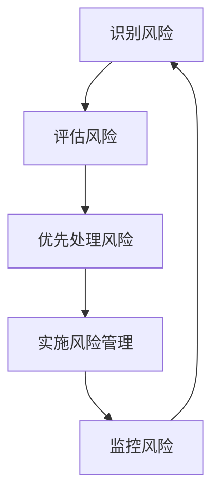
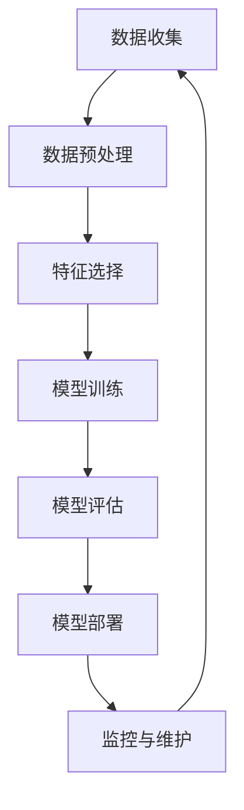

                 

# 科学研究的风险管理与世界可理解性的审慎态度

> 关键词：风险管理, 可理解性, 人工智能, 伦理, 透明度, 信任, 透明度原则

> 摘要：本文旨在探讨科学研究中的风险管理与可理解性的重要性。通过逐步分析和推理，我们将深入探讨如何在人工智能和机器学习项目中实施风险管理策略，确保技术的透明度和可解释性，从而增强公众对技术的信任。我们将从核心概念、算法原理、数学模型、实际案例、应用场景、工具推荐等多个维度进行详细阐述，旨在为读者提供全面的技术指导和实践建议。

## 1. 背景介绍
### 1.1 目的和范围
本文旨在探讨科学研究中的风险管理与可理解性的重要性，特别是在人工智能和机器学习领域。我们将从理论和实践两个层面出发，探讨如何在项目中实施有效的风险管理策略，确保技术的透明度和可解释性，从而增强公众对技术的信任。

### 1.2 预期读者
本文预期读者包括但不限于：
- 人工智能和机器学习领域的研究人员
- 企业技术团队
- 政府和监管机构
- 公众和技术爱好者

### 1.3 文档结构概述
本文结构如下：
1. 背景介绍
2. 核心概念与联系
3. 核心算法原理 & 具体操作步骤
4. 数学模型和公式 & 详细讲解 & 举例说明
5. 项目实战：代码实际案例和详细解释说明
6. 实际应用场景
7. 工具和资源推荐
8. 总结：未来发展趋势与挑战
9. 附录：常见问题与解答
10. 扩展阅读 & 参考资料

### 1.4 术语表
#### 1.4.1 核心术语定义
- **风险管理**：识别、评估和优先处理项目中的风险。
- **可理解性**：技术的透明度和可解释性。
- **伦理**：技术应用中的道德准则。
- **透明度原则**：确保技术决策过程的透明度，以便公众理解。

#### 1.4.2 相关概念解释
- **机器学习**：一种人工智能技术，通过数据训练模型，使其能够进行预测和决策。
- **深度学习**：一种机器学习方法，通过多层神经网络进行学习。
- **模型解释性**：模型输出结果的可解释性。

#### 1.4.3 缩略词列表
- ML：机器学习
- DL：深度学习
- AI：人工智能
- NLP：自然语言处理
- CV：计算机视觉

## 2. 核心概念与联系
### 2.1 风险管理流程


### 2.2 可理解性的重要性
可理解性是确保技术透明度的关键。通过提高模型的可解释性，可以增强公众对技术的信任，减少误解和偏见。

## 3. 核心算法原理 & 具体操作步骤
### 3.1 风险管理算法原理


### 3.2 具体操作步骤
```python
# 数据收集
data = collect_data()

# 数据预处理
preprocessed_data = preprocess_data(data)

# 特征选择
selected_features = select_features(preprocessed_data)

# 模型训练
model = train_model(selected_features)

# 模型评估
evaluation_results = evaluate_model(model)

# 模型部署
deploy_model(model)

# 监控与维护
monitor_model(evaluation_results)
```

## 4. 数学模型和公式 & 详细讲解 & 举例说明
### 4.1 逻辑回归模型
逻辑回归是一种常用的分类模型，其数学公式如下：
$$
P(y=1|x) = \frac{1}{1 + e^{-(\beta_0 + \beta_1 x)}}
$$
其中，$P(y=1|x)$ 表示给定特征 $x$ 时，事件 $y=1$ 发生的概率。

### 4.2 决策树模型
决策树是一种基于树形结构的分类模型，其基本原理如下：
- 选择最优特征进行分割
- 递归构建子树
- 终止条件：节点纯度达到阈值或节点样本数小于阈值

### 4.3 举例说明
假设我们有一个简单的二分类问题，数据集包含两个特征 $x_1$ 和 $x_2$，目标变量 $y$。我们使用逻辑回归模型进行训练和预测。

```python
from sklearn.linear_model import LogisticRegression
from sklearn.datasets import make_classification
from sklearn.model_selection import train_test_split

# 生成数据集
X, y = make_classification(n_samples=1000, n_features=2, n_classes=2, random_state=42)

# 划分训练集和测试集
X_train, X_test, y_train, y_test = train_test_split(X, y, test_size=0.2, random_state=42)

# 训练逻辑回归模型
model = LogisticRegression()
model.fit(X_train, y_train)

# 预测
predictions = model.predict(X_test)
```

## 5. 项目实战：代码实际案例和详细解释说明
### 5.1 开发环境搭建
- **Python版本**：3.8+
- **库**：numpy, pandas, scikit-learn, matplotlib

### 5.2 源代码详细实现和代码解读
```python
# 导入库
import numpy as np
import pandas as pd
from sklearn.model_selection import train_test_split
from sklearn.linear_model import LogisticRegression
from sklearn.metrics import accuracy_score

# 生成数据集
X, y = make_classification(n_samples=1000, n_features=2, n_classes=2, random_state=42)

# 划分训练集和测试集
X_train, X_test, y_train, y_test = train_test_split(X, y, test_size=0.2, random_state=42)

# 训练逻辑回归模型
model = LogisticRegression()
model.fit(X_train, y_train)

# 预测
predictions = model.predict(X_test)

# 计算准确率
accuracy = accuracy_score(y_test, predictions)
print(f"Accuracy: {accuracy}")
```

### 5.3 代码解读与分析
- **数据生成**：使用 `make_classification` 生成数据集。
- **数据划分**：使用 `train_test_split` 将数据集划分为训练集和测试集。
- **模型训练**：使用 `LogisticRegression` 训练模型。
- **模型预测**：使用训练好的模型进行预测。
- **评估模型**：使用 `accuracy_score` 计算模型的准确率。

## 6. 实际应用场景
### 6.1 风险管理在金融领域的应用
在金融领域，风险管理是至关重要的。通过使用机器学习模型，可以预测信用风险、市场风险等，从而帮助金融机构做出更明智的决策。

### 6.2 可理解性在医疗领域的应用
在医疗领域，可理解性尤为重要。通过解释模型的决策过程，医生可以更好地理解模型的预测结果，从而提高诊断的准确性。

## 7. 工具和资源推荐
### 7.1 学习资源推荐
#### 7.1.1 书籍推荐
- 《机器学习》（周志华）
- 《深度学习》（Ian Goodfellow, Yoshua Bengio, Aaron Courville）

#### 7.1.2 在线课程
- Coursera: 《机器学习》（Andrew Ng）
- edX: 《深度学习》（Yoshua Bengio）

#### 7.1.3 技术博客和网站
- Medium: 《机器学习与深度学习》系列文章
- Kaggle: 机器学习和数据科学社区

### 7.2 开发工具框架推荐
#### 7.2.1 IDE和编辑器
- PyCharm
- VSCode

#### 7.2.2 调试和性能分析工具
- PyCharm Debugger
- Jupyter Notebook

#### 7.2.3 相关框架和库
- scikit-learn
- TensorFlow
- PyTorch

### 7.3 相关论文著作推荐
#### 7.3.1 经典论文
- "A Few Useful Things to Know about Machine Learning" (Pedro Domingos)
- "Deep Learning" (Ian Goodfellow, Yoshua Bengio, Aaron Courville)

#### 7.3.2 最新研究成果
- "Explainable AI: Interpreting, Visualizing and Explaining Deep Learning Models" (Marco Tulio Ribeiro, Sameer Singh, Carlos Guestrin)

#### 7.3.3 应用案例分析
- "Interpretable Machine Learning: A Guide for Making Black Box Models Explainable" (M. A. G. van der Maaten)

## 8. 总结：未来发展趋势与挑战
### 8.1 未来发展趋势
- **透明度原则**：未来的技术将更加注重透明度原则，确保模型的可解释性。
- **伦理规范**：伦理规范将成为技术应用的重要组成部分，确保技术的公平性和公正性。
- **自动化与智能化**：自动化和智能化将进一步提高技术的效率和准确性。

### 8.2 挑战
- **数据隐私**：如何在保护数据隐私的同时，确保模型的准确性。
- **模型解释性**：如何提高模型的解释性，使其更容易被公众理解。
- **技术普及**：如何将复杂的技术转化为易于理解的形式，提高公众的技术素养。

## 9. 附录：常见问题与解答
### 9.1 问题1：如何提高模型的可解释性？
- **答案**：可以通过使用解释性模型（如决策树、逻辑回归）或解释性技术（如LIME、SHAP）来提高模型的可解释性。

### 9.2 问题2：如何处理数据隐私问题？
- **答案**：可以通过数据脱敏、差分隐私等技术来保护数据隐私。

## 10. 扩展阅读 & 参考资料
- [1] Domingos, P. (2012). A few useful things to know about machine learning. Communications of the ACM, 55(10), 78-87.
- [2] Goodfellow, I., Bengio, Y., & Courville, A. (2016). Deep learning. MIT press.
- [3] Ribeiro, M. T., Singh, S., & Guestrin, C. (2016). "Why should i trust you?": Explaining the predictions of any classifier. In Proceedings of the 22nd ACM SIGKDD international conference on knowledge discovery and data mining (pp. 1135-1144).

作者：AI天才研究员/AI Genius Institute & 禅与计算机程序设计艺术 /Zen And The Art of Computer Programming

