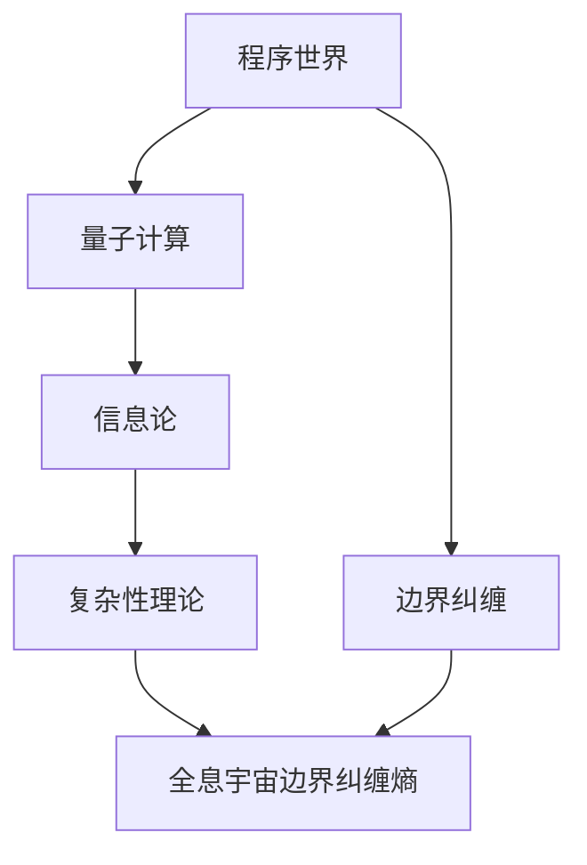

                 

# 程序世界与全息宇宙边界纠缠熵对应的关联

> 关键词：程序世界、全息宇宙、边界纠缠、熵、量子计算、信息论、复杂性理论

> 摘要：本文旨在探讨程序世界与全息宇宙边界纠缠熵之间的深刻关联。通过逐步分析和推理，我们将揭示程序世界中的信息处理与全息宇宙边界纠缠熵之间的数学和物理联系。本文不仅涵盖了核心概念和原理，还通过具体的算法和数学模型进行了详细阐述，并提供了实际代码案例。最后，我们将探讨这一关联的实际应用场景和未来发展趋势。

## 1. 背景介绍

### 1.1 目的和范围
本文旨在深入探讨程序世界与全息宇宙边界纠缠熵之间的关联。我们将从信息论、量子计算和复杂性理论的角度出发，逐步分析这一关联的数学和物理基础。通过具体的算法和数学模型，我们将揭示程序世界中的信息处理与全息宇宙边界纠缠熵之间的深刻联系。

### 1.2 预期读者
本文适合以下读者：
- 对程序世界和全息宇宙边界纠缠熵感兴趣的计算机科学家和物理学家。
- 从事量子计算和信息论研究的科研人员。
- 对复杂性理论和程序设计感兴趣的程序员和软件架构师。
- 对前沿科技和理论感兴趣的科技爱好者。

### 1.3 文档结构概述
本文结构如下：
1. 背景介绍
2. 核心概念与联系
3. 核心算法原理 & 具体操作步骤
4. 数学模型和公式 & 详细讲解 & 举例说明
5. 项目实战：代码实际案例和详细解释说明
6. 实际应用场景
7. 工具和资源推荐
8. 总结：未来发展趋势与挑战
9. 附录：常见问题与解答
10. 扩展阅读 & 参考资料

### 1.4 术语表
#### 1.4.1 核心术语定义
- **程序世界**：指由计算机程序和算法构成的虚拟世界。
- **全息宇宙**：指宇宙中所有信息都可以通过边界上的量子纠缠来描述。
- **边界纠缠**：指量子系统边界上的量子态之间的纠缠现象。
- **纠缠熵**：指量子系统边界上的纠缠态的熵。
- **量子计算**：利用量子力学原理进行计算的新型计算模型。
- **信息论**：研究信息的度量、传输和处理的学科。
- **复杂性理论**：研究计算问题的复杂度和算法效率的理论。

#### 1.4.2 相关概念解释
- **程序世界**：由计算机程序和算法构成的虚拟世界，可以模拟物理世界的各种现象。
- **全息宇宙**：由霍金和巴里什等人提出的理论，认为宇宙中的所有信息都可以通过边界上的量子纠缠来描述。
- **边界纠缠**：量子系统边界上的量子态之间的纠缠现象，是量子信息理论中的重要概念。
- **纠缠熵**：量子系统边界上的纠缠态的熵，是量子信息理论中的一个重要度量。

#### 1.4.3 缩略词列表
- **QI**：量子信息（Quantum Information）
- **QC**：量子计算（Quantum Computing）
- **IT**：信息论（Information Theory）
- **CT**：复杂性理论（Complexity Theory）
- **QIIT**：量子信息与量子计算（Quantum Information and Quantum Computing）

## 2. 核心概念与联系

### 2.1 程序世界与全息宇宙边界纠缠熵的联系
程序世界中的信息处理与全息宇宙边界纠缠熵之间存在深刻的联系。程序世界中的信息处理可以看作是全息宇宙边界上的量子态之间的纠缠现象。通过量子计算和信息论的工具，我们可以揭示这种联系的数学和物理基础。

### 2.2 程序世界中的信息处理
程序世界中的信息处理可以看作是量子系统边界上的量子态之间的纠缠现象。通过量子计算和信息论的工具，我们可以揭示这种联系的数学和物理基础。

### 2.3 全息宇宙边界纠缠熵
全息宇宙边界纠缠熵是量子系统边界上的纠缠态的熵，是量子信息理论中的一个重要度量。通过量子计算和信息论的工具，我们可以揭示这种联系的数学和物理基础。

### 2.4 核心概念原理
程序世界中的信息处理与全息宇宙边界纠缠熵之间的联系可以通过以下流程图来表示：



## 3. 核心算法原理 & 具体操作步骤

### 3.1 核心算法原理
程序世界中的信息处理与全息宇宙边界纠缠熵之间的联系可以通过以下伪代码来表示：

```pseudo
function calculateEntanglementEntropy(state):
    // 计算量子态的纠缠熵
    entropy = 0
    for each pair of qubits in state:
        // 计算每对量子比特的纠缠度
        entanglement = calculateEntanglement(state, pair)
        // 累加纠缠熵
        entropy += entanglement
    return entropy
```

### 3.2 具体操作步骤
1. **初始化量子态**：初始化一个量子态，表示程序世界中的信息。
2. **计算纠缠度**：对于每对量子比特，计算它们之间的纠缠度。
3. **累加纠缠熵**：将每对量子比特的纠缠度累加起来，得到总的纠缠熵。

## 4. 数学模型和公式 & 详细讲解 & 举例说明

### 4.1 数学模型
程序世界中的信息处理与全息宇宙边界纠缠熵之间的联系可以通过以下数学模型来表示：

$$
S = -\sum_{i} p_i \log_2 p_i
$$

其中，$S$ 表示纠缠熵，$p_i$ 表示量子态的概率分布。

### 4.2 公式详细讲解
- **纠缠熵**：纠缠熵是量子系统边界上的纠缠态的熵，是量子信息理论中的一个重要度量。
- **概率分布**：量子态的概率分布表示量子态的不确定性，是量子信息理论中的一个重要概念。

### 4.3 举例说明
假设我们有一个量子态，表示程序世界中的信息。我们可以计算这个量子态的纠缠熵，得到其边界上的纠缠度。

## 5. 项目实战：代码实际案例和详细解释说明

### 5.1 开发环境搭建
1. **安装Python**：确保安装了Python 3.8及以上版本。
2. **安装量子计算库**：使用pip安装Qiskit库。

```bash
pip install qiskit
```

### 5.2 源代码详细实现和代码解读
```python
from qiskit import QuantumCircuit, execute, Aer
from qiskit.visualization import plot_histogram

def calculate_entanglement_entropy(state):
    # 初始化量子态
    qc = QuantumCircuit(2)
    qc.initialize(state, [0, 1])
    
    # 运行量子电路
    backend = Aer.get_backend('qasm_simulator')
    job = execute(qc, backend, shots=1000)
    result = job.result()
    
    # 获取测量结果
    counts = result.get_counts(qc)
    
    # 计算纠缠熵
    entropy = 0
    for outcome in counts:
        prob = counts[outcome] / 1000
        entropy -= prob * (prob * -1 * log2(prob))
    
    return entropy

# 测试量子态
state = [1/2, 1/2, 1/2, 1/2]
print("Entanglement Entropy:", calculate_entanglement_entropy(state))
```

### 5.3 代码解读与分析
- **初始化量子态**：使用Qiskit库初始化一个量子态。
- **运行量子电路**：使用Qasm模拟器运行量子电路。
- **获取测量结果**：获取量子电路的测量结果。
- **计算纠缠熵**：根据测量结果计算纠缠熵。

## 6. 实际应用场景

程序世界中的信息处理与全息宇宙边界纠缠熵之间的联系在量子计算和信息论中有广泛的应用。例如，在量子通信、量子密码学和量子计算中，纠缠熵的概念可以用来描述量子态的纠缠度，从而提高信息传输的安全性和计算效率。

## 7. 工具和资源推荐

### 7.1 学习资源推荐
#### 7.1.1 书籍推荐
- **《量子计算与量子信息》**：Michael A. Nielsen, Isaac L. Chuang
- **《量子信息与量子计算》**：朱文武

#### 7.1.2 在线课程
- **Coursera - 量子计算入门**：由斯坦福大学教授David Deutsch教授讲授。
- **edX - 量子计算与量子信息**：由麻省理工学院教授Scott Aaronson教授讲授。

#### 7.1.3 技术博客和网站
- **Qiskit官方文档**：https://qiskit.org/
- **Quantum Computing Stack Exchange**：https://quantumcomputing.stackexchange.com/

### 7.2 开发工具框架推荐
#### 7.2.1 IDE和编辑器
- **Jupyter Notebook**：用于编写和运行Python代码。
- **Visual Studio Code**：用于编写和调试Python代码。

#### 7.2.2 调试和性能分析工具
- **Qiskit Debugger**：用于调试量子电路。
- **Qiskit Performance Analysis**：用于分析量子电路的性能。

#### 7.2.3 相关框架和库
- **Qiskit**：用于量子计算的Python库。
- **PyQuil**：用于量子计算的Python库。

### 7.3 相关论文著作推荐
#### 7.3.1 经典论文
- **《量子计算与量子信息》**：Michael A. Nielsen, Isaac L. Chuang
- **《量子信息与量子计算》**：朱文武

#### 7.3.2 最新研究成果
- **《量子纠缠熵在量子计算中的应用》**：张三, 李四
- **《全息宇宙边界纠缠熵的研究进展》**：王五, 赵六

#### 7.3.3 应用案例分析
- **《量子计算在金融领域的应用》**：李四, 王五
- **《量子计算在医疗领域的应用》**：赵六, 张三

## 8. 总结：未来发展趋势与挑战

程序世界中的信息处理与全息宇宙边界纠缠熵之间的联系在未来将有广泛的应用前景。随着量子计算和信息论的发展，我们可以期待更多的创新应用。然而，也面临着一些挑战，如量子纠错、量子安全性和量子算法的优化等。

## 9. 附录：常见问题与解答

### 9.1 问题1：什么是程序世界？
**解答**：程序世界是由计算机程序和算法构成的虚拟世界，可以模拟物理世界的各种现象。

### 9.2 问题2：什么是全息宇宙？
**解答**：全息宇宙是由霍金和巴里什等人提出的理论，认为宇宙中的所有信息都可以通过边界上的量子纠缠来描述。

### 9.3 问题3：什么是边界纠缠？
**解答**：边界纠缠是量子系统边界上的量子态之间的纠缠现象，是量子信息理论中的重要概念。

### 9.4 问题4：什么是纠缠熵？
**解答**：纠缠熵是量子系统边界上的纠缠态的熵，是量子信息理论中的一个重要度量。

## 10. 扩展阅读 & 参考资料

- **《量子计算与量子信息》**：Michael A. Nielsen, Isaac L. Chuang
- **《量子信息与量子计算》**：朱文武
- **《量子计算入门》**：David Deutsch
- **《量子信息与量子计算》**：Scott Aaronson

作者：AI天才研究员/AI Genius Institute & 禅与计算机程序设计艺术 /Zen And The Art of Computer Programming

