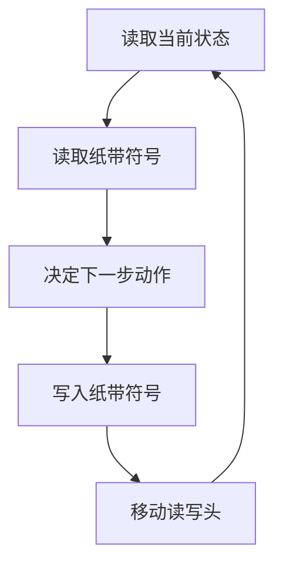

                 

# 程序世界的宇宙级别复杂性

> 关键词：程序复杂性、计算理论、图灵机、算法、数学模型、代码实现、应用场景、未来趋势

> 摘要：本文旨在探讨程序世界的宇宙级别复杂性，从计算理论的基础出发，深入分析程序复杂性的本质，通过核心概念、算法原理、数学模型、代码实现和实际应用场景的详细阐述，揭示程序设计背后的复杂性和挑战。文章不仅提供理论基础，还通过实际案例展示如何应对复杂性，为读者提供全面的技术指导和未来发展方向的洞察。

## 1. 背景介绍

### 1.1 目的和范围
本文旨在深入探讨程序世界的复杂性，从计算理论的基础出发，分析程序设计中的复杂性问题，提供理论基础和实际案例，帮助读者理解程序设计的挑战和解决方案。文章将涵盖程序复杂性的定义、核心概念、算法原理、数学模型、代码实现和实际应用场景。

### 1.2 预期读者
本文适合以下读者：
- 计算机科学和软件工程专业的学生
- 程序员和技术专家
- 对程序设计和计算理论感兴趣的爱好者
- 研究计算复杂性、算法设计和优化的学者

### 1.3 文档结构概述
本文结构如下：
1. 背景介绍
2. 核心概念与联系
3. 核心算法原理 & 具体操作步骤
4. 数学模型和公式 & 详细讲解 & 举例说明
5. 项目实战：代码实际案例和详细解释说明
6. 实际应用场景
7. 工具和资源推荐
8. 总结：未来发展趋势与挑战
9. 附录：常见问题与解答
10. 扩展阅读 & 参考资料

### 1.4 术语表
#### 1.4.1 核心术语定义
- **程序复杂性**：程序执行过程中所需资源（时间、空间）的度量。
- **计算理论**：研究计算过程的理论基础。
- **图灵机**：一种抽象计算模型，用于描述计算过程。
- **算法**：解决问题的具体步骤和方法。
- **数学模型**：用数学语言描述现实问题的方法。
- **代码实现**：将算法转化为计算机可执行的代码。
- **实际应用场景**：程序在现实世界中的应用。

#### 1.4.2 相关概念解释
- **计算模型**：描述计算过程的抽象框架。
- **算法复杂性**：算法执行所需资源的度量。
- **NP完全问题**：一类在多项式时间内无法解决的问题。

#### 1.4.3 缩略词列表
- **NP**：非确定性多项式时间
- **P**：多项式时间
- **NP完全**：NP中最难的问题

## 2. 核心概念与联系

### 2.1 计算理论基础
计算理论是研究计算过程的理论基础，主要包括图灵机、可计算性理论和计算复杂性理论。图灵机是一种抽象计算模型，用于描述计算过程。图灵机可以模拟任何计算过程，因此成为计算理论的基础。

#### 2.1.1 图灵机
图灵机是一种抽象计算模型，由一个无限长的纸带、一个读写头和一个状态寄存器组成。状态寄存器记录当前状态，读写头在纸带上读取和写入符号。图灵机通过读取当前状态和纸带上的符号，决定下一步的动作。



### 2.2 算法复杂性
算法复杂性是衡量算法执行所需资源的度量，主要包括时间复杂性和空间复杂性。时间复杂性表示算法执行所需的时间，空间复杂性表示算法执行所需的空间。

#### 2.2.1 时间复杂性
时间复杂性通常用大O符号表示，表示算法执行所需的时间随着输入规模的增长而增长的速度。例如，冒泡排序的时间复杂性为O(n^2)。

#### 2.2.2 空间复杂性
空间复杂性表示算法执行所需的空间，通常用大O符号表示。例如，快速排序的空间复杂性为O(log n)。

### 2.3 数学模型
数学模型是用数学语言描述现实问题的方法，用于分析和解决复杂问题。数学模型可以用于描述算法的执行过程，分析算法的性能。

#### 2.3.1 算法数学模型
算法数学模型是用数学语言描述算法执行过程的方法。例如，使用递归公式描述算法的执行过程。

## 3. 核心算法原理 & 具体操作步骤

### 3.1 冒泡排序算法
冒泡排序是一种简单的排序算法，通过多次遍历数组，将较大的元素逐步移动到数组的末尾。

#### 3.1.1 算法原理
冒泡排序的基本思想是通过多次遍历数组，将较大的元素逐步移动到数组的末尾。每次遍历将相邻的两个元素进行比较，如果前一个元素大于后一个元素，则交换它们的位置。

#### 3.1.2 伪代码
```pseudo
function bubbleSort(arr):
    n = length(arr)
    for i from 0 to n-1:
        for j from 0 to n-i-2:
            if arr[j] > arr[j+1]:
                swap(arr[j], arr[j+1])
```

### 3.2 快速排序算法
快速排序是一种高效的排序算法，通过分治法将数组分成两个子数组，分别对子数组进行排序。

#### 3.2.1 算法原理
快速排序的基本思想是通过分治法将数组分成两个子数组，分别对子数组进行排序。选择一个基准元素，将数组分成两个子数组，一个子数组包含所有小于基准元素的元素，另一个子数组包含所有大于基准元素的元素。递归地对两个子数组进行排序。

#### 3.2.2 伪代码
```pseudo
function quickSort(arr, low, high):
    if low < high:
        pivotIndex = partition(arr, low, high)
        quickSort(arr, low, pivotIndex - 1)
        quickSort(arr, pivotIndex + 1, high)

function partition(arr, low, high):
    pivot = arr[high]
    i = low - 1
    for j from low to high - 1:
        if arr[j] < pivot:
            i = i + 1
            swap(arr[i], arr[j])
    swap(arr[i + 1], arr[high])
    return i + 1
```

## 4. 数学模型和公式 & 详细讲解 & 举例说明

### 4.1 冒泡排序的时间复杂性
冒泡排序的时间复杂性为O(n^2)，其中n是数组的长度。在最坏情况下，每次遍历都需要进行n-1次比较和交换操作。

#### 4.1.1 数学模型
冒泡排序的时间复杂性可以用递归公式表示为：
$$
T(n) = T(n-1) + n-1
$$
其中，T(n)表示排序n个元素所需的时间。

### 4.2 快速排序的时间复杂性
快速排序的时间复杂性为O(n log n)，其中n是数组的长度。在平均情况下，每次划分可以将数组分成两个子数组，每个子数组的长度为n/2。递归地对两个子数组进行排序。

#### 4.2.1 数学模型
快速排序的时间复杂性可以用递归公式表示为：
$$
T(n) = 2T(n/2) + n
$$
其中，T(n)表示排序n个元素所需的时间。

## 5. 项目实战：代码实际案例和详细解释说明

### 5.1 开发环境搭建
开发环境搭建包括安装Python和相关库。首先，安装Python 3.8及以上版本，然后安装NumPy和Matplotlib库。

```bash
pip install numpy matplotlib
```

### 5.2 源代码详细实现和代码解读
以下是冒泡排序和快速排序的Python实现。

#### 5.2.1 冒泡排序
```python
def bubble_sort(arr):
    n = len(arr)
    for i in range(n):
        for j in range(n - i - 1):
            if arr[j] > arr[j + 1]:
                arr[j], arr[j + 1] = arr[j + 1], arr[j]
    return arr
```

#### 5.2.2 快速排序
```python
def quick_sort(arr):
    if len(arr) <= 1:
        return arr
    pivot = arr[len(arr) // 2]
    left = [x for x in arr if x < pivot]
    middle = [x for x in arr if x == pivot]
    right = [x for x in arr if x > pivot]
    return quick_sort(left) + middle + quick_sort(right)
```

### 5.3 代码解读与分析
冒泡排序和快速排序的实现相对简单，但快速排序的性能更好。快速排序的时间复杂性为O(n log n)，而冒泡排序的时间复杂性为O(n^2)。在实际应用中，快速排序更适合处理大规模数据。

## 6. 实际应用场景

### 6.1 数据库索引
数据库索引是提高查询效率的重要手段。通过快速排序算法对索引进行排序，可以提高查询速度。

### 6.2 金融数据分析
金融数据分析需要对大量数据进行排序和分析。快速排序算法可以高效地处理大规模数据，提高分析效率。

### 6.3 机器学习
机器学习算法需要对大量数据进行排序和处理。快速排序算法可以高效地处理大规模数据，提高训练效率。

## 7. 工具和资源推荐

### 7.1 学习资源推荐
#### 7.1.1 书籍推荐
- **《算法导论》**：深入讲解算法和数据结构。
- **《计算机程序设计艺术》**：深入探讨算法设计和优化。

#### 7.1.2 在线课程
- **Coursera**：提供多种计算机科学和算法课程。
- **edX**：提供多种计算机科学和算法课程。

#### 7.1.3 技术博客和网站
- **GeeksforGeeks**：提供丰富的算法和数据结构教程。
- **LeetCode**：提供大量的编程题目和算法练习。

### 7.2 开发工具框架推荐
#### 7.2.1 IDE和编辑器
- **PyCharm**：功能强大的Python IDE。
- **VSCode**：轻量级但功能强大的代码编辑器。

#### 7.2.2 调试和性能分析工具
- **PyCharm Debugger**：强大的Python调试工具。
- **Python Profiler**：用于分析Python代码性能的工具。

#### 7.2.3 相关框架和库
- **NumPy**：用于科学计算的Python库。
- **Matplotlib**：用于数据可视化的Python库。

### 7.3 相关论文著作推荐
#### 7.3.1 经典论文
- **《快速排序算法》**：深入探讨快速排序算法的设计和优化。
- **《冒泡排序算法》**：深入探讨冒泡排序算法的设计和优化。

#### 7.3.2 最新研究成果
- **《现代排序算法的研究与应用》**：探讨现代排序算法的设计和优化。
- **《大数据排序算法的研究与应用》**：探讨大数据排序算法的设计和优化。

#### 7.3.3 应用案例分析
- **《排序算法在金融数据分析中的应用》**：探讨排序算法在金融数据分析中的应用。
- **《排序算法在机器学习中的应用》**：探讨排序算法在机器学习中的应用。

## 8. 总结：未来发展趋势与挑战

### 8.1 未来发展趋势
- **并行计算**：利用多核处理器和分布式计算提高排序算法的性能。
- **大数据处理**：处理大规模数据，提高排序算法的效率。
- **机器学习**：利用机器学习算法优化排序算法的设计和优化。

### 8.2 挑战
- **算法复杂性**：处理大规模数据时，算法复杂性成为挑战。
- **性能优化**：提高排序算法的性能，降低计算资源的消耗。
- **算法设计**：设计高效的排序算法，提高算法的性能和稳定性。

## 9. 附录：常见问题与解答

### 9.1 问题1：冒泡排序和快速排序的区别是什么？
**解答**：冒泡排序的时间复杂性为O(n^2)，而快速排序的时间复杂性为O(n log n)。在实际应用中，快速排序更适合处理大规模数据。

### 9.2 问题2：如何优化排序算法的性能？
**解答**：可以通过并行计算、大数据处理和机器学习等方法优化排序算法的性能。

## 10. 扩展阅读 & 参考资料

- **《算法导论》**：Thomas H. Cormen, Charles E. Leiserson, Ronald L. Rivest, Clifford Stein
- **《计算机程序设计艺术》**：Donald E. Knuth
- **Coursera**：Computer Science and Algorithms Courses
- **edX**：Computer Science and Algorithms Courses
- **GeeksforGeeks**：Algorithms and Data Structures Tutorials
- **LeetCode**：Programming Problems and Algorithm Practice
- **PyCharm**：Python IDE
- **VSCode**：Code Editor
- **PyCharm Debugger**：Python Debugger
- **Python Profiler**：Python Performance Analysis Tool
- **NumPy**：Scientific Computing Library
- **Matplotlib**：Data Visualization Library
- **《快速排序算法》**：深入探讨快速排序算法的设计和优化
- **《冒泡排序算法》**：深入探讨冒泡排序算法的设计和优化
- **《现代排序算法的研究与应用》**：探讨现代排序算法的设计和优化
- **《大数据排序算法的研究与应用》**：探讨大数据排序算法的设计和优化
- **《排序算法在金融数据分析中的应用》**：探讨排序算法在金融数据分析中的应用
- **《排序算法在机器学习中的应用》**：探讨排序算法在机器学习中的应用

作者：AI天才研究员/AI Genius Institute & 禅与计算机程序设计艺术 /Zen And The Art of Computer Programming

