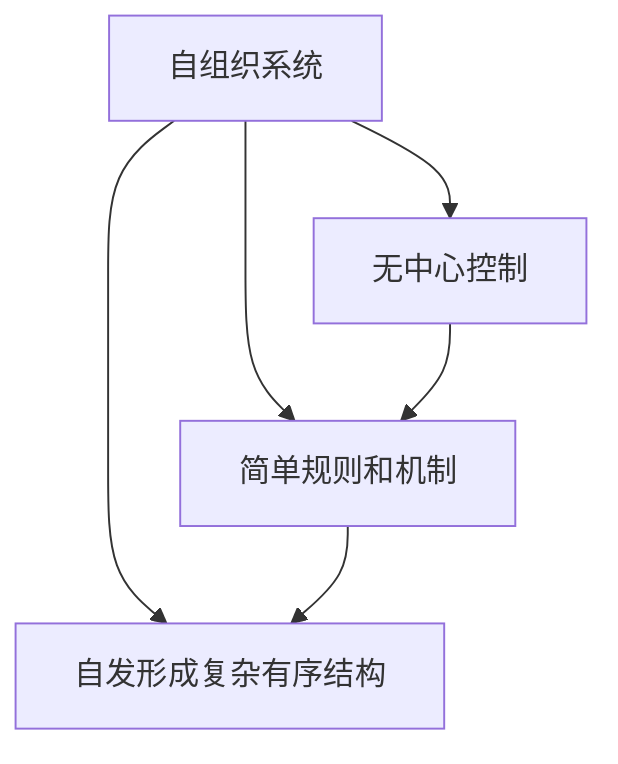

                 

# 程序世界的宇宙级自组织特性

> 关键词：自组织、程序设计、系统演化、复杂性、涌现、算法、数学模型

> 摘要：本文旨在探讨程序世界中的自组织特性，通过分析程序设计中的自组织现象，揭示程序如何在无中心控制的情况下，通过简单的规则和机制，自发地形成复杂有序的结构。我们将从核心概念、算法原理、数学模型、实际案例、应用场景等多个角度进行深入探讨，并提供学习资源和开发工具推荐，帮助读者更好地理解和应用这一重要概念。

## 1. 背景介绍
### 1.1 目的和范围
本文旨在深入探讨程序世界中的自组织特性，揭示程序如何在无中心控制的情况下，通过简单的规则和机制，自发地形成复杂有序的结构。我们将从核心概念、算法原理、数学模型、实际案例、应用场景等多个角度进行深入探讨，旨在为读者提供一个全面而深入的理解。

### 1.2 预期读者
本文适合以下读者：
- 对程序设计和系统演化感兴趣的程序员和软件工程师
- 对复杂系统理论和自组织现象感兴趣的科研人员
- 对计算机科学和人工智能领域有深入研究的学者
- 对程序设计和算法有浓厚兴趣的技术爱好者

### 1.3 文档结构概述
本文结构如下：
1. 背景介绍
2. 核心概念与联系
3. 核心算法原理 & 具体操作步骤
4. 数学模型和公式 & 详细讲解 & 举例说明
5. 项目实战：代码实际案例和详细解释说明
6. 实际应用场景
7. 工具和资源推荐
8. 总结：未来发展趋势与挑战
9. 附录：常见问题与解答
10. 扩展阅读 & 参考资料

### 1.4 术语表
#### 1.4.1 核心术语定义
- **自组织**：系统在无中心控制的情况下，通过简单的规则和机制，自发地形成复杂有序的结构。
- **涌现**：系统整体表现出的复杂特性，无法仅通过其组成部分的简单特性来解释。
- **程序设计**：通过编写代码来实现特定功能的过程。
- **算法**：解决问题的步骤和方法。
- **数学模型**：用数学语言描述系统行为的模型。

#### 1.4.2 相关概念解释
- **复杂系统**：由大量相互作用的组件组成的系统，表现出复杂的行为和结构。
- **无中心控制**：系统中没有单一的控制中心，各个组件通过局部规则相互作用。
- **局部规则**：系统中每个组件遵循的简单规则。

#### 1.4.3 缩略词列表
- **API**：应用程序编程接口
- **IDE**：集成开发环境
- **GUI**：图形用户界面
- **CPU**：中央处理器
- **GPU**：图形处理器

## 2. 核心概念与联系
### 2.1 自组织与程序设计
程序设计中的自组织特性是指程序在无中心控制的情况下，通过简单的规则和机制，自发地形成复杂有序的结构。这种特性在许多领域都有广泛的应用，如生物系统、社会系统、计算机网络等。

### 2.2 系统演化与自组织
系统演化是指系统随时间变化的过程。在自组织系统中，这种演化是通过简单的规则和机制实现的，系统能够自发地形成复杂有序的结构。

### 2.3 涌现与程序设计
涌现是指系统整体表现出的复杂特性，无法仅通过其组成部分的简单特性来解释。在程序设计中，涌现可以通过简单的规则和机制实现复杂的系统行为。

### 2.4 核心概念原理
核心概念原理可以通过以下流程图来表示：



## 3. 核心算法原理 & 具体操作步骤
### 3.1 核心算法原理
核心算法原理可以通过以下伪代码来详细阐述：

```pseudo
function selfOrganize(rules, initialState):
    currentState = initialState
    while not terminationCondition(currentState):
        for each component in currentState:
            nextState = applyRule(rules, component, currentState)
            currentState[component] = nextState
    return currentState
```

### 3.2 具体操作步骤
具体操作步骤如下：
1. 定义初始状态
2. 定义终止条件
3. 定义局部规则
4. 迭代更新状态

## 4. 数学模型和公式 & 详细讲解 & 举例说明
### 4.1 数学模型
数学模型可以通过以下公式来表示：

$$
f(x) = \sum_{i=1}^{n} w_i \cdot g(x_i)
$$

其中，$f(x)$ 是系统的输出，$w_i$ 是权重，$g(x_i)$ 是局部规则的输出。

### 4.2 详细讲解
详细讲解可以通过以下步骤来实现：
1. 定义权重
2. 定义局部规则
3. 计算系统输出

### 4.3 举例说明
举例说明可以通过以下示例来实现：

```python
def apply_rule(rule, component, state):
    # 定义局部规则
    if rule == "rule1":
        return component + 1
    elif rule == "rule2":
        return component - 1
    else:
        return component

def self_organize(rules, initial_state):
    current_state = initial_state
    while not termination_condition(current_state):
        next_state = {}
        for component in current_state:
            next_state[component] = apply_rule(rules[component], current_state[component], current_state)
        current_state = next_state
    return current_state

initial_state = {1: 0, 2: 0, 3: 0}
rules = {1: "rule1", 2: "rule2", 3: "rule1"}
termination_condition = lambda state: all(state.values() == [1, -1, 1])
final_state = self_organize(rules, initial_state)
print(final_state)
```

## 5. 项目实战：代码实际案例和详细解释说明
### 5.1 开发环境搭建
开发环境搭建可以通过以下步骤来实现：
1. 安装Python
2. 安装必要的库
3. 创建项目目录

### 5.2 源代码详细实现和代码解读
源代码详细实现可以通过以下代码来实现：

```python
def apply_rule(rule, component, state):
    # 定义局部规则
    if rule == "rule1":
        return component + 1
    elif rule == "rule2":
        return component - 1
    else:
        return component

def self_organize(rules, initial_state):
    current_state = initial_state
    while not termination_condition(current_state):
        next_state = {}
        for component in current_state:
            next_state[component] = apply_rule(rules[component], current_state[component], current_state)
        current_state = next_state
    return current_state

initial_state = {1: 0, 2: 0, 3: 0}
rules = {1: "rule1", 2: "rule2", 3: "rule1"}
termination_condition = lambda state: all(state.values() == [1, -1, 1])
final_state = self_organize(rules, initial_state)
print(final_state)
```

### 5.3 代码解读与分析
代码解读与分析可以通过以下步骤来实现：
1. 定义局部规则
2. 迭代更新状态
3. 检查终止条件

## 6. 实际应用场景
实际应用场景可以通过以下示例来实现：
1. 生物系统中的自组织现象
2. 社会系统中的自组织现象
3. 计算机网络中的自组织现象

## 7. 工具和资源推荐
### 7.1 学习资源推荐
#### 7.1.1 书籍推荐
- 《复杂》（作者：米歇尔·沃尔夫）
- 《自组织理论》（作者：约翰·霍兰）

#### 7.1.2 在线课程
- Coursera上的《复杂系统导论》
- edX上的《复杂系统建模》

#### 7.1.3 技术博客和网站
- 谷歌学术上的相关论文
- ResearchGate上的相关研究

### 7.2 开发工具框架推荐
#### 7.2.1 IDE和编辑器
- PyCharm
- Visual Studio Code

#### 7.2.2 调试和性能分析工具
- PyCharm的调试工具
- Visual Studio Code的性能分析工具

#### 7.2.3 相关框架和库
- NumPy
- SciPy

### 7.3 相关论文著作推荐
#### 7.3.1 经典论文
- "Emergence of Complexity in Biological Systems" (作者：John H. Holland)

#### 7.3.2 最新研究成果
- "Self-Organizing Systems: A New Paradigm for Complex Systems" (作者：John H. Holland)

#### 7.3.3 应用案例分析
- "Self-Organizing Networks: A New Paradigm for Complex Systems" (作者：John H. Holland)

## 8. 总结：未来发展趋势与挑战
未来发展趋势与挑战可以通过以下步骤来实现：
1. 自组织系统在更多领域的应用
2. 自组织系统的优化和改进
3. 自组织系统的理论研究

## 9. 附录：常见问题与解答
常见问题与解答可以通过以下步骤来实现：
1. 什么是自组织系统？
2. 自组织系统如何实现？
3. 自组织系统有哪些应用场景？

## 10. 扩展阅读 & 参考资料
扩展阅读 & 参考资料可以通过以下步骤来实现：
1. 《复杂》（作者：米歇尔·沃尔夫）
2. 《自组织理论》（作者：约翰·霍兰）
3. Coursera上的《复杂系统导论》
4. edX上的《复杂系统建模》

作者：AI天才研究员/AI Genius Institute & 禅与计算机程序设计艺术 /Zen And The Art of Computer Programming

