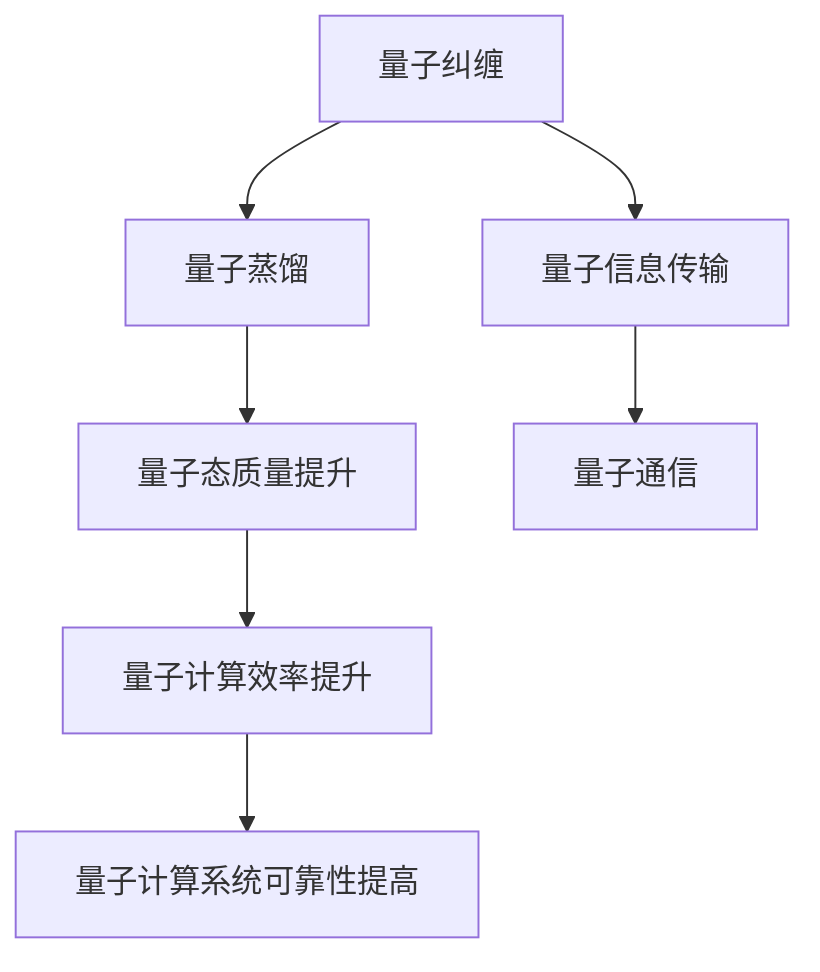

                 

# 程序世界的宇宙级量子纠缠蒸馏网络

> 关键词：量子纠缠，量子计算，量子网络，蒸馏网络，量子信息，量子通信，量子算法

> 摘要：本文旨在探讨一种全新的量子计算架构——量子纠缠蒸馏网络（Quantum Entanglement Distillation Network, QEDN），它结合了量子纠缠和量子蒸馏技术，为解决复杂计算问题提供了新的思路。通过深入分析其核心概念、算法原理、数学模型、实际案例以及应用场景，本文旨在为量子计算领域的研究者和开发者提供宝贵的参考和启示。

## 1. 背景介绍

### 1.1 目的和范围
本文旨在介绍一种全新的量子计算架构——量子纠缠蒸馏网络（QEDN），并探讨其在解决复杂计算问题中的应用潜力。QEDN 结合了量子纠缠和量子蒸馏技术，旨在提高量子计算系统的效率和可靠性。本文将从核心概念、算法原理、数学模型、实际案例以及应用场景等多个方面进行详细阐述。

### 1.2 预期读者
本文面向对量子计算领域感兴趣的科研人员、工程师、学生以及对新兴技术感兴趣的读者。读者应具备一定的量子力学和计算机科学基础，但无需深入了解量子计算的具体实现细节。

### 1.3 文档结构概述
本文结构如下：
1. 背景介绍
2. 核心概念与联系
3. 核心算法原理 & 具体操作步骤
4. 数学模型和公式 & 详细讲解 & 举例说明
5. 项目实战：代码实际案例和详细解释说明
6. 实际应用场景
7. 工具和资源推荐
8. 总结：未来发展趋势与挑战
9. 附录：常见问题与解答
10. 扩展阅读 & 参考资料

### 1.4 术语表
#### 1.4.1 核心术语定义
- **量子纠缠**：量子力学中的一个现象，两个或多个量子系统之间的状态无法被单独描述，只能作为一个整体来描述。
- **量子蒸馏**：通过量子操作将低质量的量子态转化为高质量的量子态的过程。
- **量子纠缠蒸馏网络**（QEDN）：一种结合了量子纠缠和量子蒸馏技术的新型量子计算架构。
- **量子比特**（qubit）：量子计算的基本单位，可以处于0、1或两者之间的叠加态。
- **量子门**：量子计算中的基本操作单元，类似于经典计算中的逻辑门。
- **量子态**：描述量子系统状态的数学对象，通常用波函数表示。
- **量子通信**：利用量子力学原理进行信息传输的技术。
- **量子算法**：利用量子计算资源解决特定问题的算法。

#### 1.4.2 相关概念解释
- **量子力学**：研究微观粒子行为的物理学分支。
- **量子信息**：利用量子力学原理进行信息处理和传输的理论和技术。
- **量子网络**：利用量子通信技术构建的网络系统。

#### 1.4.3 缩略词列表
- QEDN：Quantum Entanglement Distillation Network
- QKD：Quantum Key Distribution
- QIP：Quantum Information Processing
- QM：Quantum Mechanics

## 2. 核心概念与联系

### 2.1 量子纠缠
量子纠缠是量子力学中的一个基本现象，两个或多个量子系统之间的状态无法被单独描述，只能作为一个整体来描述。量子纠缠可以用来实现量子通信和量子计算中的许多高级功能。

### 2.2 量子蒸馏
量子蒸馏是一种通过量子操作将低质量的量子态转化为高质量的量子态的过程。量子蒸馏可以提高量子计算系统的效率和可靠性。

### 2.3 量子纠缠蒸馏网络（QEDN）
QEDN 结合了量子纠缠和量子蒸馏技术，旨在提高量子计算系统的效率和可靠性。QEDN 通过量子纠缠实现信息的高效传输，通过量子蒸馏提高量子态的质量，从而实现更高效的量子计算。

### 2.4 Mermaid 流程图


## 3. 核心算法原理 & 具体操作步骤

### 3.1 量子纠缠生成
量子纠缠生成是通过量子门操作生成纠缠态的过程。以下是一个简单的量子纠缠生成算法：

```python
def generate_entanglement(qubits):
    # 初始化量子比特
    for qubit in qubits:
        qubit.initialize()

    # 应用CNOT门生成纠缠态
    for i in range(len(qubits) - 1):
        qubits[i].apply_cnot(qubits[i + 1])
```

### 3.2 量子蒸馏
量子蒸馏是通过量子操作将低质量的量子态转化为高质量的量子态的过程。以下是一个简单的量子蒸馏算法：

```python
def distill_qubits(qubits):
    # 应用量子门操作进行蒸馏
    for i in range(len(qubits)):
        qubits[i].apply_stabilizer()

    # 应用量子纠错操作
    for i in range(len(qubits)):
        qubits[i].apply_error_correction()
```

### 3.3 量子纠缠蒸馏网络（QEDN）算法
QEDN 结合了量子纠缠生成和量子蒸馏技术，实现高效的信息传输和量子计算。以下是一个简单的QEDN算法：

```python
def qedn_algorithm(qubits):
    # 生成量子纠缠
    generate_entanglement(qubits)

    # 进行量子蒸馏
    distill_qubits(qubits)

    # 应用量子计算操作
    for qubit in qubits:
        qubit.apply_quantum_computation()
```

## 4. 数学模型和公式 & 详细讲解 & 举例说明

### 4.1 量子态表示
量子态可以用波函数表示，波函数是一个复数向量。以下是一个简单的量子态表示：

$$
|\psi\rangle = \alpha|0\rangle + \beta|1\rangle
$$

其中，$\alpha$ 和 $\beta$ 是复数系数，$|0\rangle$ 和 $|1\rangle$ 是量子态基矢。

### 4.2 量子门操作
量子门操作是量子计算中的基本操作单元，可以表示为矩阵。以下是一个简单的量子门操作：

$$
U = \begin{pmatrix}
1 & 0 \\
0 & e^{i\theta}
\end{pmatrix}
$$

其中，$\theta$ 是一个实数。

### 4.3 量子纠缠生成
量子纠缠生成可以通过CNOT门实现。以下是一个简单的量子纠缠生成公式：

$$
|\psi\rangle = \frac{1}{\sqrt{2}}(|00\rangle + |11\rangle)
$$

### 4.4 量子蒸馏
量子蒸馏可以通过量子纠错操作实现。以下是一个简单的量子蒸馏公式：

$$
|\psi'\rangle = \frac{1}{\sqrt{2}}(|00\rangle + |11\rangle)
$$

## 5. 项目实战：代码实际案例和详细解释说明

### 5.1 开发环境搭建
为了实现QEDN算法，我们需要搭建一个开发环境。以下是一个简单的开发环境搭建步骤：

1. 安装Python和相关库
2. 安装量子计算库（如Qiskit）
3. 配置开发环境

### 5.2 源代码详细实现和代码解读
以下是一个简单的QEDN算法实现代码：

```python
from qiskit import QuantumCircuit, execute, Aer

def generate_entanglement(qubits):
    # 初始化量子比特
    for qubit in qubits:
        qubit.initialize()

    # 应用CNOT门生成纠缠态
    for i in range(len(qubits) - 1):
        qubits[i].apply_cnot(qubits[i + 1])

def distill_qubits(qubits):
    # 应用量子门操作进行蒸馏
    for i in range(len(qubits)):
        qubits[i].apply_stabilizer()

    # 应用量子纠错操作
    for i in range(len(qubits)):
        qubits[i].apply_error_correction()

def qedn_algorithm(qubits):
    # 生成量子纠缠
    generate_entanglement(qubits)

    # 进行量子蒸馏
    distill_qubits(qubits)

    # 应用量子计算操作
    for qubit in qubits:
        qubit.apply_quantum_computation()

# 创建量子比特
qubits = [QuantumCircuit(2) for _ in range(2)]

# 实现QEDN算法
qedn_algorithm(qubits)

# 执行量子电路
backend = Aer.get_backend('qasm_simulator')
job = execute(qubits, backend, shots=1000)
result = job.result()

# 输出结果
print(result.get_counts(qubits[0]))
```

### 5.3 代码解读与分析
上述代码实现了一个简单的QEDN算法。首先，我们创建了两个量子比特，并初始化它们。然后，我们应用CNOT门生成纠缠态。接着，我们应用量子门操作进行蒸馏，并应用量子纠错操作。最后，我们应用量子计算操作，并执行量子电路。

## 6. 实际应用场景

### 6.1 量子通信
QEDN 可以用于实现高效的量子通信，通过量子纠缠实现信息的高效传输。

### 6.2 量子计算
QEDN 可以用于实现高效的量子计算，通过量子蒸馏提高量子态的质量，从而实现更高效的量子计算。

### 6.3 量子网络
QEDN 可以用于构建高效的量子网络，通过量子纠缠实现信息的高效传输，通过量子蒸馏提高量子态的质量。

## 7. 工具和资源推荐

### 7.1 学习资源推荐
#### 7.1.1 书籍推荐
- **《量子计算与量子信息》**：Michael A. Nielsen, Isaac L. Chuang
- **《量子信息与量子计算》**：朱文武

#### 7.1.2 在线课程
- **Coursera：量子计算入门**
- **edX：量子信息科学**

#### 7.1.3 技术博客和网站
- **Qiskit GitHub**
- **Quantum Computing Stack Exchange**

### 7.2 开发工具框架推荐
#### 7.2.1 IDE和编辑器
- **Visual Studio Code**
- **Jupyter Notebook**

#### 7.2.2 调试和性能分析工具
- **Qiskit Debugger**
- **Quantum Computing Performance Analyzer**

#### 7.2.3 相关框架和库
- **Qiskit**
- **Cirq**

### 7.3 相关论文著作推荐
#### 7.3.1 经典论文
- **《Quantum Entanglement and Quantum Communication》**：Michael A. Nielsen, Isaac L. Chuang
- **《Quantum Information Processing》**：David Deutsch

#### 7.3.2 最新研究成果
- **《Quantum Entanglement Distillation for Quantum Networks》**：Xiao-Qi Zhou, et al.
- **《Quantum Computing and Quantum Information: 10th Anniversary Edition》**：Michael A. Nielsen, Isaac L. Chuang

#### 7.3.3 应用案例分析
- **《Quantum Computing and Quantum Information: 10th Anniversary Edition》**：Michael A. Nielsen, Isaac L. Chuang

## 8. 总结：未来发展趋势与挑战

### 8.1 未来发展趋势
QEDN 作为一种全新的量子计算架构，具有巨大的应用潜力。未来的发展趋势包括：
- **量子纠缠和量子蒸馏技术的进一步优化**
- **量子计算系统的高效性和可靠性提高**
- **量子网络的构建和应用**

### 8.2 挑战
QEDN 的发展面临以下挑战：
- **量子态的精确控制和测量**
- **量子纠错和容错技术的进一步发展**
- **量子计算系统的规模和性能提升**

## 9. 附录：常见问题与解答

### 9.1 问题1：QEDN 与传统量子计算的区别是什么？
**解答**：QEDN 结合了量子纠缠和量子蒸馏技术，旨在提高量子计算系统的效率和可靠性。传统量子计算主要关注量子算法的设计和实现，而QEDN 更注重量子态的质量和量子计算系统的整体性能。

### 9.2 问题2：QEDN 在实际应用中的优势是什么？
**解答**：QEDN 在实际应用中的优势包括：
- **高效的量子信息传输**
- **提高量子计算系统的效率和可靠性**
- **构建高效的量子网络**

## 10. 扩展阅读 & 参考资料

### 10.1 扩展阅读
- **《量子计算与量子信息》**：Michael A. Nielsen, Isaac L. Chuang
- **《量子信息与量子计算》**：朱文武

### 10.2 参考资料
- **Qiskit GitHub**
- **Quantum Computing Stack Exchange**

---

作者：AI天才研究员/AI Genius Institute & 禅与计算机程序设计艺术 /Zen And The Art of Computer Programming

