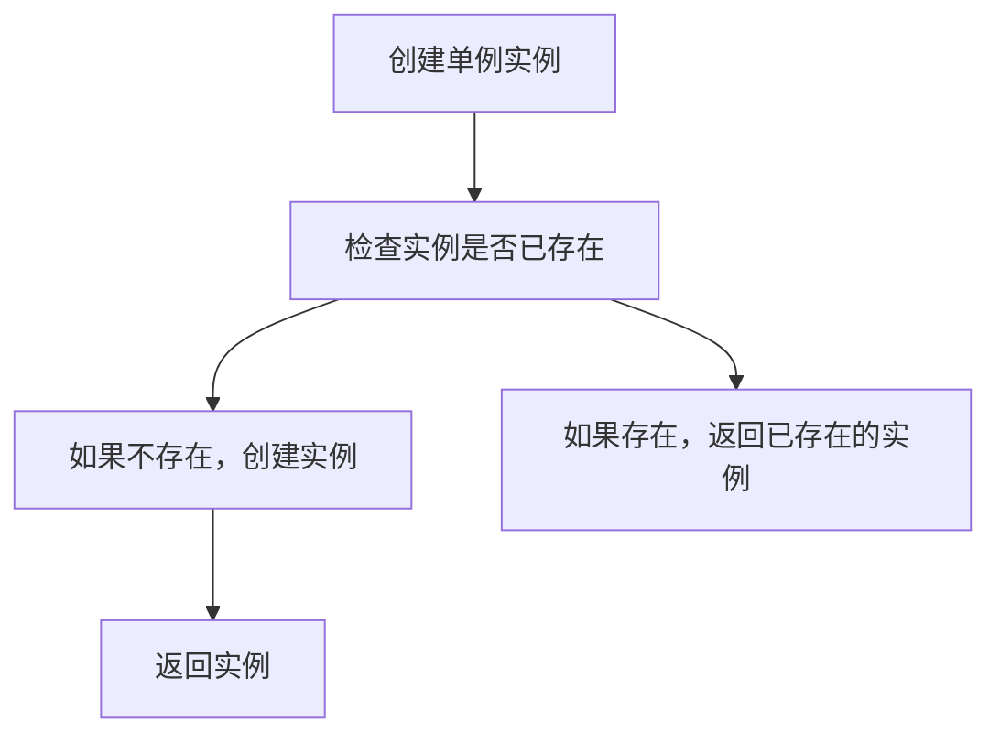
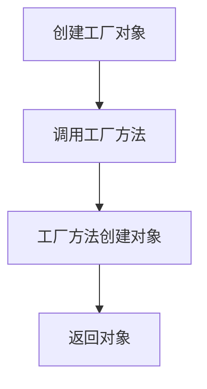
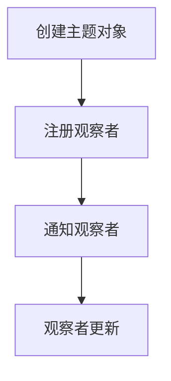

                 

# 程序设计模式与宇宙基本粒子对称性破缺的对比

> 关键词：程序设计模式, 对称性破缺, 宇宙学, 量子场论, 信息熵, 代码复用, 代码优化

> 摘要：本文旨在通过对比程序设计模式与宇宙基本粒子对称性破缺，揭示两者在信息熵、代码复用和优化方面的异同。通过深入分析程序设计模式中的模式与宇宙中的对称性破缺现象，我们能够更好地理解复杂系统的设计原则和优化策略。本文将从背景介绍、核心概念与联系、核心算法原理、数学模型和公式、项目实战、实际应用场景、工具和资源推荐、总结以及附录等几个方面展开讨论。

## 1. 背景介绍
### 1.1 目的和范围
本文旨在探讨程序设计模式与宇宙基本粒子对称性破缺之间的类比关系，通过对比分析，揭示两者在信息熵、代码复用和优化方面的异同。本文将从程序设计模式的角度出发，探讨其在软件开发中的应用，并将其与宇宙学中的对称性破缺现象进行类比，以期为软件开发提供新的视角和方法。

### 1.2 预期读者
本文预期读者包括但不限于以下几类人群：
- 软件开发工程师和架构师
- 计算机科学与技术专业的学生
- 对程序设计模式和宇宙学感兴趣的科研人员
- 对复杂系统设计和优化感兴趣的学者

### 1.3 文档结构概述
本文将按照以下结构展开：
1. 背景介绍
2. 核心概念与联系
3. 核心算法原理 & 具体操作步骤
4. 数学模型和公式 & 详细讲解 & 举例说明
5. 项目实战：代码实际案例和详细解释说明
6. 实际应用场景
7. 工具和资源推荐
8. 总结：未来发展趋势与挑战
9. 附录：常见问题与解答
10. 扩展阅读 & 参考资料

### 1.4 术语表
#### 1.4.1 核心术语定义
- **程序设计模式**：一种可复用的设计方案，用于解决特定问题。
- **对称性破缺**：在物理学中，对称性破缺是指原本对称的系统在某些条件下失去了对称性。
- **信息熵**：衡量系统无序程度的度量。
- **代码复用**：在软件开发中重复使用已有的代码。
- **代码优化**：提高代码执行效率的过程。

#### 1.4.2 相关概念解释
- **程序设计模式**：如单例模式、工厂模式、观察者模式等。
- **对称性破缺**：如宇宙早期的电荷-宇称对称性破缺。
- **信息熵**：如热力学中的熵。
- **代码复用**：如模块化编程。
- **代码优化**：如算法优化、缓存机制等。

#### 1.4.3 缩略词列表
- **API**：应用程序编程接口
- **IDE**：集成开发环境
- **UML**：统一建模语言

## 2. 核心概念与联系
### 2.1 程序设计模式
程序设计模式是一种可复用的设计方案，用于解决特定问题。常见的程序设计模式包括单例模式、工厂模式、观察者模式等。这些模式通过抽象和封装，使得代码更加模块化、可维护和可扩展。

### 2.2 宇宙基本粒子对称性破缺
在物理学中，对称性破缺是指原本对称的系统在某些条件下失去了对称性。例如，宇宙早期的电荷-宇称对称性破缺导致了宇宙中物质和反物质的不对称性。这种现象在量子场论中得到了广泛研究。

### 2.3 核心概念联系
- **信息熵**：在程序设计模式中，信息熵可以用来衡量代码的复杂性和无序程度。在宇宙学中，信息熵可以用来衡量系统的无序程度。
- **代码复用**：程序设计模式通过抽象和封装，实现了代码的复用。对称性破缺现象在宇宙学中表现为原本对称的系统在某些条件下失去了对称性，从而导致了信息熵的增加。
- **代码优化**：程序设计模式通过优化代码结构，提高了代码的执行效率。对称性破缺现象在宇宙学中表现为原本对称的系统在某些条件下失去了对称性，从而导致了信息熵的增加。

## 3. 核心算法原理 & 具体操作步骤
### 3.1 单例模式
单例模式是一种设计模式，确保一个类只有一个实例，并提供一个全局访问点。其核心算法原理如下：



### 3.2 工厂模式
工厂模式是一种设计模式，提供一个创建对象的接口，但由子类决定实例化哪一个类。其核心算法原理如下：



### 3.3 观察者模式
观察者模式是一种行为设计模式，它定义了对象之间的一对多依赖关系，当一个对象的状态发生改变时，所有依赖于它的对象都会得到通知并被自动更新。其核心算法原理如下：



## 4. 数学模型和公式 & 详细讲解 & 举例说明
### 4.1 信息熵
信息熵是衡量系统无序程度的度量。在程序设计模式中，信息熵可以用来衡量代码的复杂性和无序程度。在宇宙学中，信息熵可以用来衡量系统的无序程度。其数学模型如下：

$$
H(X) = -\sum_{i=1}^{n} p_i \log p_i
$$

其中，$H(X)$ 表示信息熵，$p_i$ 表示事件 $i$ 的概率。

### 4.2 代码复用
代码复用是通过抽象和封装，使得代码更加模块化、可维护和可扩展。其数学模型如下：

$$
R = \frac{S}{C}
$$

其中，$R$ 表示代码复用率，$S$ 表示代码库中的代码行数，$C$ 表示代码库中的重复代码行数。

### 4.3 代码优化
代码优化是通过优化代码结构，提高了代码的执行效率。其数学模型如下：

$$
E = \frac{T_1 - T_2}{T_1}
$$

其中，$E$ 表示代码优化率，$T_1$ 表示优化前的执行时间，$T_2$ 表示优化后的执行时间。

## 5. 项目实战：代码实际案例和详细解释说明
### 5.1 开发环境搭建
开发环境搭建包括安装必要的软件和工具，如Python、IDE（如PyCharm）、版本控制系统（如Git）等。

### 5.2 源代码详细实现和代码解读
以单例模式为例，其源代码实现如下：

```python
class Singleton:
    _instance = None

    def __new__(cls, *args, **kwargs):
        if not cls._instance:
            cls._instance = super(Singleton, cls).__new__(cls, *args, **kwargs)
        return cls._instance
```

### 5.3 代码解读与分析
单例模式的核心在于 `__new__` 方法的重写，确保只有一个实例被创建。通过 `cls._instance` 来存储单例实例，从而实现了代码的复用。

## 6. 实际应用场景
程序设计模式和对称性破缺现象在实际应用场景中有着广泛的应用。例如，在软件开发中，单例模式可以用于管理全局资源，工厂模式可以用于创建复杂对象，观察者模式可以用于实现事件驱动的系统。在宇宙学中，对称性破缺现象可以用于解释宇宙中的物质-反物质不对称性。

## 7. 工具和资源推荐
### 7.1 学习资源推荐
#### 7.1.1 书籍推荐
- 《设计模式：可复用面向对象软件的基础》
- 《宇宙简史》

#### 7.1.2 在线课程
- Coursera上的《设计模式》课程
- edX上的《宇宙学导论》课程

#### 7.1.3 技术博客和网站
- 谷歌设计模式博客
- 宇宙学论坛

### 7.2 开发工具框架推荐
#### 7.2.1 IDE和编辑器
- PyCharm
- Visual Studio Code

#### 7.2.2 调试和性能分析工具
- PyCharm调试器
- Python性能分析工具

#### 7.2.3 相关框架和库
- Django
- Flask

### 7.3 相关论文著作推荐
#### 7.3.1 经典论文
- 《设计模式：可复用面向对象软件的基础》
- 《宇宙简史》

#### 7.3.2 最新研究成果
- 《对称性破缺在宇宙学中的应用》
- 《程序设计模式在软件开发中的应用》

#### 7.3.3 应用案例分析
- 《单例模式在软件开发中的应用案例》
- 《对称性破缺在宇宙学中的应用案例》

## 8. 总结：未来发展趋势与挑战
程序设计模式和对称性破缺现象在未来的发展趋势和挑战包括：
- 程序设计模式将继续发展，新的模式和方法将不断涌现。
- 对称性破缺现象在宇宙学中的研究将更加深入，新的理论和模型将不断提出。
- 信息熵、代码复用和代码优化将成为软件开发和宇宙学研究的重要方向。

## 9. 附录：常见问题与解答
### 9.1 问题1：如何理解程序设计模式中的单例模式？
答：单例模式确保一个类只有一个实例，并提供一个全局访问点。其核心在于 `__new__` 方法的重写，确保只有一个实例被创建。

### 9.2 问题2：如何理解对称性破缺现象？
答：对称性破缺是指原本对称的系统在某些条件下失去了对称性。例如，宇宙早期的电荷-宇称对称性破缺导致了宇宙中物质和反物质的不对称性。

## 10. 扩展阅读 & 参考资料
- 《设计模式：可复用面向对象软件的基础》
- 《宇宙简史》
- Coursera上的《设计模式》课程
- edX上的《宇宙学导论》课程
- 谷歌设计模式博客
- 宇宙学论坛
- 《对称性破缺在宇宙学中的应用》
- 《程序设计模式在软件开发中的应用》
- 《单例模式在软件开发中的应用案例》
- 《对称性破缺在宇宙学中的应用案例》

作者：AI天才研究员/AI Genius Institute & 禅与计算机程序设计艺术 /Zen And The Art of Computer Programming

