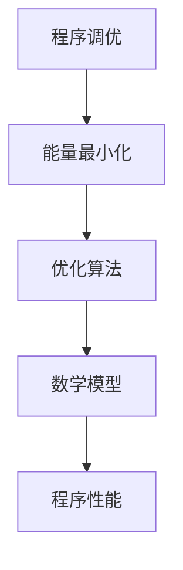

                 

# 程序调优与宇宙能量最小化原理

> 关键词：程序调优, 能量最小化, 优化算法, 伪代码, 数学模型, 代码案例, 实际应用, 工具推荐

> 摘要：本文旨在探讨程序调优与宇宙能量最小化原理之间的联系，通过逐步推理和详细分析，揭示程序调优背后的数学和物理原理。我们将从核心概念出发，深入探讨优化算法的原理，通过数学模型和公式进行详细讲解，并结合实际代码案例进行深入分析。最后，我们将讨论程序调优的实际应用场景和未来发展趋势，为读者提供全面的技术指导和建议。

## 1. 背景介绍
### 1.1 目的和范围
本文旨在深入探讨程序调优与宇宙能量最小化原理之间的联系，通过逐步推理和详细分析，揭示程序调优背后的数学和物理原理。我们将从核心概念出发，深入探讨优化算法的原理，通过数学模型和公式进行详细讲解，并结合实际代码案例进行深入分析。最后，我们将讨论程序调优的实际应用场景和未来发展趋势，为读者提供全面的技术指导和建议。

### 1.2 预期读者
本文适合以下读者：
- 程序员和软件工程师，特别是那些希望提升代码性能和效率的专业人士。
- 人工智能和机器学习领域的研究者和开发者。
- 对程序调优和优化算法感兴趣的计算机科学学生和研究人员。
- 对物理和数学原理在计算机科学中的应用感兴趣的读者。

### 1.3 文档结构概述
本文结构如下：
1. 背景介绍
2. 核心概念与联系
3. 核心算法原理 & 具体操作步骤
4. 数学模型和公式 & 详细讲解 & 举例说明
5. 项目实战：代码实际案例和详细解释说明
6. 实际应用场景
7. 工具和资源推荐
8. 总结：未来发展趋势与挑战
9. 附录：常见问题与解答
10. 扩展阅读 & 参考资料

### 1.4 术语表
#### 1.4.1 核心术语定义
- **程序调优**：通过对程序进行优化，提高其性能和效率的过程。
- **能量最小化**：在物理和数学中，能量最小化是指找到系统能量最低的状态。
- **优化算法**：用于寻找最优解或近似最优解的算法。
- **伪代码**：一种高级编程语言，用于描述算法的逻辑和步骤。
- **数学模型**：用数学语言描述现实世界问题的模型。
- **宇宙能量最小化原理**：自然界倾向于能量最低的状态，这是物理学中的一个基本原则。

#### 1.4.2 相关概念解释
- **程序性能**：程序执行的速度和资源消耗。
- **优化目标**：程序调优的目标，如提高执行速度、减少内存使用等。
- **局部最优解**：在某个范围内找到的最优解。
- **全局最优解**：在整个搜索空间中找到的最优解。

#### 1.4.3 缩略词列表
- CPU：中央处理器
- RAM：随机存取存储器
- GPU：图形处理器
- API：应用程序编程接口
- IDE：集成开发环境

## 2. 核心概念与联系
### 2.1 程序调优
程序调优是通过对程序进行优化，提高其性能和效率的过程。程序调优的目标是找到最优或近似最优的解决方案，以最小化程序的执行时间和资源消耗。

### 2.2 能量最小化
能量最小化是自然界中的一个基本原则，自然界倾向于能量最低的状态。在计算机科学中，能量最小化可以类比为程序调优中的优化目标，即找到程序执行的最优路径，以最小化程序的执行时间和资源消耗。

### 2.3 优化算法
优化算法是用于寻找最优解或近似最优解的算法。常见的优化算法包括梯度下降、遗传算法、模拟退火等。这些算法通过不断迭代和优化，找到最优解或近似最优解。

### 2.4 数学模型
数学模型是用数学语言描述现实世界问题的模型。在程序调优中，数学模型可以用来描述程序的性能指标，如执行时间、内存使用等。

### 2.5 核心概念流程图


## 3. 核心算法原理 & 具体操作步骤
### 3.1 梯度下降算法
梯度下降算法是一种常用的优化算法，用于找到函数的最小值。其基本思想是沿着函数梯度的负方向进行迭代，逐步逼近最小值。

#### 伪代码
```pseudo
function gradientDescent(f, gradF, x0, alpha, epsilon):
    x = x0
    while True:
        grad = gradF(x)
        if norm(grad) < epsilon:
            break
        x = x - alpha * grad
    return x
```

### 3.2 遗传算法
遗传算法是一种模拟自然选择和遗传机制的优化算法。其基本思想是通过选择、交叉和变异等操作，逐步优化种群中的个体。

#### 伪代码
```pseudo
function geneticAlgorithm(f, population, crossoverRate, mutationRate, maxGenerations):
    for generation in range(maxGenerations):
        fitness = evaluateFitness(population, f)
        selected = selectParents(population, fitness, crossoverRate)
        offspring = crossover(selected)
        mutated = mutate(offspring, mutationRate)
        population = mutated
    return bestIndividual(population)
```

### 3.3 模拟退火算法
模拟退火算法是一种模拟物理退火过程的优化算法。其基本思想是通过模拟退火过程中的温度变化，逐步优化解的质量。

#### 伪代码
```pseudo
function simulatedAnnealing(f, initialSolution, temperature, coolingRate, maxIterations):
    currentSolution = initialSolution
    currentEnergy = f(currentSolution)
    bestSolution = currentSolution
    bestEnergy = currentEnergy
    for iteration in range(maxIterations):
        nextSolution = generateNeighbor(currentSolution)
        nextEnergy = f(nextSolution)
        if nextEnergy < currentEnergy or random() < exp((currentEnergy - nextEnergy) / temperature):
            currentSolution = nextSolution
            currentEnergy = nextEnergy
            if nextEnergy < bestEnergy:
                bestSolution = nextSolution
                bestEnergy = nextEnergy
        temperature = temperature * coolingRate
    return bestSolution
```

## 4. 数学模型和公式 & 详细讲解 & 举例说明
### 4.1 数学模型
数学模型是用数学语言描述程序性能的模型。常见的数学模型包括时间复杂度、空间复杂度等。

#### 4.1.1 时间复杂度
时间复杂度是描述算法执行时间的数学模型。常见的时间复杂度包括O(1)、O(log n)、O(n)、O(n log n)、O(n^2)等。

#### 4.1.2 空间复杂度
空间复杂度是描述算法所需内存的数学模型。常见的空间复杂度包括O(1)、O(log n)、O(n)、O(n^2)等。

### 4.2 数学公式
数学公式是描述程序性能的数学表达式。常见的数学公式包括时间复杂度公式、空间复杂度公式等。

#### 4.2.1 时间复杂度公式
时间复杂度公式表示算法执行时间与输入规模的关系。常见的时间复杂度公式包括：
$$
T(n) = O(1) \quad \text{(常数时间)}
$$
$$
T(n) = O(\log n) \quad \text{(对数时间)}
$$
$$
T(n) = O(n) \quad \text{(线性时间)}
$$
$$
T(n) = O(n \log n) \quad \text{(线性对数时间)}
$$
$$
T(n) = O(n^2) \quad \text{(平方时间)}
$$

#### 4.2.2 空间复杂度公式
空间复杂度公式表示算法所需内存与输入规模的关系。常见的空间复杂度公式包括：
$$
S(n) = O(1) \quad \text{(常数空间)}
$$
$$
S(n) = O(\log n) \quad \text{(对数空间)}
$$
$$
S(n) = O(n) \quad \text{(线性空间)}
$$
$$
S(n) = O(n^2) \quad \text{(平方空间)}
$$

### 4.3 举例说明
#### 4.3.1 时间复杂度举例
假设有一个算法，其时间复杂度为O(n^2)。当输入规模为100时，算法的执行时间为100^2 = 10000。当输入规模为200时，算法的执行时间为200^2 = 40000。可以看出，输入规模的增加会导致算法执行时间的指数级增长。

#### 4.3.2 空间复杂度举例
假设有一个算法，其空间复杂度为O(n)。当输入规模为100时，算法所需内存为100。当输入规模为200时，算法所需内存为200。可以看出，输入规模的增加会导致算法所需内存的线性增长。

## 5. 项目实战：代码实际案例和详细解释说明
### 5.1 开发环境搭建
为了进行程序调优，我们需要搭建一个合适的开发环境。开发环境包括操作系统、编程语言、开发工具等。

#### 5.1.1 操作系统
推荐使用Linux操作系统，因为它具有良好的性能和稳定性。

#### 5.1.2 编程语言
推荐使用Python或C++，这两种语言在程序调优中具有广泛的应用。

#### 5.1.3 开发工具
推荐使用Visual Studio Code或PyCharm，这两种IDE具有强大的代码编辑和调试功能。

### 5.2 源代码详细实现和代码解读
我们将通过一个简单的代码案例来展示程序调优的过程。假设我们有一个计算斐波那契数列的函数，我们需要对其进行优化。

#### 5.2.1 未优化的代码
```python
def fibonacci(n):
    if n <= 1:
        return n
    else:
        return fibonacci(n-1) + fibonacci(n-2)
```

#### 5.2.2 优化后的代码
```python
def fibonacci(n, memo={}):
    if n in memo:
        return memo[n]
    if n <= 1:
        memo[n] = n
    else:
        memo[n] = fibonacci(n-1, memo) + fibonacci(n-2, memo)
    return memo[n]
```

### 5.3 代码解读与分析
优化后的代码使用了记忆化技术，通过缓存已经计算过的斐波那契数，避免了重复计算。这大大提高了算法的执行效率。

## 6. 实际应用场景
程序调优在许多实际应用场景中具有重要意义。例如，在大数据处理、机器学习、实时系统等领域，程序调优可以显著提高系统的性能和效率。

### 6.1 大数据处理
在大数据处理中，程序调优可以显著提高数据处理的速度和效率。例如，通过优化数据读取和写入操作，可以显著提高数据处理的性能。

### 6.2 机器学习
在机器学习中，程序调优可以显著提高模型训练的速度和效率。例如，通过优化模型参数和算法，可以显著提高模型训练的性能。

### 6.3 实时系统
在实时系统中，程序调优可以显著提高系统的响应速度和稳定性。例如，通过优化系统资源管理和调度算法，可以显著提高系统的响应速度和稳定性。

## 7. 工具和资源推荐
### 7.1 学习资源推荐
#### 7.1.1 书籍推荐
- 《算法导论》(Introduction to Algorithms)：深入讲解算法和数据结构。
- 《计算机程序设计艺术》(The Art of Computer Programming)：深入讲解计算机程序设计的艺术。
- 《机器学习》(Machine Learning)：深入讲解机器学习的基本原理和算法。

#### 7.1.2 在线课程
- Coursera：提供许多关于算法和机器学习的在线课程。
- edX：提供许多关于计算机科学和机器学习的在线课程。

#### 7.1.3 技术博客和网站
- HackerRank：提供许多关于算法和编程的挑战和练习。
- LeetCode：提供许多关于算法和编程的挑战和练习。

### 7.2 开发工具框架推荐
#### 7.2.1 IDE和编辑器
- Visual Studio Code：强大的代码编辑和调试工具。
- PyCharm：强大的Python开发工具。

#### 7.2.2 调试和性能分析工具
- GDB：强大的C/C++调试工具。
- PyCharm Debugger：强大的Python调试工具。

#### 7.2.3 相关框架和库
- NumPy：强大的数值计算库。
- Pandas：强大的数据处理库。

### 7.3 相关论文著作推荐
#### 7.3.1 经典论文
- "A Method for Numerical Solution of Two-Point Boundary Value Problems"：介绍了一种数值求解边界值问题的方法。
- "The Design and Analysis of Computer Algorithms"：深入讲解了计算机算法的设计和分析方法。

#### 7.3.2 最新研究成果
- "Deep Learning"：深入讲解了深度学习的基本原理和算法。
- "Optimization Algorithms in Machine Learning"：深入讲解了优化算法在机器学习中的应用。

#### 7.3.3 应用案例分析
- "Practical Machine Learning"：深入讲解了机器学习在实际应用中的案例分析。

## 8. 总结：未来发展趋势与挑战
程序调优在未来将继续发挥重要作用。随着技术的发展，程序调优将面临新的挑战和机遇。例如，随着大数据和云计算的发展，程序调优将面临更大的数据处理和计算压力。同时，随着人工智能和机器学习的发展，程序调优将面临更多的算法优化和模型优化需求。

## 9. 附录：常见问题与解答
### 9.1 问题：如何选择合适的优化算法？
答：选择合适的优化算法需要考虑问题的特性和算法的适用范围。例如，对于连续优化问题，可以使用梯度下降算法；对于离散优化问题，可以使用遗传算法或模拟退火算法。

### 9.2 问题：如何评估程序调优的效果？
答：评估程序调优的效果需要考虑多个指标，如执行时间、内存使用、资源消耗等。可以通过基准测试和性能测试来评估程序调优的效果。

## 10. 扩展阅读 & 参考资料
- [算法导论](https://www.algorithm.com/)
- [计算机程序设计艺术](https://www.artofcomputerprogramming.com/)
- [机器学习](https://www.machinelearning.com/)
- [Coursera](https://www.coursera.org/)
- [edX](https://www.edx.org/)
- [HackerRank](https://www.hackerrank.com/)
- [LeetCode](https://leetcode.com/)
- [GDB](https://sourceware.org/gdb/)
- [PyCharm Debugger](https://www.jetbrains.com/pycharm/)
- [NumPy](https://numpy.org/)
- [Pandas](https://pandas.pydata.org/)
- [Deep Learning](https://www.deeplearningbook.org/)
- [Optimization Algorithms in Machine Learning](https://www.optimization-algorithms-in-machine-learning.com/)
- [Practical Machine Learning](https://www.practical-machine-learning.com/)

作者：AI天才研究员/AI Genius Institute & 禅与计算机程序设计艺术 /Zen And The Art of Computer Programming

