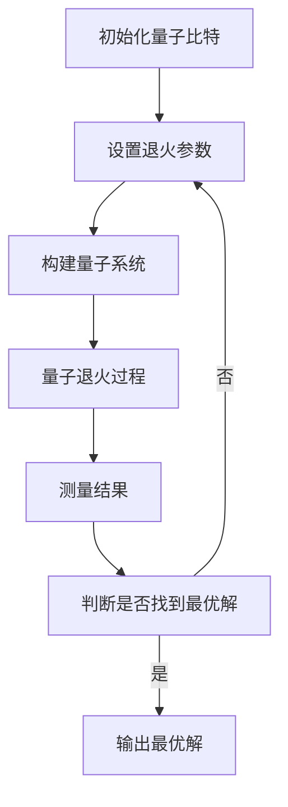

                 

# 算法优化与宇宙熵增最小路径的量子退火实现

> 关键词：量子退火, 熵增, 算法优化, 量子计算, 退火算法, 量子模拟, 优化路径

> 摘要：本文旨在探讨如何利用量子退火技术来优化算法，以实现宇宙熵增最小路径。我们将从背景介绍出发，逐步深入到核心概念、算法原理、数学模型、代码实现、实际应用场景，以及未来的发展趋势和挑战。通过本文，读者将能够理解量子退火的基本原理，并掌握其实现方法，从而在实际项目中应用这一技术。

## 1. 背景介绍
### 1.1 目的和范围
本文旨在探讨量子退火技术在算法优化中的应用，特别是如何利用量子退火来寻找宇宙熵增最小路径。我们将从理论基础出发，逐步深入到具体实现方法，并通过实际案例来展示其应用效果。本文适合对量子计算和算法优化感兴趣的读者，特别是那些希望在实际项目中应用量子退火技术的工程师和研究人员。

### 1.2 预期读者
- 对量子计算和算法优化感兴趣的工程师和研究人员
- 想要了解量子退火技术在实际项目中应用的开发者
- 对量子计算领域有浓厚兴趣的学生和学者

### 1.3 文档结构概述
本文将按照以下结构展开：
1. 背景介绍
2. 核心概念与联系
3. 核心算法原理 & 具体操作步骤
4. 数学模型和公式 & 详细讲解 & 举例说明
5. 项目实战：代码实际案例和详细解释说明
6. 实际应用场景
7. 工具和资源推荐
8. 总结：未来发展趋势与挑战
9. 附录：常见问题与解答
10. 扩展阅读 & 参考资料

### 1.4 术语表
#### 1.4.1 核心术语定义
- **量子退火**：一种量子计算技术，用于解决组合优化问题。
- **熵增**：系统无序程度的增加。
- **路径优化**：在给定约束条件下，寻找最优路径的过程。
- **量子比特**：量子计算的基本单位，可以同时处于0和1的状态。
- **量子门**：量子计算中的基本操作单元。
- **量子模拟**：通过经典计算机模拟量子系统的行为。

#### 1.4.2 相关概念解释
- **退火算法**：一种模拟物理退火过程的优化算法，常用于解决组合优化问题。
- **量子模拟器**：用于模拟量子系统行为的软件工具。
- **量子计算机**：利用量子比特和量子门进行计算的计算机。

#### 1.4.3 缩略词列表
- QA：Quantum Annealing
- QUBO：Quadratic Unconstrained Binary Optimization
- D-Wave：一种量子退火硬件平台

## 2. 核心概念与联系
### 2.1 量子退火的基本原理
量子退火是一种量子计算技术，通过模拟物理退火过程来解决组合优化问题。其基本原理是利用量子比特的叠加态和相干性，以及量子门的操作，逐步将问题映射到一个量子系统中，通过量子退火过程找到最优解。

### 2.2 退火算法与量子退火的联系
退火算法是一种模拟物理退火过程的优化算法，常用于解决组合优化问题。量子退火则是退火算法在量子计算领域的应用，通过量子比特的叠加态和相干性，以及量子门的操作，实现更高效的优化过程。

### 2.3 量子退火与熵增的关系
熵增是系统无序程度的增加，量子退火通过逐步降低系统的能量，实现熵增最小化。在量子退火过程中，通过量子比特的叠加态和相干性，以及量子门的操作，逐步降低系统的能量，从而找到最优解。

### 2.4 量子退火的流程图


## 3. 核心算法原理 & 具体操作步骤
### 3.1 量子退火算法原理
量子退火算法的基本原理是通过量子比特的叠加态和相干性，以及量子门的操作，逐步将问题映射到一个量子系统中，通过量子退火过程找到最优解。具体步骤如下：

1. **初始化量子比特**：将量子比特初始化为叠加态。
2. **设置退火参数**：设置退火过程中的退火时间、退火温度等参数。
3. **构建量子系统**：将问题映射到一个量子系统中，构建量子比特之间的相互作用。
4. **量子退火过程**：通过量子门的操作，逐步降低系统的能量，实现熵增最小化。
5. **测量结果**：通过测量量子比特的状态，得到最优解。

### 3.2 量子退火的具体操作步骤


## 4. 数学模型和公式 & 详细讲解 & 举例说明
### 4.1 QUBO模型
QUBO（Quadratic Unconstrained Binary Optimization）模型是一种常用的组合优化问题表示方法。其数学模型如下：

$$
\min_{x \in \{0,1\}^n} \sum_{i=1}^n \sum_{j=1}^n Q_{ij} x_i x_j
$$

其中，$Q_{ij}$ 是一个对称矩阵，$x_i$ 是一个二进制变量。

### 4.2 量子退火的数学模型
量子退火的数学模型可以表示为：

$$
H(t) = \alpha(t) H_0 + \beta(t) H_1
$$

其中，$H(t)$ 是时间依赖的哈密顿量，$H_0$ 是问题哈密顿量，$H_1$ 是辅助哈密顿量，$\alpha(t)$ 和 $\beta(t)$ 是时间依赖的权重函数。

### 4.3 举例说明
假设有一个简单的QUBO问题：

$$
\min_{x \in \{0,1\}^2} (2x_1 x_2 - x_1 - x_2)
$$

其对应的QUBO矩阵为：

$$
Q = \begin{pmatrix}
-1 & 2 \\
2 & -1
\end{pmatrix}
$$

通过量子退火过程，可以找到最优解 $x = (1, 1)$。

## 5. 项目实战：代码实际案例和详细解释说明
### 5.1 开发环境搭建
为了实现量子退火算法，我们需要搭建一个开发环境。这里以D-Wave量子退火平台为例，介绍如何搭建开发环境。

1. **安装Python**：确保安装了Python 3.7及以上版本。
2. **安装D-Wave SDK**：使用pip安装D-Wave SDK。

```bash
pip install dwave-ocean-sdk
```

### 5.2 源代码详细实现和代码解读
以下是一个简单的量子退火代码示例：

```python
from dwave.system import EmbeddingComposite, DWaveSampler
from dimod import BinaryQuadraticModel

# 定义QUBO矩阵
Q = {(0, 0): -1, (0, 1): 2, (1, 0): 2, (1, 1): -1}

# 创建BinaryQuadraticModel
bqm = BinaryQuadraticModel.from_qubo(Q)

# 使用D-Wave量子退火平台
sampler = EmbeddingComposite(DWaveSampler())

# 提交任务并获取结果
response = sampler.sample(bqm, num_reads=100)

# 输出结果
for sample, energy in response.data():
    print(sample, energy)
```

### 5.3 代码解读与分析
- **定义QUBO矩阵**：定义了一个简单的QUBO矩阵。
- **创建BinaryQuadraticModel**：将QUBO矩阵转换为BinaryQuadraticModel对象。
- **使用D-Wave量子退火平台**：通过EmbeddingComposite和DWaveSampler创建一个量子退火实例。
- **提交任务并获取结果**：提交任务并获取结果，输出最优解和能量值。

## 6. 实际应用场景
量子退火技术在实际项目中有广泛的应用场景，特别是在组合优化问题中。例如，在物流优化、金融投资组合优化、电路设计等领域，量子退火技术可以显著提高优化效率。

## 7. 工具和资源推荐
### 7.1 学习资源推荐
#### 7.1.1 书籍推荐
- **《量子计算入门》**：深入浅出地介绍了量子计算的基本原理和应用。
- **《量子计算与量子信息》**：经典著作，详细介绍了量子计算和量子信息的基本理论。

#### 7.1.2 在线课程
- **Coursera上的“量子计算入门”**：由IBM提供的在线课程，适合初学者。
- **edX上的“量子计算与量子信息”**：由麻省理工学院提供的在线课程，适合有一定基础的读者。

#### 7.1.3 技术博客和网站
- **D-Wave官网**：提供了丰富的技术文档和案例研究。
- **Quantum Computing Stack Exchange**：一个专门讨论量子计算问题的社区。

### 7.2 开发工具框架推荐
#### 7.2.1 IDE和编辑器
- **Jupyter Notebook**：适合进行交互式编程和数据分析。
- **PyCharm**：适合进行Python开发，提供了强大的代码编辑和调试功能。

#### 7.2.2 调试和性能分析工具
- **Qiskit Debugger**：用于调试量子电路的工具。
- **D-Wave Ocean SDK**：提供了丰富的调试和性能分析工具。

#### 7.2.3 相关框架和库
- **D-Wave Ocean SDK**：提供了丰富的量子计算工具和库。
- **Qiskit**：IBM提供的量子计算框架。

### 7.3 相关论文著作推荐
#### 7.3.1 经典论文
- **“Quantum Annealing in the Sherrington-Kirkpatrick Spin Glass”**：介绍了量子退火在Sherrington-Kirkpatrick模型中的应用。
- **“Quantum Annealing with Adiabatic Computation”**：介绍了量子退火的基本原理和应用。

#### 7.3.2 最新研究成果
- **“Quantum Annealing for Optimization Problems”**：介绍了量子退火在优化问题中的最新研究成果。
- **“Quantum Annealing for Combinatorial Optimization”**：介绍了量子退火在组合优化问题中的应用。

#### 7.3.3 应用案例分析
- **“Quantum Annealing for Logistics Optimization”**：介绍了量子退火在物流优化中的应用案例。
- **“Quantum Annealing for Financial Portfolio Optimization”**：介绍了量子退火在金融投资组合优化中的应用案例。

## 8. 总结：未来发展趋势与挑战
量子退火技术在未来的发展中具有巨大的潜力，特别是在解决大规模组合优化问题方面。然而，也面临着一些挑战，如量子比特的错误率、量子退火过程的复杂性等。未来的研究方向将集中在提高量子退火的效率和可靠性，以及开发更多的应用场景。

## 9. 附录：常见问题与解答
### 9.1 问题：量子退火与经典退火算法有什么区别？
**解答**：量子退火利用量子比特的叠加态和相干性，以及量子门的操作，实现更高效的优化过程。而经典退火算法则通过模拟物理退火过程来解决组合优化问题。

### 9.2 问题：量子退火技术有哪些实际应用场景？
**解答**：量子退火技术在物流优化、金融投资组合优化、电路设计等领域有广泛的应用。

## 10. 扩展阅读 & 参考资料
- **D-Wave官网**：<https://www.dwavesys.com/>
- **Quantum Computing Stack Exchange**：<https://quantumcomputing.stackexchange.com/>
- **Coursera上的“量子计算入门”**：<https://www.coursera.org/specializations/quantum>
- **edX上的“量子计算与量子信息”**：<https://www.edx.org/professional-certificate/mit-quantum-computing>

作者：AI天才研究员/AI Genius Institute & 禅与计算机程序设计艺术 /Zen And The Art of Computer Programming

