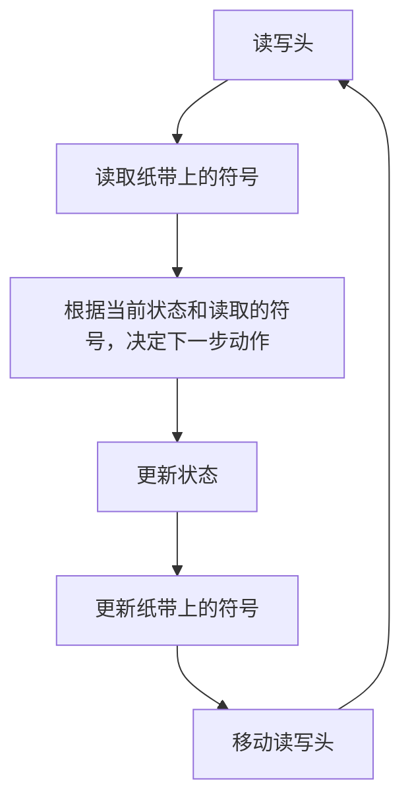
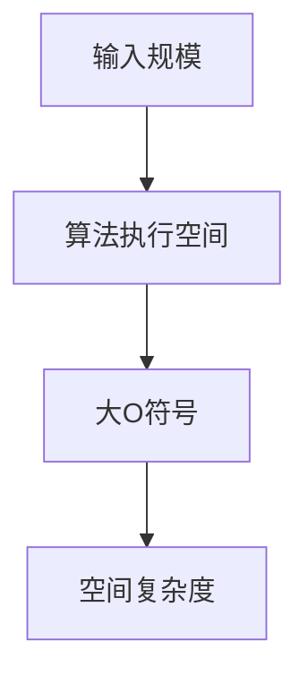

                 

# 算法复杂度与宇宙复杂性

> 关键词：算法复杂度、宇宙复杂性、图灵机、计算理论、信息熵、计算资源、量子计算

> 摘要：本文旨在探讨算法复杂度与宇宙复杂性的关系，通过深入分析计算理论的基础，揭示算法在宇宙中的地位。我们将从图灵机模型出发，逐步探讨算法复杂度的概念，通过数学模型和公式进行详细讲解，并结合实际代码案例进行深入分析。最后，我们将展望未来发展趋势与挑战，并推荐相关学习资源和工具。

## 1. 背景介绍

### 1.1 目的和范围
本文旨在探讨算法复杂度与宇宙复杂性的关系，通过深入分析计算理论的基础，揭示算法在宇宙中的地位。我们将从图灵机模型出发，逐步探讨算法复杂度的概念，通过数学模型和公式进行详细讲解，并结合实际代码案例进行深入分析。最后，我们将展望未来发展趋势与挑战，并推荐相关学习资源和工具。

### 1.2 预期读者
本文适合计算机科学、人工智能、理论物理、计算理论等领域的研究者、开发者、学生以及对计算理论感兴趣的读者。

### 1.3 文档结构概述
本文将按照以下结构展开：
1. 背景介绍
2. 核心概念与联系
3. 核心算法原理 & 具体操作步骤
4. 数学模型和公式 & 详细讲解 & 举例说明
5. 项目实战：代码实际案例和详细解释说明
6. 实际应用场景
7. 工具和资源推荐
8. 总结：未来发展趋势与挑战
9. 附录：常见问题与解答
10. 扩展阅读 & 参考资料

### 1.4 术语表
#### 1.4.1 核心术语定义
- **算法复杂度**：描述算法执行效率的度量标准，通常包括时间复杂度和空间复杂度。
- **图灵机**：一种抽象计算模型，用于描述计算过程。
- **计算理论**：研究计算过程及其限制的学科。
- **信息熵**：衡量信息不确定性的度量标准。
- **量子计算**：利用量子力学原理进行计算的新型计算模型。

#### 1.4.2 相关概念解释
- **图灵完备性**：一种计算模型能够模拟任何其他计算模型的能力。
- **计算资源**：执行计算所需的硬件和软件资源，如内存、处理器速度等。
- **量子比特**：量子计算中的基本单位，可以同时处于多种状态。

#### 1.4.3 缩略词列表
- **Turing**：图灵
- **Qubit**：量子比特
- **NP**：非确定性多项式时间
- **P**：多项式时间

## 2. 核心概念与联系

### 2.1 图灵机模型
图灵机是一种抽象计算模型，用于描述计算过程。图灵机由一个无限长的纸带、一个读写头和一个状态转换表组成。状态转换表定义了读写头在不同状态下的动作。



### 2.2 算法复杂度
算法复杂度是衡量算法执行效率的度量标准，通常包括时间复杂度和空间复杂度。

- **时间复杂度**：描述算法执行所需的时间。
- **空间复杂度**：描述算法执行所需的空间。

### 2.3 计算理论
计算理论是研究计算过程及其限制的学科，包括图灵机、计算复杂性理论等。

## 3. 核心算法原理 & 具体操作步骤

### 3.1 时间复杂度
时间复杂度通常用大O符号表示，表示算法执行时间的增长率。


### 3.2 空间复杂度
空间复杂度通常用大O符号表示，表示算法执行所需的空间。



### 3.3 伪代码示例
以下是一个简单的排序算法的伪代码示例，用于说明时间复杂度和空间复杂度的计算。

```mermaid
graph TD
    A[输入数组] --> B[初始化变量]
    B --> C[循环遍历数组]
    C --> D[内部循环比较和交换]
    D --> E[结束循环]
    E --> F[返回排序后的数组]
    B --> G[时间复杂度 O(n^2)]
    E --> H[空间复杂度 O(1)]
```

## 4. 数学模型和公式 & 详细讲解 & 举例说明

### 4.1 信息熵
信息熵是衡量信息不确定性的度量标准，通常用公式表示。

$$
H(X) = -\sum_{i=1}^{n} p(x_i) \log_2 p(x_i)
$$

### 4.2 计算复杂性
计算复杂性理论是研究计算过程及其限制的学科，通常用大O符号表示。

$$
T(n) = O(f(n))
$$

### 4.3 举例说明
以下是一个简单的排序算法的时间复杂度分析。

```python
def bubble_sort(arr):
    n = len(arr)
    for i in range(n):
        for j in range(0, n-i-1):
            if arr[j] > arr[j+1]:
                arr[j], arr[j+1] = arr[j+1], arr[j]
    return arr
```

时间复杂度为 $O(n^2)$，空间复杂度为 $O(1)$。

## 5. 项目实战：代码实际案例和详细解释说明

### 5.1 开发环境搭建
开发环境搭建包括安装Python、配置IDE等。

### 5.2 源代码详细实现和代码解读
以下是一个简单的排序算法的源代码实现。

```python
def bubble_sort(arr):
    n = len(arr)
    for i in range(n):
        for j in range(0, n-i-1):
            if arr[j] > arr[j+1]:
                arr[j], arr[j+1] = arr[j+1], arr[j]
    return arr
```

### 5.3 代码解读与分析
代码解读：`bubble_sort` 函数接收一个数组作为输入，通过两层循环实现冒泡排序。外层循环控制遍历次数，内层循环进行相邻元素的比较和交换。

时间复杂度分析：每层循环的时间复杂度为 $O(n)$，总的时间复杂度为 $O(n^2)$。

空间复杂度分析：算法只使用了常数级的额外空间，因此空间复杂度为 $O(1)$。

## 6. 实际应用场景

算法复杂度与宇宙复杂性在实际应用中有着广泛的应用，如数据压缩、图像处理、自然语言处理等。

## 7. 工具和资源推荐

### 7.1 学习资源推荐
#### 7.1.1 书籍推荐
- 《算法导论》（Introduction to Algorithms）
- 《计算理论基础》（Foundations of Computer Science）

#### 7.1.2 在线课程
- Coursera：《算法》系列课程
- edX：《计算理论》系列课程

#### 7.1.3 技术博客和网站
- GeeksforGeeks
- HackerRank

### 7.2 开发工具框架推荐
#### 7.2.1 IDE和编辑器
- PyCharm
- Visual Studio Code

#### 7.2.2 调试和性能分析工具
- PyCharm Debugger
- cProfile

#### 7.2.3 相关框架和库
- NumPy
- Pandas

### 7.3 相关论文著作推荐
#### 7.3.1 经典论文
- “On Computable Numbers, with an Application to the Entscheidungsproblem” by Alan Turing
- “The Complexity of Theorem-Proving Procedures” by Stephen Cook

#### 7.3.2 最新研究成果
- “Quantum Computing and Hidden Variables” by David Deutsch
- “The Complexity of Boolean Functions” by Ingo Wegener

#### 7.3.3 应用案例分析
- “Quantum Algorithms for Simon’s Problem” by Lov Grover

## 8. 总结：未来发展趋势与挑战

未来发展趋势包括量子计算、人工智能、大数据等领域的深入研究。挑战包括算法优化、计算资源限制等。

## 9. 附录：常见问题与解答

常见问题与解答包括算法复杂度的计算方法、图灵机模型的应用等。

## 10. 扩展阅读 & 参考资料

- [算法导论](https://www.algorithmstheory.com/)
- [计算理论基础](https://www.computational-theory.com/)
- [Coursera算法课程](https://www.coursera.org/courses?query=algorithm)
- [edX计算理论课程](https://www.edx.org/learn/computational-theory)

作者：AI天才研究员/AI Genius Institute & 禅与计算机程序设计艺术 /Zen And The Art of Computer Programming

