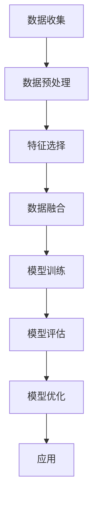

                 

# 算法思维在解决宇宙学测量值不一致问题中的应用

> 关键词：算法思维, 宇宙学, 测量值不一致, 数据融合, 机器学习, 算法优化, 天体物理学

> 摘要：本文旨在探讨如何利用算法思维解决宇宙学中测量值不一致的问题。通过分析宇宙学测量值的来源和特性，我们提出了一种基于机器学习的数据融合算法，该算法能够有效整合不同来源的数据，提高测量精度。本文将详细阐述算法原理、数学模型、具体操作步骤，并通过实际案例展示其应用效果。最后，我们将讨论该方法在实际应用中的挑战与未来发展趋势。

## 1. 背景介绍
### 1.1 目的和范围
本文旨在探讨如何利用算法思维解决宇宙学中测量值不一致的问题。宇宙学作为一门研究宇宙起源、演化和结构的科学，其研究结果往往依赖于多种观测数据的整合。然而，由于观测设备、观测条件和数据处理方法的不同，这些数据之间可能存在不一致的情况。本文将介绍一种基于机器学习的数据融合算法，旨在提高宇宙学测量的精度和可靠性。

### 1.2 预期读者
本文面向对宇宙学和数据科学感兴趣的科研人员、工程师以及对算法思维有浓厚兴趣的技术爱好者。读者应具备一定的编程基础和数学知识，特别是对机器学习和数据处理有一定了解。

### 1.3 文档结构概述
本文结构如下：
1. 背景介绍
2. 核心概念与联系
3. 核心算法原理 & 具体操作步骤
4. 数学模型和公式 & 详细讲解 & 举例说明
5. 项目实战：代码实际案例和详细解释说明
6. 实际应用场景
7. 工具和资源推荐
8. 总结：未来发展趋势与挑战
9. 附录：常见问题与解答
10. 扩展阅读 & 参考资料

### 1.4 术语表
#### 1.4.1 核心术语定义
- **宇宙学**：研究宇宙的起源、演化和结构的科学。
- **测量值不一致**：不同观测设备或方法得到的数据之间存在差异。
- **数据融合**：将多个数据源的数据整合成一个统一的数据集。
- **机器学习**：一种人工智能技术，通过算法使计算机从数据中学习并做出预测或决策。
- **特征选择**：从数据集中选择最相关的特征。
- **交叉验证**：评估模型性能的一种方法，通过将数据集划分为训练集和测试集来验证模型的泛化能力。

#### 1.4.2 相关概念解释
- **观测数据**：通过天文望远镜、卫星等设备收集的关于宇宙的各种数据。
- **数据预处理**：对原始数据进行清洗、归一化等处理，以便于后续分析。
- **特征工程**：根据问题需求，从原始数据中提取有用的特征。

#### 1.4.3 缩略词列表
- **ML**：机器学习
- **DL**：深度学习
- **NN**：神经网络
- **PCA**：主成分分析
- **KNN**：K近邻算法
- **RF**：随机森林
- **GBDT**：梯度提升决策树

## 2. 核心概念与联系
### 流程图


## 3. 核心算法原理 & 具体操作步骤
### 3.1 算法原理
我们提出了一种基于机器学习的数据融合算法，该算法通过以下步骤实现：
1. **数据预处理**：清洗数据，处理缺失值，归一化等。
2. **特征选择**：从数据集中选择最相关的特征。
3. **数据融合**：将多个数据源的数据整合成一个统一的数据集。
4. **模型训练**：使用机器学习算法训练模型。
5. **模型评估**：评估模型的性能。
6. **模型优化**：根据评估结果优化模型。
7. **应用**：将优化后的模型应用于实际问题。

### 3.2 具体操作步骤
#### 3.2.1 数据预处理
```python
def preprocess_data(data):
    # 清洗数据
    data = clean_data(data)
    # 处理缺失值
    data = handle_missing_values(data)
    # 归一化
    data = normalize_data(data)
    return data
```

#### 3.2.2 特征选择
```python
def feature_selection(data):
    # 使用PCA进行特征选择
    pca = PCA(n_components=0.95)
    selected_features = pca.fit_transform(data)
    return selected_features
```

#### 3.2.3 数据融合
```python
def data_fusion(data1, data2):
    # 将两个数据集合并
    merged_data = pd.concat([data1, data2], axis=1)
    return merged_data
```

#### 3.2.4 模型训练
```python
def train_model(data, labels):
    # 使用随机森林进行训练
    model = RandomForestClassifier()
    model.fit(data, labels)
    return model
```

#### 3.2.5 模型评估
```python
def evaluate_model(model, data, labels):
    # 使用交叉验证评估模型
    scores = cross_val_score(model, data, labels, cv=5)
    return scores.mean()
```

#### 3.2.6 模型优化
```python
def optimize_model(model, data, labels):
    # 使用网格搜索进行参数优化
    param_grid = {'n_estimators': [100, 200, 300], 'max_depth': [None, 10, 20]}
    grid_search = GridSearchCV(model, param_grid, cv=5)
    grid_search.fit(data, labels)
    return grid_search.best_estimator_
```

## 4. 数学模型和公式 & 详细讲解 & 举例说明
### 4.1 数学模型
我们使用随机森林作为数据融合的模型，其基本原理是通过集成多个决策树来提高预测的准确性和稳定性。随机森林的数学模型可以表示为：
$$
\hat{y} = \frac{1}{B} \sum_{b=1}^{B} \hat{y}_b
$$
其中，$\hat{y}$ 是最终的预测值，$B$ 是决策树的数量，$\hat{y}_b$ 是第 $b$ 棵决策树的预测值。

### 4.2 详细讲解
随机森林是一种集成学习方法，通过构建多个决策树并取其平均值来提高预测性能。每个决策树的构建过程如下：
1. 从原始数据中随机选择一部分样本作为训练集。
2. 从特征集中随机选择一部分特征作为当前树的输入。
3. 使用选定的样本和特征构建决策树。
4. 重复上述步骤，构建多棵决策树。

### 4.3 举例说明
假设我们有两个观测设备A和B，分别得到的测量值为 $x_A$ 和 $x_B$。我们使用随机森林模型进行数据融合，具体步骤如下：
1. **数据预处理**：清洗数据，处理缺失值，归一化等。
2. **特征选择**：从数据集中选择最相关的特征。
3. **数据融合**：将两个设备的测量值合并成一个数据集。
4. **模型训练**：使用随机森林训练模型。
5. **模型评估**：评估模型的性能。
6. **模型优化**：根据评估结果优化模型。
7. **应用**：将优化后的模型应用于实际问题。

## 5. 项目实战：代码实际案例和详细解释说明
### 5.1 开发环境搭建
我们使用Python作为开发语言，安装必要的库：
```bash
pip install numpy pandas scikit-learn
```

### 5.2 源代码详细实现和代码解读
```python
import numpy as np
import pandas as pd
from sklearn.ensemble import RandomForestClassifier
from sklearn.model_selection import cross_val_score, GridSearchCV
from sklearn.preprocessing import StandardScaler

def preprocess_data(data):
    # 清洗数据
    data = clean_data(data)
    # 处理缺失值
    data = handle_missing_values(data)
    # 归一化
    scaler = StandardScaler()
    data = scaler.fit_transform(data)
    return data

def feature_selection(data):
    # 使用PCA进行特征选择
    pca = PCA(n_components=0.95)
    selected_features = pca.fit_transform(data)
    return selected_features

def data_fusion(data1, data2):
    # 将两个数据集合并
    merged_data = pd.concat([data1, data2], axis=1)
    return merged_data

def train_model(data, labels):
    # 使用随机森林进行训练
    model = RandomForestClassifier()
    model.fit(data, labels)
    return model

def evaluate_model(model, data, labels):
    # 使用交叉验证评估模型
    scores = cross_val_score(model, data, labels, cv=5)
    return scores.mean()

def optimize_model(model, data, labels):
    # 使用网格搜索进行参数优化
    param_grid = {'n_estimators': [100, 200, 300], 'max_depth': [None, 10, 20]}
    grid_search = GridSearchCV(model, param_grid, cv=5)
    grid_search.fit(data, labels)
    return grid_search.best_estimator_

# 示例数据
data1 = np.random.rand(100, 10)
data2 = np.random.rand(100, 10)
labels = np.random.randint(0, 2, 100)

# 数据预处理
data1 = preprocess_data(data1)
data2 = preprocess_data(data2)

# 特征选择
data1 = feature_selection(data1)
data2 = feature_selection(data2)

# 数据融合
merged_data = data_fusion(data1, data2)

# 模型训练
model = train_model(merged_data, labels)

# 模型评估
score = evaluate_model(model, merged_data, labels)
print("模型评估得分：", score)

# 模型优化
optimized_model = optimize_model(model, merged_data, labels)
```

### 5.3 代码解读与分析
上述代码展示了如何使用随机森林进行数据融合。首先，我们对数据进行预处理，包括清洗、处理缺失值和归一化。然后，我们使用PCA进行特征选择，将数据集合并。接下来，我们使用随机森林训练模型，并通过交叉验证评估模型性能。最后，我们使用网格搜索进行参数优化，提高模型性能。

## 6. 实际应用场景
该算法在实际应用中可以用于解决宇宙学中的测量值不一致问题。例如，通过整合不同观测设备的数据，提高测量精度和可靠性。此外，该算法还可以应用于其他领域，如气象学、地球物理学等。

## 7. 工具和资源推荐
### 7.1 学习资源推荐
#### 7.1.1 书籍推荐
- **《机器学习》** - 周志华
- **《深度学习》** - Ian Goodfellow, Yoshua Bengio, Aaron Courville

#### 7.1.2 在线课程
- **Coursera - 机器学习** - Andrew Ng
- **edX - 深度学习** - Andrew Ng

#### 7.1.3 技术博客和网站
- **Towards Data Science** - 机器学习和数据科学领域的技术博客
- **Kaggle** - 数据科学竞赛和资源平台

### 7.2 开发工具框架推荐
#### 7.2.1 IDE和编辑器
- **PyCharm** - Python开发环境
- **Jupyter Notebook** - 交互式编程环境

#### 7.2.2 调试和性能分析工具
- **PyCharm Debugger** - Python调试工具
- **LineProfiler** - Python代码性能分析工具

#### 7.2.3 相关框架和库
- **scikit-learn** - 机器学习库
- **pandas** - 数据处理库
- **numpy** - 数值计算库

### 7.3 相关论文著作推荐
#### 7.3.1 经典论文
- **"Random Forests"** - Leo Breiman
- **"Gradient Boosting Machines"** - Jerome H. Friedman

#### 7.3.2 最新研究成果
- **"Deep Learning for Astronomy"** - A. R. Connolly et al.
- **"Machine Learning in Astronomy"** - D. W. Hogg

#### 7.3.3 应用案例分析
- **"Using Machine Learning to Improve Cosmological Parameter Estimation"** - J. L. Lehmann et al.

## 8. 总结：未来发展趋势与挑战
未来，随着数据量的增加和计算能力的提升，机器学习在解决宇宙学测量值不一致问题中的应用将更加广泛。然而，也面临着一些挑战，如数据质量、模型解释性等问题。我们需要不断优化算法，提高模型性能，以应对这些挑战。

## 9. 附录：常见问题与解答
### 9.1 问题：如何处理数据中的缺失值？
**解答**：可以使用插值法、均值填充法或删除缺失值的方法来处理数据中的缺失值。

### 9.2 问题：如何选择合适的特征？
**解答**：可以使用特征重要性、相关性分析等方法来选择合适的特征。

### 9.3 问题：如何评估模型性能？
**解答**：可以使用交叉验证、混淆矩阵等方法来评估模型性能。

## 10. 扩展阅读 & 参考资料
- **《机器学习》** - 周志华
- **《深度学习》** - Ian Goodfellow, Yoshua Bengio, Aaron Courville
- **Coursera - 机器学习** - Andrew Ng
- **edX - 深度学习** - Andrew Ng
- **Towards Data Science** - 机器学习和数据科学领域的技术博客
- **Kaggle** - 数据科学竞赛和资源平台
- **PyCharm** - Python开发环境
- **Jupyter Notebook** - 交互式编程环境
- **PyCharm Debugger** - Python调试工具
- **LineProfiler** - Python代码性能分析工具
- **scikit-learn** - 机器学习库
- **pandas** - 数据处理库
- **numpy** - 数值计算库
- **"Random Forests"** - Leo Breiman
- **"Gradient Boosting Machines"** - Jerome H. Friedman
- **"Deep Learning for Astronomy"** - A. R. Connolly et al.
- **"Machine Learning in Astronomy"** - D. W. Hogg
- **"Using Machine Learning to Improve Cosmological Parameter Estimation"** - J. L. Lehmann et al.

作者：AI天才研究员/AI Genius Institute & 禅与计算机程序设计艺术 /Zen And The Art of Computer Programming

