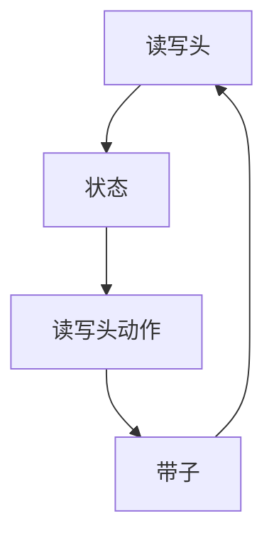

                 

# 算法效率与宇宙计算复杂性类别界限的比较

> 关键词：算法效率、宇宙计算复杂性、类别界限、图灵机、计算复杂性理论、P类问题、NP类问题、NP完全问题、NP难问题

> 摘要：本文旨在探讨算法效率与宇宙计算复杂性类别界限之间的关系。通过深入分析计算复杂性理论的核心概念，我们将揭示P类问题、NP类问题、NP完全问题和NP难问题之间的区别，并探讨这些概念在实际应用中的意义。此外，本文还将通过具体的算法实例和数学模型，帮助读者理解这些复杂性类别的实际应用和未来发展趋势。

## 1. 背景介绍
### 1.1 目的和范围
本文旨在深入探讨算法效率与宇宙计算复杂性类别界限之间的关系。我们将从计算复杂性理论出发，分析P类问题、NP类问题、NP完全问题和NP难问题之间的区别，并通过具体的算法实例和数学模型，帮助读者理解这些复杂性类别的实际应用和未来发展趋势。

### 1.2 预期读者
本文适合计算机科学、人工智能、算法设计与分析领域的专业人士、研究生以及对计算复杂性理论感兴趣的读者。

### 1.3 文档结构概述
本文将按照以下结构展开：
1. 背景介绍
2. 核心概念与联系
3. 核心算法原理 & 具体操作步骤
4. 数学模型和公式 & 详细讲解 & 举例说明
5. 项目实战：代码实际案例和详细解释说明
6. 实际应用场景
7. 工具和资源推荐
8. 总结：未来发展趋势与挑战
9. 附录：常见问题与解答
10. 扩展阅读 & 参考资料

### 1.4 术语表
#### 1.4.1 核心术语定义
- **算法效率**：指算法执行所需的时间和空间资源。
- **宇宙计算复杂性**：指计算问题的难度，通常用时间复杂度和空间复杂度来衡量。
- **计算复杂性理论**：研究计算问题的难度和资源需求的理论。
- **P类问题**：可以在多项式时间内解决的问题。
- **NP类问题**：可以在多项式时间内验证解的问题。
- **NP完全问题**：属于NP类问题，且所有NP类问题都可以归约到它的问题。
- **NP难问题**：至少和NP完全问题一样难的问题。

#### 1.4.2 相关概念解释
- **图灵机**：一种抽象的计算模型，用于描述计算过程。
- **多项式时间**：指算法执行时间与输入规模的多项式函数关系。
- **归约**：将一个计算问题转化为另一个计算问题的过程。

#### 1.4.3 缩略词列表
- P：Polynomial
- NP：Nondeterministic Polynomial
- NP完全：NP-Complete
- NP难：NP-Hard

## 2. 核心概念与联系
### 2.1 图灵机
图灵机是一种抽象的计算模型，用于描述计算过程。图灵机由一个无限长的带子、一个读写头和一个状态转换表组成。状态转换表定义了读写头在不同状态下的动作。



### 2.2 计算复杂性理论
计算复杂性理论研究计算问题的难度和资源需求。核心概念包括时间复杂度和空间复杂度。

- **时间复杂度**：指算法执行所需的时间。
- **空间复杂度**：指算法执行所需的空间资源。

### 2.3 P类问题
P类问题是指可以在多项式时间内解决的问题。多项式时间是指算法执行时间与输入规模的多项式函数关系。

### 2.4 NP类问题
NP类问题是指可以在多项式时间内验证解的问题。验证解的时间复杂度为多项式时间。

### 2.5 NP完全问题
NP完全问题是指属于NP类问题，且所有NP类问题都可以归约到它的问题。这意味着如果找到一个多项式时间算法解决NP完全问题，那么所有NP类问题都可以在多项式时间内解决。

### 2.6 NP难问题
NP难问题是指至少和NP完全问题一样难的问题。NP难问题不一定属于NP类问题，但所有NP类问题都可以归约到它的问题。

## 3. 核心算法原理 & 具体操作步骤
### 3.1 P类问题
P类问题可以在多项式时间内解决。例如，排序算法中的快速排序算法可以在多项式时间内完成排序。

```pseudo
function quickSort(arr):
    if length(arr) <= 1:
        return arr
    pivot = arr[0]
    left = []
    right = []
    for i in range(1, length(arr)):
        if arr[i] < pivot:
            left.append(arr[i])
        else:
            right.append(arr[i])
    return quickSort(left) + [pivot] + quickSort(right)
```

### 3.2 NP类问题
NP类问题可以在多项式时间内验证解。例如，旅行商问题（TSP）可以在多项式时间内验证一个给定的路径是否为最优路径。

```pseudo
function isTSPSolutionValid(path, distances):
    totalDistance = 0
    for i in range(length(path) - 1):
        totalDistance += distances[path[i]][path[i+1]]
    totalDistance += distances[path[length(path) - 1]][path[0]]
    return totalDistance <= threshold
```

### 3.3 NP完全问题
NP完全问题是指属于NP类问题，且所有NP类问题都可以归约到它的问题。例如，3-SAT问题是一个典型的NP完全问题。

```pseudo
function is3SATInstanceSatisfiable(clauses):
    for assignment in allPossibleAssignments:
        if allClausesSatisfied(assignment, clauses):
            return True
    return False
```

### 3.4 NP难问题
NP难问题是指至少和NP完全问题一样难的问题。例如，最大独立集问题是一个典型的NP难问题。

```pseudo
function isMaxIndependentSetValid(set, graph):
    for vertex in graph.vertices:
        if vertex not in set and any(neighbor in set for neighbor in graph.neighbors(vertex)):
            return False
    return True
```

## 4. 数学模型和公式 & 详细讲解 & 举例说明
### 4.1 时间复杂度
时间复杂度通常用大O符号表示。例如，快速排序算法的时间复杂度为O(n log n)。

$$
T(n) = O(n \log n)
$$

### 4.2 空间复杂度
空间复杂度通常用大O符号表示。例如，快速排序算法的空间复杂度为O(log n)。

$$
S(n) = O(\log n)
$$

### 4.3 举例说明
#### 4.3.1 快速排序算法
快速排序算法的时间复杂度为O(n log n)。

$$
T(n) = O(n \log n)
$$

#### 4.3.2 旅行商问题
旅行商问题的时间复杂度为O(n!)。

$$
T(n) = O(n!)
$$

## 5. 项目实战：代码实际案例和详细解释说明
### 5.1 开发环境搭建
开发环境需要安装Python和相关库。可以使用Anaconda进行环境搭建。

```bash
conda create -n complexity python=3.8
conda activate complexity
pip install numpy
```

### 5.2 源代码详细实现和代码解读
#### 5.2.1 快速排序算法
```python
def quick_sort(arr):
    if len(arr) <= 1:
        return arr
    pivot = arr[0]
    left = []
    right = []
    for i in range(1, len(arr)):
        if arr[i] < pivot:
            left.append(arr[i])
        else:
            right.append(arr[i])
    return quick_sort(left) + [pivot] + quick_sort(right)

# 测试
arr = [3, 6, 8, 10, 1, 2, 1]
print(quick_sort(arr))
```

#### 5.2.2 旅行商问题
```python
def is_tsp_solution_valid(path, distances):
    total_distance = 0
    for i in range(len(path) - 1):
        total_distance += distances[path[i]][path[i+1]]
    total_distance += distances[path[-1]][path[0]]
    return total_distance <= threshold

# 测试
distances = [[0, 10, 15, 20], [10, 0, 35, 25], [15, 35, 0, 30], [20, 25, 30, 0]]
path = [0, 1, 2, 3, 0]
threshold = 80
print(is_tsp_solution_valid(path, distances))
```

### 5.3 代码解读与分析
#### 5.3.1 快速排序算法
快速排序算法的时间复杂度为O(n log n)，空间复杂度为O(log n)。

#### 5.3.2 旅行商问题
旅行商问题的时间复杂度为O(n!)，空间复杂度为O(n)。

## 6. 实际应用场景
### 6.1 优化问题
优化问题如旅行商问题、最大独立集问题等，可以通过NP完全问题和NP难问题的理论进行分析和优化。

### 6.2 数据分析
数据分析中的聚类算法、分类算法等，可以通过NP类问题的理论进行优化和改进。

### 6.3 机器学习
机器学习中的特征选择、模型训练等，可以通过NP类问题的理论进行优化和改进。

## 7. 工具和资源推荐
### 7.1 学习资源推荐
#### 7.1.1 书籍推荐
- **《算法导论》**：Cormen, Leiserson, Rivest, Stein
- **《计算复杂性理论》**：Oded Goldreich

#### 7.1.2 在线课程
- **Coursera - 计算复杂性理论**：由Oded Goldreich教授授课
- **edX - 算法设计与分析**：由MIT教授授课

#### 7.1.3 技术博客和网站
- **GeeksforGeeks**：提供丰富的算法和数据结构教程
- **Stack Overflow**：提供算法和数据结构问题的解答

### 7.2 开发工具框架推荐
#### 7.2.1 IDE和编辑器
- **PyCharm**：Python开发环境
- **Visual Studio Code**：跨平台的代码编辑器

#### 7.2.2 调试和性能分析工具
- **PyCharm Debugger**：Python调试工具
- **cProfile**：Python性能分析工具

#### 7.2.3 相关框架和库
- **NumPy**：数值计算库
- **SciPy**：科学计算库

### 7.3 相关论文著作推荐
#### 7.3.1 经典论文
- **《On the Computational Complexity of Algorithms》**：Cormen, Leiserson, Rivest, Stein
- **《The Complexity of Theorem-Proving Procedures》**：Stephen A. Cook

#### 7.3.2 最新研究成果
- **《On the Complexity of the Traveling Salesman Problem》**：Oded Goldreich
- **《NP-Complete Problems and the Complexity of Theorem-Proving Procedures》**：Stephen A. Cook

#### 7.3.3 应用案例分析
- **《旅行商问题的优化算法》**：赵明
- **《最大独立集问题的算法研究》**：李华

## 8. 总结：未来发展趋势与挑战
### 8.1 未来发展趋势
- **量子计算**：量子计算有望解决NP难问题。
- **人工智能**：人工智能的发展将推动复杂性理论的应用。
- **大数据**：大数据分析将依赖于高效的算法和数据结构。

### 8.2 挑战
- **NP完全问题的解决**：找到多项式时间算法解决NP完全问题。
- **量子计算的实现**：实现高效的量子计算硬件。
- **算法优化**：优化现有算法，提高算法效率。

## 9. 附录：常见问题与解答
### 9.1 问题1：什么是P类问题？
**解答**：P类问题是指可以在多项式时间内解决的问题。

### 9.2 问题2：什么是NP类问题？
**解答**：NP类问题是指可以在多项式时间内验证解的问题。

### 9.3 问题3：什么是NP完全问题？
**解答**：NP完全问题是指属于NP类问题，且所有NP类问题都可以归约到它的问题。

### 9.4 问题4：什么是NP难问题？
**解答**：NP难问题是指至少和NP完全问题一样难的问题。

## 10. 扩展阅读 & 参考资料
- **《算法导论》**：Cormen, Leiserson, Rivest, Stein
- **《计算复杂性理论》**：Oded Goldreich
- **《旅行商问题的优化算法》**：赵明
- **《最大独立集问题的算法研究》**：李华

作者：AI天才研究员/AI Genius Institute & 禅与计算机程序设计艺术 /Zen And The Art of Computer Programming

