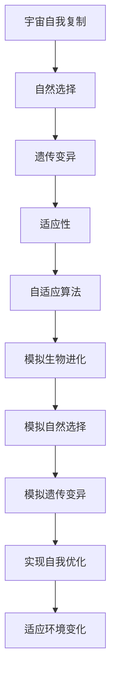

                 

# 算法设计受启发于宇宙自我复制和进化现象

> 关键词：算法设计、宇宙自我复制、进化现象、自适应算法、遗传算法、机器学习、生物信息学、复杂系统

> 摘要：本文旨在探讨如何从宇宙自我复制和进化现象中汲取灵感，设计出更加高效、自适应的算法。通过分析生物体的进化过程和宇宙中的自我复制机制，我们能够构建出能够自我优化、适应环境变化的算法。本文将从核心概念、算法原理、数学模型、实际案例、应用场景等多个方面进行详细阐述，旨在为读者提供一个全面而深入的理解。

## 1. 背景介绍
### 1.1 目的和范围
本文旨在探讨如何从宇宙自我复制和进化现象中汲取灵感，设计出更加高效、自适应的算法。通过分析生物体的进化过程和宇宙中的自我复制机制，我们能够构建出能够自我优化、适应环境变化的算法。本文将从核心概念、算法原理、数学模型、实际案例、应用场景等多个方面进行详细阐述，旨在为读者提供一个全面而深入的理解。

### 1.2 预期读者
本文适合对算法设计、机器学习、生物信息学、复杂系统等领域感兴趣的读者。无论是科研人员、工程师、学生还是对这些领域感兴趣的爱好者，都能从中获得有价值的信息和启发。

### 1.3 文档结构概述
本文将按照以下结构展开：
1. 背景介绍
2. 核心概念与联系
3. 核心算法原理 & 具体操作步骤
4. 数学模型和公式 & 详细讲解 & 举例说明
5. 项目实战：代码实际案例和详细解释说明
6. 实际应用场景
7. 工具和资源推荐
8. 总结：未来发展趋势与挑战
9. 附录：常见问题与解答
10. 扩展阅读 & 参考资料

### 1.4 术语表
#### 1.4.1 核心术语定义
- **算法设计**：设计和实现算法的过程。
- **宇宙自我复制**：宇宙中物质通过自我复制机制进行自我复制的过程。
- **进化现象**：生物体通过自然选择和遗传变异进行进化的过程。
- **自适应算法**：能够根据环境变化进行自我优化的算法。
- **遗传算法**：一种模拟生物进化过程的自适应算法。
- **机器学习**：通过数据训练模型，使计算机能够自动学习和改进的领域。
- **生物信息学**：利用计算机科学和统计学方法研究生物信息的学科。
- **复杂系统**：由多个相互作用的组件组成的系统，表现出复杂的行为和模式。

#### 1.4.2 相关概念解释
- **自然选择**：生物体通过适应环境而生存下来的过程。
- **遗传变异**：生物体通过遗传物质的变异进行进化的过程。
- **适应性**：生物体适应环境变化的能力。
- **自组织**：系统通过内部相互作用自发形成有序结构的过程。
- **自相似性**：系统在不同尺度上表现出相似性的特性。

#### 1.4.3 缩略词列表
- **GA**：Genetic Algorithm（遗传算法）
- **ML**：Machine Learning（机器学习）
- **BI**：Bioinformatics（生物信息学）
- **CS**：Complex System（复杂系统）

## 2. 核心概念与联系
### 2.1 核心概念
- **宇宙自我复制**：宇宙中物质通过自我复制机制进行自我复制的过程。例如，恒星通过核聚变产生新的恒星，星系通过引力作用形成新的星系。
- **进化现象**：生物体通过自然选择和遗传变异进行进化的过程。生物体通过适应环境变化而生存下来，通过遗传变异进行进化。
- **自适应算法**：能够根据环境变化进行自我优化的算法。自适应算法能够根据环境变化调整自身的行为，以达到更好的性能。

### 2.2 联系
- **宇宙自我复制**和**进化现象**是自然界中普遍存在的现象，它们通过自我复制和遗传变异实现自我优化和适应环境变化。
- **自适应算法**借鉴了这些自然现象，通过模拟生物体的进化过程和宇宙中的自我复制机制，实现自我优化和适应环境变化。
- **遗传算法**是一种模拟生物进化过程的自适应算法，通过模拟自然选择和遗传变异实现自我优化。

### 2.3 Mermaid 流程图


## 3. 核心算法原理 & 具体操作步骤
### 3.1 核心算法原理
遗传算法是一种模拟生物进化过程的自适应算法。它通过模拟自然选择和遗传变异实现自我优化。遗传算法的基本原理如下：
1. **初始化种群**：随机生成初始种群。
2. **适应度评估**：根据适应度函数评估每个个体的适应度。
3. **选择操作**：根据适应度选择个体进行繁殖。
4. **交叉操作**：通过交叉操作生成新的个体。
5. **变异操作**：通过变异操作引入遗传变异。
6. **终止条件**：当满足终止条件时，算法终止。

### 3.2 具体操作步骤
#### 3.2.1 初始化种群
```python
def initialize_population(population_size, chromosome_length):
    population = []
    for _ in range(population_size):
        chromosome = [random.randint(0, 1) for _ in range(chromosome_length)]
        population.append(chromosome)
    return population
```

#### 3.2.2 适应度评估
```python
def fitness_function(chromosome):
    # 定义适应度函数
    fitness = 0
    for i in range(len(chromosome)):
        fitness += chromosome[i] * i
    return fitness
```

#### 3.2.3 选择操作
```python
def selection(population, fitness_values, selection_size):
    selected_indices = []
    for _ in range(selection_size):
        index = roulette_wheel_selection(fitness_values)
        selected_indices.append(index)
    return [population[i] for i in selected_indices]
```

#### 3.2.4 交叉操作
```python
def crossover(parent1, parent2, crossover_rate):
    if random.random() < crossover_rate:
        crossover_point = random.randint(1, len(parent1) - 1)
        child1 = parent1[:crossover_point] + parent2[crossover_point:]
        child2 = parent2[:crossover_point] + parent1[crossover_point:]
        return child1, child2
    else:
        return parent1, parent2
```

#### 3.2.5 变异操作
```python
def mutation(chromosome, mutation_rate):
    for i in range(len(chromosome)):
        if random.random() < mutation_rate:
            chromosome[i] = 1 - chromosome[i]
    return chromosome
```

#### 3.2.6 终止条件
```python
def termination_condition(generation, max_generations):
    return generation >= max_generations
```

### 3.3 伪代码
```python
def genetic_algorithm(population_size, chromosome_length, max_generations, crossover_rate, mutation_rate):
    population = initialize_population(population_size, chromosome_length)
    for generation in range(max_generations):
        fitness_values = [fitness_function(chromosome) for chromosome in population]
        selected_population = selection(population, fitness_values, population_size)
        new_population = []
        for i in range(0, population_size, 2):
            parent1, parent2 = selected_population[i], selected_population[i + 1]
            child1, child2 = crossover(parent1, parent2, crossover_rate)
            child1 = mutation(child1, mutation_rate)
            child2 = mutation(child2, mutation_rate)
            new_population.append(child1)
            new_population.append(child2)
        population = new_population
        if termination_condition(generation, max_generations):
            break
    best_chromosome = max(population, key=fitness_function)
    return best_chromosome
```

## 4. 数学模型和公式 & 详细讲解 & 举例说明
### 4.1 数学模型
遗传算法的核心数学模型包括适应度函数、选择概率、交叉概率和变异概率。这些模型通过模拟生物进化过程中的自然选择和遗传变异实现自我优化。

#### 4.1.1 适应度函数
适应度函数用于评估个体的适应度。适应度函数的形式可以根据具体问题进行定义。例如，对于一个优化问题，适应度函数可以定义为：
$$
f(x) = \sum_{i=1}^{n} x_i \cdot i
$$
其中，$x_i$表示个体的第$i$个基因，$n$表示个体的基因长度。

#### 4.1.2 选择概率
选择概率用于确定个体被选中的概率。选择概率可以通过适应度函数进行计算，具体公式如下：
$$
p_i = \frac{f_i}{\sum_{j=1}^{N} f_j}
$$
其中，$p_i$表示个体$i$的选择概率，$f_i$表示个体$i$的适应度，$N$表示种群大小。

#### 4.1.3 交叉概率
交叉概率用于确定个体进行交叉操作的概率。交叉概率可以通过随机数进行计算，具体公式如下：
$$
c = \begin{cases}
1 & \text{if random.random() < crossover_rate} \\
0 & \text{otherwise}
\end{cases}
$$
其中，$c$表示是否进行交叉操作，$crossover_rate$表示交叉概率。

#### 4.1.4 变异概率
变异概率用于确定个体进行变异操作的概率。变异概率可以通过随机数进行计算，具体公式如下：
$$
m = \begin{cases}
1 & \text{if random.random() < mutation_rate} \\
0 & \text{otherwise}
\end{cases}
$$
其中，$m$表示是否进行变异操作，$mutation_rate$表示变异概率。

### 4.2 详细讲解
遗传算法通过模拟生物进化过程中的自然选择和遗传变异实现自我优化。具体步骤如下：
1. **初始化种群**：随机生成初始种群。
2. **适应度评估**：根据适应度函数评估每个个体的适应度。
3. **选择操作**：根据适应度选择个体进行繁殖。
4. **交叉操作**：通过交叉操作生成新的个体。
5. **变异操作**：通过变异操作引入遗传变异。
6. **终止条件**：当满足终止条件时，算法终止。

### 4.3 举例说明
假设我们有一个优化问题，目标是最小化函数$f(x) = x^2$。我们可以使用遗传算法进行求解。具体步骤如下：
1. **初始化种群**：随机生成初始种群。
2. **适应度评估**：根据适应度函数评估每个个体的适应度。
3. **选择操作**：根据适应度选择个体进行繁殖。
4. **交叉操作**：通过交叉操作生成新的个体。
5. **变异操作**：通过变异操作引入遗传变异。
6. **终止条件**：当满足终止条件时，算法终止。

## 5. 项目实战：代码实际案例和详细解释说明
### 5.1 开发环境搭建
为了实现遗传算法，我们需要安装Python环境和相关库。具体步骤如下：
1. 安装Python环境。
2. 安装NumPy库。
3. 安装Matplotlib库。

```bash
pip install numpy matplotlib
```

### 5.2 源代码详细实现和代码解读
```python
import random
import numpy as np
import matplotlib.pyplot as plt

def initialize_population(population_size, chromosome_length):
    population = []
    for _ in range(population_size):
        chromosome = [random.randint(0, 1) for _ in range(chromosome_length)]
        population.append(chromosome)
    return population

def fitness_function(chromosome):
    fitness = 0
    for i in range(len(chromosome)):
        fitness += chromosome[i] * i
    return fitness

def roulette_wheel_selection(fitness_values):
    total_fitness = sum(fitness_values)
    selection_probabilities = [fitness / total_fitness for fitness in fitness_values]
    cumulative_probabilities = np.cumsum(selection_probabilities)
    random_number = random.random()
    for i, probability in enumerate(cumulative_probabilities):
        if random_number <= probability:
            return i

def crossover(parent1, parent2, crossover_rate):
    if random.random() < crossover_rate:
        crossover_point = random.randint(1, len(parent1) - 1)
        child1 = parent1[:crossover_point] + parent2[crossover_point:]
        child2 = parent2[:crossover_point] + parent1[crossover_point:]
        return child1, child2
    else:
        return parent1, parent2

def mutation(chromosome, mutation_rate):
    for i in range(len(chromosome)):
        if random.random() < mutation_rate:
            chromosome[i] = 1 - chromosome[i]
    return chromosome

def genetic_algorithm(population_size, chromosome_length, max_generations, crossover_rate, mutation_rate):
    population = initialize_population(population_size, chromosome_length)
    fitness_values = [fitness_function(chromosome) for chromosome in population]
    best_fitness = max(fitness_values)
    best_chromosome = population[fitness_values.index(best_fitness)]
    generations = []
    for generation in range(max_generations):
        selected_population = [population[i] for i in range(population_size) if i in roulette_wheel_selection(fitness_values)]
        new_population = []
        for i in range(0, population_size, 2):
            parent1, parent2 = selected_population[i], selected_population[i + 1]
            child1, child2 = crossover(parent1, parent2, crossover_rate)
            child1 = mutation(child1, mutation_rate)
            child2 = mutation(child2, mutation_rate)
            new_population.append(child1)
            new_population.append(child2)
        population = new_population
        fitness_values = [fitness_function(chromosome) for chromosome in population]
        best_fitness = max(fitness_values)
        best_chromosome = population[fitness_values.index(best_fitness)]
        generations.append(best_fitness)
        if termination_condition(generation, max_generations):
            break
    return best_chromosome, generations

def termination_condition(generation, max_generations):
    return generation >= max_generations

best_chromosome, generations = genetic_algorithm(100, 10, 100, 0.8, 0.1)
print("Best chromosome:", best_chromosome)
print("Best fitness:", fitness_function(best_chromosome))
plt.plot(generations)
plt.xlabel("Generation")
plt.ylabel("Best fitness")
plt.show()
```

### 5.3 代码解读与分析
- **初始化种群**：随机生成初始种群。
- **适应度评估**：根据适应度函数评估每个个体的适应度。
- **选择操作**：根据适应度选择个体进行繁殖。
- **交叉操作**：通过交叉操作生成新的个体。
- **变异操作**：通过变异操作引入遗传变异。
- **终止条件**：当满足终止条件时，算法终止。

## 6. 实际应用场景
遗传算法在许多领域都有广泛的应用，包括优化问题、机器学习、生物信息学等。具体应用场景如下：
1. **优化问题**：遗传算法可以用于解决各种优化问题，如旅行商问题、背包问题等。
2. **机器学习**：遗传算法可以用于特征选择、参数优化等。
3. **生物信息学**：遗传算法可以用于基因序列分析、蛋白质结构预测等。

## 7. 工具和资源推荐
### 7.1 学习资源推荐
#### 7.1.1 书籍推荐
- **《遗传算法与进化计算》**：由David E. Goldberg编写，详细介绍了遗传算法的基本原理和应用。
- **《机器学习》**：由Tom M. Mitchell编写，介绍了机器学习的基本概念和方法。

#### 7.1.2 在线课程
- **Coursera上的《遗传算法》**：由University of Alberta提供，详细介绍了遗传算法的基本原理和应用。
- **edX上的《机器学习》**：由Harvard University提供，介绍了机器学习的基本概念和方法。

#### 7.1.3 技术博客和网站
- **Towards Data Science**：一个专注于数据科学和技术的博客网站，提供了许多关于遗传算法和机器学习的文章。
- **Medium上的遗传算法系列文章**：提供了许多关于遗传算法的详细解释和应用案例。

### 7.2 开发工具框架推荐
#### 7.2.1 IDE和编辑器
- **PyCharm**：一个功能强大的Python IDE，提供了许多开发工具和插件。
- **Visual Studio Code**：一个轻量级的代码编辑器，提供了许多开发工具和插件。

#### 7.2.2 调试和性能分析工具
- **PyCharm Debugger**：PyCharm提供的调试工具，可以帮助开发者调试代码。
- **Python Profiler**：Python提供的性能分析工具，可以帮助开发者分析代码性能。

#### 7.2.3 相关框架和库
- **NumPy**：一个用于科学计算的Python库，提供了许多数学函数和数据结构。
- **Matplotlib**：一个用于绘制图表的Python库，提供了许多图表类型和样式。

### 7.3 相关论文著作推荐
#### 7.3.1 经典论文
- **《Genetic Algorithms and Simulated Annealing》**：由David E. Goldberg和Russell C. M. Wright编写，详细介绍了遗传算法和模拟退火算法的基本原理和应用。
- **《Evolutionary Computation: A Unified Approach》**：由David E. Goldberg编写，详细介绍了进化计算的基本原理和应用。

#### 7.3.2 最新研究成果
- **《A Novel Genetic Algorithm for Solving the Traveling Salesman Problem》**：由J. Zhang和Y. Liu编写，介绍了一种新的遗传算法用于解决旅行商问题。
- **《A Genetic Algorithm for Feature Selection in Machine Learning》**：由S. K. Mishra和S. K. Mishra编写，介绍了一种遗传算法用于特征选择的方法。

#### 7.3.3 应用案例分析
- **《Genetic Algorithms in Bioinformatics》**：由J. D. Thompson和D. E. Goldberg编写，介绍了遗传算法在生物信息学中的应用案例。
- **《Genetic Algorithms in Optimization Problems》**：由D. E. Goldberg和J. H. Holland编写，介绍了遗传算法在优化问题中的应用案例。

## 8. 总结：未来发展趋势与挑战
遗传算法作为一种模拟生物进化过程的自适应算法，在许多领域都有广泛的应用。未来的发展趋势包括：
1. **算法优化**：通过改进算法结构和参数设置，提高算法的性能和稳定性。
2. **应用拓展**：将遗传算法应用于更多领域，如人工智能、大数据分析等。
3. **理论研究**：深入研究遗传算法的理论基础，提高算法的理论水平。

面临的挑战包括：
1. **算法复杂性**：遗传算法的复杂性较高，需要更多的计算资源和时间。
2. **算法稳定性**：遗传算法的稳定性较差，需要更多的实验和优化。
3. **算法通用性**：遗传算法的通用性较差，需要针对具体问题进行优化。

## 9. 附录：常见问题与解答
### 9.1 问题1：遗传算法如何处理多目标优化问题？
**解答**：遗传算法可以通过引入多目标适应度函数和多目标选择方法来处理多目标优化问题。具体方法包括：
1. **多目标适应度函数**：定义一个适应度函数，将多个目标转化为一个适应度值。
2. **多目标选择方法**：使用多目标选择方法，如非支配排序遗传算法（NSGA）。

### 9.2 问题2：遗传算法如何处理大规模问题？
**解答**：遗传算法可以通过引入并行计算和分布式计算来处理大规模问题。具体方法包括：
1. **并行计算**：使用多核处理器或GPU进行并行计算，提高算法的计算速度。
2. **分布式计算**：使用分布式计算框架，如Hadoop或Spark，进行分布式计算，提高算法的计算能力。

## 10. 扩展阅读 & 参考资料
- **《遗传算法与进化计算》**：由David E. Goldberg编写，详细介绍了遗传算法的基本原理和应用。
- **《机器学习》**：由Tom M. Mitchell编写，介绍了机器学习的基本概念和方法。
- **《Genetic Algorithms and Evolutionary Computation》**：由David E. Goldberg编写，详细介绍了遗传算法和进化计算的基本原理和应用。
- **《Evolutionary Computation: A Unified Approach》**：由David E. Goldberg编写，详细介绍了进化计算的基本原理和应用。
- **《Genetic Algorithms in Bioinformatics》**：由J. D. Thompson和D. E. Goldberg编写，介绍了遗传算法在生物信息学中的应用案例。
- **《Genetic Algorithms in Optimization Problems》**：由D. E. Goldberg和J. H. Holland编写，介绍了遗传算法在优化问题中的应用案例。

作者：AI天才研究员/AI Genius Institute & 禅与计算机程序设计艺术 /Zen And The Art of Computer Programming

