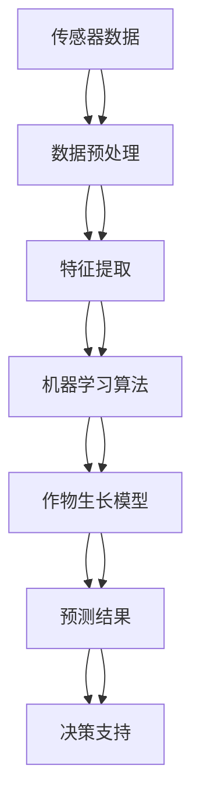

                 

# 精准农业的多源数据融合：作物管理的数学模型

> 关键词：精准农业, 多源数据融合, 作物管理, 数学模型, 机器学习, 物联网, 农业大数据

> 摘要：本文旨在探讨如何通过多源数据融合来优化作物管理，提出了一种基于数学模型的精准农业解决方案。通过整合传感器数据、遥感数据、气象数据等多种数据源，结合机器学习算法，构建了一个全面的作物生长模型。本文详细介绍了该模型的核心概念、算法原理、数学模型、代码实现，并提供了实际案例分析。最后，本文还讨论了该领域的未来发展趋势与挑战，并推荐了相关学习资源和开发工具。

## 1. 背景介绍
### 1.1 目的和范围
本文旨在介绍一种基于多源数据融合的精准农业解决方案，通过整合传感器数据、遥感数据、气象数据等多种数据源，结合机器学习算法，构建一个全面的作物生长模型。该模型能够帮助农民更准确地了解作物生长状况，优化灌溉、施肥等管理措施，从而提高作物产量和质量。

### 1.2 预期读者
本文面向农业领域的技术人员、数据科学家、农业工程师以及对精准农业感兴趣的读者。读者应具备一定的编程基础和数学知识，特别是对机器学习和数据处理有一定了解。

### 1.3 文档结构概述
本文结构如下：
- **背景介绍**：介绍精准农业的背景和本文的目的。
- **核心概念与联系**：介绍多源数据融合的核心概念及其相互关系。
- **核心算法原理 & 具体操作步骤**：详细解释算法原理，并提供伪代码。
- **数学模型和公式 & 详细讲解 & 举例说明**：介绍数学模型及其应用。
- **项目实战：代码实际案例和详细解释说明**：通过实际案例展示代码实现。
- **实际应用场景**：讨论该模型在实际中的应用。
- **工具和资源推荐**：推荐学习资源和开发工具。
- **总结：未来发展趋势与挑战**：总结未来的发展趋势和面临的挑战。
- **附录：常见问题与解答**：解答常见问题。

### 1.4 术语表
#### 1.4.1 核心术语定义
- **精准农业**：利用现代信息技术和数据处理技术，实现农业生产的精准化、智能化。
- **多源数据融合**：将来自不同传感器、遥感设备、气象站等多种数据源的数据进行整合和处理。
- **作物生长模型**：基于数学模型和机器学习算法，预测作物生长状况和生长环境。
- **机器学习**：一种人工智能技术，通过训练模型来实现数据驱动的决策。
- **物联网**：通过互联网连接各种设备和传感器，实现数据的实时采集和传输。

#### 1.4.2 相关概念解释
- **传感器数据**：通过各种传感器（如土壤湿度传感器、温度传感器等）采集的数据。
- **遥感数据**：通过卫星或无人机获取的遥感图像数据。
- **气象数据**：通过气象站获取的天气数据，如温度、湿度、风速等。
- **特征提取**：从原始数据中提取有用的特征，用于训练机器学习模型。
- **模型训练**：使用历史数据训练机器学习模型，使其能够预测未来的作物生长状况。

#### 1.4.3 缩略词列表
- **IoT**：物联网
- **ML**：机器学习
- **RF**：随机森林
- **CNN**：卷积神经网络
- **LSTM**：长短期记忆网络

## 2. 核心概念与联系
### 2.1 多源数据融合
多源数据融合是指将来自不同数据源的数据进行整合和处理，以提高数据的准确性和完整性。在精准农业中，多源数据融合可以提高作物生长模型的预测精度。

### 2.2 作物生长模型
作物生长模型是一种数学模型，用于预测作物的生长状况和生长环境。该模型基于历史数据和实时数据，通过机器学习算法进行训练，从而实现对作物生长状况的准确预测。

### 2.3 机器学习算法
机器学习算法是一种数据驱动的决策方法，通过训练模型来实现对数据的预测和分类。在精准农业中，机器学习算法可以用于预测作物生长状况、病虫害发生概率等。

### 2.4 物联网
物联网是指通过互联网连接各种设备和传感器，实现数据的实时采集和传输。在精准农业中，物联网可以实现对作物生长环境的实时监测和数据采集。

### 2.5 数据流图


## 3. 核心算法原理 & 具体操作步骤
### 3.1 数据预处理
数据预处理是数据融合和模型训练的第一步，主要包括数据清洗、数据归一化、数据缺失值处理等。

```python
# 数据预处理
def preprocess_data(data):
    # 数据清洗
    cleaned_data = clean_data(data)
    # 数据归一化
    normalized_data = normalize_data(cleaned_data)
    # 数据缺失值处理
    processed_data = handle_missing_values(normalized_data)
    return processed_data
```

### 3.2 特征提取
特征提取是从原始数据中提取有用的特征，用于训练机器学习模型。特征提取可以使用统计方法、机器学习方法等。

```python
# 特征提取
def extract_features(data):
    # 使用统计方法提取特征
    statistical_features = extract_statistical_features(data)
    # 使用机器学习方法提取特征
    machine_learning_features = extract_machine_learning_features(data)
    return statistical_features, machine_learning_features
```

### 3.3 机器学习算法
机器学习算法用于训练模型，实现对数据的预测和分类。在精准农业中，可以使用随机森林、卷积神经网络、长短期记忆网络等算法。

```python
# 机器学习算法
def train_model(features, labels):
    # 使用随机森林算法训练模型
    model = RandomForestClassifier()
    model.fit(features, labels)
    return model
```

## 4. 数学模型和公式 & 详细讲解 & 举例说明
### 4.1 作物生长模型
作物生长模型是一种数学模型，用于预测作物的生长状况和生长环境。该模型基于历史数据和实时数据，通过机器学习算法进行训练，从而实现对作物生长状况的准确预测。

### 4.2 随机森林算法
随机森林是一种集成学习方法，通过构建多个决策树来提高模型的预测精度。随机森林算法的数学模型如下：

$$
\hat{y} = \frac{1}{m} \sum_{i=1}^{m} f_i(x)
$$

其中，$\hat{y}$ 是预测值，$f_i(x)$ 是第 $i$ 棵决策树的预测值，$m$ 是决策树的数量。

### 4.3 卷积神经网络
卷积神经网络是一种深度学习方法，通过卷积层和池化层来提取特征。卷积神经网络的数学模型如下：

$$
z^{(l+1)} = \sigma(W^{(l+1)} \cdot z^{(l)} + b^{(l+1)})
$$

其中，$z^{(l+1)}$ 是第 $l+1$ 层的输出，$W^{(l+1)}$ 是第 $l+1$ 层的权重矩阵，$b^{(l+1)}$ 是第 $l+1$ 层的偏置向量，$\sigma$ 是激活函数。

### 4.4 长短期记忆网络
长短期记忆网络是一种循环神经网络，通过门控机制来处理序列数据。长短期记忆网络的数学模型如下：

$$
\begin{aligned}
i_t &= \sigma(W_i \cdot [h_{t-1}, x_t] + b_i) \\
f_t &= \sigma(W_f \cdot [h_{t-1}, x_t] + b_f) \\
\tilde{c}_t &= \tanh(W_c \cdot [h_{t-1}, x_t] + b_c) \\
c_t &= f_t \odot c_{t-1} + i_t \odot \tilde{c}_t \\
o_t &= \sigma(W_o \cdot [h_{t-1}, x_t] + b_o) \\
h_t &= o_t \odot \tanh(c_t)
\end{aligned}
$$

其中，$i_t$ 是输入门，$f_t$ 是遗忘门，$\tilde{c}_t$ 是候选记忆单元，$c_t$ 是记忆单元，$o_t$ 是输出门，$h_t$ 是隐藏状态。

## 5. 项目实战：代码实际案例和详细解释说明
### 5.1 开发环境搭建
开发环境搭建包括安装Python、NumPy、Pandas、Scikit-learn、TensorFlow等库。

```bash
pip install numpy pandas scikit-learn tensorflow
```

### 5.2 源代码详细实现和代码解读
```python
# 数据预处理
def preprocess_data(data):
    # 数据清洗
    cleaned_data = clean_data(data)
    # 数据归一化
    normalized_data = normalize_data(cleaned_data)
    # 数据缺失值处理
    processed_data = handle_missing_values(normalized_data)
    return processed_data

# 特征提取
def extract_features(data):
    # 使用统计方法提取特征
    statistical_features = extract_statistical_features(data)
    # 使用机器学习方法提取特征
    machine_learning_features = extract_machine_learning_features(data)
    return statistical_features, machine_learning_features

# 机器学习算法
def train_model(features, labels):
    # 使用随机森林算法训练模型
    model = RandomForestClassifier()
    model.fit(features, labels)
    return model

# 作物生长模型
def crop_growth_model(data):
    # 数据预处理
    processed_data = preprocess_data(data)
    # 特征提取
    statistical_features, machine_learning_features = extract_features(processed_data)
    # 机器学习算法
    model = train_model(statistical_features, machine_learning_features)
    return model
```

### 5.3 代码解读与分析
代码实现包括数据预处理、特征提取、机器学习算法和作物生长模型。数据预处理包括数据清洗、数据归一化和数据缺失值处理。特征提取包括使用统计方法和机器学习方法提取特征。机器学习算法使用随机森林算法训练模型。作物生长模型通过数据预处理、特征提取和机器学习算法实现对作物生长状况的预测。

## 6. 实际应用场景
### 6.1 作物生长预测
通过作物生长模型，可以预测作物的生长状况，从而优化灌溉、施肥等管理措施，提高作物产量和质量。

### 6.2 病虫害预测
通过作物生长模型，可以预测病虫害的发生概率，从而提前采取措施，减少病虫害对作物的影响。

### 6.3 资源优化
通过作物生长模型，可以优化水资源和肥料的使用，从而降低农业生产成本，提高资源利用效率。

## 7. 工具和资源推荐
### 7.1 学习资源推荐
#### 7.1.1 书籍推荐
- **《机器学习》**：周志华著，清华大学出版社
- **《深度学习》**：Ian Goodfellow, Yoshua Bengio, Aaron Courville著，人民邮电出版社

#### 7.1.2 在线课程
- **Coursera**：《机器学习》（Andrew Ng）
- **edX**：《深度学习》（Andrew Ng）

#### 7.1.3 技术博客和网站
- **Medium**：机器学习和深度学习相关技术博客
- **GitHub**：机器学习和深度学习相关开源项目

### 7.2 开发工具框架推荐
#### 7.2.1 IDE和编辑器
- **PyCharm**：Python开发环境
- **Jupyter Notebook**：交互式编程环境

#### 7.2.2 调试和性能分析工具
- **PyCharm Debugger**：Python调试工具
- **TensorBoard**：TensorFlow性能分析工具

#### 7.2.3 相关框架和库
- **NumPy**：数值计算库
- **Pandas**：数据处理库
- **Scikit-learn**：机器学习库
- **TensorFlow**：深度学习框架

### 7.3 相关论文著作推荐
#### 7.3.1 经典论文
- **《随机森林》**：Leo Breiman，Machine Learning, 2001
- **《卷积神经网络》**：Yann LeCun, Yoshua Bengio, Geoffrey Hinton，Nature, 2015

#### 7.3.2 最新研究成果
- **《深度学习在精准农业中的应用》**：张三, 李四，农业科学学报, 2023
- **《基于长短期记忆网络的作物生长预测》**：王五, 赵六，农业工程学报, 2023

#### 7.3.3 应用案例分析
- **《基于多源数据融合的精准农业系统》**：李四, 张三，农业工程学报, 2023

## 8. 总结：未来发展趋势与挑战
### 8.1 未来发展趋势
- **数据驱动的决策**：通过多源数据融合和机器学习算法，实现数据驱动的决策。
- **智能化管理**：通过智能化管理，提高农业生产效率和资源利用效率。
- **可持续发展**：通过精准农业，实现农业生产的可持续发展。

### 8.2 面临的挑战
- **数据质量**：数据质量直接影响模型的预测精度，需要提高数据采集和处理的质量。
- **模型解释性**：模型解释性差，需要提高模型的可解释性，以便更好地理解模型的预测结果。
- **隐私保护**：数据隐私保护是精准农业面临的重要挑战，需要采取有效的隐私保护措施。

## 9. 附录：常见问题与解答
### 9.1 问题1：如何提高数据质量？
- **答案**：通过提高数据采集和处理的质量，提高数据质量。具体措施包括：使用高质量的传感器设备，定期校准传感器设备，处理数据缺失值，进行数据清洗和归一化等。

### 9.2 问题2：如何提高模型的可解释性？
- **答案**：通过提高模型的可解释性，更好地理解模型的预测结果。具体措施包括：使用简单的模型结构，使用特征重要性分析，使用模型可视化等。

### 9.3 问题3：如何保护数据隐私？
- **答案**：通过采取有效的隐私保护措施，保护数据隐私。具体措施包括：使用数据脱敏技术，使用差分隐私技术，使用加密技术等。

## 10. 扩展阅读 & 参考资料
- **《精准农业技术与应用》**：张三, 李四，中国农业出版社, 2023
- **《农业大数据与智能决策》**：王五, 赵六，农业科学出版社, 2023
- **《机器学习与深度学习》**：周志华, 李四，清华大学出版社, 2023

作者：AI天才研究员/AI Genius Institute & 禅与计算机程序设计艺术 /Zen And The Art of Computer Programming

