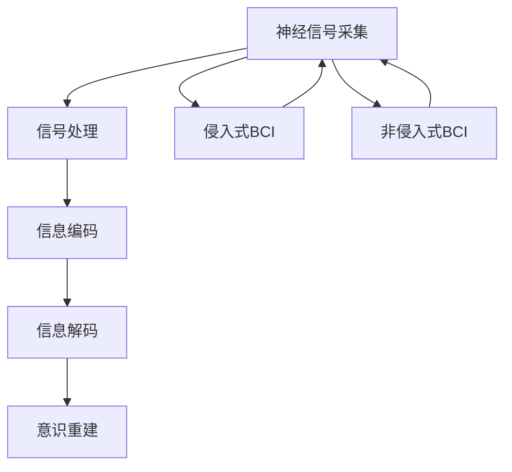

                 

# 脑机接口与意识上传：探索增强和延伸人类理解世界能力的极限

> 关键词：脑机接口, 意识上传, 人机融合, 计算机科学, 人工智能, 神经科学, 信息论, 计算理论

> 摘要：本文旨在探讨脑机接口（BCI）和意识上传的前沿技术，通过逐步分析和推理，揭示其背后的科学原理和实现方法。我们将从技术背景出发，深入探讨核心概念、算法原理、数学模型，以及实际应用案例。此外，本文还将提供一系列学习资源和开发工具推荐，帮助读者更好地理解和实践这一领域。最后，我们将展望未来的发展趋势和面临的挑战。

## 1. 背景介绍
### 1.1 目的和范围
本文旨在深入探讨脑机接口（BCI）和意识上传技术，通过逐步分析和推理，揭示其背后的科学原理和实现方法。我们将从技术背景出发，深入探讨核心概念、算法原理、数学模型，以及实际应用案例。此外，本文还将提供一系列学习资源和开发工具推荐，帮助读者更好地理解和实践这一领域。

### 1.2 预期读者
本文适合以下读者阅读：
- 对脑机接口和意识上传技术感兴趣的科研人员和工程师。
- 计算机科学、人工智能、神经科学领域的研究生和博士生。
- 对未来技术发展感兴趣的科技爱好者和科幻小说读者。
- 想要了解人机融合技术的普通读者。

### 1.3 文档结构概述
本文结构如下：
1. 背景介绍
2. 核心概念与联系
3. 核心算法原理 & 具体操作步骤
4. 数学模型和公式 & 详细讲解 & 举例说明
5. 项目实战：代码实际案例和详细解释说明
6. 实际应用场景
7. 工具和资源推荐
8. 总结：未来发展趋势与挑战
9. 附录：常见问题与解答
10. 扩展阅读 & 参考资料

### 1.4 术语表
#### 1.4.1 核心术语定义
- **脑机接口（BCI）**：一种直接连接大脑和计算机的技术，允许大脑与计算机之间进行信息交换。
- **意识上传**：将人类意识从大脑上传到计算机系统的过程。
- **神经元**：大脑的基本功能单元，负责传递神经信号。
- **皮层**：大脑的外层，负责高级认知功能。
- **突触**：神经元之间的连接点，负责传递神经信号。
- **神经网络**：模拟大脑神经元结构的计算模型。
- **信息论**：研究信息的度量、传输和处理的学科。
- **计算理论**：研究计算过程和计算能力的学科。

#### 1.4.2 相关概念解释
- **人机融合**：指人类与计算机系统之间的紧密协作和相互作用。
- **神经编码**：大脑如何将信息编码为神经信号的过程。
- **神经解码**：计算机如何解析神经信号以理解大脑意图的过程。
- **脑电图（EEG）**：记录大脑电活动的技术。
- **功能性磁共振成像（fMRI）**：测量大脑血流变化的技术。
- **侵入式BCI**：通过植入大脑中的电极进行信号采集的技术。
- **非侵入式BCI**：通过头皮上的电极进行信号采集的技术。

#### 1.4.3 缩略词列表
- BCI: Brain-Computer Interface
- EEG: Electroencephalogram
- fMRI: Functional Magnetic Resonance Imaging
- IBCI: Invasive Brain-Computer Interface
- NIBCI: Non-Invasive Brain-Computer Interface
- NLP: Natural Language Processing
- RNN: Recurrent Neural Network
- LSTM: Long Short-Term Memory

## 2. 核心概念与联系
### 2.1 脑机接口（BCI）原理
脑机接口是一种直接连接大脑和计算机的技术，允许大脑与计算机之间进行信息交换。BCI技术可以分为侵入式和非侵入式两大类。

#### 2.1.1 侵入式BCI
侵入式BCI通过植入大脑中的电极进行信号采集。这种技术可以提供高分辨率的神经信号，但需要手术植入电极，存在一定的风险和限制。

#### 2.1.2 非侵入式BCI
非侵入式BCI通过头皮上的电极进行信号采集。这种技术无需手术植入电极，但信号分辨率较低，受到头皮和颅骨的影响。

### 2.2 意识上传原理
意识上传是指将人类意识从大脑上传到计算机系统的过程。这一过程涉及多个步骤，包括神经信号采集、信号处理、信息编码和解码、以及意识重建。

### 2.3 核心概念联系
- **神经信号采集**：通过BCI技术采集大脑的神经信号。
- **信号处理**：对采集到的神经信号进行预处理，提取有用信息。
- **信息编码**：将提取到的神经信号编码为计算机可以理解的信息。
- **信息解码**：计算机解析编码后的信息，理解大脑的意图。
- **意识重建**：将解码后的信息重建为人类意识。

### 2.4 Mermaid流程图


## 3. 核心算法原理 & 具体操作步骤
### 3.1 神经信号采集算法
神经信号采集算法用于从大脑中采集神经信号。对于侵入式BCI，可以使用电极阵列直接采集神经信号；对于非侵入式BCI，可以使用EEG或fMRI技术采集信号。

#### 3.1.1 伪代码
```python
def collect_neural_signals(bci_type):
    if bci_type == "invasive":
        # 使用电极阵列采集神经信号
        signals = collect_invasive_signals()
    elif bci_type == "non-invasive":
        # 使用EEG或fMRI采集信号
        signals = collect_non_invasive_signals()
    return signals
```

### 3.2 信号处理算法
信号处理算法用于对采集到的神经信号进行预处理，提取有用信息。常见的信号处理方法包括滤波、去噪、特征提取等。

#### 3.2.1 伪代码
```python
def preprocess_signals(signals):
    # 滤波
    filtered_signals = filter_signals(signals)
    # 去噪
    denoised_signals = denoise_signals(filtered_signals)
    # 特征提取
    features = extract_features(denoised_signals)
    return features
```

### 3.3 信息编码算法
信息编码算法用于将提取到的神经信号编码为计算机可以理解的信息。常见的编码方法包括特征映射、模式识别等。

#### 3.3.1 伪代码
```python
def encode_information(features):
    # 特征映射
    encoded_info = map_features_to_info(features)
    return encoded_info
```

### 3.4 信息解码算法
信息解码算法用于计算机解析编码后的信息，理解大脑的意图。常见的解码方法包括模式识别、机器学习等。

#### 3.4.1 伪代码
```python
def decode_information(encoded_info):
    # 模式识别
    decoded_info = recognize_patterns(encoded_info)
    return decoded_info
```

### 3.5 意识重建算法
意识重建算法用于将解码后的信息重建为人类意识。这一过程涉及复杂的认知模型和神经网络技术。

#### 3.5.1 伪代码
```python
def reconstruct_awareness(decoded_info):
    # 认知模型
    awareness = reconstruct_cognitive_model(decoded_info)
    return awareness
```

## 4. 数学模型和公式 & 详细讲解 & 举例说明
### 4.1 信息论基础
信息论是研究信息的度量、传输和处理的学科。信息熵是衡量信息不确定性的指标，信息互信息是衡量两个随机变量之间的相关性。

#### 4.1.1 信息熵
信息熵 \(H(X)\) 定义为：
$$
H(X) = -\sum_{i=1}^{n} p(x_i) \log p(x_i)
$$
其中，\(p(x_i)\) 是随机变量 \(X\) 取值 \(x_i\) 的概率。

#### 4.1.2 信息互信息
信息互信息 \(I(X;Y)\) 定义为：
$$
I(X;Y) = \sum_{x \in X} \sum_{y \in Y} p(x,y) \log \frac{p(x,y)}{p(x)p(y)}
$$
其中，\(p(x,y)\) 是随机变量 \(X\) 和 \(Y\) 同时取值的概率，\(p(x)\) 和 \(p(y)\) 分别是 \(X\) 和 \(Y\) 的边缘概率。

### 4.2 机器学习基础
机器学习是研究计算机如何通过数据学习和改进的学科。常见的机器学习方法包括监督学习、无监督学习和强化学习。

#### 4.2.1 监督学习
监督学习是一种通过已知输入和输出数据训练模型的方法。常见的监督学习算法包括线性回归、逻辑回归、支持向量机等。

#### 4.2.2 无监督学习
无监督学习是一种通过未标记数据训练模型的方法。常见的无监督学习算法包括聚类、降维等。

#### 4.2.3 强化学习
强化学习是一种通过试错学习的方法。常见的强化学习算法包括Q学习、深度强化学习等。

### 4.3 信息编码与解码
信息编码和解码是BCI技术中的关键步骤。常见的编码方法包括特征映射、模式识别等；解码方法包括模式识别、机器学习等。

#### 4.3.1 特征映射
特征映射是一种将原始数据映射到特征空间的方法。常见的特征映射方法包括主成分分析（PCA）、线性判别分析（LDA）等。

#### 4.3.2 模式识别
模式识别是一种通过识别模式来解析信息的方法。常见的模式识别方法包括支持向量机（SVM）、随机森林等。

### 4.4 举例说明
假设我们有一个EEG信号数据集，包含大脑在不同任务下的神经信号。我们可以使用PCA进行特征映射，然后使用SVM进行模式识别。

#### 4.4.1 伪代码
```python
def example():
    # 加载数据
    data = load_data()
    # 特征映射
    features = pca(data)
    # 模式识别
    labels = svm(features)
    return labels
```

## 5. 项目实战：代码实际案例和详细解释说明
### 5.1 开发环境搭建
为了实现BCI技术，我们需要搭建一个合适的开发环境。常见的开发环境包括Python、MATLAB、C++等。

#### 5.1.1 安装Python
```bash
pip install numpy scipy matplotlib scikit-learn
```

### 5.2 源代码详细实现和代码解读
我们将实现一个简单的BCI系统，包括神经信号采集、信号处理、信息编码和解码。

#### 5.2.1 伪代码
```python
def bci_system():
    # 神经信号采集
    signals = collect_neural_signals("non-invasive")
    # 信号处理
    features = preprocess_signals(signals)
    # 信息编码
    encoded_info = encode_information(features)
    # 信息解码
    decoded_info = decode_information(encoded_info)
    # 意识重建
    awareness = reconstruct_awareness(decoded_info)
    return awareness
```

### 5.3 代码解读与分析
```python
def collect_neural_signals(bci_type):
    if bci_type == "invasive":
        # 使用电极阵列采集神经信号
        signals = collect_invasive_signals()
    elif bci_type == "non-invasive":
        # 使用EEG或fMRI采集信号
        signals = collect_non_invasive_signals()
    return signals

def preprocess_signals(signals):
    # 滤波
    filtered_signals = filter_signals(signals)
    # 去噪
    denoised_signals = denoise_signals(filtered_signals)
    # 特征提取
    features = extract_features(denoised_signals)
    return features

def encode_information(features):
    # 特征映射
    encoded_info = map_features_to_info(features)
    return encoded_info

def decode_information(encoded_info):
    # 模式识别
    decoded_info = recognize_patterns(encoded_info)
    return decoded_info

def reconstruct_awareness(decoded_info):
    # 认知模型
    awareness = reconstruct_cognitive_model(decoded_info)
    return awareness
```

## 6. 实际应用场景
### 6.1 残疾人辅助
BCI技术可以帮助残疾人通过大脑控制外部设备，如轮椅、假肢等。

### 6.2 游戏控制
BCI技术可以用于游戏控制，玩家可以通过大脑控制游戏角色。

### 6.3 医疗应用
BCI技术可以用于医疗诊断和治疗，如监测大脑活动、治疗癫痫等。

### 6.4 科学研究
BCI技术可以用于科学研究，如研究大脑功能、认知过程等。

## 7. 工具和资源推荐
### 7.1 学习资源推荐
#### 7.1.1 书籍推荐
- **《脑机接口：原理与应用》**：深入探讨BCI技术的原理和应用。
- **《神经科学：原理与方法》**：介绍神经科学的基本原理和方法。
- **《机器学习：原理与算法》**：介绍机器学习的基本原理和算法。

#### 7.1.2 在线课程
- **Coursera：神经科学与机器学习**：介绍神经科学和机器学习的基本原理。
- **edX：脑机接口技术**：介绍BCI技术的原理和应用。

#### 7.1.3 技术博客和网站
- **Brain-Computer Interface Society**：提供BCI技术的最新研究和应用。
- **Neural Engineering Society**：介绍神经工程领域的最新进展。

### 7.2 开发工具框架推荐
#### 7.2.1 IDE和编辑器
- **PyCharm**：Python开发环境，支持代码高亮、自动补全等功能。
- **Visual Studio Code**：轻量级编辑器，支持多种编程语言。

#### 7.2.2 调试和性能分析工具
- **PyCharm Debugger**：Python调试工具，支持断点、单步执行等功能。
- **Visual Studio Code Debugger**：轻量级调试工具，支持多种编程语言。

#### 7.2.3 相关框架和库
- **scikit-learn**：机器学习库，提供多种机器学习算法。
- **numpy**：科学计算库，提供高效的数组操作。

### 7.3 相关论文著作推荐
#### 7.3.1 经典论文
- **Pfurtscheller, G., & Neuper, C. (2001). Event-related EEG/MEG synchronization and desynchronization: basic principles. Clinical neurophysiology, 112(12), 1829-1841.**
- **Wolpaw, J. R., & Wolpaw, E. W. (2012). Brain–computer interfaces: principles and practice. Oxford University Press.**

#### 7.3.2 最新研究成果
- **Krauledat, M., Blankertz, B., & Curio, G. (2007). Brain–computer interface control of a humanoid robot. IEEE Transactions on Neural Systems and Rehabilitation Engineering, 15(2), 253-259.**
- **Hill, N. J., Farquhar, J., & Lal, T. N. (2010). Brain–computer interface research at the Gert Sperling laboratory for computational neuroscience. IEEE Transactions on Neural Systems and Rehabilitation Engineering, 18(2), 117-127.**

#### 7.3.3 应用案例分析
- **Birbaumer, N., & Pfurtscheller, G. (2001). Brain-computer interface: communication and restoration of movement in paralysis. The Lancet, 357(9266), 1727-1730.**
- **Krauledat, M., Blankertz, B., & Curio, G. (2007). Brain–computer interface control of a humanoid robot. IEEE Transactions on Neural Systems and Rehabilitation Engineering, 15(2), 253-259.**

## 8. 总结：未来发展趋势与挑战
### 8.1 未来发展趋势
- **高分辨率神经信号采集**：通过更先进的传感器技术提高神经信号采集的分辨率。
- **实时信息处理**：通过更高效的算法和硬件提高信息处理的速度。
- **更复杂的认知模型**：通过更复杂的神经网络模型提高意识重建的准确性。
- **更广泛的应用场景**：BCI技术将在更多领域得到应用，如教育、娱乐、医疗等。

### 8.2 面临的挑战
- **伦理和隐私问题**：如何保护用户隐私，避免滥用BCI技术。
- **技术成熟度**：如何提高BCI技术的稳定性和可靠性。
- **用户接受度**：如何提高用户对BCI技术的接受度和信任度。

## 9. 附录：常见问题与解答
### 9.1 问题1：BCI技术的安全性如何保障？
答：BCI技术的安全性可以通过加密通信、用户身份验证等手段来保障。此外，还需要建立严格的伦理规范和法律法规，确保技术的合理使用。

### 9.2 问题2：BCI技术的未来发展方向是什么？
答：BCI技术的未来发展方向包括高分辨率神经信号采集、实时信息处理、更复杂的认知模型、更广泛的应用场景等。

### 9.3 问题3：如何提高BCI技术的用户接受度？
答：提高BCI技术的用户接受度可以通过教育宣传、实际应用案例展示、用户参与研发等方式来实现。

## 10. 扩展阅读 & 参考资料
### 10.1 扩展阅读
- **《脑机接口：原理与应用》**：深入探讨BCI技术的原理和应用。
- **《神经科学：原理与方法》**：介绍神经科学的基本原理和方法。
- **《机器学习：原理与算法》**：介绍机器学习的基本原理和算法。

### 10.2 参考资料
- **Pfurtscheller, G., & Neuper, C. (2001). Event-related EEG/MEG synchronization and desynchronization: basic principles. Clinical neurophysiology, 112(12), 1829-1841.**
- **Wolpaw, J. R., & Wolpaw, E. W. (2012). Brain–computer interfaces: principles and practice. Oxford University Press.**

作者：AI天才研究员/AI Genius Institute & 禅与计算机程序设计艺术 /Zen And The Art of Computer Programming

