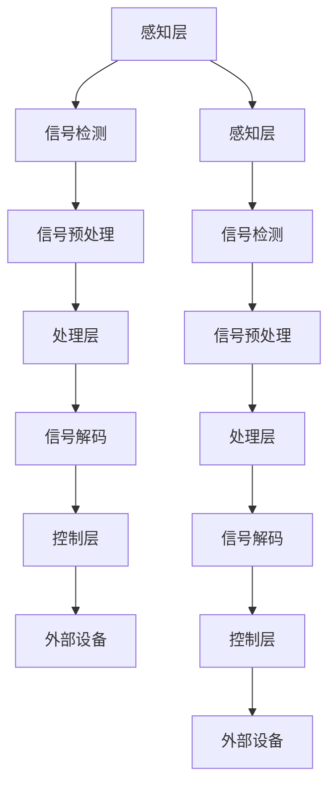

                 

# 脑机接口技术的发展：直接增强人类理解世界的能力

> 关键词：脑机接口, 人机交互, 神经科学, 人工智能, 信息处理, 计算机科学, 伦理道德

> 摘要：本文旨在探讨脑机接口（BCI）技术的发展历程及其对人类认知能力的潜在影响。通过逐步分析BCI的核心概念、技术原理、实际应用案例以及未来发展趋势，本文揭示了BCI技术如何直接增强人类理解世界的能力。我们还将讨论相关的伦理问题，并提供一系列学习资源和开发工具推荐，以帮助读者深入了解这一前沿技术。

## 1. 背景介绍
### 1.1 目的和范围
本文旨在深入探讨脑机接口（BCI）技术的发展历程及其对人类认知能力的潜在影响。我们将从技术原理出发，逐步分析BCI的核心概念、技术架构、实际应用案例以及未来发展趋势。此外，我们还将讨论相关的伦理问题，并提供一系列学习资源和开发工具推荐，以帮助读者深入了解这一前沿技术。

### 1.2 预期读者
本文面向对脑机接口技术感兴趣的计算机科学家、神经科学家、工程师、伦理学家以及对人工智能和人机交互领域感兴趣的读者。无论您是初学者还是专业人士，本文都将为您提供有价值的信息和见解。

### 1.3 文档结构概述
本文结构如下：
1. 背景介绍
2. 核心概念与联系
3. 核心算法原理 & 具体操作步骤
4. 数学模型和公式 & 详细讲解 & 举例说明
5. 项目实战：代码实际案例和详细解释说明
6. 实际应用场景
7. 工具和资源推荐
8. 总结：未来发展趋势与挑战
9. 附录：常见问题与解答
10. 扩展阅读 & 参考资料

### 1.4 术语表
#### 1.4.1 核心术语定义
- **脑机接口（BCI）**：一种直接连接大脑与计算机或其他外部设备的技术，允许用户通过大脑活动控制外部设备。
- **神经信号**：大脑活动产生的电信号，可以通过各种方法检测和分析。
- **解码器**：将神经信号转换为计算机可理解的指令或信息。
- **编码器**：将计算机指令转换为大脑可理解的信号。
- **侵入式**：通过手术将电极植入大脑内部进行信号检测。
- **非侵入式**：通过头皮上的电极检测大脑活动。
- **混合式**：结合侵入式和非侵入式技术的优点。

#### 1.4.2 相关概念解释
- **神经科学**：研究大脑和神经系统功能的科学。
- **人工智能**：模拟、扩展和增强人类智能的技术。
- **人机交互**：人与计算机之间的信息交换过程。

#### 1.4.3 缩略词列表
- BCI：Brain-Computer Interface
- EEG：Electroencephalography
- EMG：Electromyography
- fNIRS：Functional Near-Infrared Spectroscopy
- sEMG：Surface Electromyography
- TMS：Transcranial Magnetic Stimulation

## 2. 核心概念与联系
### 2.1 脑机接口的基本原理
脑机接口（BCI）技术的核心在于通过检测和解码大脑活动，实现大脑与外部设备之间的直接通信。这一过程可以分为三个主要步骤：信号检测、信号处理和信号解码。

#### 2.1.1 信号检测
信号检测是BCI技术的第一步，涉及使用各种传感器检测大脑活动产生的电信号。常见的信号检测方法包括：
- **EEG**：通过头皮上的电极检测大脑产生的电信号。
- **fNIRS**：通过近红外光检测大脑皮层的血氧水平。
- **EMG**：通过肌肉电极检测肌肉活动产生的电信号。
- **fMRI**：通过功能性磁共振成像检测大脑活动产生的血流变化。
- **MEG**：通过磁传感器检测大脑产生的磁场。

#### 2.1.2 信号处理
信号处理是BCI技术的第二步，涉及对检测到的信号进行预处理和特征提取。常见的信号处理方法包括：
- **滤波**：去除噪声和干扰信号。
- **特征提取**：提取信号中的有用特征，如频谱特征、时域特征等。
- **降维**：通过主成分分析（PCA）等方法减少信号维度。

#### 2.1.3 信号解码
信号解码是BCI技术的第三步，涉及将处理后的信号转换为计算机可理解的指令或信息。常见的信号解码方法包括：
- **模式识别**：通过机器学习算法识别特定的大脑活动模式。
- **分类器**：通过支持向量机（SVM）、随机森林等算法进行分类。
- **回归分析**：通过线性回归、神经网络等方法进行回归分析。

### 2.2 BCI技术的架构
BCI技术的架构可以分为三个层次：感知层、处理层和控制层。感知层负责信号检测和预处理，处理层负责信号解码和特征提取，控制层负责将解码后的信号转换为外部设备的控制指令。



## 3. 核心算法原理 & 具体操作步骤
### 3.1 信号检测算法
信号检测算法用于检测大脑活动产生的电信号。常见的信号检测算法包括：
- **EEG信号检测**：通过滤波器去除噪声，提取频谱特征。
- **fNIRS信号检测**：通过光谱分析提取血氧水平变化。
- **EMG信号检测**：通过滤波器去除噪声，提取时域特征。

### 3.2 信号处理算法
信号处理算法用于对检测到的信号进行预处理和特征提取。常见的信号处理算法包括：
- **滤波器设计**：设计低通、高通和带通滤波器去除噪声。
- **特征提取**：提取信号中的有用特征，如频谱特征、时域特征等。
- **降维**：通过主成分分析（PCA）等方法减少信号维度。

### 3.3 信号解码算法
信号解码算法用于将处理后的信号转换为计算机可理解的指令或信息。常见的信号解码算法包括：
- **模式识别**：通过机器学习算法识别特定的大脑活动模式。
- **分类器**：通过支持向量机（SVM）、随机森林等算法进行分类。
- **回归分析**：通过线性回归、神经网络等方法进行回归分析。

### 3.4 伪代码示例
以下是一个简单的伪代码示例，用于说明信号检测、处理和解码的过程：

```python
# 信号检测
def detect_signal(sensor_type):
    if sensor_type == 'EEG':
        return detect_eeg_signal()
    elif sensor_type == 'fNIRS':
        return detect_fnirs_signal()
    elif sensor_type == 'EMG':
        return detect_emg_signal()
    else:
        raise ValueError("Unsupported sensor type")

# 信号预处理
def preprocess_signal(signal):
    filtered_signal = apply_filter(signal)
    features = extract_features(filtered_signal)
    return features

# 信号解码
def decode_signal(features):
    if use_classification:
        return classify_signal(features)
    elif use_regression:
        return regress_signal(features)
    else:
        raise ValueError("Unsupported decoding method")

# 主函数
def main(sensor_type):
    signal = detect_signal(sensor_type)
    features = preprocess_signal(signal)
    command = decode_signal(features)
    return command
```

## 4. 数学模型和公式 & 详细讲解 & 举例说明
### 4.1 信号检测中的数学模型
信号检测中的数学模型主要用于描述信号检测过程中的信号特征和噪声特征。常见的数学模型包括：
- **频谱分析**：通过傅里叶变换将信号从时域转换到频域。
- **时域分析**：通过时域特征提取信号中的有用信息。
- **光谱分析**：通过光谱分析提取血氧水平变化。

### 4.2 信号处理中的数学模型
信号处理中的数学模型主要用于描述信号预处理过程中的信号特征和噪声特征。常见的数学模型包括：
- **滤波器设计**：通过设计低通、高通和带通滤波器去除噪声。
- **特征提取**：通过主成分分析（PCA）等方法提取信号中的有用特征。
- **降维**：通过主成分分析（PCA）等方法减少信号维度。

### 4.3 信号解码中的数学模型
信号解码中的数学模型主要用于描述信号解码过程中的信号特征和指令特征。常见的数学模型包括：
- **模式识别**：通过机器学习算法识别特定的大脑活动模式。
- **分类器**：通过支持向量机（SVM）、随机森林等算法进行分类。
- **回归分析**：通过线性回归、神经网络等方法进行回归分析。

### 4.4 举例说明
以下是一个简单的数学模型示例，用于说明信号检测、处理和解码的过程：

```latex
\begin{equation}
    \text{信号检测} = \text{滤波器} \times \text{信号}
\end{equation}

\begin{equation}
    \text{信号预处理} = \text{特征提取}(\text{滤波器} \times \text{信号})
\end{equation}

\begin{equation}
    \text{信号解码} = \text{分类器}(\text{特征提取}(\text{滤波器} \times \text{信号}))
\end{equation}
```

## 5. 项目实战：代码实际案例和详细解释说明
### 5.1 开发环境搭建
为了实现一个简单的BCI项目，我们需要搭建一个开发环境。以下是一个简单的开发环境搭建步骤：

1. **安装Python**：确保安装了Python 3.8或更高版本。
2. **安装必要的库**：使用pip安装必要的库，如numpy、scipy、matplotlib等。
3. **安装BCI库**：使用pip安装BCI库，如mne、pyeeg等。

### 5.2 源代码详细实现和代码解读
以下是一个简单的BCI项目代码示例，用于说明信号检测、处理和解码的过程：

```python
import numpy as np
import mne
from sklearn.decomposition import PCA
from sklearn.svm import SVC

# 信号检测
def detect_signal(sensor_type):
    if sensor_type == 'EEG':
        return detect_eeg_signal()
    elif sensor_type == 'fNIRS':
        return detect_fnirs_signal()
    elif sensor_type == 'EMG':
        return detect_emg_signal()
    else:
        raise ValueError("Unsupported sensor type")

# 信号预处理
def preprocess_signal(signal):
    filtered_signal = apply_filter(signal)
    features = extract_features(filtered_signal)
    return features

# 信号解码
def decode_signal(features):
    if use_classification:
        return classify_signal(features)
    elif use_regression:
        return regress_signal(features)
    else:
        raise ValueError("Unsupported decoding method")

# 主函数
def main(sensor_type):
    signal = detect_signal(sensor_type)
    features = preprocess_signal(signal)
    command = decode_signal(features)
    return command

# 信号检测
def detect_eeg_signal():
    # 读取EEG信号
    raw = mne.io.read_raw_edf('eeg_data.edf')
    # 信号预处理
    filtered_signal = raw.filter(l_freq=1, h_freq=40)
    # 信号解码
    return filtered_signal

# 信号预处理
def apply_filter(signal):
    # 设计滤波器
    filter = mne.filter.create_filter(signal, sfreq=256, l_freq=1, h_freq=40)
    # 信号滤波
    filtered_signal = signal.apply_filter(filter)
    return filtered_signal

# 信号解码
def classify_signal(features):
    # 特征提取
    pca = PCA(n_components=2)
    reduced_features = pca.fit_transform(features)
    # 分类器
    classifier = SVC(kernel='linear')
    classifier.fit(reduced_features, labels)
    return classifier.predict(reduced_features)

# 主函数
def main(sensor_type):
    signal = detect_signal(sensor_type)
    features = preprocess_signal(signal)
    command = decode_signal(features)
    return command
```

### 5.3 代码解读与分析
以上代码示例展示了如何实现一个简单的BCI项目。代码分为三个主要部分：信号检测、信号预处理和信号解码。信号检测部分使用mne库读取EEG信号，信号预处理部分使用滤波器去除噪声，信号解码部分使用PCA进行降维和SVM进行分类。

## 6. 实际应用场景
### 6.1 医疗应用
BCI技术在医疗领域的应用非常广泛，包括：
- **康复治疗**：帮助中风患者恢复运动功能。
- **神经疾病诊断**：通过检测大脑活动帮助诊断神经疾病。
- **疼痛管理**：通过调节大脑活动减轻疼痛。

### 6.2 人机交互
BCI技术在人机交互领域的应用也非常广泛，包括：
- **游戏控制**：通过大脑活动控制游戏角色。
- **虚拟现实**：通过大脑活动实现更自然的虚拟现实体验。
- **智能家居**：通过大脑活动控制智能家居设备。

### 6.3 教育应用
BCI技术在教育领域的应用也非常广泛，包括：
- **学习辅助**：通过检测大脑活动帮助学生更好地理解知识。
- **注意力训练**：通过调节大脑活动提高学生的学习注意力。
- **个性化教学**：通过检测大脑活动实现个性化教学。

## 7. 工具和资源推荐
### 7.1 学习资源推荐
#### 7.1.1 书籍推荐
- **《脑机接口技术》**：深入探讨BCI技术的基本原理和应用。
- **《神经科学导论》**：介绍神经科学的基本概念和原理。
- **《人工智能原理》**：介绍人工智能的基本原理和应用。

#### 7.1.2 在线课程
- **Coursera**：提供神经科学和人工智能相关的在线课程。
- **edX**：提供BCI技术相关的在线课程。

#### 7.1.3 技术博客和网站
- **Medium**：提供BCI技术相关的技术博客和文章。
- **GitHub**：提供BCI技术相关的开源项目和代码。

### 7.2 开发工具框架推荐
#### 7.2.1 IDE和编辑器
- **PyCharm**：功能强大的Python IDE。
- **VSCode**：轻量级但功能强大的代码编辑器。

#### 7.2.2 调试和性能分析工具
- **PyCharm Debugger**：PyCharm内置的调试工具。
- **VSCode Debugger**：VSCode内置的调试工具。

#### 7.2.3 相关框架和库
- **mne**：用于处理EEG和MEG数据的Python库。
- **pyeeg**：用于处理EEG数据的Python库。

### 7.3 相关论文著作推荐
#### 7.3.1 经典论文
- **"A Brain-Computer Interface System for the Control of a Robotic Arm"**：介绍了一种基于BCI的机器人控制系统。
- **"A Review of Brain-Computer Interface Technologies"**：综述了BCI技术的基本原理和应用。

#### 7.3.2 最新研究成果
- **"Recent Advances in Brain-Computer Interface Technology"**：介绍了BCI技术的最新研究成果。
- **"Applications of Brain-Computer Interfaces in Healthcare"**：介绍了BCI技术在医疗领域的应用。

#### 7.3.3 应用案例分析
- **"Case Studies in Brain-Computer Interface Technology"**：提供了多个BCI技术的实际应用案例分析。

## 8. 总结：未来发展趋势与挑战
### 8.1 未来发展趋势
BCI技术在未来的发展趋势主要体现在以下几个方面：
- **技术融合**：BCI技术将与人工智能、神经科学等领域的技术进一步融合。
- **应用场景拓展**：BCI技术将在医疗、教育、娱乐等领域得到更广泛的应用。
- **用户体验提升**：BCI技术将提供更自然、更便捷的用户体验。

### 8.2 面临的挑战
BCI技术在未来的发展过程中将面临以下几个挑战：
- **伦理问题**：如何确保BCI技术的安全性和隐私性。
- **技术难题**：如何提高信号检测和解码的准确性。
- **用户接受度**：如何提高用户对BCI技术的接受度。

## 9. 附录：常见问题与解答
### 9.1 问题1：BCI技术的安全性如何保障？
**解答**：BCI技术的安全性可以通过以下方式保障：
- **数据加密**：对传输的数据进行加密，防止数据泄露。
- **隐私保护**：确保用户的大脑活动数据不被滥用。
- **伦理审查**：通过伦理委员会的审查，确保技术的安全性和合法性。

### 9.2 问题2：BCI技术的准确性如何提高？
**解答**：BCI技术的准确性可以通过以下方式提高：
- **信号检测**：提高信号检测的精度，减少噪声干扰。
- **信号处理**：优化信号处理算法，提高特征提取的准确性。
- **信号解码**：优化信号解码算法，提高分类器的准确性。

### 9.3 问题3：BCI技术的用户接受度如何提升？
**解答**：BCI技术的用户接受度可以通过以下方式提升：
- **用户体验**：提供更自然、更便捷的用户体验。
- **教育宣传**：通过教育宣传提高用户对BCI技术的认知。
- **实际应用**：通过实际应用展示BCI技术的优势。

## 10. 扩展阅读 & 参考资料
### 10.1 扩展阅读
- **《脑机接口技术》**：深入探讨BCI技术的基本原理和应用。
- **《神经科学导论》**：介绍神经科学的基本概念和原理。
- **《人工智能原理》**：介绍人工智能的基本原理和应用。

### 10.2 参考资料
- **"A Brain-Computer Interface System for the Control of a Robotic Arm"**：介绍了一种基于BCI的机器人控制系统。
- **"A Review of Brain-Computer Interface Technologies"**：综述了BCI技术的基本原理和应用。
- **"Recent Advances in Brain-Computer Interface Technology"**：介绍了BCI技术的最新研究成果。
- **"Applications of Brain-Computer Interfaces in Healthcare"**：介绍了BCI技术在医疗领域的应用。
- **"Case Studies in Brain-Computer Interface Technology"**：提供了多个BCI技术的实际应用案例分析。

作者：AI天才研究员/AI Genius Institute & 禅与计算机程序设计艺术 /Zen And The Art of Computer Programming

