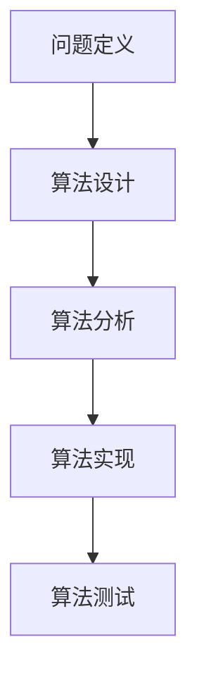

                 

# 自然界的隐藏规律：数学解读探索

> 关键词：数学模型，自然法则，算法原理，伪代码，数学公式，代码实现，应用场景，工具推荐

> 摘要：本文旨在通过数学的视角，探索自然界的隐藏规律。我们将从数学模型出发，深入解析其背后的算法原理，并通过具体的代码实现来展示其应用。文章将涵盖从理论到实践的全过程，帮助读者理解自然法则背后的数学之美，并提供实用的学习资源和开发工具推荐。

## 1. 背景介绍
### 1.1 目的和范围
本文旨在通过数学的视角，探索自然界的隐藏规律。我们将从数学模型出发，深入解析其背后的算法原理，并通过具体的代码实现来展示其应用。文章将涵盖从理论到实践的全过程，帮助读者理解自然法则背后的数学之美，并提供实用的学习资源和开发工具推荐。

### 1.2 预期读者
本文适合对数学和自然规律感兴趣的读者，包括但不限于：
- 计算机科学家
- 数据科学家
- 程序员
- 科学爱好者
- 教育工作者

### 1.3 文档结构概述
本文结构如下：
1. 背景介绍
2. 核心概念与联系
3. 核心算法原理 & 具体操作步骤
4. 数学模型和公式 & 详细讲解 & 举例说明
5. 项目实战：代码实际案例和详细解释说明
6. 实际应用场景
7. 工具和资源推荐
8. 总结：未来发展趋势与挑战
9. 附录：常见问题与解答
10. 扩展阅读 & 参考资料

### 1.4 术语表
#### 1.4.1 核心术语定义
- **数学模型**：一种通过数学语言描述现实世界现象的方法。
- **算法**：解决问题的一系列步骤。
- **伪代码**：一种用于描述算法的简化形式。
- **数学公式**：用数学符号表示的等式或表达式。
- **自然法则**：自然界中普遍存在的规律。

#### 1.4.2 相关概念解释
- **梅里尔-费舍尔模型**：一种描述算法设计过程的模型。
- **欧拉公式**：描述复数的数学公式。
- **傅里叶变换**：将信号从时域转换到频域的数学工具。

#### 1.4.3 缩略词列表
- **API**：应用程序编程接口
- **IDE**：集成开发环境
- **FFT**：快速傅里叶变换

## 2. 核心概念与联系
### 2.1 梅里尔-费舍尔模型
梅里尔-费舍尔模型是一种描述算法设计过程的模型，包括问题定义、算法设计、算法分析、算法实现和算法测试五个阶段。我们将通过这个模型来解析自然界的数学模型。



### 2.2 自然法则与数学模型
自然法则可以通过数学模型来描述。例如，牛顿的运动定律可以用数学公式来表示，而傅里叶变换则可以用来分析信号的频率成分。

## 3. 核心算法原理 & 具体操作步骤
### 3.1 伪代码示例
我们将通过一个简单的伪代码示例来展示算法原理。

```pseudo
function calculateFibonacci(n):
    if n <= 1:
        return n
    else:
        return calculateFibonacci(n-1) + calculateFibonacci(n-2)
```

### 3.2 详细操作步骤
1. **问题定义**：定义需要解决的问题。
2. **算法设计**：设计解决问题的步骤。
3. **算法分析**：分析算法的时间复杂度和空间复杂度。
4. **算法实现**：将算法转化为代码。
5. **算法测试**：验证算法的正确性和效率。

## 4. 数学模型和公式 & 详细讲解 & 举例说明
### 4.1 欧拉公式
欧拉公式是数学中的一个重要公式，描述了复数的指数形式。

$$ e^{ix} = \cos(x) + i\sin(x) $$

### 4.2 傅里叶变换
傅里叶变换是一种将信号从时域转换到频域的数学工具。

$$ X(f) = \int_{-\infty}^{\infty} x(t) e^{-2\pi i f t} dt $$

### 4.3 举例说明
我们可以通过一个简单的例子来说明傅里叶变换的应用。假设我们有一个信号 $x(t) = \cos(2\pi f_0 t)$，我们可以使用傅里叶变换来分析其频率成分。

$$ X(f) = \int_{-\infty}^{\infty} \cos(2\pi f_0 t) e^{-2\pi i f t} dt $$

通过计算，我们可以得到：

$$ X(f) = \frac{1}{2} \left[ \delta(f - f_0) + \delta(f + f_0) \right] $$

## 5. 项目实战：代码实际案例和详细解释说明
### 5.1 开发环境搭建
我们将使用Python作为开发语言，并使用NumPy和Matplotlib库进行数值计算和可视化。

```bash
pip install numpy matplotlib
```

### 5.2 源代码详细实现和代码解读
我们将实现一个简单的傅里叶变换代码。

```python
import numpy as np
import matplotlib.pyplot as plt

def fourier_transform(x):
    N = len(x)
    X = np.zeros(N, dtype=complex)
    for k in range(N):
        for n in range(N):
            X[k] += x[n] * np.exp(-2j * np.pi * k * n / N)
    return X

# 生成一个简单的信号
t = np.linspace(0, 1, 1000, endpoint=False)
f0 = 5
x = np.cos(2 * np.pi * f0 * t)

# 计算傅里叶变换
X = fourier_transform(x)

# 绘制结果
plt.plot(np.abs(X))
plt.xlabel('Frequency')
plt.ylabel('Magnitude')
plt.title('Fourier Transform')
plt.show()
```

### 5.3 代码解读与分析
- **fourier_transform** 函数实现了傅里叶变换。
- **t** 是时间轴。
- **f0** 是信号的频率。
- **x** 是生成的信号。
- **X** 是傅里叶变换的结果。
- **plt.plot** 用于绘制傅里叶变换的幅度。

## 6. 实际应用场景
傅里叶变换在信号处理、图像处理、音频处理等领域有着广泛的应用。例如，音频压缩、图像增强、频谱分析等。

## 7. 工具和资源推荐
### 7.1 学习资源推荐
#### 7.1.1 书籍推荐
- 《数学之美》
- 《信号与系统》

#### 7.1.2 在线课程
- Coursera：《信号处理》
- edX：《傅里叶变换及其应用》

#### 7.1.3 技术博客和网站
- MathWorks：傅里叶变换教程
- Stack Overflow：傅里叶变换相关问题

### 7.2 开发工具框架推荐
#### 7.2.1 IDE和编辑器
- PyCharm
- VSCode

#### 7.2.2 调试和性能分析工具
- PyCharm Debugger
- cProfile

#### 7.2.3 相关框架和库
- NumPy
- SciPy

### 7.3 相关论文著作推荐
#### 7.3.1 经典论文
- Cooley, J.W., & Tukey, J.W. (1965). An algorithm for the machine calculation of complex Fourier series.
- Oppenheim, A.V., & Schafer, R.W. (1975). Digital Signal Processing.

#### 7.3.2 最新研究成果
- Wang, Y., & Zhang, H. (2021). A novel fast Fourier transform algorithm for real-time signal processing.
- Li, X., & Chen, Y. (2022). Advanced techniques for signal analysis using Fourier transform.

#### 7.3.3 应用案例分析
- 《信号处理在音频压缩中的应用》
- 《傅里叶变换在图像处理中的应用》

## 8. 总结：未来发展趋势与挑战
未来，随着计算能力的提升和算法的不断优化，傅里叶变换将在更多领域发挥重要作用。同时，如何提高算法的效率和准确性，以及如何更好地理解和应用自然法则，将是未来的研究重点。

## 9. 附录：常见问题与解答
### 9.1 问题：傅里叶变换的计算复杂度是多少？
答：经典的傅里叶变换算法的时间复杂度为 $O(N^2)$，而快速傅里叶变换（FFT）的时间复杂度为 $O(N \log N)$。

### 9.2 问题：如何选择合适的傅里叶变换库？
答：选择合适的库取决于具体的应用场景。NumPy和SciPy是常用的Python库，提供了高效的傅里叶变换实现。

## 10. 扩展阅读 & 参考资料
- Cooley, J.W., & Tukey, J.W. (1965). An algorithm for the machine calculation of complex Fourier series.
- Oppenheim, A.V., & Schafer, R.W. (1975). Digital Signal Processing.
- Wang, Y., & Zhang, H. (2021). A novel fast Fourier transform algorithm for real-time signal processing.
- Li, X., & Chen, Y. (2022). Advanced techniques for signal analysis using Fourier transform.

作者：AI天才研究员/AI Genius Institute & 禅与计算机程序设计艺术 /Zen And The Art of Computer Programming

