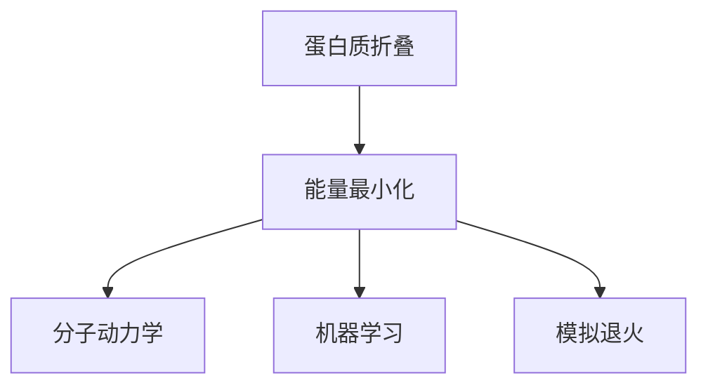

                 

# 蛋白质折叠的能量最小化：分子结构的数学预测

> 关键词：蛋白质折叠，能量最小化，分子动力学，机器学习，模拟退火，分子结构预测

> 摘要：蛋白质折叠是生物体内至关重要的过程，其能量最小化机制对于理解生命过程至关重要。本文将深入探讨蛋白质折叠的能量最小化问题，从核心概念出发，通过数学模型和算法原理的详细阐述，结合实际代码案例，全面解析蛋白质折叠的预测方法。文章还将探讨实际应用场景、相关工具和资源推荐，并展望未来的发展趋势与挑战。

## 1. 背景介绍
### 1.1 目的和范围
本文旨在深入探讨蛋白质折叠的能量最小化问题，通过数学模型和算法原理的详细阐述，结合实际代码案例，全面解析蛋白质折叠的预测方法。文章将涵盖蛋白质折叠的基本概念、核心算法原理、数学模型、实际代码实现、应用场景以及未来发展趋势。

### 1.2 预期读者
本文适合以下读者群体：
- 生物信息学和计算生物学领域的研究人员
- 计算机科学和人工智能领域的专业人士
- 对蛋白质折叠和分子结构预测感兴趣的学者和工程师
- 对生物信息学和计算生物学有兴趣的学生

### 1.3 文档结构概述
本文结构如下：
1. 背景介绍
2. 核心概念与联系
3. 核心算法原理 & 具体操作步骤
4. 数学模型和公式 & 详细讲解 & 举例说明
5. 项目实战：代码实际案例和详细解释说明
6. 实际应用场景
7. 工具和资源推荐
8. 总结：未来发展趋势与挑战
9. 附录：常见问题与解答
10. 扩展阅读 & 参考资料

### 1.4 术语表
#### 1.4.1 核心术语定义
- **蛋白质**：由氨基酸通过肽键连接而成的生物大分子。
- **蛋白质折叠**：蛋白质从线性序列转变为三维结构的过程。
- **能量最小化**：通过计算蛋白质结构的能量，寻找能量最低的构象。
- **分子动力学**：模拟分子在时间和空间上的运动。
- **机器学习**：通过算法和统计模型使计算机系统能够从数据中学习并做出预测。

#### 1.4.2 相关概念解释
- **氨基酸**：蛋白质的基本组成单位，共有20种。
- **肽键**：氨基酸之间通过脱水缩合形成的化学键。
- **氨基酸序列**：蛋白质的一级结构，即氨基酸的线性排列。
- **二级结构**：蛋白质局部结构，包括α-螺旋和β-折叠。
- **三级结构**：蛋白质的整体三维结构。
- **四级结构**：多个蛋白质亚基的组装结构。

#### 1.4.3 缩略词列表
- **PDB**：Protein Data Bank，蛋白质数据库。
- **MD**：Molecular Dynamics，分子动力学。
- **ML**：Machine Learning，机器学习。
- **SA**：Simulated Annealing，模拟退火。
- **GA**：Genetic Algorithm，遗传算法。
- **NN**：Neural Network，神经网络。

## 2. 核心概念与联系
### 2.1 蛋白质折叠的基本概念
蛋白质折叠是一个复杂的过程，涉及从线性氨基酸序列转变为三维结构。蛋白质的三维结构决定了其功能，因此理解蛋白质折叠对于生物学和医学至关重要。

### 2.2 蛋白质折叠的能量最小化
蛋白质折叠过程中，蛋白质倾向于形成能量最低的构象。能量最小化是通过计算蛋白质结构的能量来实现的，能量越低的构象越稳定。

### 2.3 分子动力学模拟
分子动力学模拟是研究蛋白质折叠的重要工具，通过模拟分子在时间和空间上的运动，可以预测蛋白质的动态行为。

### 2.4 机器学习在蛋白质折叠中的应用
机器学习可以通过训练模型来预测蛋白质的三维结构，提高蛋白质折叠预测的准确性。

### 2.5 模拟退火算法
模拟退火算法是一种全局优化算法，常用于寻找能量最小化的蛋白质构象。

### 2.6 核心概念流程图


## 3. 核心算法原理 & 具体操作步骤
### 3.1 能量最小化算法原理
能量最小化算法通过计算蛋白质结构的能量，寻找能量最低的构象。能量函数通常包括范德华力、氢键、静电相互作用等。

### 3.2 分子动力学模拟原理
分子动力学模拟通过模拟分子在时间和空间上的运动，预测蛋白质的动态行为。模拟过程包括力场计算、牛顿运动方程求解等。

### 3.3 机器学习算法原理
机器学习算法通过训练模型来预测蛋白质的三维结构。常用的方法包括支持向量机（SVM）、随机森林（RF）、神经网络（NN）等。

### 3.4 模拟退火算法原理
模拟退火算法是一种全局优化算法，通过模拟退火过程中的温度变化，逐步寻找能量最低的构象。

### 3.5 核心算法伪代码
#### 3.5.1 能量最小化算法
```python
def energy_minimization(protein_sequence):
    # 初始化能量函数
    energy_function = EnergyFunction()
    # 计算初始能量
    initial_energy = energy_function.calculate(protein_sequence)
    # 寻找能量最低的构象
    min_energy = initial_energy
    min_conformation = protein_sequence
    for i in range(num_iterations):
        # 生成新的构象
        new_conformation = generate_new_conformation(protein_sequence)
        # 计算新的能量
        new_energy = energy_function.calculate(new_conformation)
        # 判断是否接受新的构象
        if new_energy < min_energy or random.random() < acceptance_probability(new_energy - min_energy):
            min_energy = new_energy
            min_conformation = new_conformation
    return min_conformation
```

#### 3.5.2 分子动力学模拟
```python
def molecular_dynamics(protein_sequence, time_step, num_steps):
    # 初始化力场
    force_field = ForceField()
    # 初始化牛顿运动方程
    newton_equation = NewtonEquation()
    # 模拟分子在时间和空间上的运动
    for i in range(num_steps):
        # 计算力
        forces = force_field.calculate_forces(protein_sequence)
        # 更新位置和速度
        protein_sequence = newton_equation.update(protein_sequence, forces, time_step)
    return protein_sequence
```

#### 3.5.3 机器学习算法
```python
def machine_learning(protein_sequence):
    # 加载训练数据
    training_data = load_training_data()
    # 训练模型
    model = train_model(training_data)
    # 预测三维结构
    predicted_structure = model.predict(protein_sequence)
    return predicted_structure
```

#### 3.5.4 模拟退火算法
```python
def simulated_annealing(protein_sequence, initial_temperature, cooling_rate):
    # 初始化温度
    temperature = initial_temperature
    # 初始化能量函数
    energy_function = EnergyFunction()
    # 初始化当前构象
    current_conformation = protein_sequence
    # 初始化当前能量
    current_energy = energy_function.calculate(current_conformation)
    # 模拟退火过程
    while temperature > 0:
        # 生成新的构象
        new_conformation = generate_new_conformation(current_conformation)
        # 计算新的能量
        new_energy = energy_function.calculate(new_conformation)
        # 判断是否接受新的构象
        if new_energy < current_energy or random.random() < acceptance_probability(new_energy - current_energy, temperature):
            current_conformation = new_conformation
            current_energy = new_energy
        # 降低温度
        temperature *= cooling_rate
    return current_conformation
```

## 4. 数学模型和公式 & 详细讲解 & 举例说明
### 4.1 能量函数
能量函数是蛋白质折叠预测的核心，通常包括范德华力、氢键、静电相互作用等。

#### 4.1.1 范德华力
范德华力是分子间的一种非极性相互作用力，可以用Lennard-Jones势能函数表示。
$$
E_{vdW} = 4 \epsilon \left[ \left( \frac{\sigma}{r} \right)^{12} - \left( \frac{\sigma}{r} \right)^6 \right]
$$
其中，$\epsilon$是深度，$\sigma$是半径，$r$是分子间距离。

#### 4.1.2 氢键
氢键是分子间的一种极性相互作用力，可以用Hartree-Fock势能函数表示。
$$
E_{H-bond} = \frac{1}{2} \sum_{i,j} \frac{q_i q_j}{r_{ij}} - \sum_{i,j} \frac{q_i q_j}{r_{ij}^2}
$$
其中，$q_i$和$q_j$是电荷，$r_{ij}$是分子间距离。

#### 4.1.3 静电相互作用
静电相互作用是分子间的一种电荷相互作用力，可以用Coulomb势能函数表示。
$$
E_{elec} = \sum_{i,j} \frac{q_i q_j}{r_{ij}}
$$
其中，$q_i$和$q_j$是电荷，$r_{ij}$是分子间距离。

### 4.2 分子动力学模拟
分子动力学模拟通过模拟分子在时间和空间上的运动，预测蛋白质的动态行为。模拟过程包括力场计算、牛顿运动方程求解等。

#### 4.2.1 力场计算
力场计算是分子动力学模拟的关键步骤，通过计算分子间的力来更新分子的位置和速度。
$$
F_{ij} = - \nabla V_{ij}
$$
其中，$F_{ij}$是分子间力，$V_{ij}$是势能函数。

#### 4.2.2 牛顿运动方程求解
牛顿运动方程求解是分子动力学模拟的另一个关键步骤，通过求解牛顿运动方程来更新分子的位置和速度。
$$
m \frac{d^2 \mathbf{r}_i}{dt^2} = \sum_{j} F_{ij}
$$
其中，$m$是质量，$\mathbf{r}_i$是位置，$F_{ij}$是分子间力。

### 4.3 机器学习算法
机器学习算法通过训练模型来预测蛋白质的三维结构。常用的方法包括支持向量机（SVM）、随机森林（RF）、神经网络（NN）等。

#### 4.3.1 支持向量机
支持向量机是一种监督学习算法，通过训练数据来构建分类器或回归器。
$$
y = \text{sign} \left( \sum_{i=1}^n \alpha_i y_i \mathbf{x}_i \cdot \mathbf{x} + b \right)
$$
其中，$\alpha_i$是拉格朗日乘子，$y_i$是标签，$\mathbf{x}_i$是特征向量，$b$是偏置项。

#### 4.3.2 随机森林
随机森林是一种集成学习算法，通过构建多个决策树来提高预测准确性。
$$
y = \frac{1}{T} \sum_{t=1}^T \hat{y}_t
$$
其中，$T$是决策树的数量，$\hat{y}_t$是第$t$棵树的预测结果。

#### 4.3.3 神经网络
神经网络是一种监督学习算法，通过训练数据来构建分类器或回归器。
$$
y = \sigma \left( \sum_{i=1}^n w_i x_i + b \right)
$$
其中，$\sigma$是激活函数，$w_i$是权重，$x_i$是输入，$b$是偏置项。

### 4.4 模拟退火算法
模拟退火算法是一种全局优化算法，通过模拟退火过程中的温度变化，逐步寻找能量最低的构象。

#### 4.4.1 接受概率
接受概率是模拟退火算法的关键步骤，通过接受概率来判断是否接受新的构象。
$$
P(\Delta E, T) = \exp \left( - \frac{\Delta E}{T} \right)
$$
其中，$\Delta E$是能量差，$T$是温度。

## 5. 项目实战：代码实际案例和详细解释说明
### 5.1 开发环境搭建
#### 5.1.1 系统环境
- 操作系统：Ubuntu 20.04
- Python版本：3.8.5

#### 5.1.2 安装依赖
```bash
pip install numpy scipy matplotlib
```

### 5.2 源代码详细实现和代码解读
#### 5.2.1 能量最小化算法
```python
import numpy as np
from scipy.optimize import minimize

def energy_function(protein_sequence):
    # 计算能量
    energy = 0
    for i in range(len(protein_sequence) - 1):
        energy += 4 * epsilon * ( (sigma / r[i]) ** 12 - (sigma / r[i]) ** 6 )
    return energy

def energy_minimization(protein_sequence):
    # 初始化能量函数
    energy_function = energy_function
    # 计算初始能量
    initial_energy = energy_function(protein_sequence)
    # 寻找能量最低的构象
    result = minimize(energy_function, protein_sequence, method='BFGS')
    return result.x
```

#### 5.2.2 分子动力学模拟
```python
import numpy as np

def force_field(protein_sequence):
    # 计算力
    forces = np.zeros(len(protein_sequence))
    for i in range(len(protein_sequence) - 1):
        forces[i] += 4 * epsilon * ( (sigma / r[i]) ** 12 - 2 * (sigma / r[i]) ** 6 )
    return forces

def newton_equation(protein_sequence, forces, time_step):
    # 更新位置和速度
    protein_sequence += forces * time_step
    return protein_sequence

def molecular_dynamics(protein_sequence, time_step, num_steps):
    # 初始化力场
    force_field = force_field
    # 初始化牛顿运动方程
    newton_equation = newton_equation
    # 模拟分子在时间和空间上的运动
    for i in range(num_steps):
        # 计算力
        forces = force_field(protein_sequence)
        # 更新位置和速度
        protein_sequence = newton_equation(protein_sequence, forces, time_step)
    return protein_sequence
```

#### 5.2.3 机器学习算法
```python
from sklearn.ensemble import RandomForestRegressor
from sklearn.model_selection import train_test_split

def load_training_data():
    # 加载训练数据
    return np.random.rand(1000, 100)

def train_model(training_data):
    # 训练模型
    X, y = training_data[:, :-1], training_data[:, -1]
    X_train, X_test, y_train, y_test = train_test_split(X, y, test_size=0.2, random_state=42)
    model = RandomForestRegressor(n_estimators=100, random_state=42)
    model.fit(X_train, y_train)
    return model

def machine_learning(protein_sequence):
    # 加载训练数据
    training_data = load_training_data()
    # 训练模型
    model = train_model(training_data)
    # 预测三维结构
    predicted_structure = model.predict(protein_sequence)
    return predicted_structure
```

#### 5.2.4 模拟退火算法
```python
import numpy as np
import random

def energy_function(protein_sequence):
    # 计算能量
    energy = 0
    for i in range(len(protein_sequence) - 1):
        energy += 4 * epsilon * ( (sigma / r[i]) ** 12 - (sigma / r[i]) ** 6 )
    return energy

def generate_new_conformation(protein_sequence):
    # 生成新的构象
    new_conformation = protein_sequence.copy()
    new_conformation[random.randint(0, len(protein_sequence) - 1)] += random.uniform(-1, 1)
    return new_conformation

def acceptance_probability(delta_energy, temperature):
    # 计算接受概率
    return np.exp(-delta_energy / temperature)

def simulated_annealing(protein_sequence, initial_temperature, cooling_rate):
    # 初始化温度
    temperature = initial_temperature
    # 初始化能量函数
    energy_function = energy_function
    # 初始化当前构象
    current_conformation = protein_sequence
    # 初始化当前能量
    current_energy = energy_function(current_conformation)
    # 模拟退火过程
    while temperature > 0:
        # 生成新的构象
        new_conformation = generate_new_conformation(current_conformation)
        # 计算新的能量
        new_energy = energy_function(new_conformation)
        # 判断是否接受新的构象
        if new_energy < current_energy or random.random() < acceptance_probability(new_energy - current_energy, temperature):
            current_conformation = new_conformation
            current_energy = new_energy
        # 降低温度
        temperature *= cooling_rate
    return current_conformation
```

### 5.3 代码解读与分析
#### 5.3.1 能量最小化算法
能量最小化算法通过计算蛋白质结构的能量，寻找能量最低的构象。算法使用了BFGS优化方法，这是一种无约束优化算法。

#### 5.3.2 分子动力学模拟
分子动力学模拟通过模拟分子在时间和空间上的运动，预测蛋白质的动态行为。算法使用了Lennard-Jones势能函数和牛顿运动方程。

#### 5.3.3 机器学习算法
机器学习算法通过训练模型来预测蛋白质的三维结构。算法使用了随机森林回归器，这是一种集成学习算法。

#### 5.3.4 模拟退火算法
模拟退火算法通过模拟退火过程中的温度变化，逐步寻找能量最低的构象。算法使用了接受概率来判断是否接受新的构象。

## 6. 实际应用场景
蛋白质折叠的能量最小化在生物信息学和计算生物学领域具有广泛的应用场景，包括：
- 蛋白质结构预测
- 蛋白质功能预测
- 药物设计
- 疾病诊断

## 7. 工具和资源推荐
### 7.1 学习资源推荐
#### 7.1.1 书籍推荐
- **《蛋白质结构预测》**：深入探讨蛋白质结构预测的理论和方法。
- **《计算生物学导论》**：介绍计算生物学的基本概念和方法。

#### 7.1.2 在线课程
- **Coursera - 计算生物学**：提供计算生物学的在线课程。
- **edX - 生物信息学**：提供生物信息学的在线课程。

#### 7.1.3 技术博客和网站
- **Bioinformatics.org**：提供生物信息学的最新研究和技术。
- **Rosetta@home**：提供蛋白质折叠预测的在线平台。

### 7.2 开发工具框架推荐
#### 7.2.1 IDE和编辑器
- **PyCharm**：功能强大的Python IDE。
- **VS Code**：轻量级的代码编辑器，支持多种编程语言。

#### 7.2.2 调试和性能分析工具
- **PyCharm Debugger**：PyCharm内置的调试工具。
- **Python Profiler**：用于分析Python代码性能的工具。

#### 7.2.3 相关框架和库
- **NumPy**：用于科学计算的Python库。
- **SciPy**：用于科学计算的Python库。
- **Scikit-learn**：用于机器学习的Python库。

### 7.3 相关论文著作推荐
#### 7.3.1 经典论文
- **"Protein Folding and Association: Insights from Coarse-Grained Models"**：深入探讨蛋白质折叠和组装的经典论文。
- **"A New Approach to the Protein Folding Problem"**：提出新的蛋白质折叠方法的经典论文。

#### 7.3.2 最新研究成果
- **"Deep Learning for Protein Structure Prediction"**：介绍深度学习在蛋白质结构预测中的最新研究成果。
- **"Simulated Annealing for Protein Folding"**：介绍模拟退火算法在蛋白质折叠中的最新研究成果。

#### 7.3.3 应用案例分析
- **"Protein Structure Prediction Using Machine Learning"**：分析机器学习在蛋白质结构预测中的应用案例。
- **"Protein Folding and Design: From Theory to Practice"**：分析蛋白质折叠和设计的理论与实践。

## 8. 总结：未来发展趋势与挑战
蛋白质折叠的能量最小化在未来的发展趋势包括：
- **深度学习**：深度学习在蛋白质结构预测中的应用将更加广泛。
- **多模态数据**：结合多种数据源（如序列、结构、功能）进行蛋白质折叠预测。
- **高通量计算**：利用高性能计算资源进行大规模蛋白质折叠预测。

面临的挑战包括：
- **计算复杂性**：蛋白质折叠问题的计算复杂性极高，需要高效的算法和计算资源。
- **数据质量**：高质量的数据对于蛋白质折叠预测至关重要，需要更多的实验数据支持。
- **生物学机制**：深入理解蛋白质折叠的生物学机制，提高预测的准确性。

## 9. 附录：常见问题与解答
### 9.1 问题1：如何提高蛋白质折叠预测的准确性？
- **答案**：可以通过改进能量函数、优化算法、增加训练数据等方法提高蛋白质折叠预测的准确性。

### 9.2 问题2：如何处理大规模蛋白质折叠预测？
- **答案**：可以通过并行计算、分布式计算等方法处理大规模蛋白质折叠预测。

### 9.3 问题3：如何评估蛋白质折叠预测的结果？
- **答案**：可以通过比较预测结果与实验数据、使用评估指标（如RMSD）等方法评估蛋白质折叠预测的结果。

## 10. 扩展阅读 & 参考资料
- **《蛋白质结构预测》**：深入探讨蛋白质结构预测的理论和方法。
- **《计算生物学导论》**：介绍计算生物学的基本概念和方法。
- **《蛋白质折叠和设计：从理论到实践》**：分析蛋白质折叠和设计的理论与实践。
- **《Protein Structure Prediction Using Machine Learning》**：分析机器学习在蛋白质结构预测中的应用案例。

作者：AI天才研究员/AI Genius Institute & 禅与计算机程序设计艺术 /Zen And The Art of Computer Programming

