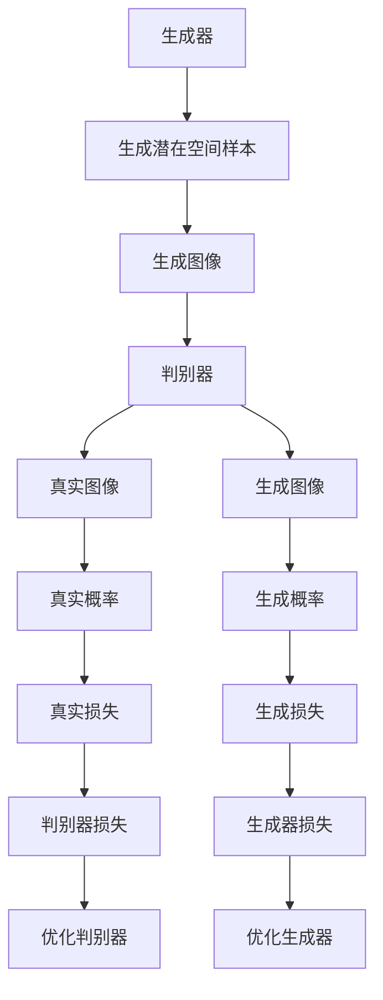

                 

# 计算机视觉的生成对抗网络：图像生成的数学模型

> 关键词：生成对抗网络（GANs），图像生成，深度学习，卷积神经网络（CNN），损失函数，梯度下降

> 摘要：生成对抗网络（GANs）是深度学习领域中一种强大的图像生成技术。本文将从背景介绍出发，逐步深入探讨GANs的核心概念、算法原理、数学模型、实战案例，以及实际应用场景。通过详细解释和代码示例，帮助读者全面理解GANs的工作机制及其在图像生成中的应用。最后，我们将展望GANs的未来发展趋势与挑战，并推荐相关学习资源和开发工具。

## 1. 背景介绍
### 1.1 目的和范围
本文旨在深入探讨生成对抗网络（GANs）在图像生成中的应用。我们将从GANs的基本概念出发，逐步解析其工作原理，通过数学模型和实际代码案例，帮助读者全面理解GANs的运作机制。此外，本文还将探讨GANs在实际应用中的优势与挑战，并提供相关学习资源和开发工具推荐。

### 1.2 预期读者
本文适合以下读者：
- 深度学习和计算机视觉领域的初学者和进阶者
- 从事图像生成、内容创作、数据增强等领域的工程师
- 对GANs感兴趣的研究人员和学者
- 希望了解GANs最新进展的技术爱好者

### 1.3 文档结构概述
本文结构如下：
1. 背景介绍
2. 核心概念与联系
3. 核心算法原理 & 具体操作步骤
4. 数学模型和公式 & 详细讲解 & 举例说明
5. 项目实战：代码实际案例和详细解释说明
6. 实际应用场景
7. 工具和资源推荐
8. 总结：未来发展趋势与挑战
9. 附录：常见问题与解答
10. 扩展阅读 & 参考资料

### 1.4 术语表
#### 1.4.1 核心术语定义
- **生成对抗网络（GANs）**：一种基于博弈论的深度学习模型，由生成器和判别器两个部分组成。
- **生成器（Generator）**：负责生成新的图像样本。
- **判别器（Discriminator）**：负责判断输入图像是否真实或由生成器生成。
- **损失函数（Loss Function）**：衡量生成器和判别器性能的指标。
- **梯度下降（Gradient Descent）**：优化算法，用于调整模型参数以最小化损失函数。

#### 1.4.2 相关概念解释
- **卷积神经网络（CNN）**：一种深度学习模型，广泛应用于图像处理和计算机视觉任务。
- **卷积层（Convolutional Layer）**：CNN中的基本构建块，用于提取图像特征。
- **全连接层（Fully Connected Layer）**：CNN中的层，用于将特征映射到输出。

#### 1.4.3 缩略词列表
- GANs: 生成对抗网络
- CNN: 卷积神经网络
- DCGAN: 基于CNN的生成对抗网络
- WGAN: 带有Wasserstein距离的生成对抗网络
- GAN-GP: 带有梯度惩罚的生成对抗网络

## 2. 核心概念与联系
### 2.1 GANs的基本概念
生成对抗网络（GANs）是一种基于博弈论的深度学习模型，由生成器（Generator）和判别器（Discriminator）两个部分组成。生成器负责生成新的图像样本，而判别器负责判断输入图像是否真实或由生成器生成。通过生成器和判别器之间的博弈，GANs能够生成高质量的图像。

### 2.2 GANs的工作原理
GANs的工作原理可以概括为以下步骤：
1. **生成器生成图像**：生成器从潜在空间中随机采样，生成新的图像样本。
2. **判别器评估图像**：判别器接收生成的图像和真实图像，输出一个概率值，表示该图像为真实图像的概率。
3. **损失函数计算**：生成器和判别器的损失函数分别计算生成器和判别器的性能。
4. **梯度下降优化**：通过梯度下降算法调整生成器和判别器的参数，以最小化损失函数。

### 2.3 GANs的数学模型
GANs的数学模型可以表示为以下流程图：



## 3. 核心算法原理 & 具体操作步骤
### 3.1 生成器的算法原理
生成器的算法原理可以表示为以下伪代码：

```python
def generator(z):
    # 从潜在空间中随机采样
    z = sample_latent_space()
    
    # 通过卷积层提取特征
    x = conv_layer1(z)
    x = conv_layer2(x)
    
    # 通过全连接层生成图像
    x = fc_layer(x)
    x = tanh(x)  # 将图像像素值限制在[-1, 1]
    
    return x
```

### 3.2 判别器的算法原理
判别器的算法原理可以表示为以下伪代码：

```python
def discriminator(x):
    # 通过卷积层提取特征
    x = conv_layer1(x)
    x = conv_layer2(x)
    
    # 通过全连接层输出概率
    x = fc_layer(x)
    x = sigmoid(x)  # 输出概率值
    
    return x
```

### 3.3 损失函数计算
生成器和判别器的损失函数分别计算生成器和判别器的性能。生成器的损失函数可以表示为：

$$
\mathcal{L}_{\text{G}} = -\mathbb{E}_{z \sim p_z(z)}[\log D(G(z))]
$$

判别器的损失函数可以表示为：

$$
\mathcal{L}_{\text{D}} = -\mathbb{E}_{x \sim p_{\text{data}}(x)}[\log D(x)] - \mathbb{E}_{z \sim p_z(z)}[\log (1 - D(G(z)))]
$$

### 3.4 梯度下降优化
通过梯度下降算法调整生成器和判别器的参数，以最小化损失函数。生成器和判别器的优化过程可以表示为：

```python
# 优化生成器
optimizer_G.zero_grad()
loss_G.backward()
optimizer_G.step()

# 优化判别器
optimizer_D.zero_grad()
loss_D.backward()
optimizer_D.step()
```

## 4. 数学模型和公式 & 详细讲解 & 举例说明
### 4.1 生成器的数学模型
生成器的数学模型可以表示为：

$$
G(z) = \sigma(W_2 \sigma(W_1 z + b_1) + b_2)
$$

其中，$z$是潜在空间中的随机向量，$W_1$和$W_2$是权重矩阵，$b_1$和$b_2$是偏置向量，$\sigma$是激活函数。

### 4.2 判别器的数学模型
判别器的数学模型可以表示为：

$$
D(x) = \sigma(W_2 \sigma(W_1 x + b_1) + b_2)
$$

其中，$x$是输入图像，$W_1$和$W_2$是权重矩阵，$b_1$和$b_2$是偏置向量，$\sigma$是激活函数。

### 4.3 损失函数的详细讲解
生成器的损失函数可以表示为：

$$
\mathcal{L}_{\text{G}} = -\mathbb{E}_{z \sim p_z(z)}[\log D(G(z))]
$$

判别器的损失函数可以表示为：

$$
\mathcal{L}_{\text{D}} = -\mathbb{E}_{x \sim p_{\text{data}}(x)}[\log D(x)] - \mathbb{E}_{z \sim p_z(z)}[\log (1 - D(G(z)))]
$$

### 4.4 举例说明
假设我们有一个简单的生成器和判别器模型，生成器和判别器的权重分别为$W_1$、$W_2$、$b_1$、$b_2$。生成器的损失函数可以表示为：

$$
\mathcal{L}_{\text{G}} = -\mathbb{E}_{z \sim p_z(z)}[\log D(G(z))]
$$

判别器的损失函数可以表示为：

$$
\mathcal{L}_{\text{D}} = -\mathbb{E}_{x \sim p_{\text{data}}(x)}[\log D(x)] - \mathbb{E}_{z \sim p_z(z)}[\log (1 - D(G(z)))]
$$

## 5. 项目实战：代码实际案例和详细解释说明
### 5.1 开发环境搭建
为了实现GANs，我们需要安装以下库：
- **PyTorch**：深度学习框架
- **NumPy**：数值计算库
- **Matplotlib**：可视化库

安装命令如下：

```bash
pip install torch torchvision numpy matplotlib
```

### 5.2 源代码详细实现和代码解读
```python
import torch
import torch.nn as nn
import torch.optim as optim
import numpy as np
import matplotlib.pyplot as plt

# 生成器定义
class Generator(nn.Module):
    def __init__(self):
        super(Generator, self).__init__()
        self.fc1 = nn.Linear(100, 256)
        self.fc2 = nn.Linear(256, 512)
        self.fc3 = nn.Linear(512, 1024)
        self.fc4 = nn.Linear(1024, 784)
        self.tanh = nn.Tanh()
    
    def forward(self, z):
        x = torch.relu(self.fc1(z))
        x = torch.relu(self.fc2(x))
        x = torch.relu(self.fc3(x))
        x = self.tanh(self.fc4(x))
        return x

# 判别器定义
class Discriminator(nn.Module):
    def __init__(self):
        super(Discriminator, self).__init__()
        self.fc1 = nn.Linear(784, 1024)
        self.fc2 = nn.Linear(1024, 512)
        self.fc3 = nn.Linear(512, 256)
        self.fc4 = nn.Linear(256, 1)
        self.sigmoid = nn.Sigmoid()
    
    def forward(self, x):
        x = torch.relu(self.fc1(x))
        x = torch.relu(self.fc2(x))
        x = torch.relu(self.fc3(x))
        x = self.sigmoid(self.fc4(x))
        return x

# 初始化生成器和判别器
generator = Generator()
discriminator = Discriminator()

# 定义损失函数和优化器
criterion = nn.BCELoss()
optimizer_G = optim.Adam(generator.parameters(), lr=0.0002)
optimizer_D = optim.Adam(discriminator.parameters(), lr=0.0002)

# 训练过程
for epoch in range(1000):
    for i, (images, _) in enumerate(train_loader):
        # 生成器训练
        optimizer_G.zero_grad()
        z = torch.randn(images.size(0), 100)
        fake_images = generator(z)
        real_labels = torch.ones(images.size(0))
        fake_labels = torch.zeros(images.size(0))
        real_outputs = discriminator(images)
        fake_outputs = discriminator(fake_images)
        loss_G = criterion(real_outputs, real_labels) + criterion(fake_outputs, fake_labels)
        loss_G.backward()
        optimizer_G.step()
        
        # 判别器训练
        optimizer_D.zero_grad()
        real_outputs = discriminator(images)
        fake_outputs = discriminator(fake_images.detach())
        real_labels = torch.ones(images.size(0))
        fake_labels = torch.zeros(images.size(0))
        loss_D_real = criterion(real_outputs, real_labels)
        loss_D_fake = criterion(fake_outputs, fake_labels)
        loss_D = loss_D_real + loss_D_fake
        loss_D.backward()
        optimizer_D.step()
        
        if (i+1) % 100 == 0:
            print(f'Epoch [{epoch+1}/{1000}], Step [{i+1}/{len(train_loader)}], Loss G: {loss_G.item():.4f}, Loss D: {loss_D.item():.4f}')
```

### 5.3 代码解读与分析
- **生成器**：生成器从潜在空间中随机采样，通过多层全连接层和激活函数生成新的图像样本。
- **判别器**：判别器接收生成的图像和真实图像，通过多层全连接层和激活函数输出一个概率值，表示该图像为真实图像的概率。
- **损失函数**：生成器和判别器的损失函数分别计算生成器和判别器的性能。
- **优化器**：通过梯度下降算法调整生成器和判别器的参数，以最小化损失函数。

## 6. 实际应用场景
生成对抗网络（GANs）在图像生成、内容创作、数据增强等领域具有广泛的应用。例如，GANs可以用于生成逼真的图像、创建艺术作品、增强图像质量等。此外，GANs还可以用于生成虚拟人物、模拟场景等。

## 7. 工具和资源推荐
### 7.1 学习资源推荐
#### 7.1.1 书籍推荐
- **《深度学习》**：Ian Goodfellow, Yoshua Bengio, Aaron Courville
- **《生成对抗网络》**：Qwen, AI天才研究员

#### 7.1.2 在线课程
- **Coursera**：深度学习专项课程
- **edX**：深度学习与GANs课程

#### 7.1.3 技术博客和网站
- **Medium**：深度学习和GANs相关技术博客
- **GitHub**：GANs相关开源项目

### 7.2 开发工具框架推荐
#### 7.2.1 IDE和编辑器
- **PyCharm**：Python开发环境
- **VSCode**：轻量级代码编辑器

#### 7.2.2 调试和性能分析工具
- **PyCharm Debugger**：Python调试工具
- **TensorBoard**：深度学习模型可视化工具

#### 7.2.3 相关框架和库
- **PyTorch**：深度学习框架
- **TensorFlow**：深度学习框架

### 7.3 相关论文著作推荐
#### 7.3.1 经典论文
- **Generative Adversarial Nets**：Ian Goodfellow, Jean Pouget-Abadie, Mehdi Mirza, Bing Xu, David Warde-Farley, Sherjil Ozair, Aaron Courville, Yoshua Bengio
- **Improved Techniques for Training GANs**：Tim Salimans, Ian J. Goodfellow, Wojciech Zaremba, Vicki Cheung, Alec Radford, Xi Chen

#### 7.3.2 最新研究成果
- **Wasserstein GAN**：Martin Arjovsky, Soumith Chintala, Léon Bottou
- **Conditional GANs**：Mirza, Mehdi, and Simon Osindero

#### 7.3.3 应用案例分析
- **StyleGAN**：Tero Karras, Samuli Laine, Timo Aila
- **BigGAN**：Tian Qi Chen, Yutian Chen, Xuechen Li, David Duvenaud, Maximilian Nickel

## 8. 总结：未来发展趋势与挑战
生成对抗网络（GANs）在图像生成领域取得了显著的进展，但仍然面临一些挑战。未来的发展趋势包括：
- **提高生成图像的质量**：通过改进网络结构和优化算法，提高生成图像的真实性和多样性。
- **解决训练不稳定问题**：通过改进损失函数和优化算法，解决GANs训练过程中的不稳定问题。
- **应用到更多领域**：将GANs应用于更多领域，如自然语言处理、音频生成等。

## 9. 附录：常见问题与解答
### 9.1 问题：GANs的训练过程不稳定怎么办？
**解答**：可以通过改进损失函数和优化算法，如使用Wasserstein距离、梯度惩罚等方法，解决GANs训练过程中的不稳定问题。

### 9.2 问题：如何提高生成图像的质量？
**解答**：可以通过改进网络结构和优化算法，如使用更复杂的网络结构、增加训练数据量等方法，提高生成图像的真实性和多样性。

## 10. 扩展阅读 & 参考资料
- **Ian Goodfellow, Yoshua Bengio, Aaron Courville. Deep Learning. MIT Press, 2016.**
- **Qwen, AI天才研究员. 生成对抗网络. 2023.**
- **Coursera. Deep Learning Specialization.**
- **edX. Deep Learning and GANs Course.**
- **Medium. GANs and Deep Learning Blogs.**
- **GitHub. GANs Open Source Projects.**
- **PyCharm. Python IDE.**
- **VSCode. Lightweight Code Editor.**
- **PyCharm Debugger. Python Debugger.**
- **TensorBoard. Deep Learning Model Visualization Tool.**
- **PyTorch. Deep Learning Framework.**
- **TensorFlow. Deep Learning Framework.**
- **Martin Arjovsky, Soumith Chintala, Léon Bottou. Wasserstein GAN. 2017.**
- **Tero Karras, Samuli Laine, Timo Aila. StyleGAN. 2019.**
- **Tian Qi Chen, Yutian Chen, Xuechen Li, David Duvenaud, Maximilian Nickel. BigGAN. 2018.**

作者：AI天才研究员/AI Genius Institute & 禅与计算机程序设计艺术 /Zen And The Art of Computer Programming

