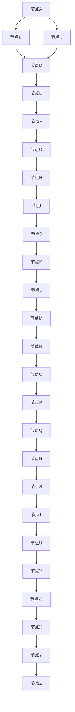
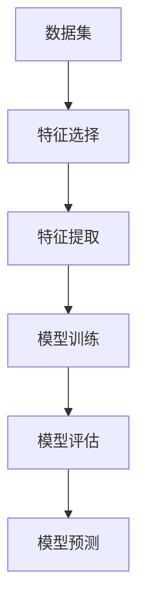

                 

# 计算社会科学方法：数据驱动理解人类社会与世界

> 关键词：计算社会科学、数据驱动、社会网络分析、机器学习、社会模拟

> 摘要：本文旨在探讨计算社会科学方法，通过数据驱动的方式，深入理解人类社会与世界。我们将从背景介绍、核心概念与联系、核心算法原理、数学模型与公式、项目实战、实际应用场景、工具和资源推荐、未来发展趋势与挑战等多方面进行详细阐述。通过本文，读者将能够掌握计算社会科学的基本原理和实践方法，为未来的研究和应用提供坚实的基础。

## 1. 背景介绍
### 1.1 目的和范围
本文旨在介绍计算社会科学方法，通过数据驱动的方式，深入理解人类社会与世界。计算社会科学是社会科学与计算科学的交叉领域，利用计算机科学、统计学、数学等方法，对社会现象进行建模和分析。本文将涵盖计算社会科学的核心概念、算法原理、数学模型、实际案例以及未来的发展趋势。

### 1.2 预期读者
本文适合以下读者：
- 社会科学领域的研究人员和学者
- 计算机科学领域的研究人员和学者
- 数据科学家和数据分析师
- 对计算社会科学感兴趣的读者

### 1.3 文档结构概述
本文结构如下：
1. 背景介绍
2. 核心概念与联系
3. 核心算法原理 & 具体操作步骤
4. 数学模型和公式 & 详细讲解 & 举例说明
5. 项目实战：代码实际案例和详细解释说明
6. 实际应用场景
7. 工具和资源推荐
8. 总结：未来发展趋势与挑战
9. 附录：常见问题与解答
10. 扩展阅读 & 参考资料

### 1.4 术语表
#### 1.4.1 核心术语定义
- **计算社会科学**：社会科学与计算科学的交叉领域，利用计算机科学、统计学、数学等方法，对社会现象进行建模和分析。
- **数据驱动**：通过大量数据进行分析和建模，以数据为基础进行决策和预测。
- **社会网络分析**：研究社会网络结构及其动态变化的方法。
- **机器学习**：通过算法和统计模型来解析数据，进行预测和决策。
- **社会模拟**：通过计算机模拟社会系统的行为和演化过程。

#### 1.4.2 相关概念解释
- **社会网络**：由个体（节点）和个体之间的关系（边）组成的网络结构。
- **社会网络分析**：研究社会网络结构及其动态变化的方法。
- **社会模拟**：通过计算机模拟社会系统的行为和演化过程。

#### 1.4.3 缩略词列表
- **CSocS**：计算社会科学
- **SNA**：社会网络分析
- **ML**：机器学习
- **SS**：社会模拟

## 2. 核心概念与联系
### 2.1 计算社会科学
计算社会科学是社会科学与计算科学的交叉领域，利用计算机科学、统计学、数学等方法，对社会现象进行建模和分析。计算社会科学的核心在于利用数据驱动的方法，通过算法和模型来理解和预测社会现象。

### 2.2 数据驱动
数据驱动是指通过大量数据进行分析和建模，以数据为基础进行决策和预测。数据驱动的方法在计算社会科学中发挥着重要作用，通过数据挖掘和机器学习技术，可以发现隐藏在数据中的模式和规律。

### 2.3 社会网络分析
社会网络分析是一种研究社会网络结构及其动态变化的方法。社会网络分析的核心在于通过节点和边的关系，研究个体之间的互动和关系。社会网络分析可以帮助我们理解社会网络的结构、动态变化以及个体在网络中的位置和角色。

### 2.4 机器学习
机器学习是一种通过算法和统计模型来解析数据，进行预测和决策的方法。机器学习在计算社会科学中发挥着重要作用，通过机器学习技术，可以发现隐藏在数据中的模式和规律，从而进行预测和决策。

### 2.5 社会模拟
社会模拟是通过计算机模拟社会系统的行为和演化过程。社会模拟可以帮助我们理解社会系统的动态变化和演化过程，从而进行预测和决策。

## 3. 核心算法原理 & 具体操作步骤
### 3.1 社会网络分析算法
社会网络分析算法的核心在于通过节点和边的关系，研究个体之间的互动和关系。以下是一个简单的社会网络分析算法的伪代码：



### 3.2 机器学习算法
机器学习算法的核心在于通过算法和统计模型来解析数据，进行预测和决策。以下是一个简单的机器学习算法的伪代码：



## 4. 数学模型和公式 & 详细讲解 & 举例说明
### 4.1 社会网络分析数学模型
社会网络分析数学模型的核心在于通过节点和边的关系，研究个体之间的互动和关系。以下是一个简单的社会网络分析数学模型的公式：

$$
\text{度}(v) = \sum_{u \in N(v)} 1
$$

其中，$\text{度}(v)$ 表示节点 $v$ 的度，$N(v)$ 表示节点 $v$ 的邻居节点集合。

### 4.2 机器学习数学模型
机器学习数学模型的核心在于通过算法和统计模型来解析数据，进行预测和决策。以下是一个简单的机器学习数学模型的公式：

$$
\hat{y} = \text{sign}(\sum_{i=1}^{n} w_i x_i + b)
$$

其中，$\hat{y}$ 表示预测值，$w_i$ 表示权重，$x_i$ 表示特征，$b$ 表示偏置。

## 5. 项目实战：代码实际案例和详细解释说明
### 5.1 开发环境搭建
为了进行计算社会科学的项目实战，我们需要搭建一个合适的开发环境。以下是一个简单的开发环境搭建步骤：

1. 安装Python：确保安装了Python 3.8及以上版本。
2. 安装相关库：安装网络分析库（如NetworkX）、机器学习库（如Scikit-learn）和数据处理库（如Pandas）。
3. 安装可视化库：安装可视化库（如Matplotlib、Seaborn）。

### 5.2 源代码详细实现和代码解读
以下是一个简单的社会网络分析代码示例：

```python
import networkx as nx
import matplotlib.pyplot as plt

# 创建一个图
G = nx.Graph()

# 添加节点
G.add_node('A')
G.add_node('B')
G.add_node('C')
G.add_node('D')
G.add_node('E')
G.add_node('F')
G.add_node('G')
G.add_node('H')
G.add_node('I')
G.add_node('J')
G.add_node('K')
G.add_node('L')
G.add_node('M')
G.add_node('N')
G.add_node('O')
G.add_node('P')
G.add_node('Q')
G.add_node('R')
G.add_node('S')
G.add_node('T')
G.add_node('U')
G.add_node('V')
G.add_node('W')
G.add_node('X')
G.add_node('Y')
G.add_node('Z')

# 添加边
G.add_edge('A', 'B')
G.add_edge('A', 'C')
G.add_edge('B', 'D')
G.add_edge('C', 'D')
G.add_edge('D', 'E')
G.add_edge('E', 'F')
G.add_edge('F', 'G')
G.add_edge('G', 'H')
G.add_edge('H', 'I')
G.add_edge('I', 'J')
G.add_edge('J', 'K')
G.add_edge('K', 'L')
G.add_edge('L', 'M')
G.add_edge('M', 'N')
G.add_edge('N', 'O')
G.add_edge('O', 'P')
G.add_edge('P', 'Q')
G.add_edge('Q', 'R')
G.add_edge('R', 'S')
G.add_edge('S', 'T')
G.add_edge('T', 'U')
G.add_edge('U', 'V')
G.add_edge('V', 'W')
G.add_edge('W', 'X')
G.add_edge('X', 'Y')
G.add_edge('Y', 'Z')

# 绘制图
nx.draw(G, with_labels=True)
plt.show()
```

### 5.3 代码解读与分析
以上代码创建了一个简单的社会网络图，并绘制了图。通过这个简单的例子，我们可以看到如何使用NetworkX库来创建和绘制社会网络图。

## 6. 实际应用场景
计算社会科学在实际应用中有着广泛的应用场景，以下是一些典型的应用场景：

1. **社会网络分析**：通过分析社会网络结构，可以发现个体之间的互动和关系，从而进行预测和决策。
2. **机器学习**：通过机器学习技术，可以发现隐藏在数据中的模式和规律，从而进行预测和决策。
3. **社会模拟**：通过计算机模拟社会系统的行为和演化过程，可以进行预测和决策。

## 7. 工具和资源推荐
### 7.1 学习资源推荐
#### 7.1.1 书籍推荐
- **《计算社会科学：数据驱动的社会科学方法》**：深入探讨计算社会科学的基本原理和实践方法。
- **《社会网络分析：方法与应用》**：详细讲解社会网络分析的方法和应用。
- **《机器学习：一种统计方法》**：深入探讨机器学习的基本原理和应用。

#### 7.1.2 在线课程
- **Coursera：社会网络分析**：深入讲解社会网络分析的方法和应用。
- **edX：机器学习**：深入讲解机器学习的基本原理和应用。

#### 7.1.3 技术博客和网站
- **Medium：计算社会科学**：深入探讨计算社会科学的基本原理和实践方法。
- **GitHub：计算社会科学项目**：分享计算社会科学的项目和代码。

### 7.2 开发工具框架推荐
#### 7.2.1 IDE和编辑器
- **PyCharm**：功能强大的Python IDE，支持代码编辑、调试和版本控制。
- **Jupyter Notebook**：支持Python和其他语言的交互式编程环境。

#### 7.2.2 调试和性能分析工具
- **PyCharm Debugger**：强大的Python调试工具。
- **LineProfiler**：用于分析Python代码的性能。

#### 7.2.3 相关框架和库
- **NetworkX**：用于社会网络分析的Python库。
- **Scikit-learn**：用于机器学习的Python库。

### 7.3 相关论文著作推荐
#### 7.3.1 经典论文
- **《社会网络分析：方法与应用》**：深入探讨社会网络分析的方法和应用。
- **《机器学习：一种统计方法》**：深入探讨机器学习的基本原理和应用。

#### 7.3.2 最新研究成果
- **《计算社会科学：数据驱动的社会科学方法》**：深入探讨计算社会科学的基本原理和实践方法。

#### 7.3.3 应用案例分析
- **《社会网络分析在社交媒体中的应用》**：深入探讨社会网络分析在社交媒体中的应用。
- **《机器学习在金融领域的应用》**：深入探讨机器学习在金融领域的应用。

## 8. 总结：未来发展趋势与挑战
计算社会科学在未来的发展中面临着许多挑战和机遇。随着数据量的不断增加和计算能力的不断提升，计算社会科学将更加深入地应用于各个领域。未来的发展趋势包括：

1. **数据驱动的预测和决策**：通过数据驱动的方法，进行更准确的预测和决策。
2. **社会网络分析的深入研究**：通过社会网络分析，深入研究个体之间的互动和关系。
3. **机器学习的广泛应用**：通过机器学习技术，发现隐藏在数据中的模式和规律，从而进行预测和决策。

## 9. 附录：常见问题与解答
### 9.1 问题1：如何选择合适的算法？
**解答**：选择合适的算法需要根据具体问题和数据特点来决定。可以通过实验和比较来选择最适合的算法。

### 9.2 问题2：如何处理大规模数据？
**解答**：可以使用分布式计算框架（如Hadoop、Spark）来处理大规模数据。

### 9.3 问题3：如何评估模型的性能？
**解答**：可以通过交叉验证、AUC、准确率等指标来评估模型的性能。

## 10. 扩展阅读 & 参考资料
- **《计算社会科学：数据驱动的社会科学方法》**：深入探讨计算社会科学的基本原理和实践方法。
- **《社会网络分析：方法与应用》**：详细讲解社会网络分析的方法和应用。
- **《机器学习：一种统计方法》**：深入探讨机器学习的基本原理和应用。

---

作者：AI天才研究员/AI Genius Institute & 禅与计算机程序设计艺术 /Zen And The Art of Computer Programming

