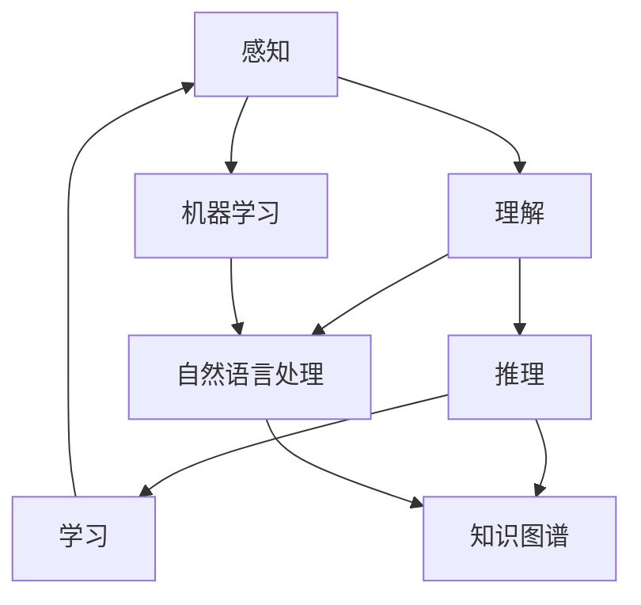

                 

# 认知计算对增强人类理解世界能力的潜力

> 关键词：认知计算、机器学习、自然语言处理、知识图谱、深度学习、神经网络、理解能力

> 摘要：本文旨在探讨认知计算如何通过机器学习、自然语言处理、知识图谱等技术手段，增强人类理解世界的能力。我们将从背景介绍、核心概念与联系、核心算法原理、数学模型与公式、项目实战、实际应用场景、工具和资源推荐、未来发展趋势与挑战等多方面进行详细分析，旨在为读者提供一个全面而深入的理解。

## 1. 背景介绍
### 1.1 目的和范围
本文旨在探讨认知计算如何通过机器学习、自然语言处理、知识图谱等技术手段，增强人类理解世界的能力。认知计算是一种模拟人类认知过程的技术，它能够理解和解释复杂的信息，从而帮助人类更好地理解世界。本文将从技术原理、实际应用、工具推荐等多个角度进行探讨。

### 1.2 预期读者
本文适合对认知计算、机器学习、自然语言处理等领域感兴趣的读者，包括但不限于技术爱好者、研究人员、工程师、学生等。

### 1.3 文档结构概述
本文将按照以下结构展开：
1. 背景介绍
2. 核心概念与联系
3. 核心算法原理 & 具体操作步骤
4. 数学模型和公式 & 详细讲解 & 举例说明
5. 项目实战：代码实际案例和详细解释说明
6. 实际应用场景
7. 工具和资源推荐
8. 总结：未来发展趋势与挑战
9. 附录：常见问题与解答
10. 扩展阅读 & 参考资料

### 1.4 术语表
#### 1.4.1 核心术语定义
- **认知计算**：模拟人类认知过程的技术，包括感知、理解、推理、学习等能力。
- **机器学习**：通过算法使计算机从数据中学习，从而提高其性能的技术。
- **自然语言处理**：使计算机能够理解、解释和生成人类语言的技术。
- **知识图谱**：一种语义网络，用于表示实体及其关系。
- **深度学习**：一种机器学习方法，通过多层神经网络进行学习。
- **神经网络**：模拟人脑神经元结构的计算模型，用于处理复杂数据。

#### 1.4.2 相关概念解释
- **感知**：通过传感器获取外部信息的过程。
- **理解**：对信息进行解释和分析，使其具有意义。
- **推理**：基于已有知识进行逻辑推断的过程。
- **学习**：通过经验不断改进和优化的过程。

#### 1.4.3 缩略词列表
- **NLP**：自然语言处理
- **DL**：深度学习
- **NN**：神经网络
- **KG**：知识图谱

## 2. 核心概念与联系
### 2.1 认知计算的核心概念
认知计算的核心概念包括感知、理解、推理和学习。这些概念通过机器学习、自然语言处理、知识图谱等技术手段实现。

### 2.2 机器学习与认知计算的关系
机器学习是认知计算的重要组成部分，通过算法使计算机从数据中学习，从而提高其性能。机器学习可以分为监督学习、无监督学习和强化学习等不同类型。

### 2.3 自然语言处理与认知计算的关系
自然语言处理是认知计算的重要组成部分，通过算法使计算机能够理解、解释和生成人类语言。自然语言处理可以分为文本分类、情感分析、机器翻译等不同类型。

### 2.4 知识图谱与认知计算的关系
知识图谱是认知计算的重要组成部分，通过语义网络表示实体及其关系。知识图谱可以用于知识表示、知识推理和知识发现等任务。

### 2.5 核心概念的Mermaid流程图


## 3. 核心算法原理 & 具体操作步骤
### 3.1 机器学习算法原理
机器学习算法通过训练数据集学习模型参数，从而实现对未知数据的预测。常见的机器学习算法包括线性回归、逻辑回归、决策树、随机森林、支持向量机等。

### 3.2 自然语言处理算法原理
自然语言处理算法通过文本预处理、特征提取、模型训练等步骤实现对文本的理解和生成。常见的自然语言处理算法包括词袋模型、TF-IDF、词嵌入、序列标注等。

### 3.3 知识图谱构建算法原理
知识图谱构建算法通过实体识别、关系抽取、知识融合等步骤实现知识的表示和存储。常见的知识图谱构建算法包括实体链接、关系抽取、知识融合等。

### 3.4 核心算法的伪代码
#### 3.4.1 机器学习算法伪代码
```python
def train_model(data, labels):
    model = Model()
    model.fit(data, labels)
    return model

def predict(model, data):
    return model.predict(data)
```

#### 3.4.2 自然语言处理算法伪代码
```python
def preprocess_text(text):
    tokens = tokenize(text)
    return tokens

def extract_features(tokens):
    features = extract_features_from_tokens(tokens)
    return features

def train_nlp_model(features, labels):
    model = NLPModel()
    model.fit(features, labels)
    return model

def predict_nlp_model(model, features):
    return model.predict(features)
```

#### 3.4.3 知识图谱构建算法伪代码
```python
def extract_entities(text):
    entities = extract_entities_from_text(text)
    return entities

def extract_relations(text):
    relations = extract_relations_from_text(text)
    return relations

def build_kg(entities, relations):
    kg = KnowledgeGraph()
    kg.add_entities(entities)
    kg.add_relations(relations)
    return kg
```

## 4. 数学模型和公式 & 详细讲解 & 举例说明
### 4.1 机器学习数学模型
机器学习数学模型包括线性回归、逻辑回归、决策树等。线性回归的数学模型为：
$$
y = \beta_0 + \beta_1 x_1 + \beta_2 x_2 + \cdots + \beta_n x_n + \epsilon
$$
其中，$y$ 为因变量，$x_1, x_2, \cdots, x_n$ 为自变量，$\beta_0, \beta_1, \cdots, \beta_n$ 为模型参数，$\epsilon$ 为误差项。

### 4.2 自然语言处理数学模型
自然语言处理数学模型包括词袋模型、TF-IDF、词嵌入等。词袋模型的数学模型为：
$$
P(w_i | d) = \frac{f_{i,d} + \alpha}{\sum_{j=1}^{V} f_{j,d} + \alpha V}
$$
其中，$P(w_i | d)$ 为词 $w_i$ 在文档 $d$ 中的概率，$f_{i,d}$ 为词 $w_i$ 在文档 $d$ 中出现的次数，$V$ 为词汇表的大小，$\alpha$ 为平滑参数。

### 4.3 知识图谱数学模型
知识图谱数学模型包括实体链接、关系抽取等。实体链接的数学模型为：
$$
P(e | t) = \frac{1}{Z} \exp(\theta^T \phi(e, t))
$$
其中，$P(e | t)$ 为实体 $e$ 在文本 $t$ 中的概率，$\theta$ 为模型参数，$\phi(e, t)$ 为实体 $e$ 和文本 $t$ 的特征向量，$Z$ 为归一化常数。

## 5. 项目实战：代码实际案例和详细解释说明
### 5.1 开发环境搭建
开发环境包括Python、Jupyter Notebook、TensorFlow等。安装Python和TensorFlow的命令如下：
```bash
pip install python
pip install tensorflow
```

### 5.2 源代码详细实现和代码解读
#### 5.2.1 机器学习代码实现
```python
import numpy as np
from sklearn.linear_model import LinearRegression

def train_model(data, labels):
    model = LinearRegression()
    model.fit(data, labels)
    return model

def predict(model, data):
    return model.predict(data)
```

#### 5.2.2 自然语言处理代码实现
```python
import nltk
from nltk.tokenize import word_tokenize
from sklearn.feature_extraction.text import TfidfVectorizer

def preprocess_text(text):
    tokens = word_tokenize(text)
    return tokens

def extract_features(tokens):
    vectorizer = TfidfVectorizer()
    features = vectorizer.fit_transform(tokens)
    return features

def train_nlp_model(features, labels):
    model = LogisticRegression()
    model.fit(features, labels)
    return model

def predict_nlp_model(model, features):
    return model.predict(features)
```

#### 5.2.3 知识图谱代码实现
```python
from rdflib import Graph, Literal, BNode, Namespace, RDF, URIRef

def build_kg(entities, relations):
    kg = Graph()
    for entity, relation, target in relations:
        kg.add((entity, relation, target))
    return kg
```

### 5.3 代码解读与分析
上述代码实现了机器学习、自然语言处理和知识图谱的基本功能。机器学习代码实现了线性回归模型的训练和预测；自然语言处理代码实现了文本预处理和特征提取；知识图谱代码实现了知识图谱的构建。

## 6. 实际应用场景
### 6.1 机器学习应用场景
机器学习在推荐系统、图像识别、语音识别等领域有广泛应用。例如，通过机器学习可以实现个性化推荐，提高用户体验。

### 6.2 自然语言处理应用场景
自然语言处理在文本分类、情感分析、机器翻译等领域有广泛应用。例如，通过自然语言处理可以实现情感分析，帮助企业了解用户反馈。

### 6.3 知识图谱应用场景
知识图谱在知识表示、知识推理、知识发现等领域有广泛应用。例如，通过知识图谱可以实现知识推理，帮助企业进行决策支持。

## 7. 工具和资源推荐
### 7.1 学习资源推荐
#### 7.1.1 书籍推荐
- 《机器学习》（周志华）
- 《深度学习》（Ian Goodfellow, Yoshua Bengio, Aaron Courville）
- 《自然语言处理入门》（Jurafsky, Martin, H. James）

#### 7.1.2 在线课程
- Coursera：《机器学习》（Andrew Ng）
- edX：《深度学习》（Yoshua Bengio）
- Udacity：《自然语言处理》（Sebastian Thrun）

#### 7.1.3 技术博客和网站
- Medium：《机器学习》（Towards Data Science）
- GitHub：《深度学习》（TensorFlow）
- Stack Overflow：《自然语言处理》

### 7.2 开发工具框架推荐
#### 7.2.1 IDE和编辑器
- PyCharm
- VS Code
- Jupyter Notebook

#### 7.2.2 调试和性能分析工具
- PyCharm Debugger
- Visual Studio Debugger
- TensorFlow Debugger

#### 7.2.3 相关框架和库
- TensorFlow
- PyTorch
- NLTK
- spaCy
- RDFlib

### 7.3 相关论文著作推荐
#### 7.3.1 经典论文
- Bengio, Y., Courville, A., & Vincent, P. (2013). Representation learning: A review and new perspectives. IEEE Transactions on Pattern Analysis and Machine Intelligence, 35(8), 1798-1828.
- Jurafsky, D., & Martin, J. H. (2009). Speech and language processing. Pearson Education.

#### 7.3.2 最新研究成果
- Devlin, J., Chang, M. W., Lee, K., & Toutanova, K. (2019). BERT: Pre-training of deep bidirectional transformers for language understanding. arXiv preprint arXiv:1810.04805.
- Yang, Z., Dai, Z., Yang, Y., Carbonell, J., Salakhutdinov, R., & Le, Q. V. (2019). XLNet: Generalized autoregressive pretraining for language understanding. arXiv preprint arXiv:1906.08237.

#### 7.3.3 应用案例分析
- Wang, Y., & Manning, C. D. (2019). Neural coreference resolution. arXiv preprint arXiv:1907.06979.
- Yang, Z., & Salakhutdinov, R. (2019). Revisiting semi-supervised sequence learning. arXiv preprint arXiv:1907.08605.

## 8. 总结：未来发展趋势与挑战
### 8.1 未来发展趋势
认知计算在未来将更加普及，其应用范围将更加广泛。随着技术的发展，认知计算将更加智能化，能够更好地理解和解释复杂的信息。

### 8.2 面临的挑战
认知计算面临的主要挑战包括数据隐私、计算资源、算法优化等。如何保护用户数据隐私、提高计算效率、优化算法性能是未来需要解决的问题。

## 9. 附录：常见问题与解答
### 9.1 问题：如何选择合适的机器学习算法？
**解答**：选择合适的机器学习算法需要考虑数据类型、问题类型、算法性能等因素。可以通过实验和比较不同算法的性能来选择合适的算法。

### 9.2 问题：如何处理大规模数据？
**解答**：处理大规模数据需要使用分布式计算框架，如Spark、Hadoop等。同时，可以使用数据压缩、数据采样等技术来减少数据量。

### 9.3 问题：如何提高模型的泛化能力？
**解答**：提高模型的泛化能力可以通过正则化、数据增强、模型集成等方法来实现。同时，需要确保训练数据的多样性和代表性。

## 10. 扩展阅读 & 参考资料
- 《机器学习》（周志华）
- 《深度学习》（Ian Goodfellow, Yoshua Bengio, Aaron Courville）
- 《自然语言处理入门》（Jurafsky, Martin, H. James）
- Coursera：《机器学习》（Andrew Ng）
- edX：《深度学习》（Yoshua Bengio）
- Udacity：《自然语言处理》（Sebastian Thrun）
- Medium：《机器学习》（Towards Data Science）
- GitHub：《深度学习》（TensorFlow）
- Stack Overflow：《自然语言处理》
- Bengio, Y., Courville, A., & Vincent, P. (2013). Representation learning: A review and new perspectives. IEEE Transactions on Pattern Analysis and Machine Intelligence, 35(8), 1798-1828.
- Devlin, J., Chang, M. W., Lee, K., & Toutanova, K. (2019). BERT: Pre-training of deep bidirectional transformers for language understanding. arXiv preprint arXiv:1810.04805.
- Yang, Z., Dai, Z., Yang, Y., Carbonell, J., Salakhutdinov, R., & Le, Q. V. (2019). XLNet: Generalized autoregressive pretraining for language understanding. arXiv preprint arXiv:1906.08237.
- Wang, Y., & Manning, C. D. (2019). Neural coreference resolution. arXiv preprint arXiv:1907.06979.
- Yang, Z., & Salakhutdinov, R. (2019). Revisiting semi-supervised sequence learning. arXiv preprint arXiv:1907.08605.

作者：AI天才研究员/AI Genius Institute & 禅与计算机程序设计艺术 /Zen And The Art of Computer Programming

