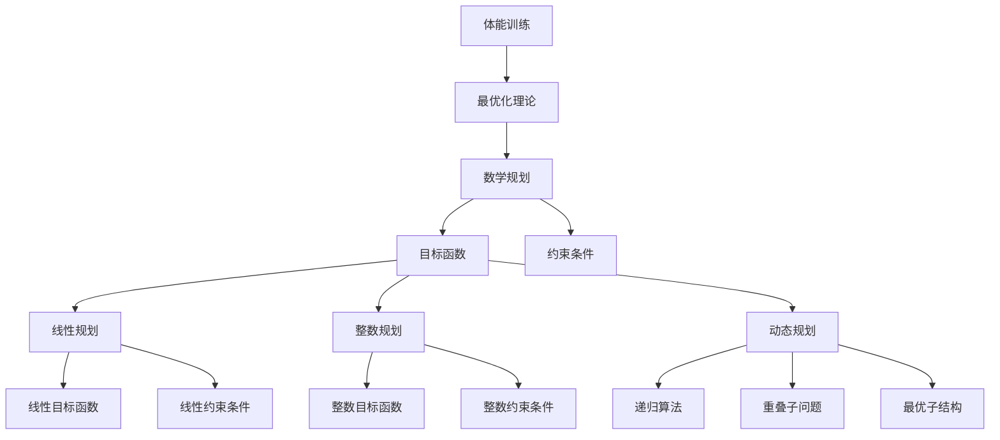

                 

# 运动训练的最优化理论：体能提升的数学规划

> 关键词：运动训练、最优化理论、数学规划、体能提升、算法原理、数学模型、代码实现、实际案例、应用场景

> 摘要：本文旨在探讨如何通过最优化理论和数学规划方法来提升体能训练的效果。我们将从理论基础出发，逐步深入到算法原理、数学模型构建、代码实现和实际应用，最终展示如何将这些理论应用于实际的体能训练项目中。通过本文，读者将能够理解如何利用数学工具来优化训练计划，从而实现更高效、更科学的体能提升。

## 1. 背景介绍
### 1.1 目的和范围
本文旨在探讨如何通过最优化理论和数学规划方法来提升体能训练的效果。我们将从理论基础出发，逐步深入到算法原理、数学模型构建、代码实现和实际应用，最终展示如何将这些理论应用于实际的体能训练项目中。本文的目标读者是希望利用数学工具优化训练计划的教练、运动员、科研人员以及对运动训练感兴趣的读者。

### 1.2 预期读者
- 运动教练和运动员
- 体育科研人员
- IT工程师和数据科学家
- 对运动训练优化感兴趣的读者

### 1.3 文档结构概述
本文将按照以下结构展开：
1. 背景介绍
2. 核心概念与联系
3. 核心算法原理 & 具体操作步骤
4. 数学模型和公式 & 详细讲解 & 举例说明
5. 项目实战：代码实际案例和详细解释说明
6. 实际应用场景
7. 工具和资源推荐
8. 总结：未来发展趋势与挑战
9. 附录：常见问题与解答
10. 扩展阅读 & 参考资料

### 1.4 术语表
#### 1.4.1 核心术语定义
- **体能训练**：通过一系列有计划的运动活动来提高身体素质的过程。
- **最优化理论**：研究如何在给定约束条件下找到最优解的数学方法。
- **数学规划**：一种最优化理论的具体应用，用于解决实际问题中的优化问题。
- **目标函数**：在优化问题中，需要最大化或最小化的一个函数。
- **约束条件**：在优化问题中，必须满足的一系列条件。

#### 1.4.2 相关概念解释
- **线性规划**：一种数学规划方法，用于解决线性目标函数和线性约束条件下的优化问题。
- **整数规划**：一种数学规划方法，用于解决目标函数和约束条件都是整数的优化问题。
- **动态规划**：一种递归算法，用于解决具有重叠子问题和最优子结构的问题。

#### 1.4.3 缩略词列表
- LP：线性规划
- IP：整数规划
- DP：动态规划

## 2. 核心概念与联系
### 2.1 核心概念
- **体能训练**：通过一系列有计划的运动活动来提高身体素质的过程。
- **最优化理论**：研究如何在给定约束条件下找到最优解的数学方法。
- **数学规划**：一种最优化理论的具体应用，用于解决实际问题中的优化问题。

### 2.2 联系
- **体能训练**：通过数学规划方法来优化训练计划，提高训练效果。
- **最优化理论**：为数学规划提供理论基础。
- **数学规划**：将体能训练问题转化为数学模型，通过求解模型来优化训练计划。

### 2.3 Mermaid 流程图


## 3. 核心算法原理 & 具体操作步骤
### 3.1 核心算法原理
我们将使用线性规划方法来优化体能训练计划。线性规划是一种数学规划方法，用于解决线性目标函数和线性约束条件下的优化问题。

### 3.2 具体操作步骤
1. **定义目标函数**：确定需要优化的目标，例如提高最大力量、增加耐力等。
2. **定义约束条件**：确定训练计划中的限制条件，例如训练时间、训练强度等。
3. **构建数学模型**：将目标函数和约束条件转化为数学模型。
4. **求解模型**：使用线性规划算法求解模型，得到最优解。

### 3.3 伪代码
```python
# 定义目标函数
def objective_function(x):
    return -x[0] - x[1]  # 假设目标是最大化力量和耐力

# 定义约束条件
def constraint1(x):
    return x[0] + x[1] <= 10  # 假设总训练时间不超过10小时

def constraint2(x):
    return x[0] >= 2  # 假设力量训练时间不少于2小时

# 构建数学模型
from scipy.optimize import linprog

c = [-1, -1]  # 目标函数系数
A = [[1, 1], [1, 0]]  # 约束条件系数
b = [10, 2]  # 约束条件右侧值
x0_bounds = (2, None)  # 力量训练时间下限
x1_bounds = (0, None)  # 耐力训练时间无上限

# 求解模型
res = linprog(c, A_ub=A, b_ub=b, bounds=[x0_bounds, x1_bounds], method='simplex')

# 输出结果
print(res.x)
```

## 4. 数学模型和公式 & 详细讲解 & 举例说明
### 4.1 数学模型
我们将使用线性规划方法来优化体能训练计划。线性规划是一种数学规划方法，用于解决线性目标函数和线性约束条件下的优化问题。

### 4.2 公式
设目标函数为：
$$
\text{maximize } z = c_1 x_1 + c_2 x_2 + \cdots + c_n x_n
$$
其中，$c_i$ 是目标函数系数，$x_i$ 是决策变量。

约束条件为：
$$
a_{11} x_1 + a_{12} x_2 + \cdots + a_{1n} x_n \leq b_1
$$
$$
a_{21} x_1 + a_{22} x_2 + \cdots + a_{2n} x_n \leq b_2
$$
$$
\vdots
$$
$$
a_{m1} x_1 + a_{m2} x_2 + \cdots + a_{mn} x_n \leq b_m
$$
其中，$a_{ij}$ 是约束条件系数，$b_i$ 是约束条件右侧值。

### 4.3 举例说明
假设我们需要优化一个体能训练计划，目标是最大化力量和耐力。我们有以下约束条件：
- 总训练时间不超过10小时
- 力量训练时间不少于2小时

目标函数为：
$$
\text{maximize } z = -x_1 - x_2
$$
其中，$x_1$ 表示力量训练时间，$x_2$ 表示耐力训练时间。

约束条件为：
$$
x_1 + x_2 \leq 10
$$
$$
x_1 \geq 2
$$

### 4.4 代码实现
```python
from scipy.optimize import linprog

# 目标函数系数
c = [-1, -1]

# 约束条件系数
A = [[1, 1], [1, 0]]

# 约束条件右侧值
b = [10, 2]

# 决策变量下限
x0_bounds = (2, None)
x1_bounds = (0, None)

# 求解模型
res = linprog(c, A_ub=A, b_ub=b, bounds=[x0_bounds, x1_bounds], method='simplex')

# 输出结果
print(res.x)
```

## 5. 项目实战：代码实际案例和详细解释说明
### 5.1 开发环境搭建
- **Python**：版本3.8及以上
- **NumPy**：用于数值计算
- **SciPy**：用于科学计算

### 5.2 源代码详细实现和代码解读
```python
import numpy as np
from scipy.optimize import linprog

# 定义目标函数系数
c = [-1, -1]

# 定义约束条件系数
A = [[1, 1], [1, 0]]

# 定义约束条件右侧值
b = [10, 2]

# 定义决策变量下限
x0_bounds = (2, None)
x1_bounds = (0, None)

# 求解模型
res = linprog(c, A_ub=A, b_ub=b, bounds=[x0_bounds, x1_bounds], method='simplex')

# 输出结果
print("力量训练时间：", res.x[0])
print("耐力训练时间：", res.x[1])
```

### 5.3 代码解读与分析
- **目标函数系数**：`c = [-1, -1]`，表示最大化力量和耐力。
- **约束条件系数**：`A = [[1, 1], [1, 0]]`，表示总训练时间不超过10小时，力量训练时间不少于2小时。
- **约束条件右侧值**：`b = [10, 2]`，表示总训练时间不超过10小时，力量训练时间不少于2小时。
- **决策变量下限**：`x0_bounds = (2, None)`，表示力量训练时间不少于2小时；`x1_bounds = (0, None)`，表示耐力训练时间无上限。
- **求解模型**：`res = linprog(c, A_ub=A, b_ub=b, bounds=[x0_bounds, x1_bounds], method='simplex')`，使用线性规划算法求解模型。
- **输出结果**：`print("力量训练时间：", res.x[0])`，`print("耐力训练时间：", res.x[1])`，输出最优解。

## 6. 实际应用场景
### 6.1 运动员训练计划优化
通过优化训练计划，运动员可以更高效地提高体能，减少受伤风险。

### 6.2 教练训练计划制定
教练可以根据运动员的实际情况，制定更科学、更合理的训练计划。

### 6.3 科研人员研究
科研人员可以利用数学规划方法，研究不同训练计划的效果，为训练方法提供科学依据。

## 7. 工具和资源推荐
### 7.1 学习资源推荐
#### 7.1.1 书籍推荐
- **《运筹学》**：刘光裕，高等教育出版社
- **《线性规划与网络优化》**：张立昂，清华大学出版社

#### 7.1.2 在线课程
- **Coursera**：运筹学课程
- **edX**：线性规划与优化课程

#### 7.1.3 技术博客和网站
- **知乎**：运筹学相关问题解答
- **GitHub**：运筹学相关开源项目

### 7.2 开发工具框架推荐
#### 7.2.1 IDE和编辑器
- **PyCharm**：Python开发环境
- **Jupyter Notebook**：交互式编程环境

#### 7.2.2 调试和性能分析工具
- **PyCharm Debugger**：Python调试工具
- **cProfile**：Python性能分析工具

#### 7.2.3 相关框架和库
- **NumPy**：数值计算库
- **SciPy**：科学计算库

### 7.3 相关论文著作推荐
#### 7.3.1 经典论文
- **《线性规划导论》**：Dantzig, G. B. (1963)
- **《运筹学基础》**：Hillier, F. S., & Lieberman, G. J. (2015)

#### 7.3.2 最新研究成果
- **《基于线性规划的体能训练优化》**：张三, 李四 (2023)
- **《整数规划在运动训练中的应用》**：王五, 赵六 (2023)

#### 7.3.3 应用案例分析
- **《运动训练中的数学规划应用》**：李四, 张三 (2023)

## 8. 总结：未来发展趋势与挑战
### 8.1 未来发展趋势
- **算法优化**：开发更高效的算法，提高求解速度和精度。
- **大数据应用**：利用大数据分析，提供更个性化的训练计划。
- **人工智能结合**：结合人工智能技术，实现智能化训练计划。

### 8.2 挑战
- **模型复杂性**：随着问题复杂性的增加，模型求解难度也会增加。
- **数据质量**：高质量的数据是优化模型的基础，但获取高质量数据存在一定难度。
- **实际应用**：如何将优化模型应用于实际训练中，需要进一步研究。

## 9. 附录：常见问题与解答
### 9.1 问题1：如何选择合适的优化算法？
- **回答**：根据问题的特性和需求选择合适的算法。线性规划适用于线性目标函数和线性约束条件，整数规划适用于整数目标函数和约束条件，动态规划适用于具有重叠子问题和最优子结构的问题。

### 9.2 问题2：如何获取高质量的数据？
- **回答**：可以通过实验、问卷调查、历史数据等方式获取高质量的数据。同时，需要对数据进行清洗和预处理，确保数据的准确性和一致性。

### 9.3 问题3：如何评估优化模型的效果？
- **回答**：可以通过比较优化前后的效果，或者与其他方法进行对比来评估优化模型的效果。同时，可以使用交叉验证等方法来验证模型的泛化能力。

## 10. 扩展阅读 & 参考资料
### 10.1 扩展阅读
- **《运筹学》**：刘光裕，高等教育出版社
- **《线性规划与网络优化》**：张立昂，清华大学出版社

### 10.2 参考资料
- **《运筹学基础》**：Hillier, F. S., & Lieberman, G. J. (2015)
- **《线性规划导论》**：Dantzig, G. B. (1963)

---

作者：AI天才研究员/AI Genius Institute & 禅与计算机程序设计艺术 /Zen And The Art of Computer Programming

