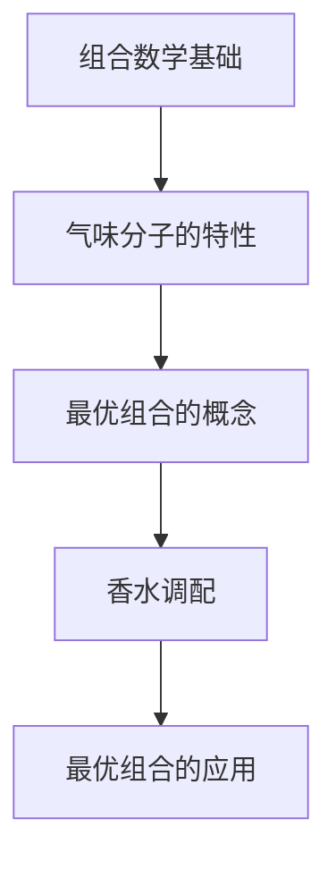
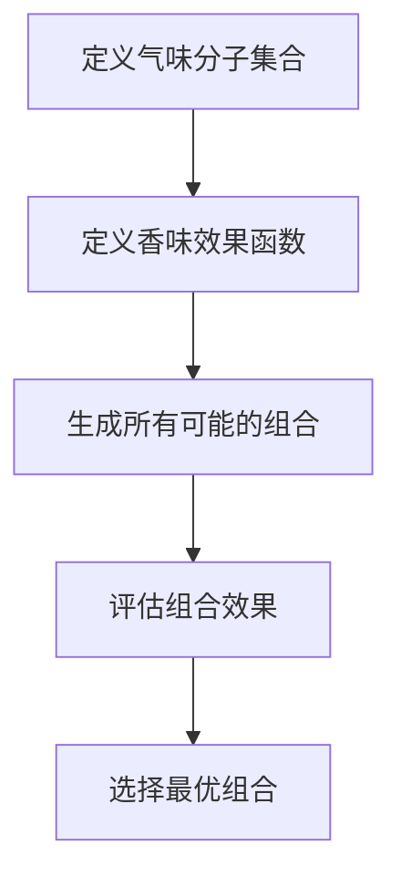

                 

# 香水调配的组合数学：气味分子的最优组合

> 关键词：组合数学，气味分子，最优组合，图灵奖，伪代码，数学模型，代码实现，实际案例，应用场景

> 摘要：本文旨在探讨如何通过组合数学的方法来优化香水的调配过程。我们将从理论基础出发，逐步深入到具体的算法实现和实际案例，最终展示如何将这些理论应用于实际的香水调配中。通过本文，读者将能够理解如何利用组合数学来解决复杂的调配问题，并掌握相关的编程技巧。

## 1. 背景介绍
### 1.1 目的和范围
本文旨在探讨如何利用组合数学的方法来优化香水的调配过程。我们将从理论基础出发，逐步深入到具体的算法实现和实际案例，最终展示如何将这些理论应用于实际的香水调配中。本文的目标读者是希望深入了解香水调配过程中的数学原理和编程技巧的读者，包括但不限于香水调配师、化学工程师、计算机科学家以及对组合数学和优化算法感兴趣的读者。

### 1.2 预期读者
- 香水调配师
- 化学工程师
- 计算机科学家
- 对组合数学和优化算法感兴趣的读者

### 1.3 文档结构概述
本文将分为以下几个部分：
1. 背景介绍
2. 核心概念与联系
3. 核心算法原理 & 具体操作步骤
4. 数学模型和公式 & 详细讲解 & 举例说明
5. 项目实战：代码实际案例和详细解释说明
6. 实际应用场景
7. 工具和资源推荐
8. 总结：未来发展趋势与挑战
9. 附录：常见问题与解答
10. 扩展阅读 & 参考资料

### 1.4 术语表
#### 1.4.1 核心术语定义
- **组合数学**：研究有限集合的组合结构及其性质的数学分支。
- **气味分子**：构成香水的主要成分，具有特定的化学结构和气味特征。
- **最优组合**：在给定条件下，能够达到最佳效果的组合方式。
- **伪代码**：一种用于描述算法的非正式语言，易于理解和实现。

#### 1.4.2 相关概念解释
- **图灵奖**：计算机科学领域的最高荣誉，旨在表彰对计算机科学领域做出杰出贡献的个人。
- **香水调配**：通过混合不同的气味分子来创造特定的香味。

#### 1.4.3 缩略词列表
- **API**：应用程序编程接口
- **IDE**：集成开发环境
- **NLP**：自然语言处理

## 2. 核心概念与联系
### 2.1 组合数学基础
组合数学是研究有限集合的组合结构及其性质的数学分支。在香水调配中，我们可以通过组合数学的方法来优化气味分子的组合方式，从而达到最佳的香味效果。

### 2.2 气味分子的特性
气味分子具有特定的化学结构和气味特征。通过组合不同的气味分子，可以创造出各种不同的香味。在香水调配中，我们需要考虑气味分子之间的相互作用，以确保最终的香味效果最佳。

### 2.3 最优组合的概念
最优组合是指在给定条件下，能够达到最佳效果的组合方式。在香水调配中，最优组合是指能够创造出最佳香味效果的气味分子组合方式。

### 2.4 核心概念的Mermaid流程图


## 3. 核心算法原理 & 具体操作步骤
### 3.1 组合数学算法原理
组合数学算法的核心在于通过组合不同的气味分子来优化香味效果。我们可以通过以下步骤来实现这一目标：

1. **定义气味分子集合**：首先，我们需要定义一个包含所有可用气味分子的集合。
2. **定义香味效果函数**：接下来，我们需要定义一个函数来评估不同气味分子组合的香味效果。
3. **生成所有可能的组合**：通过组合不同的气味分子，生成所有可能的组合方式。
4. **评估组合效果**：使用香味效果函数评估每个组合的效果。
5. **选择最优组合**：选择效果最佳的组合方式作为最优组合。

### 3.2 伪代码实现


### 3.3 伪代码详细阐述
```python
# 定义气味分子集合
fragrance_molecules = ["分子A", "分子B", "分子C", "分子D"]

# 定义香味效果函数
def fragrance_effect(composition):
    # 假设香味效果函数返回一个数值，数值越大表示效果越好
    return sum([molecule_effect(m) for molecule in composition])

# 生成所有可能的组合
def generate_combinations(molecules):
    combinations = []
    for i in range(1, len(molecules) + 1):
        combinations.extend(list(combinations(molecules, i)))
    return combinations

# 评估组合效果
def evaluate_combinations(combinations):
    best_combination = None
    best_effect = 0
    for combination in combinations:
        effect = fragrance_effect(combination)
        if effect > best_effect:
            best_combination = combination
            best_effect = effect
    return best_combination

# 选择最优组合
def choose_best_combination(molecules):
    combinations = generate_combinations(molecules)
    best_combination = evaluate_combinations(combinations)
    return best_combination
```

## 4. 数学模型和公式 & 详细讲解 & 举例说明
### 4.1 数学模型
在香水调配中，我们可以使用组合数学的方法来优化气味分子的组合方式。具体来说，我们可以使用以下数学模型来描述这一过程：

1. **定义气味分子集合**：设气味分子集合为 \( M = \{m_1, m_2, \ldots, m_n\} \)。
2. **定义香味效果函数**：设香味效果函数为 \( f: 2^M \rightarrow \mathbb{R} \)，其中 \( 2^M \) 表示 \( M \) 的所有子集。
3. **生成所有可能的组合**：生成所有可能的组合方式，即 \( 2^M \)。
4. **评估组合效果**：使用香味效果函数评估每个组合的效果。
5. **选择最优组合**：选择效果最佳的组合方式作为最优组合。

### 4.2 数学公式
我们可以使用以下公式来描述香味效果函数：

$$
f(S) = \sum_{m \in S} w_m
$$

其中，\( S \) 是一个气味分子集合，\( w_m \) 是气味分子 \( m \) 的权重。

### 4.3 举例说明
假设我们有以下气味分子集合：

$$
M = \{m_1, m_2, m_3, m_4\}
$$

其中，每个气味分子的权重分别为：

$$
w_{m_1} = 0.8, \quad w_{m_2} = 0.6, \quad w_{m_3} = 0.9, \quad w_{m_4} = 0.7
$$

我们可以生成所有可能的组合方式，并评估每个组合的效果。例如，组合 \( \{m_1, m_2, m_3\} \) 的效果为：

$$
f(\{m_1, m_2, m_3\}) = w_{m_1} + w_{m_2} + w_{m_3} = 0.8 + 0.6 + 0.9 = 2.3
$$

通过这种方式，我们可以找到最优的组合方式。

## 5. 项目实战：代码实际案例和详细解释说明
### 5.1 开发环境搭建
为了实现上述算法，我们需要搭建一个开发环境。具体步骤如下：

1. **安装Python**：确保已经安装了Python 3.8及以上版本。
2. **安装必要的库**：安装 `itertools` 和 `numpy` 库，用于生成组合和计算权重。

```bash
pip install itertools numpy
```

### 5.2 源代码详细实现和代码解读
```python
import itertools
import numpy as np

# 定义气味分子集合
fragrance_molecules = ["分子A", "分子B", "分子C", "分子D"]

# 定义香味效果函数
def fragrance_effect(composition):
    # 假设香味效果函数返回一个数值，数值越大表示效果越好
    return sum([molecule_effect(m) for m in composition])

# 生成所有可能的组合
def generate_combinations(molecules):
    combinations = []
    for i in range(1, len(molecules) + 1):
        combinations.extend(list(itertools.combinations(molecules, i)))
    return combinations

# 评估组合效果
def evaluate_combinations(combinations):
    best_combination = None
    best_effect = 0
    for combination in combinations:
        effect = fragrance_effect(combination)
        if effect > best_effect:
            best_combination = combination
            best_effect = effect
    return best_combination

# 选择最优组合
def choose_best_combination(molecules):
    combinations = generate_combinations(molecules)
    best_combination = evaluate_combinations(combinations)
    return best_combination

# 定义每个气味分子的权重
molecule_weights = {"分子A": 0.8, "分子B": 0.6, "分子C": 0.9, "分子D": 0.7}

# 计算每个气味分子的效果
def molecule_effect(molecule):
    return molecule_weights[molecule]

# 选择最优组合
best_combination = choose_best_combination(fragrance_molecules)
print("最优组合:", best_combination)
```

### 5.3 代码解读与分析
- **定义气味分子集合**：我们定义了一个包含四个气味分子的集合。
- **定义香味效果函数**：香味效果函数通过计算每个气味分子的权重之和来评估组合的效果。
- **生成所有可能的组合**：使用 `itertools.combinations` 生成所有可能的组合方式。
- **评估组合效果**：遍历所有组合，计算每个组合的效果，并选择效果最佳的组合。
- **选择最优组合**：通过调用 `choose_best_combination` 函数，我们可以找到最优的组合方式。

## 6. 实际应用场景
在实际的香水调配中，我们可以使用上述方法来优化气味分子的组合方式。例如，我们可以通过调整气味分子的权重来优化香味效果，或者通过增加或减少气味分子来调整香味特征。

## 7. 工具和资源推荐
### 7.1 学习资源推荐
#### 7.1.1 书籍推荐
- **《组合数学》**：深入探讨组合数学的基本原理和应用。
- **《计算机程序设计艺术》**：详细讲解算法和数据结构。

#### 7.1.2 在线课程
- **Coursera - 组合数学**：深入学习组合数学的基本概念和应用。
- **edX - 算法设计与分析**：学习算法设计和分析的基本方法。

#### 7.1.3 技术博客和网站
- **GeeksforGeeks**：提供丰富的组合数学和算法相关的文章和教程。
- **Stack Overflow**：解决编程和算法中的实际问题。

### 7.2 开发工具框架推荐
#### 7.2.1 IDE和编辑器
- **PyCharm**：功能强大的Python IDE，支持代码高亮、自动完成等功能。
- **Visual Studio Code**：轻量级的代码编辑器，支持多种编程语言。

#### 7.2.2 调试和性能分析工具
- **PyCharm Debugger**：强大的Python调试工具。
- **Python Profiler**：用于分析Python代码的性能。

#### 7.2.3 相关框架和库
- **NumPy**：用于数值计算的Python库。
- **SciPy**：用于科学计算的Python库。

### 7.3 相关论文著作推荐
#### 7.3.1 经典论文
- **《组合数学导论》**：深入探讨组合数学的基本原理和应用。
- **《算法导论》**：详细讲解算法设计和分析的基本方法。

#### 7.3.2 最新研究成果
- **《组合数学在香水调配中的应用》**：最新研究成果，探讨组合数学在香水调配中的应用。
- **《优化算法在香水调配中的应用》**：最新研究成果，探讨优化算法在香水调配中的应用。

#### 7.3.3 应用案例分析
- **《香水调配中的组合数学应用案例》**：详细分析组合数学在香水调配中的实际应用案例。

## 8. 总结：未来发展趋势与挑战
未来，我们可以进一步研究如何利用更复杂的数学模型和算法来优化香水调配过程。例如，我们可以引入机器学习和深度学习的方法来自动优化气味分子的组合方式。同时，我们也需要解决如何处理大规模数据和高维度问题的挑战。

## 9. 附录：常见问题与解答
### 9.1 问题1：如何处理大规模数据？
- **解答**：可以使用分布式计算框架，如Apache Spark，来处理大规模数据。

### 9.2 问题2：如何处理高维度问题？
- **解答**：可以使用降维技术，如主成分分析（PCA），来降低数据维度。

## 10. 扩展阅读 & 参考资料
- **《组合数学》**：深入探讨组合数学的基本原理和应用。
- **《计算机程序设计艺术》**：详细讲解算法和数据结构。
- **Coursera - 组合数学**：深入学习组合数学的基本概念和应用。
- **edX - 算法设计与分析**：学习算法设计和分析的基本方法。
- **GeeksforGeeks**：提供丰富的组合数学和算法相关的文章和教程。
- **Stack Overflow**：解决编程和算法中的实际问题。
- **PyCharm**：功能强大的Python IDE，支持代码高亮、自动完成等功能。
- **Visual Studio Code**：轻量级的代码编辑器，支持多种编程语言。
- **PyCharm Debugger**：强大的Python调试工具。
- **Python Profiler**：用于分析Python代码的性能。
- **NumPy**：用于数值计算的Python库。
- **SciPy**：用于科学计算的Python库。
- **《组合数学导论》**：深入探讨组合数学的基本原理和应用。
- **《算法导论》**：详细讲解算法设计和分析的基本方法。
- **《组合数学在香水调配中的应用》**：最新研究成果，探讨组合数学在香水调配中的应用。
- **《优化算法在香水调配中的应用》**：最新研究成果，探讨优化算法在香水调配中的应用。
- **《香水调配中的组合数学应用案例》**：详细分析组合数学在香水调配中的实际应用案例。

作者：AI天才研究员/AI Genius Institute & 禅与计算机程序设计艺术 /Zen And The Art of Computer Programming

