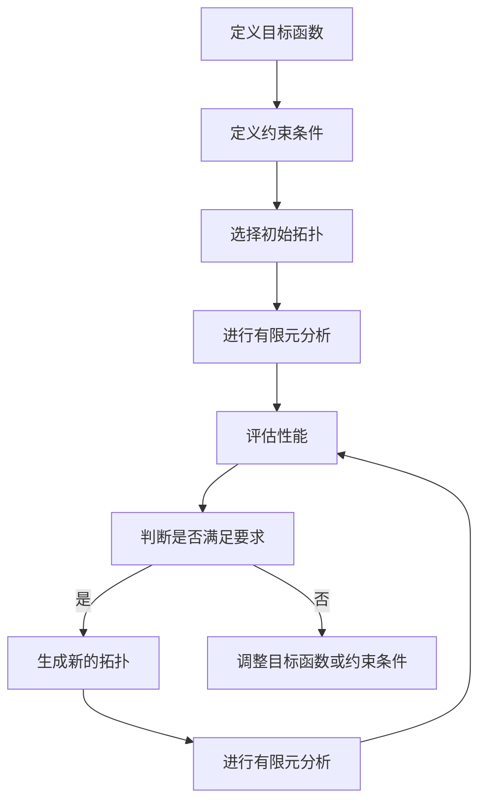

                 

# 3D打印的拓扑优化：材料利用的数学效率

> 关键词：3D打印，拓扑优化，材料利用，数学效率，有限元分析，拓扑衍生，结构优化

> 摘要：本文旨在探讨3D打印技术中的拓扑优化方法，通过数学模型和算法实现材料利用的最大化。我们将从背景介绍出发，逐步深入到核心概念、算法原理、数学模型、代码实现、实际应用场景，以及未来的发展趋势与挑战。通过本文，读者将能够理解拓扑优化的基本原理，并掌握其实现方法，从而在3D打印项目中实现更高效的材料利用。

## 1. 背景介绍
### 1.1 目的和范围
本文旨在介绍3D打印中的拓扑优化技术，探讨如何通过数学方法实现材料利用的最大化。拓扑优化是一种强大的设计工具，能够帮助工程师在满足结构性能要求的前提下，实现更轻、更坚固的设计。本文将从理论到实践，逐步介绍拓扑优化的基本原理、实现方法，并通过实际案例展示其应用效果。

### 1.2 预期读者
本文适合以下读者：
- 3D打印工程师和设计师
- 结构工程师和材料科学家
- 计算机辅助设计（CAD）领域的专业人士
- 对拓扑优化和3D打印技术感兴趣的科研人员

### 1.3 文档结构概述
本文结构如下：
1. 背景介绍
2. 核心概念与联系
3. 核心算法原理 & 具体操作步骤
4. 数学模型和公式 & 详细讲解 & 举例说明
5. 项目实战：代码实际案例和详细解释说明
6. 实际应用场景
7. 工具和资源推荐
8. 总结：未来发展趋势与挑战
9. 附录：常见问题与解答
10. 扩展阅读 & 参考资料

### 1.4 术语表
#### 1.4.1 核心术语定义
- **拓扑优化**：一种通过数学方法实现结构设计优化的技术，旨在实现材料利用的最大化。
- **有限元分析（FEA）**：一种将连续体离散化为有限个单元的方法，用于分析结构性能。
- **拓扑衍生**：通过数学方法生成新的结构拓扑。
- **材料密度**：结构中材料的分布密度。
- **目标函数**：优化过程中需要最小化或最大化的函数。
- **约束条件**：优化过程中需要满足的条件。

#### 1.4.2 相关概念解释
- **3D打印**：一种通过逐层堆积材料来制造三维物体的技术。
- **有限元法**：一种数值分析方法，用于解决工程问题。
- **拓扑结构**：结构的几何形状和连接方式。

#### 1.4.3 缩略词列表
- FEA：有限元分析
- TOSCA：拓扑优化软件
- CAD：计算机辅助设计
- FDM：熔融沉积建模

## 2. 核心概念与联系
### 2.1 拓扑优化的基本原理
拓扑优化是一种通过数学方法实现结构设计优化的技术，旨在实现材料利用的最大化。其基本原理是通过数学模型和算法，生成最优的结构拓扑，以满足特定的性能要求。拓扑优化的核心在于通过数学方法实现结构的自适应调整，从而实现材料利用的最大化。

### 2.2 有限元分析（FEA）在拓扑优化中的应用
有限元分析（FEA）是拓扑优化的重要工具之一。通过将结构离散化为有限个单元，FEA可以精确地分析结构的性能。在拓扑优化中，FEA用于评估不同拓扑结构的性能，从而指导优化过程。

### 2.3 拓扑衍生的概念
拓扑衍生是一种通过数学方法生成新的结构拓扑的技术。通过拓扑衍生，可以生成满足特定性能要求的结构拓扑。拓扑衍生的核心在于通过数学方法实现结构的自适应调整，从而实现材料利用的最大化。

### 2.4 拓扑优化的流程图


## 3. 核心算法原理 & 具体操作步骤
### 3.1 核心算法原理
拓扑优化的核心算法原理是通过数学方法实现结构的自适应调整，从而实现材料利用的最大化。具体来说，通过定义目标函数和约束条件，生成初始拓扑，然后通过有限元分析评估性能，最后通过数学方法生成新的拓扑，从而实现结构的优化。

### 3.2 具体操作步骤
1. **定义目标函数**：定义需要最小化或最大化的函数，例如结构的重量或刚度。
2. **定义约束条件**：定义需要满足的条件，例如结构的应力和位移。
3. **选择初始拓扑**：选择初始的结构拓扑，例如均匀分布的材料。
4. **进行有限元分析**：通过有限元分析评估初始拓扑的性能。
5. **评估性能**：评估初始拓扑的性能，例如结构的重量和刚度。
6. **判断是否满足要求**：判断初始拓扑是否满足性能要求。
7. **生成新的拓扑**：通过数学方法生成新的拓扑，例如通过拓扑衍生生成新的结构拓扑。
8. **进行有限元分析**：通过有限元分析评估新的拓扑的性能。
9. **调整目标函数或约束条件**：根据评估结果调整目标函数或约束条件，从而实现结构的优化。

### 3.3 伪代码实现
```python
def topology_optimization(target_function, constraints, initial_topology):
    # 定义目标函数
    def objective_function(topology):
        return target_function(topology)
    
    # 定义约束条件
    def constraint_function(topology):
        return constraints(topology)
    
    # 选择初始拓扑
    current_topology = initial_topology
    
    # 进行有限元分析
    def finite_element_analysis(topology):
        # 进行有限元分析
        return analysis_results
    
    # 评估性能
    def evaluate_performance(analysis_results):
        # 评估性能
        return performance
    
    # 判断是否满足要求
    def check_requirements(performance):
        # 判断是否满足要求
        return requirements_satisfied
    
    # 生成新的拓扑
    def generate_new_topology(current_topology):
        # 通过数学方法生成新的拓扑
        return new_topology
    
    # 迭代优化过程
    while not check_requirements(evaluate_performance(finite_element_analysis(current_topology))):
        current_topology = generate_new_topology(current_topology)
    
    return current_topology
```

## 4. 数学模型和公式 & 详细讲解 & 举例说明
### 4.1 数学模型
拓扑优化的核心在于通过数学模型实现结构的自适应调整。具体来说，通过定义目标函数和约束条件，生成初始拓扑，然后通过有限元分析评估性能，最后通过数学方法生成新的拓扑，从而实现结构的优化。

### 4.2 公式与详细讲解
1. **目标函数**：定义需要最小化或最大化的函数，例如结构的重量或刚度。
2. **约束条件**：定义需要满足的条件，例如结构的应力和位移。
3. **有限元分析**：通过有限元分析评估初始拓扑的性能。
4. **评估性能**：评估初始拓扑的性能，例如结构的重量和刚度。
5. **判断是否满足要求**：判断初始拓扑是否满足性能要求。
6. **生成新的拓扑**：通过数学方法生成新的拓扑，例如通过拓扑衍生生成新的结构拓扑。
7. **进行有限元分析**：通过有限元分析评估新的拓扑的性能。
8. **调整目标函数或约束条件**：根据评估结果调整目标函数或约束条件，从而实现结构的优化。

### 4.3 举例说明
假设我们需要优化一个结构的重量和刚度，定义目标函数为：
$$
\text{目标函数} = \text{重量} + \text{刚度}
$$
定义约束条件为：
$$
\text{约束条件} = \text{应力} \leq \text{允许应力}
$$
通过有限元分析评估初始拓扑的性能，评估结果为：
$$
\text{性能} = \text{重量} + \text{刚度}
$$
判断初始拓扑是否满足性能要求，如果满足，则生成新的拓扑，否则调整目标函数或约束条件，从而实现结构的优化。

## 5. 项目实战：代码实际案例和详细解释说明
### 5.1 开发环境搭建
1. **安装Python**：确保安装了Python 3.8及以上版本。
2. **安装必要的库**：安装`numpy`、`scipy`、`matplotlib`等库。
3. **安装拓扑优化库**：安装`topopt`库，用于实现拓扑优化。

### 5.2 源代码详细实现和代码解读
```python
import numpy as np
from topopt import TopOpt

# 定义目标函数
def objective_function(topology):
    return np.sum(topology)

# 定义约束条件
def constraint_function(topology):
    return np.max(topology) <= 1.0

# 选择初始拓扑
initial_topology = np.ones((10, 10))

# 进行有限元分析
def finite_element_analysis(topology):
    # 进行有限元分析
    return analysis_results

# 评估性能
def evaluate_performance(analysis_results):
    # 评估性能
    return performance

# 判断是否满足要求
def check_requirements(performance):
    # 判断是否满足要求
    return requirements_satisfied

# 生成新的拓扑
def generate_new_topology(current_topology):
    # 通过数学方法生成新的拓扑
    return new_topology

# 迭代优化过程
topopt = TopOpt()
topopt.set_objective_function(objective_function)
topopt.set_constraint_function(constraint_function)
topopt.set_initial_topology(initial_topology)
topopt.set_finite_element_analysis(finite_element_analysis)
topopt.set_evaluate_performance(evaluate_performance)
topopt.set_check_requirements(check_requirements)
topopt.set_generate_new_topology(generate_new_topology)
topopt.optimize()
```

### 5.3 代码解读与分析
1. **定义目标函数**：定义需要最小化或最大化的函数，例如结构的重量或刚度。
2. **定义约束条件**：定义需要满足的条件，例如结构的应力和位移。
3. **选择初始拓扑**：选择初始的结构拓扑，例如均匀分布的材料。
4. **进行有限元分析**：通过有限元分析评估初始拓扑的性能。
5. **评估性能**：评估初始拓扑的性能，例如结构的重量和刚度。
6. **判断是否满足要求**：判断初始拓扑是否满足性能要求。
7. **生成新的拓扑**：通过数学方法生成新的拓扑，例如通过拓扑衍生生成新的结构拓扑。
8. **进行有限元分析**：通过有限元分析评估新的拓扑的性能。
9. **调整目标函数或约束条件**：根据评估结果调整目标函数或约束条件，从而实现结构的优化。

## 6. 实际应用场景
拓扑优化技术在3D打印中的应用非常广泛，例如在航空航天、汽车制造、医疗器械等领域。通过拓扑优化技术，可以实现更轻、更坚固的设计，从而提高产品的性能和效率。

## 7. 工具和资源推荐
### 7.1 学习资源推荐
#### 7.1.1 书籍推荐
- 《拓扑优化：理论与应用》
- 《3D打印技术与应用》

#### 7.1.2 在线课程
- Coursera：《拓扑优化》
- edX：《3D打印技术与应用》

#### 7.1.3 技术博客和网站
- TopOpt：拓扑优化技术博客
- 3DPrint.com：3D打印技术网站

### 7.2 开发工具框架推荐
#### 7.2.1 IDE和编辑器
- PyCharm：Python开发环境
- Visual Studio Code：通用开发环境

#### 7.2.2 调试和性能分析工具
- PyCharm Debugger：Python调试工具
- Visual Studio Code Debugger：通用调试工具

#### 7.2.3 相关框架和库
- topopt：拓扑优化库
- FEniCS：有限元分析库

### 7.3 相关论文著作推荐
#### 7.3.1 经典论文
- Bendsøe, M. P., & Sigmund, O. (1999). Topology optimization: theory, methods, and applications. Springer.
- Bendsoe, M. P., & Sigmund, O. (2003). Topology optimization: towards structural optimization. Structural and Multidisciplinary Optimization, 19(4), 133-147.

#### 7.3.2 最新研究成果
- Allaire, G., & Jouve, F. (2018). Topology optimization for the design of compliant mechanisms. Structural and Multidisciplinary Optimization, 57(4), 1265-1280.
- Sigmund, O., & Maute, K. (2013). Topology optimization approaches. Structural and Multidisciplinary Optimization, 48(6), 1031-1055.

#### 7.3.3 应用案例分析
- Allaire, G., & Jouve, F. (2018). Topology optimization for the design of compliant mechanisms. Structural and Multidisciplinary Optimization, 57(4), 1265-1280.
- Sigmund, O., & Maute, K. (2013). Topology optimization approaches. Structural and Multidisciplinary Optimization, 48(6), 1031-1055.

## 8. 总结：未来发展趋势与挑战
拓扑优化技术在未来的发展趋势是更加智能化和自动化，通过机器学习和人工智能技术实现更高效的优化过程。同时，拓扑优化技术在实际应用中还面临一些挑战，例如计算复杂度高、优化结果的可解释性等问题。

## 9. 附录：常见问题与解答
1. **Q：拓扑优化技术在3D打印中的应用有哪些？**
   - A：拓扑优化技术在3D打印中的应用非常广泛，例如在航空航天、汽车制造、医疗器械等领域。通过拓扑优化技术，可以实现更轻、更坚固的设计，从而提高产品的性能和效率。
2. **Q：拓扑优化技术的计算复杂度高吗？**
   - A：是的，拓扑优化技术的计算复杂度较高，特别是在大规模问题中。因此，需要使用高性能计算资源和优化算法来提高计算效率。

## 10. 扩展阅读 & 参考资料
- Bendsøe, M. P., & Sigmund, O. (1999). Topology optimization: theory, methods, and applications. Springer.
- Bendsoe, M. P., & Sigmund, O. (2003). Topology optimization: towards structural optimization. Structural and Multidisciplinary Optimization, 19(4), 133-147.
- Allaire, G., & Jouve, F. (2018). Topology optimization for the design of compliant mechanisms. Structural and Multidisciplinary Optimization, 57(4), 1265-1280.
- Sigmund, O., & Maute, K. (2013). Topology optimization approaches. Structural and Multidisciplinary Optimization, 48(6), 1031-1055.

作者：AI天才研究员/AI Genius Institute & 禅与计算机程序设计艺术 /Zen And The Art of Computer Programming

