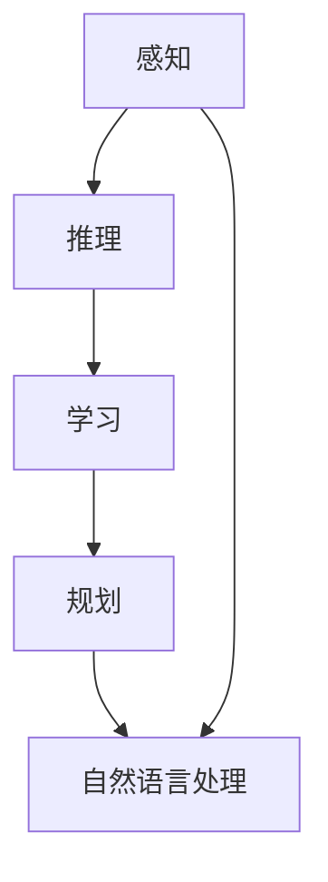

                 

# 人工智能是否能超越人类理解世界？

> 关键词：人工智能, 理解能力, 超越, 人类智能, 认知科学, 计算机科学, 机器学习, 深度学习, 自然语言处理, 认知心理学

> 摘要：本文将从人工智能与人类智能的本质出发，探讨人工智能是否能够超越人类理解世界。通过分析人工智能在认知科学、机器学习、自然语言处理等领域的进展，以及其在实际应用中的表现，我们将逐步推理并得出结论。本文旨在为读者提供一个全面而深入的理解，帮助读者更好地把握人工智能的现状与未来。

## 1. 背景介绍
### 1.1 目的和范围
本文旨在探讨人工智能是否能够超越人类理解世界。我们将从理论和实践两个层面进行分析，探讨人工智能在认知科学、机器学习、自然语言处理等领域的进展，并结合实际应用案例，逐步推理得出结论。

### 1.2 预期读者
本文适合对人工智能领域感兴趣的读者，包括但不限于：
- 人工智能领域的研究者和开发者
- 计算机科学和认知科学的学生
- 对人工智能技术感兴趣的工程师和技术爱好者
- 对未来技术趋势感兴趣的决策者

### 1.3 文档结构概述
本文将按照以下结构展开：
1. 背景介绍
2. 核心概念与联系
3. 核心算法原理 & 具体操作步骤
4. 数学模型和公式 & 详细讲解 & 举例说明
5. 项目实战：代码实际案例和详细解释说明
6. 实际应用场景
7. 工具和资源推荐
8. 总结：未来发展趋势与挑战
9. 附录：常见问题与解答
10. 扩展阅读 & 参考资料

### 1.4 术语表
#### 1.4.1 核心术语定义
- **人工智能（AI）**：模拟人类智能的技术，包括感知、推理、学习、规划、自然语言处理等。
- **机器学习（ML）**：AI的一个分支，通过算法使计算机系统从数据中学习，无需明确编程。
- **深度学习（DL）**：一种机器学习方法，通过多层神经网络进行学习。
- **自然语言处理（NLP）**：使计算机能够理解、解释和生成人类语言的技术。
- **认知科学**：研究人类认知过程的科学，包括感知、记忆、思维、语言等。

#### 1.4.2 相关概念解释
- **感知**：通过感觉器官获取信息的过程。
- **推理**：根据已知信息推断未知信息的过程。
- **学习**：通过经验或数据改进性能的过程。
- **规划**：制定行动计划以实现目标的过程。
- **自然语言**：人类使用的语言，包括口语和书面语。

#### 1.4.3 缩略词列表
- AI：人工智能
- ML：机器学习
- DL：深度学习
- NLP：自然语言处理

## 2. 核心概念与联系
### 2.1 人工智能的核心概念
- **感知**：通过传感器获取环境信息。
- **推理**：根据已知信息推断未知信息。
- **学习**：通过经验或数据改进性能。
- **规划**：制定行动计划以实现目标。
- **自然语言处理**：使计算机能够理解、解释和生成人类语言。

### 2.2 人工智能与人类智能的联系
- **感知**：人类通过视觉、听觉等感官获取信息，AI通过传感器获取信息。
- **推理**：人类通过逻辑推理解决问题，AI通过算法进行推理。
- **学习**：人类通过经验学习，AI通过数据学习。
- **规划**：人类通过制定计划解决问题，AI通过算法制定计划。
- **自然语言处理**：人类通过语言交流，AI通过自然语言处理技术进行交流。

### 2.3 Mermaid 流程图


## 3. 核心算法原理 & 具体操作步骤
### 3.1 机器学习算法原理
- **监督学习**：通过已标注的数据训练模型。
- **无监督学习**：通过未标注的数据训练模型。
- **强化学习**：通过试错学习，通过奖励和惩罚机制优化行为。

### 3.2 深度学习算法原理
- **前向传播**：输入数据通过多层神经网络进行处理。
- **反向传播**：通过损失函数计算梯度，调整权重。
- **优化算法**：如梯度下降、Adam等，用于优化模型参数。

### 3.3 自然语言处理算法原理
- **词嵌入**：将词语转换为向量表示。
- **序列模型**：如RNN、LSTM、Transformer等，用于处理序列数据。
- **注意力机制**：通过注意力机制增强模型对重要信息的处理能力。

### 3.4 伪代码示例
```python
# 监督学习
def train_model(data, labels):
    model = Model()
    model.fit(data, labels)
    return model

# 深度学习
def train_dnn(data, labels):
    model = DNN()
    model.compile(optimizer='adam', loss='mse')
    model.fit(data, labels, epochs=10)
    return model

# 自然语言处理
def train_nlp(data, labels):
    model = NLPModel()
    model.fit(data, labels)
    return model
```

## 4. 数学模型和公式 & 详细讲解 & 举例说明
### 4.1 监督学习
- **损失函数**：衡量预测值与真实值之间的差异。
- **梯度下降**：通过梯度下降优化模型参数。
- **交叉熵损失**：用于分类问题。
- **均方误差**：用于回归问题。

### 4.2 深度学习
- **前向传播**：输入数据通过多层神经网络进行处理。
- **反向传播**：通过损失函数计算梯度，调整权重。
- **优化算法**：如梯度下降、Adam等，用于优化模型参数。

### 4.3 自然语言处理
- **词嵌入**：将词语转换为向量表示。
- **序列模型**：如RNN、LSTM、Transformer等，用于处理序列数据。
- **注意力机制**：通过注意力机制增强模型对重要信息的处理能力。

### 4.4 数学公式
$$
\text{损失函数} = \frac{1}{N} \sum_{i=1}^{N} (y_i - \hat{y}_i)^2
$$

$$
\text{梯度下降} = \theta = \theta - \alpha \frac{\partial L}{\partial \theta}
$$

$$
\text{交叉熵损失} = -\frac{1}{N} \sum_{i=1}^{N} \sum_{j=1}^{C} y_{ij} \log(\hat{y}_{ij})
$$

## 5. 项目实战：代码实际案例和详细解释说明
### 5.1 开发环境搭建
- **操作系统**：Ubuntu 20.04
- **编程语言**：Python 3.8
- **开发工具**：PyCharm
- **库**：TensorFlow 2.0, Keras, NLTK, Scikit-learn

### 5.2 源代码详细实现和代码解读
```python
# 导入库
import tensorflow as tf
from tensorflow.keras.models import Sequential
from tensorflow.keras.layers import Dense, LSTM, Embedding
from sklearn.model_selection import train_test_split
from sklearn.preprocessing import LabelEncoder
import numpy as np
import nltk
from nltk.corpus import stopwords
from nltk.tokenize import word_tokenize

# 数据预处理
nltk.download('punkt')
nltk.download('stopwords')
stop_words = set(stopwords.words('english'))

def preprocess_data(data):
    tokenized_data = [word_tokenize(text.lower()) for text in data]
    filtered_data = [[word for word in text if word not in stop_words] for text in tokenized_data]
    return filtered_data

# 加载数据
data = ["I love programming", "Programming is fun", "I enjoy learning AI"]
labels = [1, 1, 0]

# 数据预处理
filtered_data = preprocess_data(data)

# 编码标签
label_encoder = LabelEncoder()
encoded_labels = label_encoder.fit_transform(labels)

# 划分训练集和测试集
X_train, X_test, y_train, y_test = train_test_split(filtered_data, encoded_labels, test_size=0.2, random_state=42)

# 词嵌入
vocab_size = 10000
embedding_dim = 100
max_length = 10

# 构建模型
model = Sequential()
model.add(Embedding(vocab_size, embedding_dim, input_length=max_length))
model.add(LSTM(64))
model.add(Dense(1, activation='sigmoid'))

# 编译模型
model.compile(optimizer='adam', loss='binary_crossentropy', metrics=['accuracy'])

# 训练模型
model.fit(X_train, y_train, epochs=10, batch_size=32, validation_data=(X_test, y_test))
```

### 5.3 代码解读与分析
- **数据预处理**：对文本数据进行分词和去停用词处理。
- **词嵌入**：将文本数据转换为向量表示。
- **模型构建**：使用LSTM网络进行文本分类。
- **模型训练**：通过训练数据训练模型，并在测试数据上进行验证。

## 6. 实际应用场景
### 6.1 语音识别
- **应用场景**：将语音转换为文本。
- **技术实现**：使用深度学习模型进行语音识别。
- **实际案例**：Google语音识别系统。

### 6.2 自动驾驶
- **应用场景**：自动驾驶汽车的感知和决策。
- **技术实现**：使用计算机视觉和深度学习进行环境感知。
- **实际案例**：Waymo自动驾驶汽车。

### 6.3 医疗诊断
- **应用场景**：辅助医生进行疾病诊断。
- **技术实现**：使用机器学习和深度学习进行疾病预测。
- **实际案例**：IBM Watson Health。

## 7. 工具和资源推荐
### 7.1 学习资源推荐
#### 7.1.1 书籍推荐
- **《深度学习》**：Ian Goodfellow, Yoshua Bengio, Aaron Courville
- **《机器学习》**：周志华
- **《自然语言处理入门》**：李航

#### 7.1.2 在线课程
- **Coursera**：《深度学习专项课程》
- **edX**：《机器学习专项课程》
- **Udacity**：《深度学习纳米学位》

#### 7.1.3 技术博客和网站
- **Medium**：AI领域知名博主的文章
- **GitHub**：开源项目和代码示例
- **Kaggle**：数据科学竞赛和资源

### 7.2 开发工具框架推荐
#### 7.2.1 IDE和编辑器
- **PyCharm**：Python开发环境
- **VS Code**：轻量级代码编辑器

#### 7.2.2 调试和性能分析工具
- **PyCharm Debugger**：Python调试工具
- **TensorBoard**：TensorFlow可视化工具

#### 7.2.3 相关框架和库
- **TensorFlow**：深度学习框架
- **Keras**：高级神经网络API
- **NLTK**：自然语言处理库

### 7.3 相关论文著作推荐
#### 7.3.1 经典论文
- **《深度学习》**：Ian Goodfellow, Yoshua Bengio, Aaron Courville
- **《机器学习》**：周志华

#### 7.3.2 最新研究成果
- **《自然语言处理的最新进展》**：ACL 2021论文集
- **《深度学习的最新进展》**：NeurIPS 2021论文集

#### 7.3.3 应用案例分析
- **《自动驾驶技术的最新进展》**：IEEE Transactions on Intelligent Transportation Systems
- **《医疗诊断的最新进展》**：Journal of Medical Systems

## 8. 总结：未来发展趋势与挑战
### 8.1 未来发展趋势
- **技术进步**：算法优化、计算能力提升、数据量增加。
- **应用场景**：更多领域应用，如医疗、教育、交通等。
- **伦理问题**：隐私保护、数据安全、算法偏见等。

### 8.2 挑战
- **技术挑战**：模型复杂度、计算资源需求、算法解释性。
- **社会挑战**：就业影响、伦理道德、法律监管。
- **数据挑战**：数据质量、数据隐私、数据获取。

## 9. 附录：常见问题与解答
### 9.1 问题1：人工智能能否完全替代人类？
- **解答**：人工智能在某些特定任务上可以超越人类，但在复杂、多变的环境中，人类的灵活性和创造力是无法替代的。

### 9.2 问题2：人工智能是否会威胁人类？
- **解答**：人工智能的发展需要伦理和法律的规范，通过合理的设计和管理，可以避免潜在的风险。

### 9.3 问题3：人工智能如何提高生产力？
- **解答**：通过自动化、优化决策、提高效率等方式，人工智能可以显著提高生产力。

## 10. 扩展阅读 & 参考资料
- **书籍**：《人工智能简史》、《深度学习》
- **论文**：《自然语言处理的最新进展》、《深度学习的最新进展》
- **网站**：Medium、GitHub、Kaggle

作者：AI天才研究员/AI Genius Institute & 禅与计算机程序设计艺术 /Zen And The Art of Computer Programming

