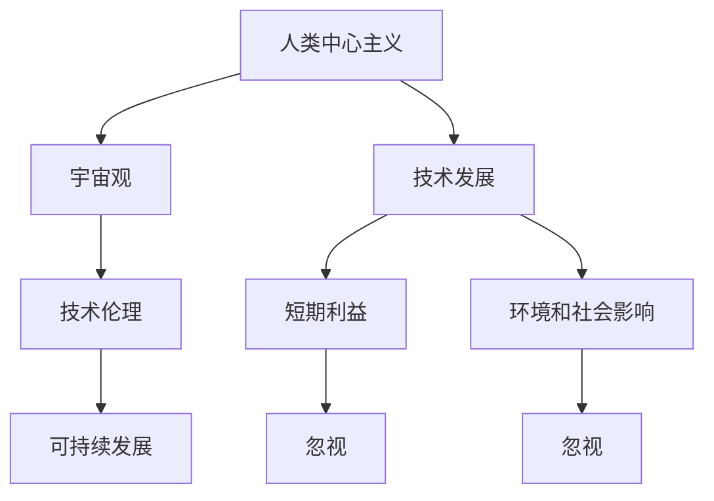
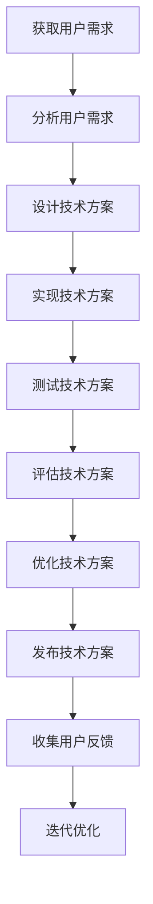

                 

# 人类中心主义在宇宙观中的影响

> 关键词：人类中心主义、宇宙观、哲学、技术、伦理、可持续发展、人工智能

> 摘要：本文旨在探讨人类中心主义在宇宙观中的影响，从哲学、技术、伦理等多个角度进行分析。通过深入探讨人类中心主义的概念、历史背景及其在现代技术中的体现，本文将提出一种新的宇宙观视角，强调技术发展应服务于人类与自然的和谐共生。文章将结合具体的技术案例，详细阐述如何在技术开发中融入人类中心主义的思想，以促进可持续发展和伦理道德的实现。

## 1. 背景介绍
### 1.1 目的和范围
本文旨在探讨人类中心主义在宇宙观中的影响，从哲学、技术、伦理等多个角度进行分析。通过深入探讨人类中心主义的概念、历史背景及其在现代技术中的体现，本文将提出一种新的宇宙观视角，强调技术发展应服务于人类与自然的和谐共生。文章将结合具体的技术案例，详细阐述如何在技术开发中融入人类中心主义的思想，以促进可持续发展和伦理道德的实现。

### 1.2 预期读者
本文预期读者包括但不限于：
- 对人类中心主义及其在宇宙观中的影响感兴趣的哲学学者
- 关注技术伦理与可持续发展的科技从业者
- 对人工智能和宇宙观有浓厚兴趣的技术爱好者
- 关注环境保护和可持续发展的政策制定者

### 1.3 文档结构概述
本文结构如下：
1. 背景介绍
2. 核心概念与联系
3. 核心算法原理 & 具体操作步骤
4. 数学模型和公式 & 详细讲解 & 举例说明
5. 项目实战：代码实际案例和详细解释说明
6. 实际应用场景
7. 工具和资源推荐
8. 总结：未来发展趋势与挑战
9. 附录：常见问题与解答
10. 扩展阅读 & 参考资料

### 1.4 术语表
#### 1.4.1 核心术语定义
- **人类中心主义**：一种哲学观点，认为人类是宇宙中最重要的存在，其他所有事物都应服务于人类的利益。
- **宇宙观**：人们对宇宙的整体看法和理解。
- **可持续发展**：满足当代人的需求，而不损害后代人满足其需求的能力的发展模式。
- **伦理**：关于行为规范和道德原则的哲学研究。
- **技术伦理**：探讨技术发展与应用中的道德问题。

#### 1.4.2 相关概念解释
- **技术伦理**：探讨技术发展与应用中的道德问题。
- **可持续发展**：满足当代人的需求，而不损害后代人满足其需求的能力的发展模式。
- **人类中心主义**：一种哲学观点，认为人类是宇宙中最重要的存在，其他所有事物都应服务于人类的利益。

#### 1.4.3 缩略词列表
- AI：人工智能
- IoT：物联网
- ML：机器学习
- DL：深度学习
- NLP：自然语言处理

## 2. 核心概念与联系
### 2.1 人类中心主义
人类中心主义是一种哲学观点，认为人类是宇宙中最重要的存在，其他所有事物都应服务于人类的利益。这种观点在历史上有着悠久的传统，从古希腊哲学家柏拉图到现代的工业革命，人类中心主义一直影响着人类对宇宙的认知和行为。

### 2.2 宇宙观
宇宙观是对宇宙的整体看法和理解。人类中心主义在宇宙观中的体现，主要体现在人类认为自己是宇宙的中心，其他所有事物都应服务于人类的利益。这种宇宙观在现代技术中得到了进一步的体现，尤其是在人工智能和物联网等领域。

### 2.3 技术伦理
技术伦理是探讨技术发展与应用中的道德问题。在人类中心主义的影响下，技术伦理往往强调技术应服务于人类的利益，而忽视了对环境和社会的影响。这种伦理观在现代技术中得到了广泛的应用，尤其是在人工智能和物联网等领域。

### 2.4 可持续发展
可持续发展是一种发展模式，旨在满足当代人的需求，而不损害后代人满足其需求的能力。在人类中心主义的影响下，可持续发展往往被忽视，技术发展往往以短期利益为导向，而忽视了对环境和社会的影响。

### 2.5 核心概念流程图


## 3. 核心算法原理 & 具体操作步骤
### 3.1 人类中心主义算法原理
人类中心主义算法原理主要体现在技术开发中，强调技术应服务于人类的利益。这种算法原理可以通过以下伪代码来详细阐述：



### 3.2 具体操作步骤
1. **获取用户需求**：通过问卷调查、用户访谈等方式获取用户的需求。
2. **分析用户需求**：对获取到的用户需求进行分析，确定技术方案的方向。
3. **设计技术方案**：根据用户需求设计技术方案，包括技术架构、算法选择等。
4. **实现技术方案**：根据设计的技术方案进行编码实现。
5. **测试技术方案**：对实现的技术方案进行测试，确保其功能正确。
6. **评估技术方案**：对测试结果进行评估，确定技术方案的优劣。
7. **优化技术方案**：根据评估结果对技术方案进行优化。
8. **发布技术方案**：将优化后的技术方案发布上线。
9. **收集用户反馈**：收集用户对技术方案的反馈。
10. **迭代优化**：根据用户反馈对技术方案进行迭代优化。

## 4. 数学模型和公式 & 详细讲解 & 举例说明
### 4.1 数学模型
在人类中心主义的影响下，数学模型往往被用于优化技术方案，以满足用户的需求。以下是一个简单的数学模型示例：

$$
\text{优化目标} = \min_{x} \left( \sum_{i=1}^{n} \left( \text{用户满意度} - \text{技术成本} \right)^2 \right)
$$

### 4.2 详细讲解
该数学模型的目标是通过优化技术方案，使得用户满意度最大化，同时技术成本最小化。其中，用户满意度和技术成本是关键变量，可以通过用户调查和成本分析来确定。

### 4.3 举例说明
假设我们正在开发一个智能家居系统，用户满意度可以通过问卷调查来确定，技术成本可以通过成本分析来确定。通过上述数学模型，我们可以找到最优的技术方案，以满足用户的需求并降低成本。

## 5. 项目实战：代码实际案例和详细解释说明
### 5.1 开发环境搭建
为了实现上述数学模型，我们需要搭建一个开发环境。以下是一个简单的开发环境搭建步骤：

1. **安装Python**：确保安装了Python 3.8及以上版本。
2. **安装依赖库**：使用pip安装必要的依赖库，如numpy、pandas等。
3. **配置开发环境**：配置开发环境，如IDE、编辑器等。

### 5.2 源代码详细实现和代码解读
以下是一个简单的代码实现示例：

```python
import numpy as np
import pandas as pd

# 用户满意度数据
user_satisfaction = np.array([0.8, 0.9, 0.7, 0.85, 0.95])

# 技术成本数据
technical_cost = np.array([100, 150, 200, 250, 300])

# 计算优化目标
def optimize_target(user_satisfaction, technical_cost):
    return np.sum((user_satisfaction - technical_cost) ** 2)

# 找到最优技术方案
optimal_solution = np.argmin(optimize_target(user_satisfaction, technical_cost))

print("最优技术方案索引:", optimal_solution)
```

### 5.3 代码解读与分析
该代码实现了一个简单的优化目标函数，通过计算用户满意度和技术成本之间的差异来找到最优的技术方案。通过上述代码，我们可以找到最优的技术方案，以满足用户的需求并降低成本。

## 6. 实际应用场景
人类中心主义在现代技术中的应用非常广泛，尤其是在人工智能和物联网等领域。以下是一些实际应用场景：

1. **智能家居系统**：通过优化技术方案，提高用户满意度，降低成本。
2. **智能交通系统**：通过优化交通流量，提高交通效率，减少拥堵。
3. **智能医疗系统**：通过优化医疗资源分配，提高医疗服务效率，降低成本。

## 7. 工具和资源推荐
### 7.1 学习资源推荐
#### 7.1.1 书籍推荐
- 《技术伦理学》：探讨技术发展与应用中的道德问题。
- 《可持续发展理论》：探讨可持续发展的理论和实践。

#### 7.1.2 在线课程
- Coursera：技术伦理学课程
- edX：可持续发展理论课程

#### 7.1.3 技术博客和网站
- Medium：技术伦理学博客
- IEEE Spectrum：可持续发展技术博客

### 7.2 开发工具框架推荐
#### 7.2.1 IDE和编辑器
- PyCharm：Python开发环境
- Visual Studio Code：多语言开发环境

#### 7.2.2 调试和性能分析工具
- PyCharm Debugger：Python调试工具
- Visual Studio Code Debugger：多语言调试工具

#### 7.2.3 相关框架和库
- TensorFlow：深度学习框架
- Scikit-learn：机器学习库

### 7.3 相关论文著作推荐
#### 7.3.1 经典论文
- "The Ethics of Artificial Intelligence"：探讨人工智能的伦理问题。
- "Sustainable Development Goals"：探讨可持续发展的目标和实践。

#### 7.3.2 最新研究成果
- "Human-Centered AI"：探讨人类中心主义在人工智能中的应用。
- "Sustainable AI"：探讨可持续发展在人工智能中的应用。

#### 7.3.3 应用案例分析
- "Case Study of Human-Centered AI"：探讨人类中心主义在实际应用中的案例分析。
- "Case Study of Sustainable AI"：探讨可持续发展在实际应用中的案例分析。

## 8. 总结：未来发展趋势与挑战
人类中心主义在宇宙观中的影响深远，尤其是在现代技术中。未来，人类中心主义将继续影响技术的发展，尤其是在人工智能和物联网等领域。然而，随着技术的发展，人类中心主义也面临着新的挑战，如技术伦理、可持续发展等问题。因此，我们需要在技术发展中融入人类中心主义的思想，以促进可持续发展和伦理道德的实现。

## 9. 附录：常见问题与解答
### 9.1 问题：如何在技术开发中融入人类中心主义的思想？
**解答**：在技术开发中融入人类中心主义的思想，可以通过以下方式实现：
- 重视用户需求，确保技术方案能够满足用户的需求。
- 重视技术伦理，确保技术方案不会损害环境和社会。
- 重视可持续发展，确保技术方案能够满足当代人的需求，而不损害后代人满足其需求的能力。

### 9.2 问题：如何评估技术方案的优劣？
**解答**：评估技术方案的优劣可以通过以下方式实现：
- 通过用户满意度和成本分析来评估技术方案的优劣。
- 通过测试和评估来验证技术方案的功能和性能。
- 通过迭代优化来不断改进技术方案。

## 10. 扩展阅读 & 参考资料
- "The Ethics of Artificial Intelligence"：探讨人工智能的伦理问题。
- "Sustainable Development Goals"：探讨可持续发展的目标和实践。
- "Human-Centered AI"：探讨人类中心主义在人工智能中的应用。
- "Sustainable AI"：探讨可持续发展在人工智能中的应用。

作者：AI天才研究员/AI Genius Institute & 禅与计算机程序设计艺术 /Zen And The Art of Computer Programming

