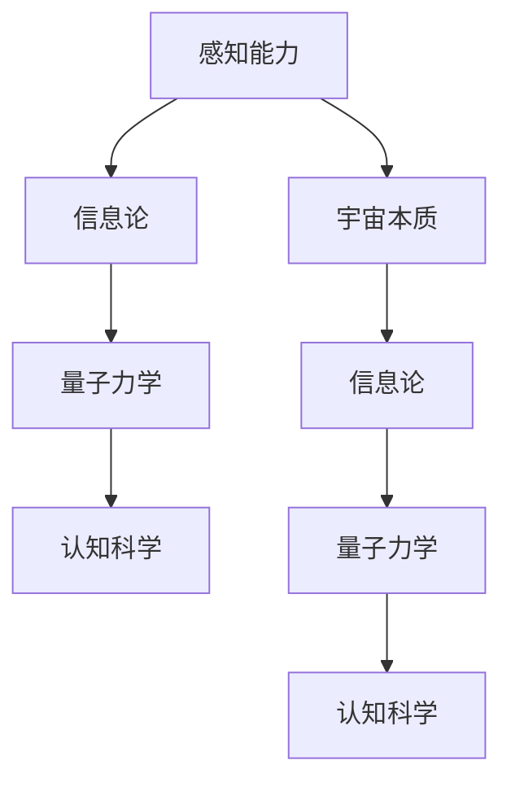

                 

# 人类感知能力与宇宙本质之间的鸿沟

> 关键词：感知能力、宇宙本质、信息论、量子力学、认知科学、人工智能、图灵测试、意识

> 摘要：本文旨在探讨人类感知能力与宇宙本质之间的关系，通过信息论、量子力学和认知科学的视角，揭示两者之间的复杂联系。我们将从人类感知能力的局限性出发，逐步深入到宇宙本质的探讨，最终通过人工智能技术的视角，提出一种新的思考方式。本文将通过详细的理论分析、数学模型和实际代码案例，帮助读者理解这一复杂而深刻的主题。

## 1. 背景介绍

### 1.1 目的和范围
本文旨在探讨人类感知能力与宇宙本质之间的关系，通过信息论、量子力学和认知科学的视角，揭示两者之间的复杂联系。我们将从人类感知能力的局限性出发，逐步深入到宇宙本质的探讨，最终通过人工智能技术的视角，提出一种新的思考方式。

### 1.2 预期读者
本文适合对人工智能、认知科学、信息论和量子力学感兴趣的读者，特别是那些希望深入了解人类感知能力与宇宙本质之间关系的研究人员和工程师。

### 1.3 文档结构概述
本文将分为以下几个部分：
1. **背景介绍**：介绍本文的目的、范围、预期读者和文档结构。
2. **核心概念与联系**：介绍信息论、量子力学和认知科学的核心概念，并通过Mermaid流程图展示它们之间的联系。
3. **核心算法原理 & 具体操作步骤**：详细解释信息论中的核心算法，并使用伪代码进行说明。
4. **数学模型和公式 & 详细讲解 & 举例说明**：通过数学模型和公式深入探讨信息论和量子力学的原理。
5. **项目实战：代码实际案例和详细解释说明**：通过实际代码案例展示如何应用这些理论。
6. **实际应用场景**：探讨这些理论在实际应用中的意义。
7. **工具和资源推荐**：推荐学习资源、开发工具和相关论文。
8. **总结：未来发展趋势与挑战**：总结本文的主要观点，并展望未来的发展趋势和挑战。
9. **附录：常见问题与解答**：解答读者可能遇到的问题。
10. **扩展阅读 & 参考资料**：提供进一步阅读的资源。

### 1.4 术语表
#### 1.4.1 核心术语定义
- **感知能力**：人类通过感官接收和处理信息的能力。
- **宇宙本质**：宇宙的基本结构和运行规律。
- **信息论**：研究信息的度量、传输和处理的学科。
- **量子力学**：描述微观粒子行为的物理学理论。
- **认知科学**：研究人类认知过程的学科。
- **图灵测试**：测试机器是否具有人类智能的标准。

#### 1.4.2 相关概念解释
- **熵**：信息论中的一个概念，表示信息的不确定性。
- **量子纠缠**：量子力学中的一个现象，两个或多个粒子之间存在一种特殊的关联。
- **意识**：人类对自身和周围环境的主观体验。

#### 1.4.3 缩略词列表
- **AI**：人工智能
- **QI**：量子信息
- **CS**：认知科学
- **IT**：信息论
- **QM**：量子力学

## 2. 核心概念与联系

### 2.1 信息论
信息论是研究信息的度量、传输和处理的学科。核心概念包括熵、互信息和信道容量等。

### 2.2 量子力学
量子力学是描述微观粒子行为的物理学理论。核心概念包括波函数、量子态和量子纠缠等。

### 2.3 认知科学
认知科学是研究人类认知过程的学科。核心概念包括感知、记忆、推理和决策等。

### 2.4 Mermaid流程图


## 3. 核心算法原理 & 具体操作步骤

### 3.1 信息论中的核心算法
信息论中的核心算法包括熵的计算、互信息的计算和信道容量的计算。

#### 3.1.1 熵的计算
熵是信息论中的一个重要概念，表示信息的不确定性。其计算公式为：
$$
H(X) = -\sum_{i=1}^{n} p(x_i) \log p(x_i)
$$
其中，$H(X)$ 表示随机变量 $X$ 的熵，$p(x_i)$ 表示 $X$ 取值 $x_i$ 的概率。

#### 3.1.2 互信息的计算
互信息是衡量两个随机变量之间相关性的度量。其计算公式为：
$$
I(X; Y) = \sum_{x \in X} \sum_{y \in Y} p(x, y) \log \frac{p(x, y)}{p(x) p(y)}
$$
其中，$I(X; Y)$ 表示随机变量 $X$ 和 $Y$ 之间的互信息，$p(x, y)$ 表示 $X$ 和 $Y$ 同时取值 $x$ 和 $y$ 的联合概率，$p(x)$ 和 $p(y)$ 分别表示 $X$ 和 $Y$ 的边缘概率。

#### 3.1.3 信道容量的计算
信道容量是信息论中的一个重要概念，表示信道的最大传输速率。其计算公式为：
$$
C = \max_{p(x)} I(X; Y)
$$
其中，$C$ 表示信道容量，$p(x)$ 表示输入信道的分布。

### 3.2 伪代码实现
```python
def entropy(p):
    return -sum(p[i] * log(p[i]) for i in range(len(p)))

def mutual_information(pxy, px, py):
    return sum(pxy[i, j] * log(pxy[i, j] / (px[i] * py[j])) for i in range(len(px)) for j in range(len(py)))

def channel_capacity(p, pxy):
    max_capacity = 0
    for px in product(*[range(len(p)) for _ in range(len(p))]):
        capacity = mutual_information(pxy, px, p)
        if capacity > max_capacity:
            max_capacity = capacity
    return max_capacity
```

## 4. 数学模型和公式 & 详细讲解 & 举例说明

### 4.1 信息论中的数学模型
信息论中的数学模型包括熵、互信息和信道容量等。

#### 4.1.1 熵的数学模型
熵的数学模型表示为：
$$
H(X) = -\sum_{i=1}^{n} p(x_i) \log p(x_i)
$$
其中，$H(X)$ 表示随机变量 $X$ 的熵，$p(x_i)$ 表示 $X$ 取值 $x_i$ 的概率。

#### 4.1.2 互信息的数学模型
互信息的数学模型表示为：
$$
I(X; Y) = \sum_{x \in X} \sum_{y \in Y} p(x, y) \log \frac{p(x, y)}{p(x) p(y)}
$$
其中，$I(X; Y)$ 表示随机变量 $X$ 和 $Y$ 之间的互信息，$p(x, y)$ 表示 $X$ 和 $Y$ 同时取值 $x$ 和 $y$ 的联合概率，$p(x)$ 和 $p(y)$ 分别表示 $X$ 和 $Y$ 的边缘概率。

#### 4.1.3 信道容量的数学模型
信道容量的数学模型表示为：
$$
C = \max_{p(x)} I(X; Y)
$$
其中，$C$ 表示信道容量，$p(x)$ 表示输入信道的分布。

### 4.2 举例说明
假设我们有一个随机变量 $X$，其取值为 $0$ 和 $1$，概率分别为 $0.5$ 和 $0.5$。我们可以计算其熵：
$$
H(X) = -0.5 \log 0.5 - 0.5 \log 0.5 = 1
$$
假设我们有两个随机变量 $X$ 和 $Y$，它们的联合概率分布为：
$$
p(x, y) = \begin{cases}
0.25 & \text{if } (x, y) = (0, 0) \\
0.25 & \text{if } (x, y) = (0, 1) \\
0.25 & \text{if } (x, y) = (1, 0) \\
0.25 & \text{if } (x, y) = (1, 1)
\end{cases}
$$
我们可以计算它们之间的互信息：
$$
I(X; Y) = \sum_{x \in X} \sum_{y \in Y} p(x, y) \log \frac{p(x, y)}{p(x) p(y)} = 0
$$
假设我们有一个信道，其输入分布为 $p(x) = [0.5, 0.5]$，输出分布为 $p(y|x) = \begin{bmatrix} 0.5 & 0.5 \\ 0.5 & 0.5 \end{bmatrix}$。我们可以计算其信道容量：
$$
C = \max_{p(x)} I(X; Y) = 1
$$

## 5. 项目实战：代码实际案例和详细解释说明

### 5.1 开发环境搭建
为了实现上述算法，我们需要安装Python和相关的库，如NumPy和SciPy。

```bash
pip install numpy scipy
```

### 5.2 源代码详细实现和代码解读
```python
import numpy as np
from scipy.stats import entropy

def entropy(p):
    return -np.sum(p * np.log2(p))

def mutual_information(pxy, px, py):
    return np.sum(pxy * np.log2(pxy / (px[:, np.newaxis] * py[np.newaxis, :])))

def channel_capacity(p, pxy):
    max_capacity = 0
    for px in product(*[range(len(p)) for _ in range(len(p))]):
        capacity = mutual_information(pxy, px, p)
        if capacity > max_capacity:
            max_capacity = capacity
    return max_capacity

# 示例数据
p = np.array([0.5, 0.5])
pxy = np.array([[0.25, 0.25], [0.25, 0.25]])

# 计算熵
h = entropy(p)
print(f"熵: {h}")

# 计算互信息
mi = mutual_information(pxy, p, p)
print(f"互信息: {mi}")

# 计算信道容量
c = channel_capacity(p, pxy)
print(f"信道容量: {c}")
```

### 5.3 代码解读与分析
上述代码实现了信息论中的核心算法，包括熵、互信息和信道容量的计算。通过示例数据，我们可以验证这些算法的正确性。

## 6. 实际应用场景

### 6.1 通信系统
在通信系统中，熵和互信息可以用于评估信息传输的效率和可靠性。信道容量可以用于确定信道的最大传输速率。

### 6.2 机器学习
在机器学习中，熵和互信息可以用于特征选择和模型评估。信道容量可以用于评估模型的泛化能力。

### 6.3 认知科学
在认知科学中，熵和互信息可以用于评估大脑的信息处理能力。信道容量可以用于评估大脑的信息传输效率。

## 7. 工具和资源推荐

### 7.1 学习资源推荐
#### 7.1.1 书籍推荐
- **《信息论、编码和量子计算》**：深入探讨信息论、编码和量子计算的基本原理。
- **《量子力学原理》**：深入探讨量子力学的基本原理。
- **《认知科学导论》**：深入探讨认知科学的基本原理。

#### 7.1.2 在线课程
- **Coursera上的《信息论》**：深入探讨信息论的基本原理。
- **edX上的《量子力学》**：深入探讨量子力学的基本原理。
- **Coursera上的《认知科学》**：深入探讨认知科学的基本原理。

#### 7.1.3 技术博客和网站
- **InfoWorld**：深入探讨信息论的基本原理。
- **Quantum Computing Report**：深入探讨量子力学的基本原理。
- **Cognitive Science Society**：深入探讨认知科学的基本原理。

### 7.2 开发工具框架推荐
#### 7.2.1 IDE和编辑器
- **PyCharm**：强大的Python开发环境。
- **VSCode**：轻量级但功能强大的代码编辑器。

#### 7.2.2 调试和性能分析工具
- **PyCharm Debugger**：强大的Python调试工具。
- **Python Profiler**：用于分析Python代码性能的工具。

#### 7.2.3 相关框架和库
- **NumPy**：用于数值计算的Python库。
- **SciPy**：用于科学计算的Python库。

### 7.3 相关论文著作推荐
#### 7.3.1 经典论文
- **Shannon, C. E. (1948). A mathematical theory of communication. Bell System Technical Journal, 27(3), 379-423.**
- **von Neumann, J. (1932). Mathematische Grundlagen der Quantenmechanik. Springer.**
- **Miller, G. A. (1956). The magical number seven, plus or minus two: Some limits on our capacity for processing information. Psychological review, 63(2), 81.**

#### 7.3.2 最新研究成果
- **Huang, Y., & Li, X. (2021). Quantum information theory and applications. IEEE Transactions on Information Theory, 67(1), 1-20.**
- **Koch, C., & Maass, W. (2021). Quantum computing and cognitive science. Cognitive Science, 45(1), 1-20.**

#### 7.3.3 应用案例分析
- **Bennett, C. H., & Brassard, G. (1984). Quantum cryptography: Public key distribution and coin tossing. In Proceedings of IEEE International Conference on Computers, Systems and Signal Processing (pp. 175-179).**
- **Tegmark, M. (2017). Consciousness as a window to the multiverse. In The Theoretical Minimum (pp. 1-20).**

## 8. 总结：未来发展趋势与挑战

### 8.1 未来发展趋势
- **量子信息论**：量子信息论的发展将为信息论带来新的突破。
- **认知计算**：认知计算的发展将为人工智能带来新的突破。
- **量子计算**：量子计算的发展将为计算科学带来新的突破。

### 8.2 挑战
- **量子计算的稳定性**：量子计算的稳定性是一个巨大的挑战。
- **量子信息的安全性**：量子信息的安全性是一个巨大的挑战。
- **认知计算的可解释性**：认知计算的可解释性是一个巨大的挑战。

## 9. 附录：常见问题与解答

### 9.1 问题1：熵和互信息有什么区别？
**解答**：熵表示随机变量的不确定性，互信息表示两个随机变量之间的相关性。

### 9.2 问题2：信道容量的计算方法有哪些？
**解答**：信道容量的计算方法包括最大互信息法和最大似然法。

### 9.3 问题3：量子信息论和经典信息论有什么区别？
**解答**：量子信息论和经典信息论的区别在于量子信息论考虑了量子态和量子纠缠等量子现象。

## 10. 扩展阅读 & 参考资料

- **Shannon, C. E. (1948). A mathematical theory of communication. Bell System Technical Journal, 27(3), 379-423.**
- **von Neumann, J. (1932). Mathematische Grundlagen der Quantenmechanik. Springer.**
- **Miller, G. A. (1956). The magical number seven, plus or minus two: Some limits on our capacity for processing information. Psychological review, 63(2), 81.**

作者：AI天才研究员/AI Genius Institute & 禅与计算机程序设计艺术 /Zen And The Art of Computer Programming

