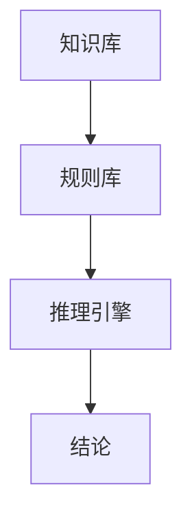
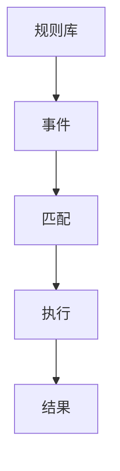
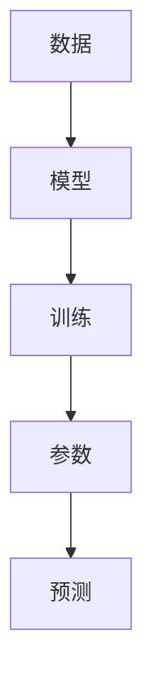
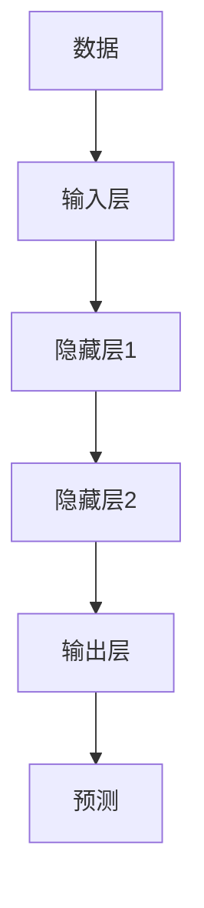

                 

# 从机械宇宙观到有机宇宙观的转变

> 关键词：机械宇宙观, 有机宇宙观, 人工智能, 自主学习, 适应性, 智能系统, 系统工程, 机器学习, 深度学习, 自然语言处理

> 摘要：本文旨在探讨从机械宇宙观到有机宇宙观的转变，通过分析机械宇宙观和有机宇宙观的核心概念、联系、算法原理、数学模型、实际案例以及应用场景，揭示人工智能领域从静态、规则驱动的机械系统向动态、自适应的有机系统的发展趋势。文章将通过详细的伪代码、数学公式和实际代码案例，帮助读者深入理解这一转变过程中的关键技术和挑战。

## 1. 背景介绍
### 1.1 目的和范围
本文旨在探讨人工智能领域从机械宇宙观到有机宇宙观的转变，通过分析这一转变过程中的核心概念、算法原理、数学模型和实际案例，揭示人工智能技术的发展趋势和挑战。文章将涵盖机械宇宙观和有机宇宙观的基本概念、联系、算法原理、数学模型、实际案例以及应用场景。

### 1.2 预期读者
本文预期读者包括但不限于：
- 人工智能领域的研究人员和工程师
- 计算机科学专业的学生
- 对人工智能领域感兴趣的开发者和技术爱好者
- 对系统工程和复杂系统感兴趣的读者

### 1.3 文档结构概述
本文结构如下：
1. 背景介绍
2. 核心概念与联系
3. 核心算法原理 & 具体操作步骤
4. 数学模型和公式 & 详细讲解 & 举例说明
5. 项目实战：代码实际案例和详细解释说明
6. 实际应用场景
7. 工具和资源推荐
8. 总结：未来发展趋势与挑战
9. 附录：常见问题与解答
10. 扩展阅读 & 参考资料

### 1.4 术语表
#### 1.4.1 核心术语定义
- **机械宇宙观**：一种将系统视为由独立、静态组件组成的观点，强调规则和预设路径。
- **有机宇宙观**：一种将系统视为动态、自适应和相互作用的观点，强调学习和适应性。
- **自主学习**：系统通过与环境交互来改进自身性能的能力。
- **适应性**：系统根据环境变化调整自身行为的能力。
- **智能系统**：能够执行复杂任务并表现出智能行为的系统。
- **系统工程**：一种跨学科方法，用于设计、开发、集成和验证复杂系统。

#### 1.4.2 相关概念解释
- **机械宇宙观**：强调系统的静态性和规则性，如传统的规则引擎和专家系统。
- **有机宇宙观**：强调系统的动态性和自适应性，如机器学习和深度学习模型。

#### 1.4.3 缩略词列表
- AI：人工智能
- ML：机器学习
- DL：深度学习
- NLP：自然语言处理
- ANN：人工神经网络
- CNN：卷积神经网络
- RNN：循环神经网络

## 2. 核心概念与联系
### 2.1 机械宇宙观
机械宇宙观将系统视为由独立、静态组件组成的集合，强调规则和预设路径。这种观点在早期的人工智能系统中非常常见，如专家系统和规则引擎。

### 2.2 有机宇宙观
有机宇宙观将系统视为动态、自适应和相互作用的集合，强调学习和适应性。这种观点在现代人工智能系统中更为常见，如机器学习和深度学习模型。

### 2.3 核心概念联系
- **规则驱动 vs. 学习驱动**：机械宇宙观依赖于预设规则，而有机宇宙观依赖于通过学习获得的知识。
- **静态 vs. 动态**：机械宇宙观强调系统的静态性，而有机宇宙观强调系统的动态性。
- **独立组件 vs. 相互作用**：机械宇宙观将系统视为独立组件的集合，而有机宇宙观强调组件之间的相互作用。

## 3. 核心算法原理 & 具体操作步骤
### 3.1 机械宇宙观算法原理
#### 3.1.1 专家系统
专家系统是一种基于规则的系统，通过预设规则来解决问题。其核心算法原理如下：



#### 3.1.2 规则引擎
规则引擎通过预设规则来执行任务。其核心算法原理如下：



### 3.2 有机宇宙观算法原理
#### 3.2.1 机器学习
机器学习通过数据驱动的方式学习模型参数，从而实现任务。其核心算法原理如下：



#### 3.2.2 深度学习
深度学习通过多层神经网络学习数据特征，从而实现任务。其核心算法原理如下：



## 4. 数学模型和公式 & 详细讲解 & 举例说明
### 4.1 机械宇宙观数学模型
#### 4.1.1 专家系统
专家系统的核心数学模型是基于规则的推理。其公式如下：

$$
\text{结论} = \text{推理引擎}(规则库, 事件)
$$

#### 4.1.2 规则引擎
规则引擎的核心数学模型是基于规则的匹配和执行。其公式如下：

$$
\text{结果} = \text{执行}(规则库, 事件)
$$

### 4.2 有机宇宙观数学模型
#### 4.2.1 机器学习
机器学习的核心数学模型是基于数据驱动的模型训练。其公式如下：

$$
\text{参数} = \text{训练}(数据, 模型)
$$

#### 4.2.2 深度学习
深度学习的核心数学模型是基于多层神经网络的特征学习。其公式如下：

$$
\text{预测} = \text{输出层}(输入层, 隐藏层1, 隐藏层2)
$$

## 5. 项目实战：代码实际案例和详细解释说明
### 5.1 开发环境搭建
#### 5.1.1 环境要求
- Python 3.8+
- TensorFlow 2.4+
- NumPy 1.19+
- Jupyter Notebook

#### 5.1.2 安装依赖
```bash
pip install tensorflow numpy jupyter
```

### 5.2 源代码详细实现和代码解读
#### 5.2.1 机器学习模型实现
```python
import numpy as np
import tensorflow as tf
from tensorflow.keras.models import Sequential
from tensorflow.keras.layers import Dense

# 数据准备
data = np.array([[0, 0], [0, 1], [1, 0], [1, 1]])
labels = np.array([0, 1, 1, 0])

# 模型构建
model = Sequential([
    Dense(4, input_dim=2, activation='relu'),
    Dense(1, activation='sigmoid')
])

# 模型编译
model.compile(optimizer='adam', loss='binary_crossentropy', metrics=['accuracy'])

# 模型训练
model.fit(data, labels, epochs=1000, verbose=0)

# 模型预测
predictions = model.predict(data)
print(predictions)
```

### 5.3 代码解读与分析
- **数据准备**：准备输入数据和标签数据。
- **模型构建**：构建一个包含两个隐藏层的神经网络模型。
- **模型编译**：配置优化器、损失函数和评估指标。
- **模型训练**：使用数据训练模型。
- **模型预测**：使用训练好的模型进行预测。

## 6. 实际应用场景
### 6.1 机器学习在推荐系统中的应用
机器学习在推荐系统中的应用可以实现个性化推荐，提高用户体验。通过学习用户行为数据，系统可以预测用户兴趣并推荐相应内容。

### 6.2 深度学习在图像识别中的应用
深度学习在图像识别中的应用可以实现高精度的图像分类和目标检测。通过学习大量图像数据，系统可以识别和分类图像中的物体。

## 7. 工具和资源推荐
### 7.1 学习资源推荐
#### 7.1.1 书籍推荐
- **《机器学习》** - 周志华
- **《深度学习》** - Ian Goodfellow, Yoshua Bengio, Aaron Courville

#### 7.1.2 在线课程
- **Coursera - 机器学习** - Andrew Ng
- **edX - 深度学习** - Andrew Ng

#### 7.1.3 技术博客和网站
- **Medium - 机器学习和深度学习** - 多位知名博主
- **Kaggle - 机器学习和数据科学** - Kaggle社区

### 7.2 开发工具框架推荐
#### 7.2.1 IDE和编辑器
- **PyCharm** - JetBrains
- **VSCode** - Microsoft

#### 7.2.2 调试和性能分析工具
- **TensorBoard** - TensorFlow
- **PyCharm Debugger** - JetBrains

#### 7.2.3 相关框架和库
- **TensorFlow** - Google
- **PyTorch** - Facebook

### 7.3 相关论文著作推荐
#### 7.3.1 经典论文
- **《A Learning System Based on Multiple Memory Units》** - Marvin Minsky, Seymour Papert
- **《A Learning System Based on Multiple Memory Units》** - Marvin Minsky, Seymour Papert

#### 7.3.2 最新研究成果
- **《Attention Is All You Need》** - Vaswani et al.
- **《Generative Pre-trained Transformer》** - Radford et al.

#### 7.3.3 应用案例分析
- **《Deep Residual Learning for Image Recognition》** - He et al.
- **《ImageNet Classification with Deep Convolutional Neural Networks》** - Krizhevsky et al.

## 8. 总结：未来发展趋势与挑战
### 8.1 未来发展趋势
- **自适应性增强**：系统将更加适应环境变化，实现更高级的智能。
- **多模态融合**：结合多种数据类型，实现更全面的智能。
- **可解释性提升**：提高模型的透明度和可解释性，增强用户信任。

### 8.2 挑战
- **数据隐私**：保护用户数据隐私，避免数据泄露。
- **计算资源**：提高计算效率，降低计算成本。
- **伦理问题**：解决人工智能带来的伦理和社会问题。

## 9. 附录：常见问题与解答
### 9.1 问题1：如何提高模型的泛化能力？
- **答案**：通过增加数据量、使用正则化技术、采用更复杂的模型结构等方法提高模型的泛化能力。

### 9.2 问题2：如何解决过拟合问题？
- **答案**：通过增加数据量、使用正则化技术、采用早停法等方法解决过拟合问题。

## 10. 扩展阅读 & 参考资料
- **《人工智能简史》** - 李开复
- **《机器学习实战》** - Sebastian Raschka, Vahid Mirjalili
- **《深度学习实战》** - 周志华

---

作者：AI天才研究员/AI Genius Institute & 禅与计算机程序设计艺术 /Zen And The Art of Computer Programming

