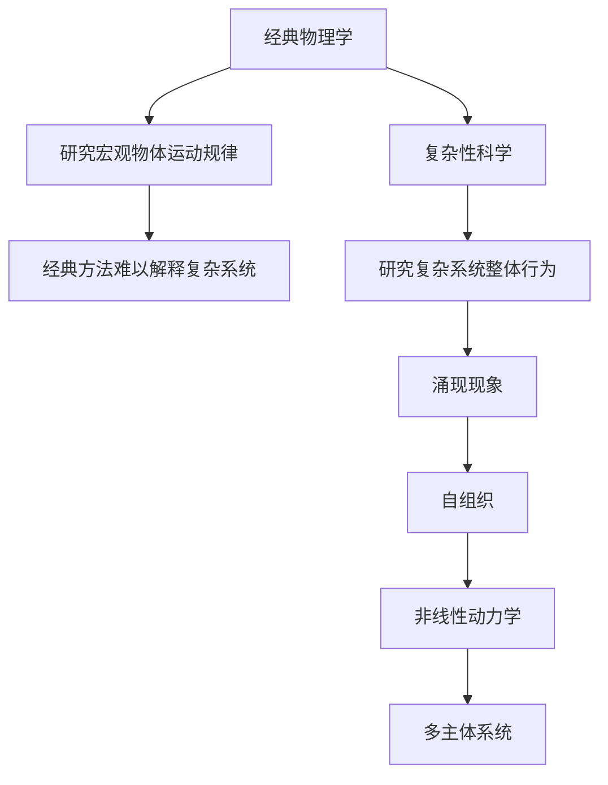
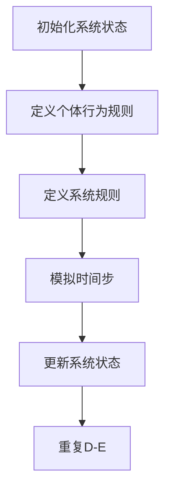

                 

# 从经典物理学到复杂性科学：理解涌现现象的新范式

> 关键词：复杂性科学, 涌现现象, 自组织, 非线性动力学, 多主体系统, 模拟与仿真, 机器学习

> 摘要：本文旨在探讨从经典物理学向复杂性科学的转变，特别是如何通过涌现现象来理解复杂系统的行为。我们将从基本概念出发，逐步深入到核心算法原理、数学模型和实际案例，最终探讨其在实际应用中的价值。通过本文，读者将能够掌握复杂性科学的基本框架，并了解如何利用这一理论来解决现实世界中的复杂问题。

## 1. 背景介绍
### 1.1 目的和范围
本文旨在为读者提供一个从经典物理学向复杂性科学过渡的视角，特别是通过涌现现象来理解复杂系统的行为。我们将探讨复杂性科学的核心概念、算法原理、数学模型以及实际应用案例。本文适合对复杂系统理论感兴趣的科研人员、工程师以及对新兴技术感兴趣的读者。

### 1.2 预期读者
- 复杂性科学领域的研究人员
- 工程师和开发者
- 对复杂系统理论感兴趣的科研人员
- 对新兴技术感兴趣的读者

### 1.3 文档结构概述
本文将按照以下结构展开：
1. 背景介绍
2. 核心概念与联系
3. 核心算法原理 & 具体操作步骤
4. 数学模型和公式 & 详细讲解 & 举例说明
5. 项目实战：代码实际案例和详细解释说明
6. 实际应用场景
7. 工具和资源推荐
8. 总结：未来发展趋势与挑战
9. 附录：常见问题与解答
10. 扩展阅读 & 参考资料

### 1.4 术语表
#### 1.4.1 核心术语定义
- **涌现现象**：复杂系统中，个体行为的简单规则通过相互作用产生出整体复杂行为的现象。
- **自组织**：系统自发地形成有序结构或模式的过程。
- **非线性动力学**：系统状态随时间变化的非线性关系。
- **多主体系统**：由多个独立个体组成的系统，每个个体都有自己的行为规则。
- **复杂性科学**：研究复杂系统及其行为的科学。

#### 1.4.2 相关概念解释
- **经典物理学**：研究宏观世界中物体运动规律的科学。
- **混沌理论**：研究非线性系统中看似随机但实际上是确定性的现象。
- **自适应系统**：能够根据环境变化调整自身行为的系统。

#### 1.4.3 缩略词列表
- **CA**：细胞自动机（Cellular Automata）
- **MAS**：多主体系统（Multi-Agent System）
- **PDE**：偏微分方程（Partial Differential Equation）

## 2. 核心概念与联系
### 2.1 经典物理学与复杂性科学
经典物理学主要研究宏观世界中物体的运动规律，如牛顿力学、热力学等。然而，对于复杂系统，经典物理学的方法往往难以解释其行为。复杂性科学则关注系统整体行为的涌现现象，通过研究个体行为的相互作用来理解整体行为。

### 2.2 涌现现象
涌现现象是指复杂系统中，个体行为的简单规则通过相互作用产生出整体复杂行为的现象。例如，蚂蚁群体能够形成复杂的觅食路径，这并不是单个蚂蚁所能够预见的。

### 2.3 自组织
自组织是指系统自发地形成有序结构或模式的过程。例如，水滴在光滑表面上会自发地形成有序的图案。

### 2.4 非线性动力学
非线性动力学研究系统状态随时间变化的非线性关系。非线性系统往往表现出混沌现象，即系统状态对初始条件极其敏感。

### 2.5 多主体系统
多主体系统是由多个独立个体组成的系统，每个个体都有自己的行为规则。通过个体行为的相互作用，系统整体表现出复杂行为。

### 2.6 核心概念流程图


## 3. 核心算法原理 & 具体操作步骤
### 3.1 模拟与仿真
模拟与仿真是研究复杂系统的重要方法。通过构建模型并模拟系统行为，可以更好地理解复杂系统的涌现现象。

### 3.2 伪代码示例


### 3.3 详细操作步骤
1. **初始化系统状态**：定义系统中个体的初始状态。
2. **定义个体行为规则**：为每个个体定义简单的行为规则。
3. **定义系统规则**：定义个体之间的相互作用规则。
4. **模拟时间步**：模拟系统在每个时间步的行为。
5. **更新系统状态**：根据个体行为规则和系统规则更新系统状态。
6. **重复模拟**：重复上述步骤，直到达到所需的模拟时间。

## 4. 数学模型和公式 & 详细讲解 & 举例说明
### 4.1 数学模型
数学模型是描述复杂系统行为的数学表达式。常见的数学模型包括偏微分方程（PDE）和细胞自动机（CA）。

### 4.2 偏微分方程
偏微分方程是描述系统状态随时间和空间变化的数学模型。例如，反应扩散方程可以描述化学反应和扩散过程。

### 4.3 细胞自动机
细胞自动机是一种离散的数学模型，通过定义细胞状态的更新规则来模拟系统行为。例如，Game of Life是一种经典的细胞自动机模型。

### 4.4 数学模型示例
#### 4.4.1 反应扩散方程
$$
\frac{\partial u}{\partial t} = D \nabla^2 u + f(u)
$$
其中，$u$表示系统状态，$D$是扩散系数，$f(u)$是反应项。

#### 4.4.2 Game of Life
细胞自动机的规则如下：
- 如果一个细胞周围有2或3个活细胞，则该细胞在下一个时间步仍然存活。
- 如果一个细胞周围有3个活细胞，则该细胞在下一个时间步变为活细胞。
- 其他情况下，细胞在下一个时间步死亡。

## 5. 项目实战：代码实际案例和详细解释说明
### 5.1 开发环境搭建
- **编程语言**：Python
- **开发工具**：Jupyter Notebook
- **库**：NumPy, Matplotlib, SciPy

### 5.2 源代码详细实现和代码解读
```python
import numpy as np
import matplotlib.pyplot as plt

# 初始化系统状态
def initialize_system(size):
    return np.random.choice([0, 1], size=(size, size))

# 定义个体行为规则
def update_cell(state, x, y):
    neighbors = [
        (x-1, y-1), (x, y-1), (x+1, y-1),
        (x-1, y), (x+1, y),
        (x-1, y+1), (x, y+1), (x+1, y+1)
    ]
    live_neighbors = sum(state[neighbor] for neighbor in neighbors if 0 <= neighbor[0] < state.shape[0] and 0 <= neighbor[1] < state.shape[1])
    if state[x, y] == 1:
        return 1 if live_neighbors in [2, 3] else 0
    else:
        return 1 if live_neighbors == 3 else 0

# 定义系统规则
def update_state(state):
    new_state = state.copy()
    for x in range(state.shape[0]):
        for y in range(state.shape[1]):
            new_state[x, y] = update_cell(state, x, y)
    return new_state

# 模拟时间步
def simulate(size, steps):
    state = initialize_system(size)
    for _ in range(steps):
        state = update_state(state)
        plt.imshow(state, cmap='gray')
        plt.show()

# 代码解读与分析
# 1. 初始化系统状态
# 2. 定义个体行为规则
# 3. 定义系统规则
# 4. 模拟时间步
# 5. 更新系统状态
```

### 5.3 代码解读与分析
- **初始化系统状态**：使用随机数生成器初始化系统状态。
- **定义个体行为规则**：根据Game of Life的规则更新每个细胞的状态。
- **定义系统规则**：定义细胞之间的相互作用规则。
- **模拟时间步**：模拟系统在每个时间步的行为。
- **更新系统状态**：根据个体行为规则和系统规则更新系统状态。

## 6. 实际应用场景
复杂性科学在多个领域都有广泛的应用，例如：
- **生态学**：研究生态系统中物种的相互作用。
- **经济学**：研究市场中的价格波动和供需关系。
- **社会学**：研究社会网络中的信息传播。
- **生物学**：研究细胞群体的行为。

## 7. 工具和资源推荐
### 7.1 学习资源推荐
#### 7.1.1 书籍推荐
- **《复杂性科学导论》**：深入浅出地介绍了复杂性科学的基本概念和方法。
- **《复杂系统与复杂性科学》**：详细讲解了复杂系统的研究方法和应用。

#### 7.1.2 在线课程
- **Coursera - 复杂系统导论**：由知名大学教授授课，内容丰富。
- **edX - 复杂性科学与系统建模**：提供了丰富的在线课程资源。

#### 7.1.3 技术博客和网站
- **Complexity Explorer**：提供了丰富的复杂性科学课程和资源。
- **Complexity Digest**：定期发布复杂性科学领域的最新研究进展。

### 7.2 开发工具框架推荐
#### 7.2.1 IDE和编辑器
- **PyCharm**：功能强大的Python开发环境。
- **Jupyter Notebook**：支持交互式编程和可视化。

#### 7.2.2 调试和性能分析工具
- **PyCharm Debugger**：强大的Python调试工具。
- **LineProfiler**：用于分析Python代码性能的工具。

#### 7.2.3 相关框架和库
- **NumPy**：用于数值计算的Python库。
- **Matplotlib**：用于数据可视化。
- **SciPy**：用于科学计算的Python库。

### 7.3 相关论文著作推荐
#### 7.3.1 经典论文
- **《A New Kind of Science》**：探讨了细胞自动机和复杂系统。
- **《Complexity: The Emerging Science at the Edge of Order and Chaos》**：深入探讨了复杂性科学的基本概念和方法。

#### 7.3.2 最新研究成果
- **《Emergence of Complex Behaviors in Multi-Agent Systems》**：探讨了多主体系统中的复杂行为。
- **《Complexity and Emergence in Social Systems》**：研究了社会系统中的复杂行为。

#### 7.3.3 应用案例分析
- **《Complexity in Ecology and Economics》**：探讨了复杂性科学在生态学和经济学中的应用。
- **《Complexity in Social Networks》**：研究了复杂性科学在社会网络中的应用。

## 8. 总结：未来发展趋势与挑战
复杂性科学在未来的发展中面临许多挑战，例如：
- **数据获取**：如何获取复杂系统中的大量数据。
- **模型构建**：如何构建准确的数学模型来描述复杂系统。
- **计算能力**：如何利用高性能计算资源来模拟复杂系统。

未来的发展趋势包括：
- **跨学科研究**：复杂性科学将与其他学科交叉融合，产生新的研究方向。
- **大数据分析**：利用大数据技术来分析复杂系统的行为。
- **人工智能**：利用机器学习和深度学习技术来模拟复杂系统。

## 9. 附录：常见问题与解答
### 9.1 问题1：如何获取复杂系统中的大量数据？
- **解答**：可以通过传感器网络、遥感技术等手段获取复杂系统中的数据。

### 9.2 问题2：如何构建准确的数学模型？
- **解答**：可以通过实验观察和理论推导相结合的方法来构建数学模型。

### 9.3 问题3：如何利用高性能计算资源来模拟复杂系统？
- **解答**：可以通过并行计算和分布式计算技术来利用高性能计算资源。

## 10. 扩展阅读 & 参考资料
- **《复杂性科学导论》**：深入浅出地介绍了复杂性科学的基本概念和方法。
- **《复杂系统与复杂性科学》**：详细讲解了复杂系统的研究方法和应用。
- **《A New Kind of Science》**：探讨了细胞自动机和复杂系统。
- **《Complexity: The Emerging Science at the Edge of Order and Chaos》**：深入探讨了复杂性科学的基本概念和方法。
- **《Emergence of Complex Behaviors in Multi-Agent Systems》**：探讨了多主体系统中的复杂行为。
- **《Complexity in Ecology and Economics》**：探讨了复杂性科学在生态学和经济学中的应用。
- **《Complexity in Social Networks》**：研究了复杂性科学在社会网络中的应用。

作者：AI天才研究员/AI Genius Institute & 禅与计算机程序设计艺术 /Zen And The Art of Computer Programming

