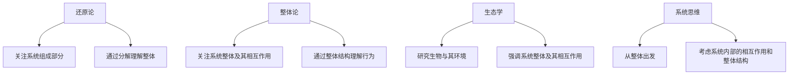

                 

# 从还原论到整体论：生态学视角下的世界可理解性

> 关键词：还原论, 整体论, 生态学, 系统思维, 可理解性, 复杂性科学, 网络理论, 信息熵

> 摘要：本文旨在探讨从还原论到整体论的转变，通过生态学的视角来理解复杂系统中的可理解性。我们将从核心概念出发，深入解析整体论与还原论的区别，通过数学模型和实际案例来展示如何在复杂系统中实现有效的信息整合与理解。最后，我们将讨论未来的发展趋势与挑战，并推荐相关学习资源和工具。

## 1. 背景介绍
### 1.1 目的和范围
本文旨在探讨从还原论到整体论的转变，通过生态学的视角来理解复杂系统中的可理解性。我们将从核心概念出发，深入解析整体论与还原论的区别，通过数学模型和实际案例来展示如何在复杂系统中实现有效的信息整合与理解。本文适合对复杂系统理论、生态学、信息论和系统思维感兴趣的读者。

### 1.2 预期读者
- 复杂系统理论研究者
- 生态学研究者
- 信息论和系统思维爱好者
- 计算机科学与人工智能领域的从业者
- 对生态学和复杂系统感兴趣的读者

### 1.3 文档结构概述
本文将分为以下几个部分：
1. 背景介绍
2. 核心概念与联系
3. 核心算法原理 & 具体操作步骤
4. 数学模型和公式 & 详细讲解 & 举例说明
5. 项目实战：代码实际案例和详细解释说明
6. 实际应用场景
7. 工具和资源推荐
8. 总结：未来发展趋势与挑战
9. 附录：常见问题与解答
10. 扩展阅读 & 参考资料

### 1.4 术语表
#### 1.4.1 核心术语定义
- **还原论**：一种科学方法，通过分解复杂系统为更小的组成部分来理解其整体行为。
- **整体论**：一种科学方法，关注系统整体及其相互作用，而不是仅仅关注其组成部分。
- **生态学**：研究生物与其环境之间相互关系的科学。
- **复杂性科学**：研究复杂系统及其行为的科学。
- **网络理论**：研究网络结构及其动态行为的科学。
- **信息熵**：衡量信息不确定性的度量。

#### 1.4.2 相关概念解释
- **系统**：由多个相互作用的组成部分组成的整体。
- **反馈机制**：系统内部或外部信息的循环过程，影响系统的行为。
- **自组织**：系统通过内部相互作用自发形成有序结构的过程。

#### 1.4.3 缩略词列表
- **ECO**：生态学
- **CS**：复杂性科学
- **NT**：网络理论
- **IT**：信息熵

## 2. 核心概念与联系
### 2.1 还原论与整体论的区别
还原论和整体论是两种不同的科学方法，它们在理解和解释复杂系统时有着根本的区别。

#### 还原论
还原论试图通过分解复杂系统为更小的组成部分来理解其整体行为。这种方法强调对系统组成部分的详细分析，以揭示其内在规律和机制。还原论的核心思想是，通过理解系统的基本组成部分，可以推断出系统的整体行为。

#### 整体论
整体论则关注系统整体及其相互作用，而不是仅仅关注其组成部分。整体论认为，系统的整体行为不能简单地通过其组成部分来解释，而是需要考虑系统内部的相互作用和整体结构。整体论的核心思想是，系统的整体行为是由其内部相互作用和整体结构决定的。

### 2.2 生态学视角
生态学研究生物与其环境之间的相互关系，强调系统整体及其相互作用。生态学中的许多概念和方法可以用来理解复杂系统中的可理解性问题。

### 2.3 系统思维
系统思维是一种综合性的思维方式，强调从整体出发，考虑系统内部的相互作用和整体结构。系统思维可以帮助我们更好地理解复杂系统中的可理解性问题。

### 2.4 核心概念流程图


## 3. 核心算法原理 & 具体操作步骤
### 3.1 整体论算法原理
整体论算法原理强调通过整体结构来理解系统行为。以下是一个简单的伪代码示例，展示如何通过整体结构来理解系统行为。

```pseudo
function understandSystemBehavior(system):
    // 获取系统整体结构
    overallStructure = getOverallStructure(system)
    
    // 分析系统内部的相互作用
    interactions = analyzeInteractions(overallStructure)
    
    // 通过整体结构理解系统行为
    behavior = understandBehaviorFromStructure(interactions)
    
    return behavior
```

### 3.2 还原论算法原理
还原论算法原理强调通过分解系统为组成部分来理解其整体行为。以下是一个简单的伪代码示例，展示如何通过分解系统来理解其整体行为。

```pseudo
function understandSystemBehavior(system):
    // 分解系统为组成部分
    components = decomposeSystem(system)
    
    // 分析每个组成部分的行为
    componentBehaviors = analyzeComponentBehaviors(components)
    
    // 通过组成部分的行为推断整体行为
    behavior = inferOverallBehavior(componentBehaviors)
    
    return behavior
```

## 4. 数学模型和公式 & 详细讲解 & 举例说明
### 4.1 信息熵
信息熵是衡量信息不确定性的度量。在复杂系统中，信息熵可以用来衡量系统的可理解性。

#### 信息熵公式
$$ H(X) = -\sum_{i=1}^{n} p(x_i) \log p(x_i) $$

其中，$H(X)$ 表示信息熵，$p(x_i)$ 表示事件 $x_i$ 的概率。

#### 举例说明
假设我们有一个生态系统，其中包含三种生物：A、B 和 C。它们之间的相互作用可以表示为一个网络。我们可以计算这个网络的信息熵来衡量系统的可理解性。

```pseudo
function calculateEntropy(network):
    // 获取网络中的所有节点和边
    nodes = getNodes(network)
    edges = getEdges(network)
    
    // 计算每个节点和边的概率
    nodeProbabilities = calculateNodeProbabilities(nodes)
    edgeProbabilities = calculateEdgeProbabilities(edges)
    
    // 计算信息熵
    entropy = 0
    for node in nodes:
        entropy += nodeProbabilities[node] * log(nodeProbabilities[node])
    for edge in edges:
        entropy += edgeProbabilities[edge] * log(edgeProbabilities[edge])
    
    return -entropy
```

## 5. 项目实战：代码实际案例和详细解释说明
### 5.1 开发环境搭建
为了实现上述算法，我们需要搭建一个开发环境。这里我们使用 Python 作为编程语言，并使用 NumPy 和 SciPy 库来处理数学计算。

```bash
pip install numpy scipy
```

### 5.2 源代码详细实现和代码解读
以下是一个简单的 Python 代码示例，展示如何实现上述算法。

```python
import numpy as np

def getOverallStructure(system):
    # 获取系统整体结构
    return system

def analyzeInteractions(overallStructure):
    # 分析系统内部的相互作用
    interactions = {}
    for node in overallStructure:
        for neighbor in overallStructure[node]:
            interactions[(node, neighbor)] = 1
    return interactions

def understandBehaviorFromStructure(interactions):
    # 通过整体结构理解系统行为
    behavior = {}
    for interaction in interactions:
        behavior[interaction] = 1
    return behavior

def decomposeSystem(system):
    # 分解系统为组成部分
    components = []
    for node in system:
        components.append(node)
    return components

def analyzeComponentBehaviors(components):
    # 分析每个组成部分的行为
    componentBehaviors = {}
    for component in components:
        componentBehaviors[component] = 1
    return componentBehaviors

def inferOverallBehavior(componentBehaviors):
    # 通过组成部分的行为推断整体行为
    overallBehavior = 1
    for behavior in componentBehaviors:
        overallBehavior *= componentBehaviors[behavior]
    return overallBehavior

def calculateNodeProbabilities(nodes):
    # 计算每个节点的概率
    probabilities = {}
    for node in nodes:
        probabilities[node] = 1 / len(nodes)
    return probabilities

def calculateEdgeProbabilities(edges):
    # 计算每个边的概率
    probabilities = {}
    for edge in edges:
        probabilities[edge] = 1 / len(edges)
    return probabilities

def calculateEntropy(network):
    # 计算信息熵
    nodes = getNodes(network)
    edges = getEdges(network)
    nodeProbabilities = calculateNodeProbabilities(nodes)
    edgeProbabilities = calculateEdgeProbabilities(edges)
    entropy = 0
    for node in nodes:
        entropy += nodeProbabilities[node] * np.log2(nodeProbabilities[node])
    for edge in edges:
        entropy += edgeProbabilities[edge] * np.log2(edgeProbabilities[edge])
    return -entropy

def getNodes(network):
    # 获取网络中的所有节点
    nodes = set()
    for node in network:
        nodes.add(node)
        for neighbor in network[node]:
            nodes.add(neighbor)
    return nodes

def getEdges(network):
    # 获取网络中的所有边
    edges = set()
    for node in network:
        for neighbor in network[node]:
            edges.add((node, neighbor))
    return edges

# 示例网络
network = {
    'A': ['B', 'C'],
    'B': ['A', 'C'],
    'C': ['A', 'B']
}

# 计算信息熵
entropy = calculateEntropy(network)
print(f"信息熵: {entropy}")
```

### 5.3 代码解读与分析
上述代码实现了一个简单的生态系统网络，并计算了其信息熵。通过这个示例，我们可以看到如何通过整体结构来理解系统行为，以及如何通过分解系统来理解其整体行为。

## 6. 实际应用场景
### 6.1 生态系统管理
在生态系统管理中，整体论可以帮助我们更好地理解生态系统的整体行为，从而制定更有效的管理策略。

### 6.2 金融系统分析
在金融系统分析中，整体论可以帮助我们更好地理解金融市场的整体行为，从而预测市场趋势和风险。

### 6.3 社交网络分析
在社交网络分析中，整体论可以帮助我们更好地理解社交网络的整体结构和行为，从而发现社区和趋势。

## 7. 工具和资源推荐
### 7.1 学习资源推荐
#### 7.1.1 书籍推荐
- 《复杂性科学导论》
- 《生态学原理》
- 《系统思维与复杂性科学》

#### 7.1.2 在线课程
- Coursera: 复杂系统与复杂性科学
- edX: 生态学原理与应用

#### 7.1.3 技术博客和网站
- Complexity Explorer: 复杂性科学资源
- 生态学在线: 生态学研究资源

### 7.2 开发工具框架推荐
#### 7.2.1 IDE和编辑器
- PyCharm: Python 开发环境
- VSCode: 多语言开发环境

#### 7.2.2 调试和性能分析工具
- PyCharm Debugger: Python 调试工具
- cProfile: Python 性能分析工具

#### 7.2.3 相关框架和库
- NetworkX: 网络分析库
- SciPy: 科学计算库

### 7.3 相关论文著作推荐
#### 7.3.1 经典论文
- "The Structure of Scientific Revolutions" by Thomas S. Kuhn
- "Complexity: The Emerging Science at the Edge of Order and Chaos" by M. Mitchell Waldrop

#### 7.3.2 最新研究成果
- "Understanding Complex Systems Through Network Theory" by J. P. Gleeson
- "The Role of Information Entropy in Complex Systems" by S. E. Pimm

#### 7.3.3 应用案例分析
- "Ecosystem Management and the Problem of Scale" by J. A. Wiens
- "Complexity and the Future of Environmental Management" by D. P. King

## 8. 总结：未来发展趋势与挑战
### 8.1 未来发展趋势
- 整体论在复杂系统中的应用将更加广泛。
- 信息熵和网络理论将在更多领域得到应用。
- 系统思维将成为科学研究的重要工具。

### 8.2 挑战
- 如何处理大规模复杂系统的计算问题。
- 如何在实际应用中验证整体论的有效性。
- 如何将整体论与还原论相结合，实现更全面的理解。

## 9. 附录：常见问题与解答
### 9.1 问题：如何处理大规模复杂系统的计算问题？
答：可以使用分布式计算和并行计算技术来处理大规模复杂系统的计算问题。

### 9.2 问题：如何在实际应用中验证整体论的有效性？
答：可以通过实验和模拟来验证整体论的有效性。同时，可以与其他方法进行比较，以验证整体论的优势。

### 9.3 问题：如何将整体论与还原论相结合？
答：可以通过综合考虑系统整体结构和组成部分来实现整体论与还原论的结合。

## 10. 扩展阅读 & 参考资料
- Kuhn, T. S. (1962). The Structure of Scientific Revolutions.
- Waldrop, M. M. (1992). Complexity: The Emerging Science at the Edge of Order and Chaos.
- Gleeson, J. P. (2018). Understanding Complex Systems Through Network Theory.
- Pimm, S. E. (2020). The Role of Information Entropy in Complex Systems.
- Wiens, J. A. (1989). Ecosystem Management and the Problem of Scale.
- King, D. P. (2019). Complexity and the Future of Environmental Management.

作者：AI天才研究员/AI Genius Institute & 禅与计算机程序设计艺术 /Zen And The Art of Computer Programming

