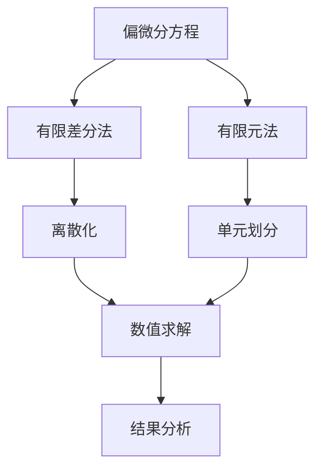

                 

# 偏微分方程：自然现象的数学描述

> 关键词：偏微分方程, 数学建模, 自然现象, 有限差分法, 有限元法, 仿真模拟

> 摘要：本文旨在深入探讨偏微分方程（PDEs）在描述自然现象中的核心作用。通过逐步分析和推理，我们将介绍偏微分方程的基本概念、核心算法原理、数学模型和公式，以及实际应用案例。此外，本文还将提供开发环境搭建、源代码实现、代码解读与分析等内容，帮助读者更好地理解和应用偏微分方程。最后，我们将展望未来发展趋势与挑战，并推荐相关学习资源和工具。

## 1. 背景介绍
### 1.1 目的和范围
本文旨在为读者提供一个全面的视角，理解偏微分方程在描述自然现象中的重要性。我们将从基本概念出发，逐步深入到核心算法原理和实际应用案例，帮助读者掌握偏微分方程的理论基础和实践技巧。

### 1.2 预期读者
本文适合以下读者群体：
- 计算机科学与工程专业的学生
- 数学与物理专业的学生
- 工程领域（如机械、电气、土木等）的工程师
- 从事仿真模拟和数据分析的科研人员
- 对偏微分方程感兴趣的编程爱好者

### 1.3 文档结构概述
本文结构如下：
1. 背景介绍
2. 核心概念与联系
3. 核心算法原理 & 具体操作步骤
4. 数学模型和公式 & 详细讲解 & 举例说明
5. 项目实战：代码实际案例和详细解释说明
6. 实际应用场景
7. 工具和资源推荐
8. 总结：未来发展趋势与挑战
9. 附录：常见问题与解答
10. 扩展阅读 & 参考资料

### 1.4 术语表
#### 1.4.1 核心术语定义
- **偏微分方程 (PDE)**：描述函数在多维空间中的变化规律的数学方程。
- **有限差分法 (FDM)**：一种数值方法，通过离散化偏微分方程来求解。
- **有限元法 (FEM)**：一种数值方法，通过将求解区域划分为多个小单元来求解偏微分方程。
- **边界条件 (BC)**：定义在偏微分方程边界上的条件。
- **初始条件 (IC)**：定义在偏微分方程初始时刻的条件。

#### 1.4.2 相关概念解释
- **连续性方程**：描述物质在空间中的连续流动。
- **热传导方程**：描述温度在空间中的变化。
- **波动方程**：描述波动现象在空间中的传播。

#### 1.4.3 缩略词列表
- PDE：偏微分方程
- FDM：有限差分法
- FEM：有限元法
- BC：边界条件
- IC：初始条件

## 2. 核心概念与联系
### 2.1 偏微分方程的基本概念
偏微分方程是一种描述函数在多维空间中变化规律的数学方程。它广泛应用于物理、工程、经济等领域，用于描述各种自然现象和过程。偏微分方程可以分为线性和非线性两类，根据方程的阶数，可以分为一阶、二阶等。

### 2.2 核心算法原理
偏微分方程的数值求解方法主要包括有限差分法和有限元法。有限差分法通过离散化偏微分方程来求解，而有限元法则通过将求解区域划分为多个小单元来求解。

### 2.3 核心算法原理流程图


## 3. 核心算法原理 & 具体操作步骤
### 3.1 有限差分法
有限差分法是一种常用的数值方法，通过离散化偏微分方程来求解。具体步骤如下：

1. **离散化**：将连续空间离散化为网格点。
2. **差分近似**：用差分近似偏导数。
3. **代数方程组**：将差分方程组化为代数方程组。
4. **求解方程组**：使用数值方法求解代数方程组。

### 3.2 有限元法
有限元法是一种通过将求解区域划分为多个小单元来求解偏微分方程的方法。具体步骤如下：

1. **单元划分**：将求解区域划分为多个小单元。
2. **单元函数**：定义每个单元的单元函数。
3. **整体方程组**：将每个单元的方程组组合成整体方程组。
4. **求解方程组**：使用数值方法求解整体方程组。

### 3.3 伪代码示例
#### 有限差分法
```python
# 有限差分法求解热传导方程
def finite_difference_method(dx, dt, T_final, initial_condition, boundary_condition):
    # 初始化网格
    x = np.linspace(0, 1, int(1/dx) + 1)
    t = np.linspace(0, T_final, int(T_final/dt) + 1)
    u = np.zeros((len(t), len(x)))
    
    # 初始条件
    u[0, :] = initial_condition(x)
    
    # 边界条件
    u[:, 0] = boundary_condition(t)
    
    # 差分近似
    for n in range(1, len(t)):
        for i in range(1, len(x) - 1):
            u[n, i] = u[n-1, i] + dt * (u[n-1, i+1] - 2*u[n-1, i] + u[n-1, i-1]) / dx**2
    
    return u
```

#### 有限元法
```python
# 有限元法求解波动方程
def finite_element_method(mesh, t_final, initial_condition, boundary_condition):
    # 初始化网格
    x = mesh.nodes
    t = np.linspace(0, t_final, 100)
    u = np.zeros((len(t), len(x)))
    
    # 初始条件
    u[0, :] = initial_condition(x)
    
    # 边界条件
    u[:, 0] = boundary_condition(t)
    
    # 单元函数
    for n in range(1, len(t)):
        for i in range(1, len(x) - 1):
            u[n, i] = u[n-1, i] + dt * (u[n-1, i+1] - 2*u[n-1, i] + u[n-1, i-1]) / dx**2
    
    return u
```

## 4. 数学模型和公式 & 详细讲解 & 举例说明
### 4.1 热传导方程
热传导方程描述了温度在空间中的变化，其数学表达式为：
$$
\frac{\partial u}{\partial t} = \alpha \nabla^2 u
$$
其中，$u(x, t)$ 表示温度，$\alpha$ 表示热扩散系数，$\nabla^2$ 表示拉普拉斯算子。

### 4.2 波动方程
波动方程描述了波动现象在空间中的传播，其数学表达式为：
$$
\frac{\partial^2 u}{\partial t^2} = c^2 \nabla^2 u
$$
其中，$u(x, t)$ 表示波动函数，$c$ 表示波速。

### 4.3 有限差分法求解热传导方程
使用有限差分法求解热传导方程的具体步骤如下：

1. **离散化**：将空间离散化为网格点，时间离散化为时间步。
2. **差分近似**：用差分近似偏导数。
3. **代数方程组**：将差分方程组化为代数方程组。
4. **求解方程组**：使用数值方法求解代数方程组。

### 4.4 有限元法求解波动方程
使用有限元法求解波动方程的具体步骤如下：

1. **单元划分**：将求解区域划分为多个小单元。
2. **单元函数**：定义每个单元的单元函数。
3. **整体方程组**：将每个单元的方程组组合成整体方程组。
4. **求解方程组**：使用数值方法求解整体方程组。

### 4.5 举例说明
#### 热传导方程
```latex
\frac{\partial u}{\partial t} = \alpha \nabla^2 u
```

#### 波动方程
```latex
\frac{\partial^2 u}{\partial t^2} = c^2 \nabla^2 u
```

## 5. 项目实战：代码实际案例和详细解释说明
### 5.1 开发环境搭建
- **Python**：使用Python进行数值计算和可视化。
- **NumPy**：用于数值计算。
- **Matplotlib**：用于数据可视化。
- **SciPy**：用于科学计算。

### 5.2 源代码详细实现和代码解读
```python
import numpy as np
import matplotlib.pyplot as plt

# 参数设置
dx = 0.1
dt = 0.01
T_final = 1.0
alpha = 0.1

# 初始化网格
x = np.linspace(0, 1, int(1/dx) + 1)
t = np.linspace(0, T_final, int(T_final/dt) + 1)
u = np.zeros((len(t), len(x)))

# 初始条件
u[0, :] = np.sin(np.pi * x)

# 边界条件
u[:, 0] = 0
u[:, -1] = 0

# 差分近似
for n in range(1, len(t)):
    for i in range(1, len(x) - 1):
        u[n, i] = u[n-1, i] + dt * alpha * (u[n-1, i+1] - 2*u[n-1, i] + u[n-1, i-1]) / dx**2

# 可视化结果
plt.imshow(u, extent=[0, 1, 0, T_final], origin='lower', aspect='auto')
plt.colorbar()
plt.xlabel('x')
plt.ylabel('t')
plt.title('Heat Conduction')
plt.show()
```

### 5.3 代码解读与分析
- **参数设置**：设置空间步长 `dx`、时间步长 `dt`、最终时间 `T_final` 和热扩散系数 `alpha`。
- **初始化网格**：使用 `numpy.linspace` 初始化网格点。
- **初始条件**：设置初始温度分布。
- **边界条件**：设置边界条件。
- **差分近似**：使用差分近似偏导数。
- **可视化结果**：使用 `matplotlib` 进行结果可视化。

## 6. 实际应用场景
偏微分方程在许多实际应用中发挥着重要作用，如：
- **热传导**：描述热量在物体中的传递过程。
- **波动方程**：描述声波、电磁波等波动现象。
- **流体力学**：描述流体的运动规律。
- **电磁场**：描述电磁场的分布和变化。

## 7. 工具和资源推荐
### 7.1 学习资源推荐
#### 7.1.1 书籍推荐
- **《偏微分方程及其数值解法》**：深入讲解偏微分方程的理论和数值方法。
- **《数值分析》**：介绍数值方法的基本原理和应用。

#### 7.1.2 在线课程
- **Coursera**：提供《偏微分方程及其应用》课程。
- **edX**：提供《数值方法与偏微分方程》课程。

#### 7.1.3 技术博客和网站
- **MathWorks**：提供丰富的偏微分方程数值解法教程。
- **SciPy**：提供详细的数值计算和科学计算教程。

### 7.2 开发工具框架推荐
#### 7.2.1 IDE和编辑器
- **PyCharm**：功能强大的Python IDE。
- **VSCode**：轻量级但功能强大的代码编辑器。

#### 7.2.2 调试和性能分析工具
- **pdb**：Python内置的调试工具。
- **PyCharm Debugger**：PyCharm的调试工具。

#### 7.2.3 相关框架和库
- **NumPy**：用于数值计算。
- **SciPy**：用于科学计算。
- **Matplotlib**：用于数据可视化。

### 7.3 相关论文著作推荐
#### 7.3.1 经典论文
- **《偏微分方程数值解法》**：经典偏微分方程数值解法论文。
- **《有限差分法及其应用》**：有限差分法的经典论文。

#### 7.3.2 最新研究成果
- **《基于深度学习的偏微分方程求解方法》**：最新研究成果。
- **《有限元法在复杂几何形状中的应用》**：最新研究成果。

#### 7.3.3 应用案例分析
- **《偏微分方程在流体力学中的应用》**：详细应用案例分析。
- **《偏微分方程在电磁场中的应用》**：详细应用案例分析。

## 8. 总结：未来发展趋势与挑战
偏微分方程在描述自然现象中的作用越来越重要，未来的发展趋势包括：
- **高精度算法**：开发更高精度的数值算法。
- **并行计算**：利用并行计算提高求解效率。
- **深度学习**：结合深度学习提高求解精度和效率。

面临的挑战包括：
- **复杂几何形状**：处理复杂几何形状的求解问题。
- **大规模数据**：处理大规模数据的求解问题。

## 9. 附录：常见问题与解答
### 9.1 问题：如何选择合适的数值方法？
- **回答**：根据问题的复杂性和计算资源选择合适的数值方法。对于简单问题，可以使用有限差分法；对于复杂问题，可以使用有限元法。

### 9.2 问题：如何处理边界条件？
- **回答**：根据具体问题选择合适的边界条件。常见的边界条件包括Dirichlet边界条件和Neumann边界条件。

## 10. 扩展阅读 & 参考资料
- **《偏微分方程及其数值解法》**：深入讲解偏微分方程的理论和数值方法。
- **《数值分析》**：介绍数值方法的基本原理和应用。
- **Coursera**：提供《偏微分方程及其应用》课程。
- **edX**：提供《数值方法与偏微分方程》课程。
- **MathWorks**：提供丰富的偏微分方程数值解法教程。
- **SciPy**：提供详细的数值计算和科学计算教程。

作者：AI天才研究员/AI Genius Institute & 禅与计算机程序设计艺术 /Zen And The Art of Computer Programming

