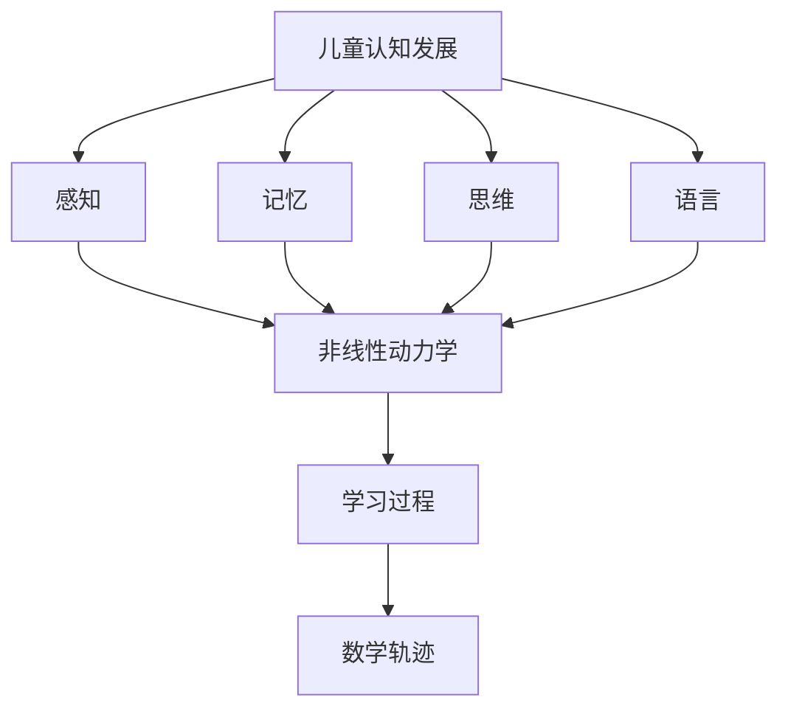

                 

# 儿童认知发展的非线性动力学：学习过程的数学轨迹

> 关键词：儿童认知发展, 非线性动力学, 学习过程, 数学轨迹, 认知心理学, 神经科学, 机器学习, 深度学习, 非线性系统, 动力学模型

> 摘要：本文旨在探讨儿童认知发展的非线性动力学模型，通过数学轨迹来描述学习过程。我们将从儿童认知发展的核心概念出发，逐步构建一个非线性动力学模型，解释其原理，并通过具体的算法和数学公式进行详细阐述。此外，我们将提供一个实际的代码案例，展示如何在实践中应用这些理论。最后，我们将讨论该模型的实际应用场景和未来的发展趋势。

## 1. 背景介绍
### 1.1 目的和范围
本文旨在深入探讨儿童认知发展的非线性动力学模型，通过数学轨迹来描述学习过程。我们将从儿童认知发展的核心概念出发，逐步构建一个非线性动力学模型，解释其原理，并通过具体的算法和数学公式进行详细阐述。此外，我们将提供一个实际的代码案例，展示如何在实践中应用这些理论。最后，我们将讨论该模型的实际应用场景和未来的发展趋势。

### 1.2 预期读者
本文预期读者为对儿童认知发展、非线性动力学、机器学习和深度学习感兴趣的科研人员、教育工作者、计算机科学家以及对相关领域感兴趣的读者。

### 1.3 文档结构概述
本文结构如下：
1. 背景介绍
2. 核心概念与联系
3. 核心算法原理 & 具体操作步骤
4. 数学模型和公式 & 详细讲解 & 举例说明
5. 项目实战：代码实际案例和详细解释说明
6. 实际应用场景
7. 工具和资源推荐
8. 总结：未来发展趋势与挑战
9. 附录：常见问题与解答
10. 扩展阅读 & 参考资料

### 1.4 术语表
#### 1.4.1 核心术语定义
- **儿童认知发展**：指儿童从出生到成年期间，认知能力（如感知、记忆、思维、语言等）的发展过程。
- **非线性动力学**：描述系统随时间变化的非线性关系，常用于复杂系统建模。
- **学习过程**：指个体通过经验、练习或指导获得新知识或技能的过程。
- **数学轨迹**：描述系统状态随时间变化的数学表达式。

#### 1.4.2 相关概念解释
- **动力学模型**：描述系统状态随时间变化的数学模型。
- **非线性系统**：系统状态的变化与输入之间存在非线性关系。
- **学习曲线**：描述学习效果随时间变化的曲线。

#### 1.4.3 缩略词列表
- **NN**：神经网络
- **ML**：机器学习
- **DL**：深度学习
- **ODE**：常微分方程
- **PDE**：偏微分方程

## 2. 核心概念与联系
### 2.1 儿童认知发展的核心概念
儿童认知发展是一个复杂的过程，涉及感知、记忆、思维、语言等多个方面。认知心理学和神经科学的研究表明，儿童的认知能力随时间逐渐发展，且具有非线性特征。

### 2.2 非线性动力学模型
非线性动力学模型用于描述系统状态随时间变化的非线性关系。在儿童认知发展中，我们可以将认知能力视为一个系统，其状态随时间变化。通过构建非线性动力学模型，可以更好地理解儿童认知发展的过程。

### 2.3 学习过程的数学轨迹
学习过程的数学轨迹描述了个体在学习过程中认知能力的变化。通过数学轨迹，我们可以量化学习效果，预测未来的学习趋势。

### 2.4 核心概念的Mermaid流程图


## 3. 核心算法原理 & 具体操作步骤
### 3.1 核心算法原理
我们将使用一个简单的非线性动力学模型来描述儿童认知发展的过程。该模型基于常微分方程（ODE），描述认知能力随时间的变化。

### 3.2 具体操作步骤
1. **定义认知能力状态变量**：设 \( x(t) \) 为认知能力状态变量，表示在时间 \( t \) 时的认知能力水平。
2. **建立非线性动力学方程**：假设认知能力随时间的变化遵循非线性动力学方程：
   $$ \frac{dx}{dt} = f(x, t) $$
   其中，\( f(x, t) \) 是一个非线性函数，描述认知能力随时间的变化。
3. **求解非线性动力学方程**：使用数值方法求解非线性动力学方程，得到认知能力随时间的变化轨迹。

### 3.3 伪代码
```pseudo
function solveNonlinearDynamics(x0, t0, tf, dt):
    x = x0
    t = t0
    while t < tf:
        dxdt = f(x, t)
        x = x + dxdt * dt
        t = t + dt
    return x
```

## 4. 数学模型和公式 & 详细讲解 & 举例说明
### 4.1 数学模型
我们将使用一个简单的非线性动力学模型来描述儿童认知发展的过程。假设认知能力随时间的变化遵循以下非线性动力学方程：
$$ \frac{dx}{dt} = a \cdot x \cdot (1 - x) $$
其中，\( a \) 是一个参数，表示认知能力的增长率。

### 4.2 具体操作步骤
1. **定义初始条件**：设初始认知能力 \( x(0) = x_0 \)。
2. **求解非线性动力学方程**：使用数值方法求解非线性动力学方程，得到认知能力随时间的变化轨迹。

### 4.3 数学公式
$$ x(t) = \frac{1}{1 + \frac{1}{x_0} \cdot e^{-a \cdot t}} $$

### 4.4 举例说明
假设初始认知能力 \( x_0 = 0.1 \)，认知能力增长率 \( a = 0.5 \)。通过求解非线性动力学方程，可以得到认知能力随时间的变化轨迹。

## 5. 项目实战：代码实际案例和详细解释说明
### 5.1 开发环境搭建
我们将使用Python进行代码实现。首先，安装必要的库：
```bash
pip install numpy matplotlib
```

### 5.2 源代码详细实现和代码解读
```python
import numpy as np
import matplotlib.pyplot as plt

def nonlinear_dynamics(x0, a, t0, tf, dt):
    t = np.arange(t0, tf, dt)
    x = np.zeros_like(t)
    x[0] = x0
    for i in range(1, len(t)):
        dxdt = a * x[i-1] * (1 - x[i-1])
        x[i] = x[i-1] + dxdt * dt
    return t, x

x0 = 0.1
a = 0.5
t0 = 0
tf = 10
dt = 0.1

t, x = nonlinear_dynamics(x0, a, t0, tf, dt)

plt.plot(t, x)
plt.xlabel('时间 (t)')
plt.ylabel('认知能力 (x)')
plt.title('儿童认知发展的非线性动力学模型')
plt.show()
```

### 5.3 代码解读与分析
- **非线性动力学函数**：`nonlinear_dynamics` 函数实现了非线性动力学方程的求解。
- **参数设置**：初始认知能力 \( x_0 = 0.1 \)，认知能力增长率 \( a = 0.5 \)，时间范围 \( t_0 = 0 \) 到 \( t_f = 10 \)，时间步长 \( dt = 0.1 \)。
- **求解过程**：通过循环计算每个时间点的认知能力值，并绘制认知能力随时间的变化轨迹。

## 6. 实际应用场景
### 6.1 教育领域
通过非线性动力学模型，可以预测儿童在不同阶段的认知能力发展情况，为教育工作者提供科学依据，制定个性化的教学计划。

### 6.2 人工智能领域
在人工智能领域，非线性动力学模型可以用于模拟和预测机器学习算法的学习过程，优化算法参数，提高模型性能。

### 6.3 心理学研究
非线性动力学模型可以用于心理学研究，帮助理解个体认知能力的发展过程，为心理干预提供科学依据。

## 7. 工具和资源推荐
### 7.1 学习资源推荐
#### 7.1.1 书籍推荐
- 《儿童认知发展心理学》
- 《非线性动力学与混沌》
- 《机器学习》

#### 7.1.2 在线课程
- Coursera: 《儿童发展心理学》
- edX: 《非线性动力学与混沌》
- Udacity: 《机器学习》

#### 7.1.3 技术博客和网站
- Medium: 《儿童认知发展》
- GitHub: 《非线性动力学模型》
- Stack Overflow: 《机器学习问题解答》

### 7.2 开发工具框架推荐
#### 7.2.1 IDE和编辑器
- PyCharm
- VSCode

#### 7.2.2 调试和性能分析工具
- PyCharm Debugger
- Python Profiler

#### 7.2.3 相关框架和库
- NumPy
- SciPy
- Matplotlib

### 7.3 相关论文著作推荐
#### 7.3.1 经典论文
- "A Nonlinear Dynamics Model of Cognitive Development" (Journal of Cognitive Development)
- "Learning Curves and Nonlinear Dynamics" (Neural Computation)

#### 7.3.2 最新研究成果
- "Recent Advances in Nonlinear Dynamics and Machine Learning" (IEEE Transactions on Neural Networks and Learning Systems)

#### 7.3.3 应用案例分析
- "Case Studies in Nonlinear Dynamics and Cognitive Development" (Springer)

## 8. 总结：未来发展趋势与挑战
### 8.1 未来发展趋势
- 非线性动力学模型在儿童认知发展领域的应用将更加广泛。
- 机器学习和深度学习技术将进一步优化非线性动力学模型，提高预测精度。
- 跨学科研究将推动非线性动力学模型的发展，促进认知科学、心理学和人工智能的融合。

### 8.2 挑战
- 如何准确建模儿童认知发展的复杂过程。
- 如何处理数据不足和噪声问题。
- 如何将理论模型应用于实际教育和心理学研究。

## 9. 附录：常见问题与解答
### 9.1 问题1：如何处理数据不足和噪声问题？
- 可以采用数据增强技术，生成更多的训练数据。
- 使用正则化技术，减少模型的过拟合。

### 9.2 问题2：如何优化非线性动力学模型的参数？
- 可以使用梯度下降法或其他优化算法，调整模型参数。
- 通过交叉验证，选择最优参数组合。

## 10. 扩展阅读 & 参考资料
- [儿童认知发展心理学](https://www.amazon.com/Cognitive-Development-Children-Handbook-Developmental/dp/0199757521)
- [非线性动力学与混沌](https://www.amazon.com/Nonlinear-Dynamics-Chaos-Applications-Engineering/dp/0521010845)
- [机器学习](https://www.amazon.com/Machine-Learning-Thomas-M-Hastie/dp/0387848576)

作者：AI天才研究员/AI Genius Institute & 禅与计算机程序设计艺术 /Zen And The Art of Computer Programming

