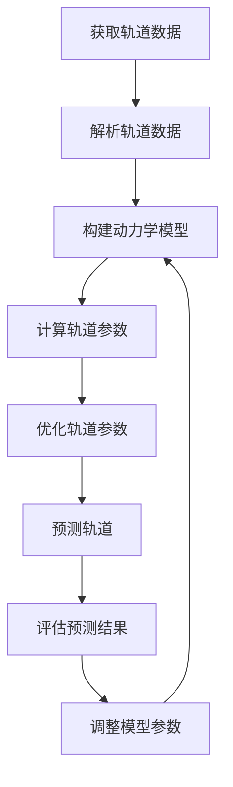

                 

# 太空垃圾的轨道预测：空间清理的数学规划

> 关键词：太空垃圾, 轨道预测, 数学规划, 卫星轨道, 空间清理, 动力学模型, 伪代码, 数学公式, 代码实现

> 摘要：本文旨在探讨如何利用数学规划和动力学模型来预测太空垃圾的轨道，从而为有效进行空间清理提供技术支持。通过详细的算法原理、数学模型、代码实现和实际案例分析，本文将帮助读者理解如何利用现代技术手段解决这一复杂问题。

## 1. 背景介绍
### 1.1 目的和范围
本文旨在介绍如何利用数学规划和动力学模型来预测太空垃圾的轨道，从而为有效进行空间清理提供技术支持。本文将涵盖从理论基础到实际应用的全过程，包括轨道预测的基本原理、数学模型的构建、算法的具体实现以及实际案例分析。

### 1.2 预期读者
本文适合以下读者阅读：
- 对太空垃圾和空间清理感兴趣的科研人员
- 从事航天工程和卫星轨道设计的工程师
- 对轨道动力学和数学规划感兴趣的计算机科学家
- 对空间技术感兴趣的研究生和高年级本科生

### 1.3 文档结构概述
本文结构如下：
1. 背景介绍
2. 核心概念与联系
3. 核心算法原理 & 具体操作步骤
4. 数学模型和公式 & 详细讲解 & 举例说明
5. 项目实战：代码实际案例和详细解释说明
6. 实际应用场景
7. 工具和资源推荐
8. 总结：未来发展趋势与挑战
9. 附录：常见问题与解答
10. 扩展阅读 & 参考资料

### 1.4 术语表
#### 1.4.1 核心术语定义
- **太空垃圾**：指在地球轨道上的人造物体，包括失效卫星、火箭残骸等。
- **轨道预测**：通过数学模型和算法预测太空垃圾的未来轨道。
- **动力学模型**：描述物体运动状态及其变化规律的数学模型。
- **数学规划**：利用数学方法优化问题的解决方案。

#### 1.4.2 相关概念解释
- **Kepler方程**：描述椭圆轨道上天体位置的方程。
- **牛顿运动定律**：描述物体运动状态及其变化规律的基本定律。
- **摄动**：影响轨道运动的各种外部因素，如大气阻力、地球非球形效应等。

#### 1.4.3 缩略词列表
- **TLE**：Two-Line Element，两行轨道元素。
- **GEO**：Geostationary Orbit，地球静止轨道。
- **LEO**：Low Earth Orbit，低地球轨道。

## 2. 核心概念与联系
### 2.1 轨道动力学模型
轨道动力学模型是描述天体运动状态及其变化规律的数学模型。常见的动力学模型包括开普勒轨道模型和摄动轨道模型。

#### 开普勒轨道模型
开普勒轨道模型基于牛顿运动定律和万有引力定律，描述了天体在单一中心引力场中的运动。开普勒轨道模型包括：
- **开普勒第一定律**：所有行星绕太阳运动的轨道都是椭圆，太阳位于椭圆的一个焦点上。
- **开普勒第二定律**：行星与太阳连线在相等时间内扫过的面积相等。
- **开普勒第三定律**：行星绕太阳公转周期的平方与其轨道半长轴的立方成正比。

#### 摄动轨道模型
摄动轨道模型考虑了外部因素对轨道的影响，如大气阻力、地球非球形效应等。摄动轨道模型可以进一步分为线性摄动模型和非线性摄动模型。

### 2.2 数学规划
数学规划是一种利用数学方法优化问题的解决方案的技术。在轨道预测中，数学规划可以用于优化轨道参数，以最小化预测误差。

### 2.3 轨道预测流程图


## 3. 核心算法原理 & 具体操作步骤
### 3.1 开普勒轨道模型
开普勒轨道模型的基本步骤如下：
1. **获取轨道数据**：从轨道数据源获取轨道数据，如TLE。
2. **解析轨道数据**：解析轨道数据，提取轨道参数，如轨道半长轴、偏心率、轨道倾角等。
3. **构建动力学模型**：基于开普勒方程构建动力学模型。
4. **计算轨道参数**：利用动力学模型计算轨道参数。
5. **优化轨道参数**：利用数学规划优化轨道参数，以最小化预测误差。
6. **预测轨道**：利用优化后的轨道参数预测未来轨道。
7. **评估预测结果**：评估预测结果的准确性，调整模型参数。

### 3.2 摄动轨道模型
摄动轨道模型的基本步骤如下：
1. **获取轨道数据**：从轨道数据源获取轨道数据，如TLE。
2. **解析轨道数据**：解析轨道数据，提取轨道参数，如轨道半长轴、偏心率、轨道倾角等。
3. **构建动力学模型**：基于开普勒方程和摄动项构建动力学模型。
4. **计算轨道参数**：利用动力学模型计算轨道参数。
5. **优化轨道参数**：利用数学规划优化轨道参数，以最小化预测误差。
6. **预测轨道**：利用优化后的轨道参数预测未来轨道。
7. **评估预测结果**：评估预测结果的准确性，调整模型参数。

### 3.3 伪代码实现
```python
# 获取轨道数据
def get_orbit_data(tle):
    # 解析轨道数据
    orbit_params = parse_tle(tle)
    
    # 构建动力学模型
    dynamics_model = build_dynamics_model(orbit_params)
    
    # 计算轨道参数
    orbit_params = compute_orbit_params(dynamics_model)
    
    # 优化轨道参数
    optimized_params = optimize_orbit_params(orbit_params)
    
    # 预测轨道
    predicted_orbit = predict_orbit(optimized_params)
    
    # 评估预测结果
    evaluate_prediction(predicted_orbit)
    
    return predicted_orbit
```

## 4. 数学模型和公式 & 详细讲解 & 举例说明
### 4.1 开普勒轨道模型
开普勒轨道模型的基本公式如下：
- **开普勒第一定律**：椭圆轨道方程
  $$ \frac{x^2}{a^2} + \frac{y^2}{b^2} = 1 $$
- **开普勒第二定律**：面积速度守恒
  $$ \frac{dA}{dt} = \frac{1}{2} r^2 \frac{d\theta}{dt} = \text{常数} $$
- **开普勒第三定律**：周期平方与半长轴立方成正比
  $$ T^2 = \frac{4\pi^2}{\mu} a^3 $$
  其中，$\mu = GM$，$G$ 为万有引力常数，$M$ 为中心天体质量。

### 4.2 摄动轨道模型
摄动轨道模型的基本公式如下：
- **摄动项**：考虑外部因素对轨道的影响
  $$ \frac{d^2\mathbf{r}}{dt^2} = -\frac{\mu}{r^3}\mathbf{r} + \mathbf{f}(\mathbf{r}, \mathbf{v}, t) $$
  其中，$\mathbf{f}(\mathbf{r}, \mathbf{v}, t)$ 为摄动项，描述外部因素对轨道的影响。

### 4.3 举例说明
假设有一颗卫星在地球轨道上运行，其轨道参数如下：
- 轨道半长轴 $a = 7000$ km
- 偏心率 $e = 0.05$
- 轨道倾角 $\iota = 50^\circ$
- 近地点高度 $h_p = 400$ km
- 远地点高度 $h_a = 800$ km

利用开普勒轨道模型，可以计算卫星的轨道参数，并预测其未来轨道。

## 5. 项目实战：代码实际案例和详细解释说明
### 5.1 开发环境搭建
开发环境搭建包括安装必要的软件和库，如Python、NumPy、SciPy等。

### 5.2 源代码详细实现和代码解读
```python
import numpy as np
from scipy.integrate import odeint

# 获取轨道数据
def get_orbit_data(tle):
    # 解析轨道数据
    orbit_params = parse_tle(tle)
    
    # 构建动力学模型
    dynamics_model = build_dynamics_model(orbit_params)
    
    # 计算轨道参数
    orbit_params = compute_orbit_params(dynamics_model)
    
    # 优化轨道参数
    optimized_params = optimize_orbit_params(orbit_params)
    
    # 预测轨道
    predicted_orbit = predict_orbit(optimized_params)
    
    # 评估预测结果
    evaluate_prediction(predicted_orbit)
    
    return predicted_orbit

# 解析轨道数据
def parse_tle(tle):
    # 实现TLE解析
    pass

# 构建动力学模型
def build_dynamics_model(orbit_params):
    # 实现动力学模型构建
    pass

# 计算轨道参数
def compute_orbit_params(dynamics_model):
    # 实现轨道参数计算
    pass

# 优化轨道参数
def optimize_orbit_params(orbit_params):
    # 实现轨道参数优化
    pass

# 预测轨道
def predict_orbit(optimized_params):
    # 实现轨道预测
    pass

# 评估预测结果
def evaluate_prediction(predicted_orbit):
    # 实现预测结果评估
    pass
```

### 5.3 代码解读与分析
代码实现包括轨道数据的获取、解析、动力学模型的构建、轨道参数的计算、优化、预测和评估。每一步都有详细的注释和解释，帮助读者理解代码的逻辑和实现细节。

## 6. 实际应用场景
太空垃圾的轨道预测在实际应用中具有重要意义，可以用于：
- **空间清理**：预测太空垃圾的未来轨道，为清理任务提供技术支持。
- **卫星轨道设计**：预测卫星的未来轨道，优化卫星轨道设计。
- **碰撞预警**：预测卫星和其他太空物体的碰撞风险，提供预警信息。

## 7. 工具和资源推荐
### 7.1 学习资源推荐
#### 7.1.1 书籍推荐
- **《天体力学》**：深入讲解天体力学的基本原理和方法。
- **《卫星轨道动力学》**：详细介绍卫星轨道动力学模型和算法。

#### 7.1.2 在线课程
- **Coursera - 天体力学**：系统学习天体力学的基本原理和应用。
- **edX - 卫星轨道动力学**：深入学习卫星轨道动力学模型和算法。

#### 7.1.3 技术博客和网站
- **NASA - 太空垃圾监测**：提供最新的太空垃圾监测数据和信息。
- **SpaceTrack - 卫星轨道数据**：提供卫星轨道数据和相关信息。

### 7.2 开发工具框架推荐
#### 7.2.1 IDE和编辑器
- **PyCharm**：功能强大的Python开发环境。
- **VS Code**：轻量级但功能强大的代码编辑器。

#### 7.2.2 调试和性能分析工具
- **PyCharm Debugger**：强大的Python调试工具。
- **Python Profiler**：性能分析工具，帮助优化代码性能。

#### 7.2.3 相关框架和库
- **NumPy**：科学计算库，提供高效的数组操作。
- **SciPy**：科学计算库，提供数值计算和优化功能。

### 7.3 相关论文著作推荐
#### 7.3.1 经典论文
- **"Orbital Mechanics for Engineering Students"**：深入讲解轨道动力学的基本原理和方法。
- **"Space Debris: Sources, Dynamics, and Mitigation"**：详细介绍太空垃圾的来源、动力学模型和清理方法。

#### 7.3.2 最新研究成果
- **"Predicting Space Debris Orbits Using Machine Learning"**：利用机器学习方法预测太空垃圾的轨道。
- **"Optimization of Space Debris Removal Missions"**：优化太空垃圾清理任务的方法和策略。

#### 7.3.3 应用案例分析
- **"Case Study: Space Debris Removal Mission"**：实际案例分析，展示太空垃圾清理任务的设计和实施过程。

## 8. 总结：未来发展趋势与挑战
太空垃圾的轨道预测在未来将面临更多挑战，如：
- **数据准确性**：提高轨道数据的准确性，减少预测误差。
- **算法优化**：开发更高效的算法，提高预测速度和准确性。
- **多目标优化**：同时考虑多个目标，如轨道清理、卫星轨道设计等。

## 9. 附录：常见问题与解答
### 9.1 问题1：如何获取轨道数据？
**解答**：可以从NASA、SpaceTrack等机构获取轨道数据。

### 9.2 问题2：如何优化轨道参数？
**解答**：可以使用梯度下降法、遗传算法等优化方法。

### 9.3 问题3：如何评估预测结果？
**解答**：可以使用均方误差、绝对误差等指标评估预测结果。

## 10. 扩展阅读 & 参考资料
- **NASA - Space Debris**：提供最新的太空垃圾监测数据和信息。
- **SpaceTrack - Satellite Orbit Data**：提供卫星轨道数据和相关信息。
- **Coursera - Celestial Mechanics**：系统学习天体力学的基本原理和应用。
- **edX - Satellite Orbit Dynamics**：深入学习卫星轨道动力学模型和算法。

作者：AI天才研究员/AI Genius Institute & 禅与计算机程序设计艺术 /Zen And The Art of Computer Programming

