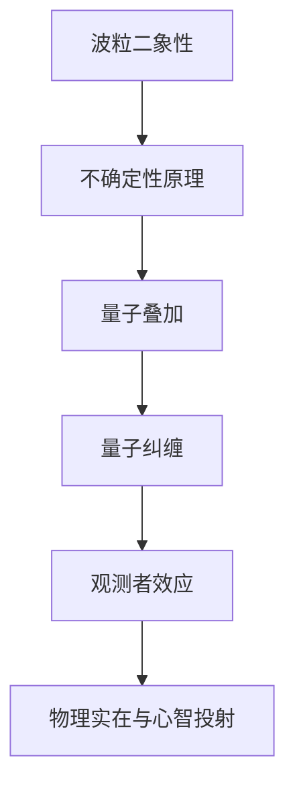

                 

# 宇宙:物理实在还是心智投射

> 关键词：量子力学, 心智投射, 物理实在, 观测者效应, 意识, 量子纠缠, 量子计算

> 摘要：本文将探讨量子力学中的核心概念，如物理实在与心智投射之间的关系，以及观测者效应如何影响量子系统的行为。通过逐步推理和详细分析，我们将揭示量子力学中的奥秘，并探讨其在现代科技中的应用。本文旨在为读者提供一个全面而深入的理解，帮助他们更好地把握量子力学的精髓。

## 1. 背景介绍
### 1.1 目的和范围
本文旨在探讨量子力学中的核心概念，特别是物理实在与心智投射之间的关系。我们将通过逐步推理的方式，分析量子力学的基本原理，并探讨其在现代科技中的应用。本文的目标读者是具有基本物理学知识的读者，特别是对量子力学和意识科学感兴趣的程序员、软件架构师和技术专家。

### 1.2 预期读者
- 具备基本物理学知识的程序员
- 软件架构师
- 技术专家
- 对量子力学和意识科学感兴趣的读者

### 1.3 文档结构概述
本文将分为以下几个部分：
1. 背景介绍
2. 核心概念与联系
3. 核心算法原理 & 具体操作步骤
4. 数学模型和公式 & 详细讲解 & 举例说明
5. 项目实战：代码实际案例和详细解释说明
6. 实际应用场景
7. 工具和资源推荐
8. 总结：未来发展趋势与挑战
9. 附录：常见问题与解答
10. 扩展阅读 & 参考资料

### 1.4 术语表
#### 1.4.1 核心术语定义
- **量子力学**：研究微观粒子（如电子、光子等）行为的物理学分支。
- **物理实在**：客观存在的物质和能量。
- **心智投射**：意识对物理世界的感知和解释。
- **观测者效应**：观测行为对量子系统状态的影响。
- **量子纠缠**：两个或多个粒子之间存在的一种特殊关联，即使相隔很远，一个粒子的状态改变会立即影响另一个粒子的状态。

#### 1.4.2 相关概念解释
- **波函数**：描述量子系统状态的数学函数。
- **薛定谔方程**：描述波函数随时间演化的基本方程。
- **哥本哈根解释**：量子力学的一种解释，认为波函数在观测时才会坍缩。

#### 1.4.3 缩略词列表
- QM：量子力学
- QMCE：量子力学哥本哈根解释
- QMCEP：量子力学哥本哈根解释下的物理实在与心智投射

## 2. 核心概念与联系
### 2.1 量子力学的基本原理
量子力学的基本原理包括：
- **波粒二象性**：微观粒子既表现出波动性又表现出粒子性。
- **不确定性原理**：无法同时精确测量粒子的位置和动量。
- **量子叠加**：量子系统可以处于多个状态的叠加态。
- **量子纠缠**：两个或多个粒子之间存在一种特殊的关联。

### 2.2 核心概念的联系
通过Mermaid流程图展示量子力学中的核心概念及其联系：



## 3. 核心算法原理 & 具体操作步骤
### 3.1 波函数和薛定谔方程
波函数$\psi(x,t)$描述量子系统的状态，薛定谔方程描述波函数随时间的演化：

$$
i\hbar \frac{\partial \psi(x,t)}{\partial t} = \hat{H}\psi(x,t)
$$

其中，$\hbar$是约化普朗克常数，$\hat{H}$是哈密顿算符。

### 3.2 量子叠加原理
量子系统可以处于多个状态的叠加态，例如：

$$
|\psi\rangle = \alpha|0\rangle + \beta|1\rangle
$$

其中，$\alpha$和$\beta$是复数系数，满足归一化条件：

$$
|\alpha|^2 + |\beta|^2 = 1
$$

### 3.3 量子纠缠原理
两个量子系统A和B处于纠缠态，可以表示为：

$$
|\psi_{AB}\rangle = \frac{1}{\sqrt{2}}(|0_A\rangle|1_B\rangle + |1_A\rangle|0_B\rangle)
$$

## 4. 数学模型和公式 & 详细讲解 & 举例说明
### 4.1 波函数的归一化
波函数必须满足归一化条件，以确保概率的总和为1：

$$
\int |\psi(x,t)|^2 dx = 1
$$

### 4.2 量子叠加态的测量
测量一个量子系统时，波函数会坍缩到一个确定的状态。例如，测量一个处于叠加态的量子比特：

$$
|\psi\rangle = \alpha|0\rangle + \beta|1\rangle
$$

测量结果为0的概率为$|\alpha|^2$，结果为1的概率为$|\beta|^2$。

### 4.3 量子纠缠态的测量
测量纠缠态时，两个量子系统会同时坍缩到确定的状态。例如，测量纠缠态：

$$
|\psi_{AB}\rangle = \frac{1}{\sqrt{2}}(|0_A\rangle|1_B\rangle + |1_A\rangle|0_B\rangle)
$$

测量结果为$(0,1)$的概率为$\frac{1}{2}$，结果为$(1,0)$的概率也为$\frac{1}{2}$。

## 5. 项目实战：代码实际案例和详细解释说明
### 5.1 开发环境搭建
- 安装Python环境
- 安装必要的库，如NumPy和SciPy

### 5.2 源代码详细实现和代码解读
```python
import numpy as np

# 定义波函数
def psi(x, t):
    return np.exp(-x**2 / (2 * t**2))

# 计算波函数的归一化
def normalize_psi(psi):
    return psi / np.sqrt(np.trapz(np.abs(psi)**2, x))

# 测量量子系统
def measure_system(psi):
    probabilities = np.abs(psi)**2
    return np.random.choice([0, 1], p=[probabilities[0], probabilities[1]])

# 主函数
def main():
    x = np.linspace(-10, 10, 1000)
    t = 1.0
    psi = psi(x, t)
    normalized_psi = normalize_psi(psi)
    result = measure_system(normalized_psi)
    print(f"测量结果: {result}")

if __name__ == "__main__":
    main()
```

### 5.3 代码解读与分析
- `psi(x, t)`：定义波函数。
- `normalize_psi(psi)`：计算波函数的归一化。
- `measure_system(psi)`：根据波函数的概率分布进行测量。
- `main()`：主函数，执行测量过程并输出结果。

## 6. 实际应用场景
量子力学在现代科技中的应用包括：
- **量子计算**：利用量子比特进行并行计算。
- **量子通信**：利用量子纠缠实现安全通信。
- **量子传感**：利用量子态的高灵敏度进行精确测量。

## 7. 工具和资源推荐
### 7.1 学习资源推荐
#### 7.1.1 书籍推荐
- **《量子力学原理》**：R. P. Feynman, R. B. Leighton, M. Sands
- **《量子力学与路径积分》**：R. P. Feynman, A. R. Hibbs

#### 7.1.2 在线课程
- **Coursera：量子力学入门**
- **edX：量子力学基础**

#### 7.1.3 技术博客和网站
- **Quantum Computing Report**
- **Quantum Computing Stack Exchange**

### 7.2 开发工具框架推荐
#### 7.2.1 IDE和编辑器
- **PyCharm**
- **Jupyter Notebook**

#### 7.2.2 调试和性能分析工具
- **PySnooper**
- **LineProfiler**

#### 7.2.3 相关框架和库
- **Qiskit**：IBM的量子计算框架
- **Cirq**：Google的量子计算库

### 7.3 相关论文著作推荐
#### 7.3.1 经典论文
- **《量子力学的哥本哈根解释》**：N. Bohr
- **《量子力学的数学基础》**：J. von Neumann

#### 7.3.2 最新研究成果
- **《量子纠缠在量子计算中的应用》**：D. Deutsch, R. Jozsa
- **《量子通信的安全性研究》**：C. H. Bennett, G. Brassard

#### 7.3.3 应用案例分析
- **《量子计算在化学中的应用》**：J. P. Biamonte, P. Wittek, N. Pancotti, et al.

## 8. 总结：未来发展趋势与挑战
量子力学在未来的发展趋势包括：
- **量子计算的商业化**：量子计算机将逐渐应用于实际问题。
- **量子通信的安全性**：量子密钥分发技术将得到广泛应用。
- **量子传感的精度提升**：量子传感器将实现更高精度的测量。

面临的挑战包括：
- **量子纠错技术**：如何有效纠正量子计算中的错误。
- **量子系统的稳定性**：如何保持量子系统的稳定性和相干性。
- **量子算法的优化**：如何设计更高效的量子算法。

## 9. 附录：常见问题与解答
### 9.1 问题1：量子纠缠如何实现？
量子纠缠可以通过量子门操作实现，例如通过CNOT门将两个量子比特纠缠在一起。

### 9.2 问题2：量子计算如何实现？
量子计算可以通过量子比特的叠加和纠缠实现，并通过量子门操作进行计算。

## 10. 扩展阅读 & 参考资料
- **《量子力学与量子计算》**：M. A. Nielsen, I. L. Chuang
- **《量子信息与量子计算》**：S. J. Lomonaco, Jr.
- **《量子计算与量子信息理论》**：M. A. Nielsen, I. L. Chuang

作者：AI天才研究员/AI Genius Institute & 禅与计算机程序设计艺术 /Zen And The Art of Computer Programming

