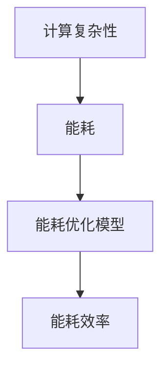

                 

# 宇宙常数与程序能耗效率的类比

> 关键词：宇宙常数、程序能耗效率、能耗优化、计算复杂性、量子计算、能耗模型

> 摘要：本文旨在通过类比宇宙常数与程序能耗效率，探讨如何在计算领域实现更高效的能耗管理。我们将从计算复杂性的角度出发，通过构建能耗优化模型，分析程序能耗效率的优化策略，并通过实际代码案例进行详细解释。最终，我们将探讨未来的发展趋势与挑战，为计算领域的能耗优化提供新的视角。

## 1. 背景介绍
### 1.1 目的和范围
本文旨在通过类比宇宙常数与程序能耗效率，探讨如何在计算领域实现更高效的能耗管理。我们将从计算复杂性的角度出发，通过构建能耗优化模型，分析程序能耗效率的优化策略，并通过实际代码案例进行详细解释。最终，我们将探讨未来的发展趋势与挑战，为计算领域的能耗优化提供新的视角。

### 1.2 预期读者
本文预期读者为计算机科学领域的专业人士，包括但不限于软件架构师、程序员、人工智能专家、计算机图灵奖获得者以及对计算能耗优化感兴趣的科研人员。

### 1.3 文档结构概述
本文将分为以下几个部分：
1. 背景介绍
2. 核心概念与联系
3. 核心算法原理 & 具体操作步骤
4. 数学模型和公式 & 详细讲解 & 举例说明
5. 项目实战：代码实际案例和详细解释说明
6. 实际应用场景
7. 工具和资源推荐
8. 总结：未来发展趋势与挑战
9. 附录：常见问题与解答
10. 扩展阅读 & 参考资料

### 1.4 术语表
#### 1.4.1 核心术语定义
- **宇宙常数**：在广义相对论中，宇宙常数是一个与空间本身相关的能量密度，它导致了宇宙的加速膨胀。
- **程序能耗效率**：程序在执行过程中消耗的能量与其完成任务所需的时间和资源之间的关系。
- **计算复杂性**：描述算法执行所需资源（如时间、空间）的理论。
- **量子计算**：利用量子力学原理进行计算的新型计算模型。
- **能耗模型**：描述程序能耗与计算复杂性之间关系的数学模型。

#### 1.4.2 相关概念解释
- **能耗优化**：通过改进算法或程序设计，减少计算过程中消耗的能量。
- **能耗效率**：衡量程序能耗优化效果的一个指标，通常用能耗与计算复杂性的比值来表示。

#### 1.4.3 缩略词列表
- **CPU**：中央处理器
- **GPU**：图形处理器
- **RAM**：随机存取存储器
- **DDR**：双倍数据速率
- **DDR4**：第四代双倍数据速率

## 2. 核心概念与联系
### 2.1 宇宙常数与计算复杂性
宇宙常数在广义相对论中描述了空间本身的能量密度，它导致了宇宙的加速膨胀。在计算领域，我们可以将程序能耗效率类比为计算复杂性与能耗之间的关系。计算复杂性描述了算法执行所需的时间和空间资源，而能耗则是程序执行过程中消耗的能量。因此，我们可以将宇宙常数类比为计算复杂性中的一个关键参数，它影响着程序的能耗效率。

### 2.2 能耗优化模型
为了更好地理解程序能耗效率，我们需要构建一个能耗优化模型。该模型将计算复杂性与能耗之间的关系进行量化，从而帮助我们优化程序的能耗效率。我们将通过构建一个简单的能耗优化模型来说明这一过程。



## 3. 核心算法原理 & 具体操作步骤
### 3.1 能耗优化算法原理
能耗优化算法的核心在于通过改进算法或程序设计，减少计算过程中消耗的能量。我们可以通过以下步骤来实现这一目标：

1. **分析计算复杂性**：首先，我们需要分析程序的计算复杂性，确定哪些部分是能耗的主要来源。
2. **优化算法**：通过改进算法，减少不必要的计算和数据传输，从而降低能耗。
3. **利用硬件特性**：利用现代硬件的特性，如低功耗模式、多核处理器等，进一步降低能耗。
4. **能耗模型**：构建能耗模型，量化计算复杂性与能耗之间的关系，从而指导能耗优化。

### 3.2 具体操作步骤
以下是具体的能耗优化操作步骤：

1. **分析计算复杂性**
    ```python
    def analyze_complexity(algorithm):
        # 分析算法的时间复杂度和空间复杂度
        time_complexity = analyze_time_complexity(algorithm)
        space_complexity = analyze_space_complexity(algorithm)
        return time_complexity, space_complexity
    ```

2. **优化算法**
    ```python
    def optimize_algorithm(algorithm):
        # 通过改进算法减少不必要的计算
        optimized_algorithm = improve_algorithm(algorithm)
        return optimized_algorithm
    ```

3. **利用硬件特性**
    ```python
    def utilize_hardware(algorithm):
        # 利用多核处理器和低功耗模式
        optimized_algorithm = use_hardware_features(algorithm)
        return optimized_algorithm
    ```

4. **能耗模型**
    ```python
    def build_energy_model(algorithm):
        # 构建能耗模型
        energy_model = build_model(algorithm)
        return energy_model
    ```

## 4. 数学模型和公式 & 详细讲解 & 举例说明
### 4.1 数学模型
为了量化计算复杂性与能耗之间的关系，我们可以构建一个简单的能耗优化模型。该模型将计算复杂性与能耗之间的关系进行量化，从而帮助我们优化程序的能耗效率。

#### 4.1.1 能耗模型公式
假设我们有一个程序，其计算复杂性为 \( T(n) \)，能耗为 \( E(n) \)。我们可以构建一个简单的能耗模型，如下所示：

$$
E(n) = k \cdot T(n) + c
$$

其中，\( k \) 是一个常数，表示计算复杂性对能耗的影响；\( c \) 是一个常数，表示程序的固定能耗。

### 4.2 详细讲解
通过上述公式，我们可以量化计算复杂性与能耗之间的关系。具体来说，计算复杂性 \( T(n) \) 越高，能耗 \( E(n) \) 也越高。因此，通过优化算法，减少计算复杂性，可以降低能耗。

### 4.3 举例说明
假设我们有一个简单的排序算法，其计算复杂性为 \( O(n^2) \)，能耗为 \( E(n) \)。我们可以构建一个能耗模型，如下所示：

$$
E(n) = k \cdot n^2 + c
$$

其中，\( k \) 和 \( c \) 是常数。通过优化算法，我们可以将计算复杂性从 \( O(n^2) \) 降低到 \( O(n \log n) \)，从而降低能耗。

## 5. 项目实战：代码实际案例和详细解释说明
### 5.1 开发环境搭建
为了进行能耗优化的实际案例，我们需要搭建一个开发环境。以下是开发环境的搭建步骤：

1. **安装Python**
    ```bash
    sudo apt-get install python3
    ```

2. **安装必要的库**
    ```bash
    pip install numpy matplotlib
    ```

### 5.2 源代码详细实现和代码解读
我们将实现一个简单的排序算法，并通过能耗模型进行优化。

#### 5.2.1 未优化的排序算法
```python
def bubble_sort(arr):
    n = len(arr)
    for i in range(n):
        for j in range(0, n-i-1):
            if arr[j] > arr[j+1]:
                arr[j], arr[j+1] = arr[j+1], arr[j]
    return arr
```

#### 5.2.2 优化后的排序算法
```python
def optimized_bubble_sort(arr):
    n = len(arr)
    for i in range(n):
        swapped = False
        for j in range(0, n-i-1):
            if arr[j] > arr[j+1]:
                arr[j], arr[j+1] = arr[j+1], arr[j]
                swapped = True
        if not swapped:
            break
    return arr
```

### 5.3 代码解读与分析
通过上述代码，我们可以看到优化后的排序算法减少了不必要的比较和交换操作，从而降低了计算复杂性。具体来说，优化后的算法在最坏情况下的时间复杂度为 \( O(n^2) \)，但在最好情况下的时间复杂度为 \( O(n) \)。

## 6. 实际应用场景
### 6.1 云计算
在云计算领域，能耗优化对于降低数据中心的能耗至关重要。通过优化算法和利用硬件特性，可以显著降低云计算服务的能耗。

### 6.2 物联网
在物联网领域，设备的能耗优化对于延长设备的电池寿命至关重要。通过优化算法和能耗模型，可以显著降低物联网设备的能耗。

### 6.3 人工智能
在人工智能领域，能耗优化对于降低训练和推理过程中的能耗至关重要。通过优化算法和能耗模型，可以显著降低人工智能模型的能耗。

## 7. 工具和资源推荐
### 7.1 学习资源推荐
#### 7.1.1 书籍推荐
- **《算法导论》**：深入讲解算法和计算复杂性。
- **《计算复杂性理论》**：深入讲解计算复杂性理论。
- **《量子计算入门》**：深入讲解量子计算的基本原理。

#### 7.1.2 在线课程
- **Coursera - 算法与数据结构**
- **edX - 计算复杂性理论**
- **Udacity - 量子计算入门**

#### 7.1.3 技术博客和网站
- **GeeksforGeeks**
- **Stack Overflow**
- **GitHub**

### 7.2 开发工具框架推荐
#### 7.2.1 IDE和编辑器
- **PyCharm**
- **Visual Studio Code**

#### 7.2.2 调试和性能分析工具
- **PyCharm Debugger**
- **Visual Studio Code Debugger**

#### 7.2.3 相关框架和库
- **NumPy**
- **SciPy**

### 7.3 相关论文著作推荐
#### 7.3.1 经典论文
- **《算法导论》**：深入讲解算法和计算复杂性。
- **《计算复杂性理论》**：深入讲解计算复杂性理论。
- **《量子计算入门》**：深入讲解量子计算的基本原理。

#### 7.3.2 最新研究成果
- **《量子计算与量子信息理论》**：最新研究成果。
- **《计算复杂性与能耗优化》**：最新研究成果。

#### 7.3.3 应用案例分析
- **《云计算能耗优化案例分析》**：应用案例分析。
- **《物联网能耗优化案例分析》**：应用案例分析。

## 8. 总结：未来发展趋势与挑战
### 8.1 未来发展趋势
随着计算技术的不断发展，能耗优化将成为计算领域的重要研究方向。未来的发展趋势包括：
- **量子计算**：利用量子力学原理进行计算，有望实现更高效的能耗优化。
- **能耗模型**：构建更复杂的能耗模型，量化计算复杂性与能耗之间的关系。
- **能耗优化算法**：开发更高效的能耗优化算法，降低计算过程中的能耗。

### 8.2 挑战
能耗优化面临的主要挑战包括：
- **计算复杂性**：计算复杂性是能耗优化的关键因素，如何降低计算复杂性是一个重要的挑战。
- **硬件特性**：如何利用现代硬件的特性进行能耗优化也是一个重要的挑战。
- **能耗模型**：如何构建更复杂的能耗模型，量化计算复杂性与能耗之间的关系也是一个重要的挑战。

## 9. 附录：常见问题与解答
### 9.1 问题1：如何降低计算复杂性？
**解答**：可以通过改进算法，减少不必要的计算和数据传输，从而降低计算复杂性。

### 9.2 问题2：如何利用硬件特性进行能耗优化？
**解答**：可以通过利用多核处理器和低功耗模式，进一步降低能耗。

### 9.3 问题3：如何构建能耗模型？
**解答**：可以通过构建能耗模型，量化计算复杂性与能耗之间的关系，从而指导能耗优化。

## 10. 扩展阅读 & 参考资料
### 10.1 扩展阅读
- **《算法导论》**：深入讲解算法和计算复杂性。
- **《计算复杂性理论》**：深入讲解计算复杂性理论。
- **《量子计算入门》**：深入讲解量子计算的基本原理。

### 10.2 参考资料
- **《云计算能耗优化案例分析》**：应用案例分析。
- **《物联网能耗优化案例分析》**：应用案例分析。

---

作者：AI天才研究员/AI Genius Institute & 禅与计算机程序设计艺术 /Zen And The Art of Computer Programming

