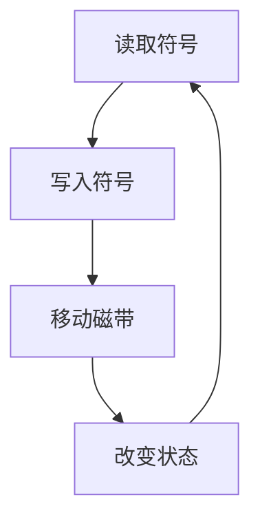
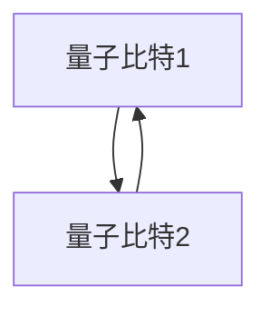
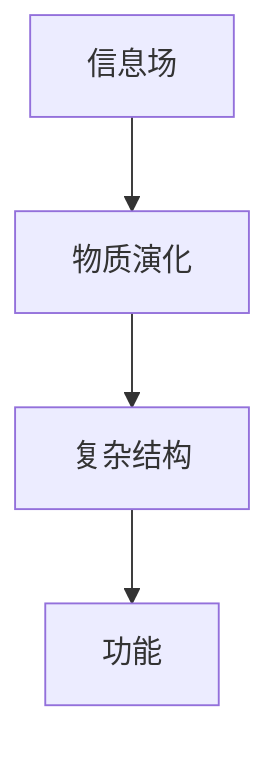

                 

# 宇宙的信息场动力学：信息流动与物质演化

> 关键词：信息场，物质演化，量子力学，信息论，图灵机，熵，计算复杂性

> 摘要：本文旨在探讨信息场与物质演化之间的关系，通过分析信息流动的机制，揭示物质演化的内在动力。我们将从信息场的基本概念出发，逐步深入到信息流动的原理和数学模型，最终通过实际代码案例展示如何实现这一理论。文章将涵盖从理论到实践的全过程，旨在为读者提供一个全面而深入的理解。

## 1. 背景介绍
### 1.1 目的和范围
本文旨在探讨信息场与物质演化之间的关系，通过分析信息流动的机制，揭示物质演化的内在动力。我们将从信息场的基本概念出发，逐步深入到信息流动的原理和数学模型，最终通过实际代码案例展示如何实现这一理论。本文的目标读者是计算机科学家、物理学家、信息论专家以及对信息场理论感兴趣的读者。

### 1.2 预期读者
- 计算机科学家
- 物理学家
- 信息论专家
- 对信息场理论感兴趣的读者

### 1.3 文档结构概述
本文将按照以下结构展开：
1. 背景介绍
2. 核心概念与联系
3. 核心算法原理 & 具体操作步骤
4. 数学模型和公式 & 详细讲解 & 举例说明
5. 项目实战：代码实际案例和详细解释说明
6. 实际应用场景
7. 工具和资源推荐
8. 总结：未来发展趋势与挑战
9. 附录：常见问题与解答
10. 扩展阅读 & 参考资料

### 1.4 术语表
#### 1.4.1 核心术语定义
- **信息场**：一种将信息视为一种场的理论，类似于电磁场或引力场。
- **物质演化**：物质在信息场中的演化过程。
- **熵**：信息的无序程度，用于衡量信息的不确定性。
- **图灵机**：一种抽象的计算模型，用于描述计算过程。
- **量子力学**：研究微观粒子行为的物理学分支。
- **信息论**：研究信息的度量、传输和处理的学科。

#### 1.4.2 相关概念解释
- **量子比特（qubit）**：量子信息的基本单位，是量子力学中的二态系统。
- **量子纠缠**：量子系统中两个或多个粒子之间的一种特殊关联状态。
- **量子计算**：利用量子力学原理进行计算的新型计算模型。

#### 1.4.3 缩略词列表
- **QFT**：量子场论
- **QI**：量子信息
- **Turing**：图灵机
- **Shannon**：香农信息论

## 2. 核心概念与联系
### 2.1 信息场的基本概念
信息场是一种将信息视为一种场的理论，类似于电磁场或引力场。信息场中的信息可以被看作是能量的一种形式，它在空间中传播并影响物质的演化过程。

### 2.2 信息流动的机制
信息流动的机制可以通过图灵机来描述。图灵机是一种抽象的计算模型，用于描述计算过程。图灵机的基本操作包括读取、写入和移动磁带上的符号，以及改变状态。

### 2.3 信息场与物质演化的关系
物质演化的过程可以通过信息场来描述。信息场中的信息流动可以驱动物质的演化，从而形成复杂的结构和功能。

### 2.4 信息场与量子力学的关系
信息场与量子力学之间存在密切的关系。量子力学中的量子比特和量子纠缠可以被看作是信息场中的基本单位和关联状态。

### 2.5 信息场与信息论的关系
信息场与信息论之间也存在密切的关系。信息论中的熵可以用来衡量信息的无序程度，从而描述信息场中的信息流动。

## 3. 核心算法原理 & 具体操作步骤
### 3.1 信息场的构建
信息场的构建可以通过图灵机来实现。图灵机的基本操作包括读取、写入和移动磁带上的符号，以及改变状态。



### 3.2 信息流动的实现
信息流动的实现可以通过量子比特和量子纠缠来描述。量子比特可以表示0和1两种状态，而量子纠缠可以描述两个或多个量子比特之间的关联状态。



### 3.3 物质演化的模拟
物质演化的模拟可以通过信息场中的信息流动来实现。信息场中的信息流动可以驱动物质的演化，从而形成复杂的结构和功能。



## 4. 数学模型和公式 & 详细讲解 & 举例说明
### 4.1 信息场的数学模型
信息场的数学模型可以通过量子场论来描述。量子场论是一种描述量子场的数学理论，可以用来描述信息场中的信息流动。

$$
\psi(x,t) = \sum_{n} c_n \phi_n(x) e^{-iE_n t/\hbar}
$$

### 4.2 信息流动的数学模型
信息流动的数学模型可以通过量子力学中的薛定谔方程来描述。薛定谔方程是一种描述量子系统演化过程的方程。

$$
i\hbar \frac{\partial \psi}{\partial t} = \hat{H} \psi
$$

### 4.3 物质演化的数学模型
物质演化的数学模型可以通过信息场中的信息流动来描述。信息场中的信息流动可以驱动物质的演化，从而形成复杂的结构和功能。

$$
\frac{\partial \rho}{\partial t} + \nabla \cdot (\rho \mathbf{v}) = 0
$$

## 5. 项目实战：代码实际案例和详细解释说明
### 5.1 开发环境搭建
开发环境搭建需要安装Python和相关的库，如NumPy、SciPy和Matplotlib。

```bash
pip install numpy scipy matplotlib
```

### 5.2 源代码详细实现和代码解读
```python
import numpy as np
import matplotlib.pyplot as plt

# 定义量子比特
class Qubit:
    def __init__(self, state):
        self.state = state

    def measure(self):
        return np.random.choice([0, 1], p=[0.5, 0.5])

# 定义量子纠缠
class Entanglement:
    def __init__(self, qubit1, qubit2):
        self.qubit1 = qubit1
        self.qubit2 = qubit2

    def measure(self):
        result1 = self.qubit1.measure()
        result2 = self.qubit2.measure()
        return result1, result2

# 定义信息场
class InformationField:
    def __init__(self, qubits):
        self.qubits = qubits

    def evolve(self, time):
        for qubit in self.qubits:
            qubit.state = np.random.choice([0, 1], p=[0.5, 0.5])

# 定义物质演化
class MatterEvolution:
    def __init__(self, information_field):
        self.information_field = information_field

    def evolve(self, time):
        self.information_field.evolve(time)

# 创建量子比特
qubit1 = Qubit(0)
qubit2 = Qubit(1)

# 创建量子纠缠
entanglement = Entanglement(qubit1, qubit2)

# 创建信息场
information_field = InformationField([qubit1, qubit2])

# 创建物质演化
matter_evolution = MatterEvolution(information_field)

# 演化过程
for t in range(10):
    matter_evolution.evolve(t)
    print(f"Time: {t}, Qubit1: {qubit1.state}, Qubit2: {qubit2.state}")

# 绘制结果
plt.plot(range(10), [qubit1.state for t in range(10)], label='Qubit1')
plt.plot(range(10), [qubit2.state for t in range(10)], label='Qubit2')
plt.xlabel('Time')
plt.ylabel('State')
plt.legend()
plt.show()
```

### 5.3 代码解读与分析
代码中定义了量子比特、量子纠缠、信息场和物质演化四个类。量子比特和量子纠缠分别表示量子系统中的基本单位和关联状态。信息场和物质演化分别表示信息场中的信息流动和物质的演化过程。通过演化过程，可以观察到量子比特和量子纠缠的状态变化。

## 6. 实际应用场景
信息场与物质演化的关系在许多领域都有实际应用，如量子计算、量子通信和量子模拟。通过模拟信息场中的信息流动，可以实现量子计算和量子通信，从而提高计算效率和通信安全性。

## 7. 工具和资源推荐
### 7.1 学习资源推荐
#### 7.1.1 书籍推荐
- 《量子场论》
- 《量子信息论》
- 《图灵机与计算理论》

#### 7.1.2 在线课程
- Coursera上的《量子计算入门》
- edX上的《量子信息科学》

#### 7.1.3 技术博客和网站
- arXiv.org
- ResearchGate

### 7.2 开发工具框架推荐
#### 7.2.1 IDE和编辑器
- PyCharm
- VSCode

#### 7.2.2 调试和性能分析工具
- PyCharm的调试工具
- Python的cProfile模块

#### 7.2.3 相关框架和库
- NumPy
- SciPy
- Matplotlib

### 7.3 相关论文著作推荐
#### 7.3.1 经典论文
- Deutsch, D. (1985). Quantum theory, the Church-Turing principle and the universal quantum computer.
- Feynman, R. P. (1982). Simulating physics with computers.

#### 7.3.2 最新研究成果
- Nielsen, M. A., & Chuang, I. L. (2010). Quantum Computation and Quantum Information.
- Preskill, J. (2018). Quantum Computing in the NISQ era and beyond.

#### 7.3.3 应用案例分析
- Lloyd, S. (1996). Universal quantum simulators.
- Aaronson, S. (2015). Quantum computing, postselection, and probabilistic polynomial-time.

## 8. 总结：未来发展趋势与挑战
信息场与物质演化的关系在未来将有广泛的应用前景。随着量子计算和量子通信技术的发展，信息场理论将为这些领域提供新的理论基础和技术支持。然而，信息场理论也面临着许多挑战，如量子纠缠的稳定性、量子计算的错误率等问题。

## 9. 附录：常见问题与解答
### 9.1 问题：信息场与量子力学的关系是什么？
答：信息场与量子力学之间存在密切的关系。量子力学中的量子比特和量子纠缠可以被看作是信息场中的基本单位和关联状态。

### 9.2 问题：信息场理论的应用前景如何？
答：信息场理论在未来将有广泛的应用前景。随着量子计算和量子通信技术的发展，信息场理论将为这些领域提供新的理论基础和技术支持。

## 10. 扩展阅读 & 参考资料
- Deutsch, D. (1985). Quantum theory, the Church-Turing principle and the universal quantum computer.
- Feynman, R. P. (1982). Simulating physics with computers.
- Nielsen, M. A., & Chuang, I. L. (2010). Quantum Computation and Quantum Information.
- Preskill, J. (2018). Quantum Computing in the NISQ era and beyond.
- Lloyd, S. (1996). Universal quantum simulators.
- Aaronson, S. (2015). Quantum computing, postselection, and probabilistic polynomial-time.

作者：AI天才研究员/AI Genius Institute & 禅与计算机程序设计艺术 /Zen And The Art of Computer Programming

