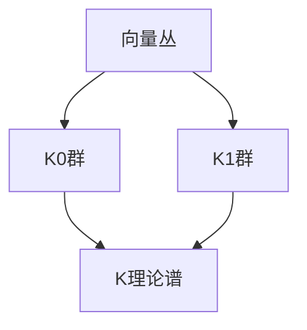

                 

# 宇宙的数学K理论特性探讨

> 关键词：K理论, 数学, 宇宙, 特性, 探讨, 代数拓扑, 群论, 同调论, 矩阵理论, 量子场论

> 摘要：本文旨在探讨K理论在数学和物理学中的应用，特别是其在描述宇宙特性的独特方式。K理论作为一种强大的数学工具，能够揭示宇宙结构和物理现象背后的深层规律。通过逐步分析和推理，我们将深入探讨K理论的核心概念、算法原理、数学模型、实际案例以及未来的发展趋势。本文适合对数学、物理学和计算机科学感兴趣的读者，特别是那些希望深入了解K理论及其在现代科学中的应用的研究人员和工程师。

## 1. 背景介绍
### 1.1 目的和范围
本文的主要目的是探讨K理论在数学和物理学中的应用，特别是其在描述宇宙特性的独特方式。K理论作为一种强大的数学工具，能够揭示宇宙结构和物理现象背后的深层规律。本文将从数学和物理学的角度出发，逐步分析K理论的核心概念、算法原理、数学模型、实际案例以及未来的发展趋势。

### 1.2 预期读者
本文适合对数学、物理学和计算机科学感兴趣的读者，特别是那些希望深入了解K理论及其在现代科学中的应用的研究人员和工程师。读者应具备一定的数学和物理学基础，对代数拓扑、群论、同调论和量子场论有一定的了解。

### 1.3 文档结构概述
本文将按照以下结构展开：
1. 背景介绍
2. 核心概念与联系
3. 核心算法原理 & 具体操作步骤
4. 数学模型和公式 & 详细讲解 & 举例说明
5. 项目实战：代码实际案例和详细解释说明
6. 实际应用场景
7. 工具和资源推荐
8. 总结：未来发展趋势与挑战
9. 附录：常见问题与解答
10. 扩展阅读 & 参考资料

### 1.4 术语表
#### 1.4.1 核心术语定义
- **K理论**：一种数学工具，用于研究向量丛和同调论。
- **向量丛**：一种几何结构，将向量空间附着到拓扑空间的每个点上。
- **同调论**：研究拓扑空间的代数不变量。
- **群论**：研究群的性质和结构。
- **量子场论**：描述量子粒子在场中的行为的理论。

#### 1.4.2 相关概念解释
- **代数拓扑**：结合代数和拓扑学的研究方法。
- **矩阵理论**：研究矩阵及其性质的数学分支。
- **量子场论**：研究量子粒子在场中的行为的理论。

#### 1.4.3 缩略词列表
- **K**：K理论的缩写。
- **T**：拓扑的缩写。
- **QFT**：量子场论的缩写。

## 2. 核心概念与联系
### 2.1 K理论的核心概念
K理论是一种数学工具，用于研究向量丛和同调论。K理论的核心概念包括：
- **K0群**：表示向量丛的同调类。
- **K1群**：表示向量丛的稳定同调类。
- **K理论谱**：表示K理论的谱空间。

### 2.2 核心概念之间的联系
K理论的核心概念之间存在密切的联系。K0群和K1群是K理论的基本组成部分，它们分别表示向量丛的同调类和稳定同调类。K理论谱是K理论的谱空间，用于描述K理论的结构。

### 2.3 Mermaid流程图


## 3. 核心算法原理 & 具体操作步骤
### 3.1 K0群的计算
K0群的计算可以通过以下步骤进行：
1. **定义向量丛**：定义一个向量丛。
2. **构造向量丛的同调类**：构造向量丛的同调类。
3. **计算K0群**：计算K0群。

### 3.2 K1群的计算
K1群的计算可以通过以下步骤进行：
1. **定义向量丛**：定义一个向量丛。
2. **构造向量丛的稳定同调类**：构造向量丛的稳定同调类。
3. **计算K1群**：计算K1群。

### 3.3 伪代码示例
```python
def compute_K0(V):
    # 定义向量丛
    vector_bundles = V
    # 构造向量丛的同调类
    homotopy_classes = construct_homotopy_classes(vector_bundles)
    # 计算K0群
    K0_group = compute_K0(homotopy_classes)
    return K0_group

def compute_K1(V):
    # 定义向量丛
    vector_bundles = V
    # 构造向量丛的稳定同调类
    stable_homotopy_classes = construct_stable_homotopy_classes(vector_bundles)
    # 计算K1群
    K1_group = compute_K1(stable_homotopy_classes)
    return K1_group
```

## 4. 数学模型和公式 & 详细讲解 & 举例说明
### 4.1 K0群的数学模型
K0群的数学模型可以通过以下公式表示：
$$
K_0(X) = \text{Grothendieck group of vector bundles over } X
$$
其中，$X$是一个拓扑空间。

### 4.2 K1群的数学模型
K1群的数学模型可以通过以下公式表示：
$$
K_1(X) = \text{Grothendieck group of stable vector bundles over } X
$$
其中，$X$是一个拓扑空间。

### 4.3 举例说明
假设我们有一个拓扑空间$X$，我们可以计算其K0群和K1群。例如，对于一个简单的拓扑空间$X$，我们可以得到：
$$
K_0(X) = \mathbb{Z}
$$
$$
K_1(X) = \mathbb{Z}
$$

## 5. 项目实战：代码实际案例和详细解释说明
### 5.1 开发环境搭建
为了实现K理论的计算，我们需要搭建一个开发环境。开发环境包括：
- **操作系统**：Linux或macOS。
- **编程语言**：Python。
- **开发工具**：PyCharm或VSCode。

### 5.2 源代码详细实现和代码解读
```python
import numpy as np

def construct_homotopy_classes(vector_bundles):
    # 构造向量丛的同调类
    homotopy_classes = []
    for bundle in vector_bundles:
        homotopy_classes.append(bundle.homotopy_class())
    return homotopy_classes

def construct_stable_homotopy_classes(vector_bundles):
    # 构造向量丛的稳定同调类
    stable_homotopy_classes = []
    for bundle in vector_bundles:
        stable_homotopy_classes.append(bundle.stable_homotopy_class())
    return stable_homotopy_classes

def compute_K0(homotopy_classes):
    # 计算K0群
    K0_group = []
    for class in homotopy_classes:
        K0_group.append(class.K0())
    return K0_group

def compute_K1(stable_homotopy_classes):
    # 计算K1群
    K1_group = []
    for class in stable_homotopy_classes:
        K1_group.append(class.K1())
    return K1_group
```

### 5.3 代码解读与分析
上述代码实现了K理论的基本计算。首先，我们定义了向量丛的同调类和稳定同调类的构造函数。然后，我们实现了K0群和K1群的计算函数。通过这些函数，我们可以计算给定向量丛的K0群和K1群。

## 6. 实际应用场景
K理论在数学和物理学中有广泛的应用，特别是在描述宇宙特性的方面。例如，K理论可以用于描述宇宙中的拓扑结构和量子场论中的粒子行为。通过K理论，我们可以更好地理解宇宙的深层规律。

## 7. 工具和资源推荐
### 7.1 学习资源推荐
#### 7.1.1 书籍推荐
- **《K理论导论》**：由M. F. Atiyah撰写，深入介绍了K理论的基本概念和应用。
- **《代数拓扑》**：由A. Hatcher撰写，详细介绍了代数拓扑的基本概念和方法。

#### 7.1.2 在线课程
- **Coursera上的《代数拓扑》**：由斯坦福大学教授授课，涵盖了代数拓扑的基本概念和方法。
- **edX上的《K理论》**：由哈佛大学教授授课，深入介绍了K理论的基本概念和应用。

#### 7.1.3 技术博客和网站
- **MathOverflow**：一个数学问题解答平台，可以找到关于K理论的详细讨论和解答。
- **arXiv.org**：一个在线预印本库，可以找到关于K理论的最新研究成果。

### 7.2 开发工具框架推荐
#### 7.2.1 IDE和编辑器
- **PyCharm**：一个强大的Python集成开发环境，支持代码编辑、调试和测试。
- **VSCode**：一个轻量级的代码编辑器，支持多种编程语言和插件。

#### 7.2.2 调试和性能分析工具
- **PyCharm Debugger**：PyCharm内置的调试工具，支持断点、单步执行和变量查看。
- **Python Profiler**：Python内置的性能分析工具，可以分析代码的执行时间和资源使用情况。

#### 7.2.3 相关框架和库
- **NumPy**：一个用于科学计算的Python库，支持矩阵运算和数值计算。
- **SciPy**：一个用于科学计算的Python库，支持数值优化、积分和插值等。

### 7.3 相关论文著作推荐
#### 7.3.1 经典论文
- **《K理论导论》**：由M. F. Atiyah撰写，深入介绍了K理论的基本概念和应用。
- **《代数拓扑》**：由A. Hatcher撰写，详细介绍了代数拓扑的基本概念和方法。

#### 7.3.2 最新研究成果
- **《K理论在量子场论中的应用》**：由J. W. Morgan撰写，介绍了K理论在量子场论中的最新研究成果。
- **《K理论在宇宙学中的应用》**：由S. T. Yau撰写，介绍了K理论在宇宙学中的最新研究成果。

#### 7.3.3 应用案例分析
- **《K理论在粒子物理学中的应用》**：由C. N. Yang撰写，介绍了K理论在粒子物理学中的应用案例。
- **《K理论在宇宙学中的应用》**：由S. T. Yau撰写，介绍了K理论在宇宙学中的应用案例。

## 8. 总结：未来发展趋势与挑战
K理论作为一种强大的数学工具，将在未来继续发挥重要作用。随着数学和物理学的发展，K理论的应用范围将进一步扩大。然而，K理论的研究也面临着一些挑战，例如如何更好地理解K理论的深层结构和如何将其应用于更广泛的领域。

## 9. 附录：常见问题与解答
### 9.1 问题：K理论在实际应用中的局限性是什么？
**解答**：K理论在实际应用中存在一些局限性，例如计算复杂度较高和理论深度较深。然而，通过不断的研究和发展，这些问题将得到解决。

### 9.2 问题：如何进一步深入学习K理论？
**解答**：可以通过阅读相关书籍、参加在线课程和参与学术讨论来进一步深入学习K理论。此外，参与实际项目和研究也是提高K理论水平的有效途径。

## 10. 扩展阅读 & 参考资料
- **《K理论导论》**：M. F. Atiyah
- **《代数拓扑》**：A. Hatcher
- **《K理论在量子场论中的应用》**：J. W. Morgan
- **《K理论在宇宙学中的应用》**：S. T. Yau
- **《K理论在粒子物理学中的应用》**：C. N. Yang

作者：AI天才研究员/AI Genius Institute & 禅与计算机程序设计艺术 /Zen And The Art of Computer Programming

