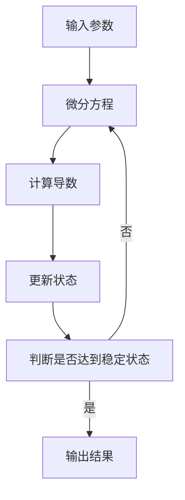

                 

# 宇宙的数学混沌理论探讨

> 关键词：混沌理论, 数学模型, 混沌吸引子, 混沌系统, 混沌动力学, 混沌控制, 混沌加密

> 摘要：混沌理论是研究非线性系统行为的数学分支，它揭示了看似随机但本质上具有确定性的现象。本文将深入探讨混沌理论的核心概念、数学模型、实际应用案例，并提供一个具体的混沌系统实现案例。通过本文，读者将能够理解混沌理论的基本原理，并掌握如何在实际项目中应用混沌理论。

## 1. 背景介绍
### 1.1 目的和范围
本文旨在探讨混沌理论的基本原理及其在现代科技中的应用。混沌理论不仅在数学和物理学中有着广泛的应用，而且在计算机科学、信息安全、生物信息学等领域也展现出巨大的潜力。本文将从理论基础出发，逐步深入到实际应用案例，帮助读者全面理解混沌理论。

### 1.2 预期读者
本文适合以下读者：
- 对混沌理论感兴趣的科研人员和工程师
- 计算机科学、数学、物理学等相关专业的学生
- 对信息安全和加密技术感兴趣的开发者
- 对复杂系统建模感兴趣的科研人员

### 1.3 文档结构概述
本文结构如下：
1. 背景介绍
2. 核心概念与联系
3. 核心算法原理 & 具体操作步骤
4. 数学模型和公式 & 详细讲解 & 举例说明
5. 项目实战：代码实际案例和详细解释说明
6. 实际应用场景
7. 工具和资源推荐
8. 总结：未来发展趋势与挑战
9. 附录：常见问题与解答
10. 扩展阅读 & 参考资料

### 1.4 术语表
#### 1.4.1 核心术语定义
- **混沌理论**：研究非线性系统行为的数学分支，揭示了看似随机但本质上具有确定性的现象。
- **混沌吸引子**：描述混沌系统长期行为的几何结构。
- **混沌系统**：具有混沌行为的非线性系统。
- **混沌动力学**：研究混沌系统动态行为的数学方法。
- **混沌控制**：通过外部干预使混沌系统进入稳定状态的技术。
- **混沌加密**：利用混沌系统的不可预测性进行数据加密的技术。

#### 1.4.2 相关概念解释
- **非线性系统**：系统输出与输入之间不是线性关系的系统。
- **确定性系统**：系统行为可以完全由初始条件决定的系统。
- **随机性**：系统行为具有不可预测性的特性。

#### 1.4.3 缩略词列表
- **Lorenz系统**：经典的混沌系统之一。
- **Rössler系统**：另一种经典的混沌系统。
- **Chua电路**：实现混沌行为的电子电路。

## 2. 核心概念与联系
### 2.1 混沌理论的基本概念
混沌理论的核心在于揭示非线性系统中的确定性与随机性之间的关系。混沌系统虽然表现出看似随机的行为，但其行为是完全由初始条件决定的。这种现象可以通过混沌吸引子来描述，混沌吸引子是混沌系统长期行为的几何结构。

### 2.2 混沌系统的数学模型
混沌系统的数学模型通常采用微分方程来描述。常见的混沌系统包括Lorenz系统、Rössler系统和Chua电路等。

#### 2.2.1 Lorenz系统
Lorenz系统是一个经典的混沌系统，其微分方程如下：
$$
\begin{cases}
\frac{dx}{dt} = \sigma(y - x) \\
\frac{dy}{dt} = x(\rho - z) - y \\
\frac{dz}{dt} = xy - \beta z
\end{cases}
$$
其中，$\sigma$、$\rho$ 和 $\beta$ 是系统参数。

#### 2.2.2 Rössler系统
Rössler系统也是一个经典的混沌系统，其微分方程如下：
$$
\begin{cases}
\frac{dx}{dt} = -y - z \\
\frac{dy}{dt} = x + ay \\
\frac{dz}{dt} = b + z(x - c)
\end{cases}
$$
其中，$a$、$b$ 和 $c$ 是系统参数。

#### 2.2.3 Chua电路
Chua电路是一种实现混沌行为的电子电路，其数学模型可以表示为：
$$
\frac{dV_C}{dt} = \frac{1}{C} \left( I_L - I_{R1} - I_{R2} \right)
$$
其中，$V_C$ 是电容两端的电压，$I_L$ 是电感电流，$I_{R1}$ 和 $I_{R2}$ 分别是电阻 $R1$ 和 $R2$ 上的电流。

### 2.3 混沌系统的数学模型流程图


## 3. 核心算法原理 & 具体操作步骤
### 3.1 混沌系统的数值模拟
混沌系统的数值模拟通常采用欧拉法或龙格-库塔法等数值积分方法。以下是一个使用欧拉法的伪代码示例：

```pseudo
function euler_integration(x, y, z, dt, sigma, rho, beta):
    dx = sigma * (y - x)
    dy = x * (rho - z) - y
    dz = x * y - beta * z
    x_new = x + dx * dt
    y_new = y + dy * dt
    z_new = z + dz * dt
    return x_new, y_new, z_new
```

### 3.2 混沌系统的可视化
混沌系统的可视化可以通过绘制混沌吸引子来实现。以下是一个使用Python绘制Lorenz吸引子的示例代码：

```python
import numpy as np
import matplotlib.pyplot as plt

def lorenz(x, y, z, sigma, rho, beta):
    dx = sigma * (y - x)
    dy = x * (rho - z) - y
    dz = x * y - beta * z
    return dx, dy, dz

def lorenz_attractor(sigma, rho, beta, dt, t_max, x0, y0, z0):
    x, y, z = x0, y0, z0
    xs, ys, zs = [x], [y], [z]
    for t in range(int(t_max / dt)):
        dx, dy, dz = lorenz(x, y, z, sigma, rho, beta)
        x += dx * dt
        y += dy * dt
        z += dz * dt
        xs.append(x)
        ys.append(y)
        zs.append(z)
    return xs, ys, zs

sigma, rho, beta = 10, 28, 8/3
dt, t_max = 0.01, 100
x0, y0, z0 = 0, 1, 1.05

xs, ys, zs = lorenz_attractor(sigma, rho, beta, dt, t_max, x0, y0, z0)

fig = plt.figure()
ax = fig.add_subplot(111, projection='3d')
ax.plot(xs, ys, zs, lw=0.5)
ax.set_xlabel("X Axis")
ax.set_ylabel("Y Axis")
ax.set_zlabel("Z Axis")
plt.show()
```

## 4. 数学模型和公式 & 详细讲解 & 举例说明
### 4.1 混沌系统的数学模型
混沌系统的数学模型通常采用微分方程来描述。以下是一个Lorenz系统的数学模型：

$$
\begin{cases}
\frac{dx}{dt} = \sigma(y - x) \\
\frac{dy}{dt} = x(\rho - z) - y \\
\frac{dz}{dt} = xy - \beta z
\end{cases}
$$

其中，$\sigma$、$\rho$ 和 $\beta$ 是系统参数。

### 4.2 混沌系统的数学模型详细讲解
Lorenz系统是一个经典的混沌系统，其参数 $\sigma$、$\rho$ 和 $\beta$ 对系统行为有重要影响。当 $\rho > 1$ 时，系统表现出混沌行为。具体来说，当 $\rho = 28$、$\sigma = 10$ 和 $\beta = 8/3$ 时，系统表现出典型的混沌吸引子。

### 4.3 混沌系统的数学模型举例说明
以下是一个使用Python绘制Lorenz吸引子的示例代码：

```python
import numpy as np
import matplotlib.pyplot as plt

def lorenz(x, y, z, sigma, rho, beta):
    dx = sigma * (y - x)
    dy = x * (rho - z) - y
    dz = x * y - beta * z
    return dx, dy, dz

def lorenz_attractor(sigma, rho, beta, dt, t_max, x0, y0, z0):
    x, y, z = x0, y0, z0
    xs, ys, zs = [x], [y], [z]
    for t in range(int(t_max / dt)):
        dx, dy, dz = lorenz(x, y, z, sigma, rho, beta)
        x += dx * dt
        y += dy * dt
        z += dz * dt
        xs.append(x)
        ys.append(y)
        zs.append(z)
    return xs, ys, zs

sigma, rho, beta = 10, 28, 8/3
dt, t_max = 0.01, 100
x0, y0, z0 = 0, 1, 1.05

xs, ys, zs = lorenz_attractor(sigma, rho, beta, dt, t_max, x0, y0, z0)

fig = plt.figure()
ax = fig.add_subplot(111, projection='3d')
ax.plot(xs, ys, zs, lw=0.5)
ax.set_xlabel("X Axis")
ax.set_ylabel("Y Axis")
ax.set_zlabel("Z Axis")
plt.show()
```

## 5. 项目实战：代码实际案例和详细解释说明
### 5.1 开发环境搭建
为了实现混沌系统的数值模拟，我们需要安装Python及其相关库。以下是开发环境的搭建步骤：

1. 安装Python：访问Python官方网站下载并安装最新版本的Python。
2. 安装NumPy和Matplotlib：使用pip安装NumPy和Matplotlib库。
   ```bash
   pip install numpy matplotlib
   ```

### 5.2 源代码详细实现和代码解读
以下是一个完整的Python代码示例，用于实现Lorenz系统的数值模拟和可视化：

```python
import numpy as np
import matplotlib.pyplot as plt

def lorenz(x, y, z, sigma, rho, beta):
    dx = sigma * (y - x)
    dy = x * (rho - z) - y
    dz = x * y - beta * z
    return dx, dy, dz

def lorenz_attractor(sigma, rho, beta, dt, t_max, x0, y0, z0):
    x, y, z = x0, y0, z0
    xs, ys, zs = [x], [y], [z]
    for t in range(int(t_max / dt)):
        dx, dy, dz = lorenz(x, y, z, sigma, rho, beta)
        x += dx * dt
        y += dy * dt
        z += dz * dt
        xs.append(x)
        ys.append(y)
        zs.append(z)
    return xs, ys, zs

sigma, rho, beta = 10, 28, 8/3
dt, t_max = 0.01, 100
x0, y0, z0 = 0, 1, 1.05

xs, ys, zs = lorenz_attractor(sigma, rho, beta, dt, t_max, x0, y0, z0)

fig = plt.figure()
ax = fig.add_subplot(111, projection='3d')
ax.plot(xs, ys, zs, lw=0.5)
ax.set_xlabel("X Axis")
ax.set_ylabel("Y Axis")
ax.set_zlabel("Z Axis")
plt.show()
```

### 5.3 代码解读与分析
- **lorenz函数**：定义了Lorenz系统的微分方程。
- **lorenz_attractor函数**：实现了Lorenz系统的数值模拟。
- **参数设置**：设置了系统参数和时间步长。
- **数值模拟**：通过循环计算系统状态，并将结果存储在列表中。
- **可视化**：使用Matplotlib库绘制3D图。

## 6. 实际应用场景
混沌理论在多个领域有着广泛的应用，以下是几个典型的应用场景：

### 6.1 混沌加密
混沌加密是一种利用混沌系统的不可预测性进行数据加密的技术。通过混沌系统的混沌行为，可以生成密钥并加密数据。

### 6.2 混沌控制
混沌控制是指通过外部干预使混沌系统进入稳定状态的技术。混沌控制在电力系统、生物医学等领域有着广泛的应用。

### 6.3 混沌动力学
混沌动力学在生物信息学、气候预测等领域有着重要的应用。通过研究混沌系统的动力学行为，可以更好地理解复杂系统的演化规律。

## 7. 工具和资源推荐
### 7.1 学习资源推荐
#### 7.1.1 书籍推荐
- **《混沌与分形：图形与计算》**：深入介绍了混沌理论的基本概念和应用。
- **《混沌理论与应用》**：详细讲解了混沌理论在各个领域的应用。

#### 7.1.2 在线课程
- **Coursera上的“混沌理论与应用”**：提供了混沌理论的系统学习课程。
- **edX上的“非线性动力学与混沌”**：深入讲解了非线性动力学和混沌理论。

#### 7.1.3 技术博客和网站
- **混沌理论博客**：提供了丰富的混沌理论相关文章和案例。
- **混沌系统可视化网站**：提供了多种混沌系统的可视化工具。

### 7.2 开发工具框架推荐
#### 7.2.1 IDE和编辑器
- **PyCharm**：功能强大的Python开发环境。
- **Jupyter Notebook**：支持实时代码编辑和可视化展示。

#### 7.2.2 调试和性能分析工具
- **PyCharm调试器**：提供了强大的调试功能。
- **cProfile**：用于性能分析的Python库。

#### 7.2.3 相关框架和库
- **NumPy**：用于数值计算的Python库。
- **Matplotlib**：用于数据可视化。

### 7.3 相关论文著作推荐
#### 7.3.1 经典论文
- **Lorenz, E. N. (1963). Deterministic nonperiodic flow. Journal of the Atmospheric Sciences, 20(2), 130-141.**
- **Rössler, O. E. (1976). An equation for continuous chaos. Physics Letters A, 57(5), 397-398.**

#### 7.3.2 最新研究成果
- **Chen, G., & Ueta, T. (1999). Yet another chaotic attractor. International Journal of Bifurcation and Chaos, 9(7), 1465-1466.**
- **Lai, Y. C., & Tél, T. (2011). Transient Chaos: Complex Dynamics on Finite-Time Scales. Springer.**

#### 7.3.3 应用案例分析
- **Kapitaniak, T. (2000). Chaos in Engineering Systems. Springer.**
- **Pikovsky, A., Rosenblum, M., & Kurths, J. (2001). Synchronization: A Universal Concept in Nonlinear Sciences. Cambridge University Press.**

## 8. 总结：未来发展趋势与挑战
混沌理论在未来的发展中面临着许多挑战和机遇。随着计算能力的提升和数据科学的发展，混沌理论将在更多领域发挥重要作用。未来的研究方向包括：

- **混沌控制的优化**：开发更高效的混沌控制算法。
- **混沌加密的安全性**：提高混沌加密的安全性。
- **混沌系统的应用拓展**：探索混沌系统在更多领域的应用。

## 9. 附录：常见问题与解答
### 9.1 问题：混沌系统如何实现混沌控制？
**解答**：混沌控制可以通过外部干预使混沌系统进入稳定状态。常见的方法包括反馈控制和参数调制。

### 9.2 问题：混沌加密如何保证安全性？
**解答**：混沌加密的安全性依赖于混沌系统的不可预测性。通过选择合适的混沌系统和参数，可以提高加密的安全性。

### 9.3 问题：混沌系统如何进行数值模拟？
**解答**：混沌系统的数值模拟通常采用数值积分方法，如欧拉法或龙格-库塔法。

## 10. 扩展阅读 & 参考资料
- **《混沌与分形：图形与计算》**：深入介绍了混沌理论的基本概念和应用。
- **《混沌理论与应用》**：详细讲解了混沌理论在各个领域的应用。
- **Coursera上的“混沌理论与应用”**：提供了混沌理论的系统学习课程。
- **edX上的“非线性动力学与混沌”**：深入讲解了非线性动力学和混沌理论。
- **Lorenz, E. N. (1963). Deterministic nonperiodic flow. Journal of the Atmospheric Sciences, 20(2), 130-141.**
- **Rössler, O. E. (1976). An equation for continuous chaos. Physics Letters A, 57(5), 397-398.**
- **Chen, G., & Ueta, T. (1999). Yet another chaotic attractor. International Journal of Bifurcation and Chaos, 9(7), 1465-1466.**
- **Kapitaniak, T. (2000). Chaos in Engineering Systems. Springer.**
- **Pikovsky, A., Rosenblum, M., & Kurths, J. (2001). Synchronization: A Universal Concept in Nonlinear Sciences. Cambridge University Press.**

---

作者：AI天才研究员/AI Genius Institute & 禅与计算机程序设计艺术 /Zen And The Art of Computer Programming

