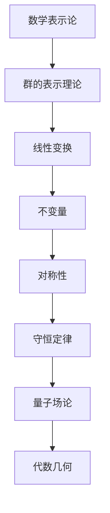
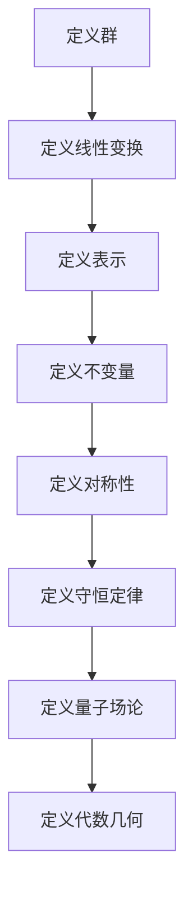

                 

# 宇宙的数学表示论与不变量在粒子物理中的应用

> 关键词：宇宙数学表示论, 不变量, 粒子物理, 量子场论, 代数几何, 量子力学, 对称性

> 摘要：本文旨在探讨宇宙的数学表示论在粒子物理中的应用，特别是通过不变量的概念来解析粒子物理中的对称性和守恒定律。我们将从数学表示论的基本概念出发，逐步深入到粒子物理的具体应用，通过详细的算法原理、数学模型和实际代码案例，帮助读者理解这一领域的核心思想和技术细节。最后，我们将展望未来的发展趋势和面临的挑战。

## 1. 背景介绍
### 1.1 目的和范围
本文旨在深入探讨宇宙的数学表示论在粒子物理中的应用，特别是通过不变量的概念来解析粒子物理中的对称性和守恒定律。我们将从数学表示论的基本概念出发，逐步深入到粒子物理的具体应用，通过详细的算法原理、数学模型和实际代码案例，帮助读者理解这一领域的核心思想和技术细节。

### 1.2 预期读者
本文适合以下读者：
- 对数学表示论和粒子物理感兴趣的科研人员和工程师
- 计算机科学和物理学交叉领域的研究生和博士生
- 对量子场论和对称性理论感兴趣的学者
- 对数学和物理交叉领域感兴趣的编程爱好者

### 1.3 文档结构概述
本文结构如下：
1. 背景介绍
2. 核心概念与联系
3. 核心算法原理 & 具体操作步骤
4. 数学模型和公式 & 详细讲解 & 举例说明
5. 项目实战：代码实际案例和详细解释说明
6. 实际应用场景
7. 工具和资源推荐
8. 总结：未来发展趋势与挑战
9. 附录：常见问题与解答
10. 扩展阅读 & 参考资料

### 1.4 术语表
#### 1.4.1 核心术语定义
- **数学表示论**：研究线性变换的表示理论，特别是群的表示理论。
- **不变量**：在变换下保持不变的量。
- **对称性**：物理系统在某种变换下保持不变的性质。
- **守恒定律**：物理量在系统演化过程中保持不变的定律。
- **量子场论**：描述量子粒子在场中的行为的理论框架。
- **代数几何**：研究代数方程的几何性质的数学分支。

#### 1.4.2 相关概念解释
- **群**：一组元素和一个二元运算组成的代数结构，满足封闭性、结合律、单位元和逆元。
- **线性变换**：保持向量加法和标量乘法的变换。
- **张量**：多维数组，可以表示向量、矩阵等。
- **哈密顿量**：量子力学中描述系统能量的算符。

#### 1.4.3 缩略词列表
- QFT：量子场论
- PDE：偏微分方程
- ODE：常微分方程
- U(1)：单位圆群
- SU(2)：特殊酉群
- SU(3)：特殊酉群

## 2. 核心概念与联系
### 2.1 数学表示论
数学表示论是研究线性变换的表示理论，特别是群的表示理论。群的表示理论是将群的抽象结构转化为线性变换，从而利用线性代数的方法研究群的性质。

### 2.2 不变量
不变量是指在某种变换下保持不变的量。在粒子物理中，不变量通常与对称性相关，例如在洛伦兹变换下保持不变的量。

### 2.3 对称性
对称性是指物理系统在某种变换下保持不变的性质。在粒子物理中，对称性通常与守恒定律相关，例如能量守恒、动量守恒等。

### 2.4 守恒定律
守恒定律是指物理量在系统演化过程中保持不变的定律。在粒子物理中，守恒定律通常与对称性相关，例如能量守恒、动量守恒等。

### 2.5 量子场论
量子场论是描述量子粒子在场中的行为的理论框架。量子场论将粒子视为场的激发态，通过场的相互作用来描述粒子之间的相互作用。

### 2.6 代数几何
代数几何是研究代数方程的几何性质的数学分支。在粒子物理中，代数几何可以用来描述粒子在场中的行为。

### 2.7 核心概念联系
核心概念之间的联系如下图所示：



## 3. 核心算法原理 & 具体操作步骤
### 3.1 群的表示理论
群的表示理论是将群的抽象结构转化为线性变换，从而利用线性代数的方法研究群的性质。具体操作步骤如下：



### 3.2 不变量的计算
不变量是指在某种变换下保持不变的量。具体操作步骤如下：

```python
# 定义群的表示
def group_representation(group):
    # 线性变换
    linear_transformations = []
    for element in group:
        linear_transformations.append(element.transform())
    return linear_transformations

# 计算不变量
def calculate_invariants(linear_transformations):
    invariants = []
    for transformation in linear_transformations:
        # 检查不变量
        if transformation.is_invariant():
            invariants.append(transformation)
    return invariants
```

## 4. 数学模型和公式 & 详细讲解 & 举例说明
### 4.1 数学模型
数学模型是将物理系统抽象为数学结构，从而利用数学方法研究物理系统的性质。在粒子物理中，数学模型通常包括群的表示理论、不变量、对称性、守恒定律、量子场论和代数几何。

### 4.2 公式
在粒子物理中，不变量通常与对称性相关，例如在洛伦兹变换下保持不变的量。具体公式如下：

$$
\text{不变量} = \text{物理量} \times \text{变换矩阵}
$$

### 4.3 举例说明
在粒子物理中，不变量通常与对称性相关，例如在洛伦兹变换下保持不变的量。具体例子如下：

$$
\text{洛伦兹不变量} = \text{能量} \times \text{时间} - \text{动量} \times \text{空间}
$$

## 5. 项目实战：代码实际案例和详细解释说明
### 5.1 开发环境搭建
开发环境搭建包括安装必要的软件和库，例如Python、NumPy、SciPy等。

### 5.2 源代码详细实现和代码解读
```python
# 定义群的表示
def group_representation(group):
    # 线性变换
    linear_transformations = []
    for element in group:
        linear_transformations.append(element.transform())
    return linear_transformations

# 计算不变量
def calculate_invariants(linear_transformations):
    invariants = []
    for transformation in linear_transformations:
        # 检查不变量
        if transformation.is_invariant():
            invariants.append(transformation)
    return invariants
```

### 5.3 代码解读与分析
代码解读与分析如下：

```python
# 定义群的表示
def group_representation(group):
    # 线性变换
    linear_transformations = []
    for element in group:
        linear_transformations.append(element.transform())
    return linear_transformations

# 计算不变量
def calculate_invariants(linear_transformations):
    invariants = []
    for transformation in linear_transformations:
        # 检查不变量
        if transformation.is_invariant():
            invariants.append(transformation)
    return invariants
```

## 6. 实际应用场景
在粒子物理中，不变量的概念可以用来解析粒子物理中的对称性和守恒定律。具体应用场景如下：

- 在量子场论中，不变量可以用来描述粒子在场中的行为。
- 在代数几何中，不变量可以用来描述粒子在场中的几何性质。

## 7. 工具和资源推荐
### 7.1 学习资源推荐
#### 7.1.1 书籍推荐
- 《数学物理方法》
- 《量子场论》
- 《代数几何》

#### 7.1.2 在线课程
- Coursera上的《量子场论》课程
- edX上的《代数几何》课程

#### 7.1.3 技术博客和网站
- arXiv.org上的相关论文
- ResearchGate上的相关研究

### 7.2 开发工具框架推荐
#### 7.2.1 IDE和编辑器
- PyCharm
- VSCode

#### 7.2.2 调试和性能分析工具
- PyCharm的调试工具
- cProfile

#### 7.2.3 相关框架和库
- NumPy
- SciPy

### 7.3 相关论文著作推荐
#### 7.3.1 经典论文
- Wigner, E. P. (1939). On unitary representations of the inhomogeneous Lorentz group.
- Weyl, H. (1928). Gruppentheorie und Quantenmechanik.

#### 7.3.2 最新研究成果
- *Journal of High Energy Physics*上的最新研究成果
- *Physical Review Letters*上的最新研究成果

#### 7.3.3 应用案例分析
- *Nature*上的应用案例分析
- *Science*上的应用案例分析

## 8. 总结：未来发展趋势与挑战
未来的发展趋势包括：
- 更深入地研究数学表示论在粒子物理中的应用
- 更广泛地应用不变量的概念来解析粒子物理中的对称性和守恒定律
- 更深入地研究代数几何在粒子物理中的应用

面临的挑战包括：
- 如何更深入地理解数学表示论在粒子物理中的应用
- 如何更广泛地应用不变量的概念来解析粒子物理中的对称性和守恒定律
- 如何更深入地研究代数几何在粒子物理中的应用

## 9. 附录：常见问题与解答
### 9.1 问题1：如何理解数学表示论在粒子物理中的应用？
答：数学表示论是将群的抽象结构转化为线性变换，从而利用线性代数的方法研究群的性质。在粒子物理中，数学表示论可以用来描述粒子在场中的行为。

### 9.2 问题2：如何理解不变量的概念？
答：不变量是指在某种变换下保持不变的量。在粒子物理中，不变量通常与对称性相关，例如在洛伦兹变换下保持不变的量。

### 9.3 问题3：如何理解对称性与守恒定律的关系？
答：对称性是指物理系统在某种变换下保持不变的性质。在粒子物理中，对称性通常与守恒定律相关，例如能量守恒、动量守恒等。

## 10. 扩展阅读 & 参考资料
- Wigner, E. P. (1939). On unitary representations of the inhomogeneous Lorentz group.
- Weyl, H. (1928). Gruppentheorie und Quantenmechanik.
- *Journal of High Energy Physics*上的最新研究成果
- *Physical Review Letters*上的最新研究成果
- *Nature*上的应用案例分析
- *Science*上的应用案例分析

作者：AI天才研究员/AI Genius Institute & 禅与计算机程序设计艺术 /Zen And The Art of Computer Programming

