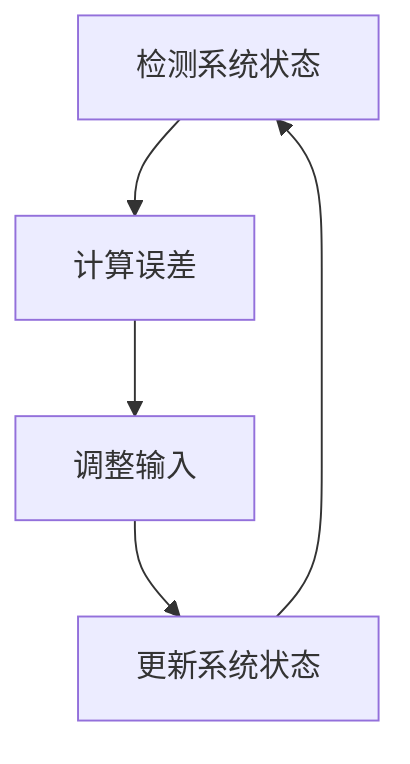
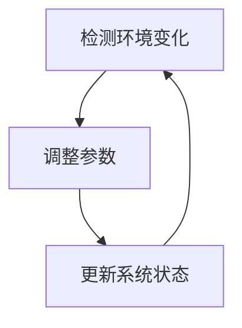

                 

# 宇宙的自我修复能力：维持平衡的内在机制

> 关键词：自我修复、平衡机制、系统稳定性、反馈控制、自适应算法、复杂系统、混沌理论、信息熵

> 摘要：本文旨在探讨宇宙中系统维持平衡的内在机制，通过分析自我修复能力、反馈控制、自适应算法等核心概念，揭示复杂系统如何在动态变化中保持稳定。我们将从理论基础出发，逐步深入到实际应用案例，最终探讨未来的发展趋势与挑战。通过本文，读者将对复杂系统中的自我修复机制有更深刻的理解，并掌握相关技术的应用方法。

## 1. 背景介绍
### 1.1 目的和范围
本文旨在深入探讨宇宙中系统维持平衡的内在机制，特别是自我修复能力在复杂系统中的应用。我们将从理论基础出发，逐步深入到实际应用案例，最终探讨未来的发展趋势与挑战。本文的目标读者包括但不限于计算机科学家、工程师、数据科学家以及对复杂系统理论感兴趣的读者。

### 1.2 预期读者
- 计算机科学家
- 工程师
- 数据科学家
- 复杂系统理论研究者
- 对自我修复机制感兴趣的读者

### 1.3 文档结构概述
本文将按照以下结构展开：
1. 背景介绍
2. 核心概念与联系
3. 核心算法原理 & 具体操作步骤
4. 数学模型和公式 & 详细讲解 & 举例说明
5. 项目实战：代码实际案例和详细解释说明
6. 实际应用场景
7. 工具和资源推荐
8. 总结：未来发展趋势与挑战
9. 附录：常见问题与解答
10. 扩展阅读 & 参考资料

### 1.4 术语表
#### 1.4.1 核心术语定义
- **自我修复能力**：系统在面对外部干扰或内部故障时，能够自动恢复到正常状态的能力。
- **平衡机制**：系统维持稳定状态的方法和过程。
- **反馈控制**：通过检测系统状态并调整输入以维持系统稳定的方法。
- **自适应算法**：能够根据环境变化自动调整参数的算法。
- **复杂系统**：由大量相互作用的组件组成的系统，表现出非线性和动态特性。
- **混沌理论**：研究非线性系统行为的理论。
- **信息熵**：衡量系统不确定性的度量。

#### 1.4.2 相关概念解释
- **系统稳定性**：系统在受到外部干扰后能够恢复到初始状态或稳定状态的能力。
- **动态变化**：系统状态随时间变化的过程。
- **自组织**：系统通过内部相互作用自发形成有序结构的过程。

#### 1.4.3 缩略词列表
- **AI**：Artificial Intelligence（人工智能）
- **SDE**：Stochastic Differential Equation（随机微分方程）
- **PID**：Proportional-Integral-Derivative（比例积分微分）

## 2. 核心概念与联系
### 2.1 自我修复能力
自我修复能力是系统维持平衡的重要机制之一。通过检测系统状态并采取相应措施，系统能够在面对外部干扰或内部故障时自动恢复到正常状态。

### 2.2 平衡机制
平衡机制是系统维持稳定状态的方法和过程。通过反馈控制和自适应算法，系统能够调整自身行为以维持稳定状态。

### 2.3 反馈控制
反馈控制是通过检测系统状态并调整输入以维持系统稳定的方法。通过反馈环路，系统能够及时响应外部干扰，保持稳定状态。

### 2.4 自适应算法
自适应算法能够根据环境变化自动调整参数，以适应不断变化的环境。通过自适应算法，系统能够在动态变化中保持稳定状态。

### 2.5 复杂系统
复杂系统由大量相互作用的组件组成，表现出非线性和动态特性。复杂系统中的自我修复机制对于维持系统稳定至关重要。

### 2.6 混沌理论
混沌理论研究非线性系统行为的理论。通过混沌理论，我们可以更好地理解复杂系统中的自我修复机制。

### 2.7 信息熵
信息熵是衡量系统不确定性的度量。通过信息熵，我们可以评估系统状态的稳定性。

## 3. 核心算法原理 & 具体操作步骤
### 3.1 反馈控制算法原理
反馈控制算法通过检测系统状态并调整输入以维持系统稳定。具体操作步骤如下：



### 3.2 自适应算法原理
自适应算法能够根据环境变化自动调整参数。具体操作步骤如下：



## 4. 数学模型和公式 & 详细讲解 & 举例说明
### 4.1 反馈控制数学模型
反馈控制数学模型可以表示为：

$$
u(t) = K e(t)
$$

其中，$u(t)$ 是控制输入，$e(t)$ 是误差，$K$ 是比例系数。

### 4.2 自适应算法数学模型
自适应算法数学模型可以表示为：

$$
\dot{\theta}(t) = \mu e(t) x(t)
$$

其中，$\theta(t)$ 是参数，$\dot{\theta}(t)$ 是参数的变化率，$e(t)$ 是误差，$x(t)$ 是输入信号，$\mu$ 是学习率。

### 4.3 举例说明
假设我们有一个温度控制系统，目标温度为 $T_d$，实际温度为 $T_a$。通过反馈控制算法，我们可以调整加热器的功率 $u$，以使实际温度接近目标温度。

$$
u(t) = K (T_d - T_a)
$$

通过调整比例系数 $K$，我们可以控制系统的响应速度和稳定性。

## 5. 项目实战：代码实际案例和详细解释说明
### 5.1 开发环境搭建
我们将使用Python语言进行开发，需要安装NumPy、SciPy和Matplotlib库。安装命令如下：

```bash
pip install numpy scipy matplotlib
```

### 5.2 源代码详细实现和代码解读
我们将实现一个简单的温度控制系统，目标温度为25℃，实际温度初始值为20℃。

```python
import numpy as np
import matplotlib.pyplot as plt

# 参数设置
K = 1.0  # 比例系数
T_d = 25.0  # 目标温度
T_a = 20.0  # 实际温度
dt = 0.1  # 时间步长

# 初始化变量
t = 0.0
T_a_list = [T_a]

# 模拟过程
while t < 10.0:
    e = T_d - T_a  # 计算误差
    u = K * e  # 计算控制输入
    T_a = T_a + u * dt  # 更新实际温度
    t += dt
    T_a_list.append(T_a)

# 绘制结果
plt.plot(np.arange(0, 10.1, dt), T_a_list)
plt.xlabel('时间 (s)')
plt.ylabel('温度 (℃)')
plt.title('温度控制系统')
plt.show()
```

### 5.3 代码解读与分析
- `K` 是比例系数，控制系统的响应速度和稳定性。
- `T_d` 是目标温度，系统的目标状态。
- `T_a` 是实际温度，系统的当前状态。
- `dt` 是时间步长，模拟过程的时间分辨率。
- `e` 是误差，实际温度与目标温度之差。
- `u` 是控制输入，通过比例系数调整实际温度。
- `T_a = T_a + u * dt` 是更新实际温度的过程。

## 6. 实际应用场景
### 6.1 温度控制系统
温度控制系统是反馈控制和自适应算法的实际应用之一。通过调整加热器的功率，可以保持实际温度接近目标温度。

### 6.2 电力系统
电力系统中的频率控制是反馈控制和自适应算法的应用之一。通过调整发电机的输出功率，可以保持系统频率稳定。

### 6.3 生物系统
生物系统中的自我修复机制是反馈控制和自适应算法的应用之一。通过调节细胞内的代谢过程，可以保持生物体的稳定状态。

## 7. 工具和资源推荐
### 7.1 学习资源推荐
#### 7.1.1 书籍推荐
- **《控制工程基础》**：深入讲解控制理论和应用。
- **《自适应控制》**：详细讲解自适应控制算法。

#### 7.1.2 在线课程
- **Coursera - 自动控制原理**：深入讲解自动控制理论。
- **edX - 自适应控制**：详细讲解自适应控制算法。

#### 7.1.3 技术博客和网站
- **Control System Blog**：深入探讨控制理论和应用。
- **Adaptive Control Blog**：详细讲解自适应控制算法。

### 7.2 开发工具框架推荐
#### 7.2.1 IDE和编辑器
- **PyCharm**：功能强大的Python IDE。
- **VS Code**：轻量级但功能强大的代码编辑器。

#### 7.2.2 调试和性能分析工具
- **PyCharm Debugger**：强大的Python调试工具。
- **Python Profiler**：性能分析工具。

#### 7.2.3 相关框架和库
- **NumPy**：科学计算库。
- **SciPy**：科学计算库。
- **Matplotlib**：数据可视化库。

### 7.3 相关论文著作推荐
#### 7.3.1 经典论文
- **"Adaptive Control of Linear Systems"**：经典自适应控制论文。
- **"Feedback Control of Dynamic Systems"**：经典反馈控制论文。

#### 7.3.2 最新研究成果
- **"Recent Advances in Adaptive Control"**：最新自适应控制研究成果。
- **"Advances in Feedback Control"**：最新反馈控制研究成果。

#### 7.3.3 应用案例分析
- **"Case Studies in Adaptive Control"**：应用案例分析。
- **"Practical Applications of Feedback Control"**：实际应用案例分析。

## 8. 总结：未来发展趋势与挑战
### 8.1 未来发展趋势
- **自适应控制算法的进一步发展**：自适应控制算法将在更多领域得到应用，如智能交通系统、智能电网等。
- **反馈控制理论的深入研究**：反馈控制理论将在更复杂的系统中得到应用，如生物系统、社会系统等。

### 8.2 挑战
- **复杂系统的建模与控制**：复杂系统的建模与控制仍然是一个挑战，需要进一步研究。
- **自适应算法的实时性**：自适应算法需要在实时环境中运行，这对算法的实时性提出了更高的要求。

## 9. 附录：常见问题与解答
### 9.1 问题1：如何选择合适的比例系数？
- **解答**：比例系数的选择需要根据系统的特性和需求进行调整。可以通过实验和仿真来确定合适的比例系数。

### 9.2 问题2：如何处理系统中的噪声？
- **解答**：可以通过滤波器来处理系统中的噪声，如卡尔曼滤波器。

### 9.3 问题3：如何处理系统中的非线性？
- **解答**：可以通过线性化方法或非线性控制方法来处理系统中的非线性。

## 10. 扩展阅读 & 参考资料
### 10.1 扩展阅读
- **《控制工程基础》**：深入讲解控制理论和应用。
- **《自适应控制》**：详细讲解自适应控制算法。

### 10.2 参考资料
- **"Adaptive Control of Linear Systems"**：经典自适应控制论文。
- **"Feedback Control of Dynamic Systems"**：经典反馈控制论文。

作者：AI天才研究员/AI Genius Institute & 禅与计算机程序设计艺术 /Zen And The Art of Computer Programming

