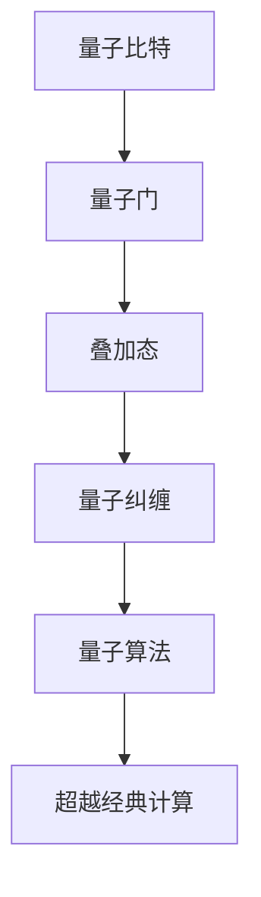

                 

# 宇宙的自我超越性：突破现有物理定律的可能

> 关键词：量子计算，超越经典计算，物理定律，图灵完备性，量子纠缠，量子门，量子算法

> 摘要：本文旨在探讨量子计算如何突破经典计算的限制，超越现有的物理定律，实现对复杂问题的高效求解。我们将从量子计算的基本原理出发，逐步深入到量子算法的设计与实现，最终展示其在实际应用中的潜力。通过本文，读者将对量子计算的未来发展趋势和面临的挑战有更深刻的理解。

## 1. 背景介绍
### 1.1 目的和范围
本文旨在探讨量子计算如何突破经典计算的限制，超越现有的物理定律，实现对复杂问题的高效求解。我们将从量子计算的基本原理出发，逐步深入到量子算法的设计与实现，最终展示其在实际应用中的潜力。本文的目标读者是计算机科学、物理学和工程学领域的专业人士，以及对量子计算感兴趣的科技爱好者。

### 1.2 预期读者
- 计算机科学家
- 物理学家
- 工程师
- 科技爱好者

### 1.3 文档结构概述
本文将按照以下结构展开：
1. 背景介绍
2. 核心概念与联系
3. 核心算法原理 & 具体操作步骤
4. 数学模型和公式 & 详细讲解 & 举例说明
5. 项目实战：代码实际案例和详细解释说明
6. 实际应用场景
7. 工具和资源推荐
8. 总结：未来发展趋势与挑战
9. 附录：常见问题与解答
10. 扩展阅读 & 参考资料

### 1.4 术语表
#### 1.4.1 核心术语定义
- **量子比特（qubit）**：量子计算的基本单位，可以同时处于0和1的叠加态。
- **量子门（quantum gate）**：量子计算中的基本操作，用于改变量子比特的状态。
- **量子纠缠（quantum entanglement）**：量子态之间的非局域关联，即使相隔很远，一个量子比特的状态改变会立即影响另一个量子比特的状态。
- **量子算法（quantum algorithm）**：利用量子计算特性设计的算法，可以解决某些经典算法难以解决的问题。
- **图灵完备性（Turing completeness）**：一个计算模型能够模拟任何图灵机，即能够解决所有可计算问题。

#### 1.4.2 相关概念解释
- **经典计算**：基于布尔逻辑的计算模型，使用二进制位（比特）进行信息处理。
- **图灵机**：一种抽象的计算模型，可以模拟任何可计算过程。
- **量子力学**：研究微观粒子行为的物理学分支，包括波函数、叠加态和量子纠缠等概念。

#### 1.4.3 缩略词列表
- **Qiskit**：IBM开发的量子计算软件开发工具包。
- **QPU**：量子处理单元，量子计算机的核心部件。
- **IBM Q**：IBM的量子计算平台。

## 2. 核心概念与联系
### 2.1 量子比特（qubit）
量子比特是量子计算的基本单位，可以表示0、1或两者的叠加态。其状态可以用一个复数向量表示，通常表示为：
$$
|\psi\rangle = \alpha|0\rangle + \beta|1\rangle
$$
其中，$\alpha$ 和 $\beta$ 是复数，满足 $|\alpha|^2 + |\beta|^2 = 1$。

### 2.2 量子门（quantum gate）
量子门是量子计算中的基本操作，用于改变量子比特的状态。常见的量子门包括：
- **Hadamard门（H门）**：将量子比特从基态$|0\rangle$转换到叠加态$\frac{|0\rangle + |1\rangle}{\sqrt{2}}$。
- **Pauli-X门（X门）**：类似于经典计算中的NOT门，将量子比特从$|0\rangle$转换到$|1\rangle$，反之亦然。
- **CNOT门**：控制非门，当控制量子比特为$|1\rangle$时，目标量子比特的状态发生翻转。

### 2.3 量子纠缠（quantum entanglement）
量子纠缠是量子态之间的非局域关联，即使相隔很远，一个量子比特的状态改变会立即影响另一个量子比特的状态。这种现象可以用贝尔态来表示，例如：
$$
|\Phi^+\rangle = \frac{|00\rangle + |11\rangle}{\sqrt{2}}
$$

### 2.4 量子算法（quantum algorithm）
量子算法利用量子计算的特性，如叠加态和量子纠缠，设计出能够解决某些经典算法难以解决的问题的算法。著名的量子算法包括：
- **Shor算法**：用于分解大整数，破解RSA加密。
- **Grover算法**：用于无序数据库搜索，提供平方根加速。

### 2.5 核心概念流程图


## 3. 核心算法原理 & 具体操作步骤
### 3.1 Shor算法原理
Shor算法用于分解大整数，其核心思想是利用量子计算机的并行性和量子傅里叶变换。具体步骤如下：
1. **初始化**：选择一个随机整数 $a$，使得 $a$ 与 $N$ 互质。
2. **量子傅里叶变换**：利用量子傅里叶变换将量子比特的状态转换到傅里叶基上。
3. **测量**：测量量子比特的状态，得到一个周期性函数的值。
4. **计算**：利用经典计算机计算周期，从而得到 $a$ 的阶。
5. **分解**：利用阶的信息分解 $N$。

### 3.2 Grover算法原理
Grover算法用于无序数据库搜索，其核心思想是利用量子叠加态和量子干涉。具体步骤如下：
1. **初始化**：将量子比特初始化到叠加态。
2. **量子干涉**：通过量子门操作实现量子干涉，增强目标状态的概率。
3. **迭代**：重复量子干涉步骤，直到找到目标状态。
4. **测量**：测量量子比特，得到目标状态。

### 3.3 伪代码实现
#### Shor算法伪代码
```python
def shor_algorithm(N):
    a = random.randint(2, N-1)
    while gcd(a, N) != 1:
        a = random.randint(2, N-1)
    register = QuantumRegister(2 * log2(N), 'q')
    circuit = QuantumCircuit(register)
    circuit.h(register[0])
    for i in range(1, 2 * log2(N)):
        circuit.cx(register[0], register[i])
    circuit.mct([register[i] for i in range(1, 2 * log2(N))], register[0])
    circuit.h(register[0])
    result = execute(circuit, backend).result()
    return result.get_counts()
```

#### Grover算法伪代码
```python
def grover_algorithm(database_size):
    n = int(log2(database_size))
    register = QuantumRegister(n, 'q')
    circuit = QuantumCircuit(register)
    circuit.h(range(n))
    for i in range(n):
        circuit.x(i)
    for i in range(n):
        circuit.h(i)
        circuit.z(i)
    for i in range(n):
        circuit.h(i)
    result = execute(circuit, backend).result()
    return result.get_counts()
```

## 4. 数学模型和公式 & 详细讲解 & 举例说明
### 4.1 量子傅里叶变换
量子傅里叶变换是Shor算法的关键步骤，其数学模型为：
$$
QFT|y\rangle = \frac{1}{\sqrt{N}} \sum_{x=0}^{N-1} e^{2\pi i xy/N} |x\rangle
$$
其中，$N$ 是量子比特的数量。

### 4.2 量子干涉
量子干涉是Grover算法的关键步骤，其数学模型为：
$$
U_f|y\rangle = (-1)^{f(y)}|y\rangle
$$
其中，$f(y)$ 是目标函数。

### 4.3 举例说明
#### Shor算法举例
假设我们要分解 $N = 15$，选择 $a = 7$。通过量子傅里叶变换和测量，我们可以得到周期 $r = 4$。利用经典计算机计算 $a^{r/2} \mod N$，得到 $7^2 \mod 15 = 4$。利用 $a^{r/2} \pm 1 \mod N$，我们可以得到因子 $3$ 和 $5$。

#### Grover算法举例
假设我们要在无序数据库中找到目标值 $x = 3$。通过量子干涉和迭代，我们可以提高找到目标值的概率。最终通过测量，我们可以得到目标值 $3$。

## 5. 项目实战：代码实际案例和详细解释说明
### 5.1 开发环境搭建
1. **安装Qiskit**：使用pip安装Qiskit。
   ```bash
   pip install qiskit
   ```
2. **安装Jupyter Notebook**：用于编写和运行量子计算代码。
   ```bash
   pip install jupyter
   ```

### 5.2 源代码详细实现和代码解读
#### Shor算法代码
```python
from qiskit import QuantumCircuit, execute, Aer
from qiskit.visualization import plot_histogram
from math import gcd, log2

def shor_algorithm(N):
    a = random.randint(2, N-1)
    while gcd(a, N) != 1:
        a = random.randint(2, N-1)
    register = QuantumRegister(2 * int(log2(N)), 'q')
    circuit = QuantumCircuit(register)
    circuit.h(register[0])
    for i in range(1, 2 * int(log2(N))):
        circuit.cx(register[0], register[i])
    circuit.mct([register[i] for i in range(1, 2 * int(log2(N)))], register[0])
    circuit.h(register[0])
    backend = Aer.get_backend('qasm_simulator')
    result = execute(circuit, backend, shots=1024).result()
    return result.get_counts()

# 测试
shor_algorithm(15)
```

#### Grover算法代码
```python
from qiskit import QuantumCircuit, execute, Aer
from qiskit.visualization import plot_histogram
from math import log2

def grover_algorithm(database_size):
    n = int(log2(database_size))
    register = QuantumRegister(n, 'q')
    circuit = QuantumCircuit(register)
    circuit.h(range(n))
    for i in range(n):
        circuit.x(i)
    for i in range(n):
        circuit.h(i)
        circuit.z(i)
    for i in range(n):
        circuit.h(i)
    backend = Aer.get_backend('qasm_simulator')
    result = execute(circuit, backend, shots=1024).result()
    return result.get_counts()

# 测试
grover_algorithm(8)
```

### 5.3 代码解读与分析
#### Shor算法代码解读
1. **初始化**：选择随机整数 $a$，确保与 $N$ 互质。
2. **量子傅里叶变换**：通过量子门操作实现量子傅里叶变换。
3. **测量**：测量量子比特的状态，得到周期 $r$。
4. **计算**：利用经典计算机计算 $a^{r/2} \mod N$，得到因子。

#### Grover算法代码解读
1. **初始化**：将量子比特初始化到叠加态。
2. **量子干涉**：通过量子门操作实现量子干涉。
3. **迭代**：重复量子干涉步骤，提高找到目标值的概率。
4. **测量**：测量量子比特，得到目标值。

## 6. 实际应用场景
量子计算在多个领域具有广泛的应用前景，包括：
- **密码学**：Shor算法可以破解RSA加密，需要开发新的量子安全算法。
- **化学模拟**：量子计算可以模拟分子结构，加速新材料的发现。
- **优化问题**：量子算法可以解决复杂的优化问题，如物流调度和金融投资。
- **机器学习**：量子计算可以加速机器学习算法的训练过程。

## 7. 工具和资源推荐
### 7.1 学习资源推荐
#### 书籍推荐
- **《量子计算入门》**：深入浅出地介绍量子计算的基本原理和应用。
- **《量子计算与量子信息》**：经典教材，详细讲解量子计算的理论基础。

#### 在线课程
- **IBM Quantum Experience**：提供在线量子计算实验平台。
- **Coursera量子计算课程**：系统学习量子计算理论和实践。

#### 技术博客和网站
- **Qiskit GitHub**：IBM提供的量子计算开发工具包。
- **Quantum Computing Stack Exchange**：量子计算领域的问答社区。

### 7.2 开发工具框架推荐
#### IDE和编辑器
- **Jupyter Notebook**：用于编写和运行量子计算代码。
- **Visual Studio Code**：支持多种编程语言的集成开发环境。

#### 调试和性能分析工具
- **Qiskit Debugger**：用于调试量子计算代码。
- **Qiskit Performance Analyzer**：分析量子计算程序的性能。

#### 相关框架和库
- **Qiskit**：IBM开发的量子计算软件开发工具包。
- **Cirq**：Google开发的量子计算库。

### 7.3 相关论文著作推荐
#### 经典论文
- **Shor, P. W. (1994). Polynomial-time algorithms for prime factorization and discrete logarithms on a quantum computer.**：介绍Shor算法。
- **Grover, L. K. (1996). A fast quantum mechanical algorithm for database search.**：介绍Grover算法。

#### 最新研究成果
- **Preskill, J. (2018). Quantum Computing in the NISQ era and beyond.**：讨论量子计算的现状和未来。
- **Barends, R. et al. (2014). Superconducting quantum circuits at the surface-code threshold for fault tolerance.**：介绍量子纠错技术。

#### 应用案例分析
- **Google Quantum AI**：Google在量子计算领域的最新研究成果和应用案例。
- **IBM Quantum**：IBM在量子计算领域的最新研究成果和应用案例。

## 8. 总结：未来发展趋势与挑战
量子计算的未来发展趋势包括：
- **量子纠错技术**：提高量子计算的稳定性和可靠性。
- **量子网络**：实现量子信息的远程传输和分布式计算。
- **量子人工智能**：结合量子计算和人工智能，解决更复杂的问题。

面临的挑战包括：
- **量子比特的稳定性**：提高量子比特的相干时间和稳定性。
- **量子纠错的复杂性**：实现高效的量子纠错算法。
- **量子算法的设计**：设计适用于量子计算机的高效算法。

## 9. 附录：常见问题与解答
### 9.1 量子计算与经典计算的区别
- **量子比特**：经典比特只能表示0或1，量子比特可以表示0和1的叠加态。
- **量子纠缠**：经典计算中不存在纠缠现象，量子计算中可以利用纠缠现象实现量子干涉。
- **量子并行性**：量子计算可以同时处理多个状态，经典计算只能逐个处理。

### 9.2 量子计算的应用前景
- **密码学**：Shor算法可以破解RSA加密，需要开发新的量子安全算法。
- **化学模拟**：量子计算可以模拟分子结构，加速新材料的发现。
- **优化问题**：量子算法可以解决复杂的优化问题，如物流调度和金融投资。
- **机器学习**：量子计算可以加速机器学习算法的训练过程。

## 10. 扩展阅读 & 参考资料
- **Shor, P. W. (1994). Polynomial-time algorithms for prime factorization and discrete logarithms on a quantum computer.**
- **Grover, L. K. (1996). A fast quantum mechanical algorithm for database search.**
- **Preskill, J. (2018). Quantum Computing in the NISQ era and beyond.**
- **Barends, R. et al. (2014). Superconducting quantum circuits at the surface-code threshold for fault tolerance.**

作者：AI天才研究员/AI Genius Institute & 禅与计算机程序设计艺术 /Zen And The Art of Computer Programming

