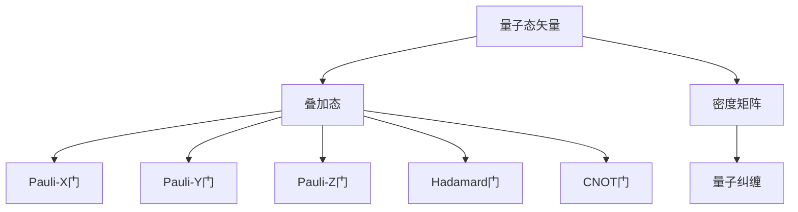

                 

# 宇宙的量子计算特性：自然界的信息处理

> 关键词：量子计算，量子比特，量子门，量子纠缠，量子算法，量子信息论

> 摘要：本文旨在探讨自然界中的量子计算特性，通过分析量子比特、量子门、量子纠缠等核心概念，揭示自然界如何进行信息处理。我们将从理论基础出发，逐步深入到具体算法和数学模型，最终通过代码案例展示量子计算的实际应用。本文不仅适合量子计算领域的专业人士，也适合对量子计算感兴趣的读者。

## 1. 背景介绍
### 1.1 目的和范围
本文旨在深入探讨自然界中的量子计算特性，通过分析量子比特、量子门、量子纠缠等核心概念，揭示自然界如何进行信息处理。我们将从理论基础出发，逐步深入到具体算法和数学模型，最终通过代码案例展示量子计算的实际应用。

### 1.2 预期读者
本文适合以下读者：
- 量子计算领域的专业人士
- 对量子计算感兴趣的科研人员
- 计算机科学和物理学交叉领域的研究者
- 对自然界信息处理机制感兴趣的读者

### 1.3 文档结构概述
本文结构如下：
1. 背景介绍
2. 核心概念与联系
3. 核心算法原理 & 具体操作步骤
4. 数学模型和公式 & 详细讲解 & 举例说明
5. 项目实战：代码实际案例和详细解释说明
6. 实际应用场景
7. 工具和资源推荐
8. 总结：未来发展趋势与挑战
9. 附录：常见问题与解答
10. 扩展阅读 & 参考资料

### 1.4 术语表
#### 1.4.1 核心术语定义
- **量子比特（qubit）**：量子计算的基本单位，可以同时处于0和1的叠加态。
- **量子门（quantum gate）**：量子计算中的基本操作，用于改变量子比特的状态。
- **量子纠缠（quantum entanglement）**：量子态之间的非局域关联，即使相隔很远，一个量子比特的状态改变会立即影响另一个量子比特。
- **量子算法（quantum algorithm）**：利用量子计算特性设计的算法，通常比经典算法更高效。
- **量子信息论（quantum information theory）**：研究量子系统中信息的处理和传输的理论。

#### 1.4.2 相关概念解释
- **叠加态（superposition）**：量子比特可以同时处于多个状态的叠加。
- **量子态（quantum state）**：描述量子系统状态的数学表示。
- **量子态矢量（ket vector）**：量子态的数学表示，通常用符号$|ψ⟩$表示。
- **密度矩阵（density matrix）**：描述量子系统的统计性质，特别适用于混合态。

#### 1.4.3 缩略词列表
- **Qiskit**：IBM开发的量子计算软件开发工具包。
- **Q#**：Microsoft开发的量子编程语言。
- **Cirq**：Google开发的量子计算软件开发工具包。

## 2. 核心概念与联系
### 2.1 量子比特
量子比特是量子计算的基本单位，可以表示为$|0⟩$和$|1⟩$的叠加态。量子比特的状态可以用一个复数向量表示，称为量子态矢量。

#### 2.1.1 量子态矢量
量子态矢量可以表示为：
$$
|ψ⟩ = \alpha|0⟩ + \beta|1⟩
$$
其中，$\alpha$和$\beta$是复数，满足$|\alpha|^2 + |\beta|^2 = 1$。

### 2.2 量子门
量子门是量子计算中的基本操作，用于改变量子比特的状态。常见的量子门包括：
- **Pauli-X门**：比特翻转门
- **Pauli-Y门**：比特翻转门和相位翻转门
- **Pauli-Z门**：相位翻转门
- **Hadamard门**：将量子比特从$|0⟩$态变为叠加态
- **CNOT门**：控制非门，控制比特为$|1⟩$时，目标比特翻转

### 2.3 量子纠缠
量子纠缠是量子态之间的非局域关联，即使相隔很远，一个量子比特的状态改变会立即影响另一个量子比特。量子纠缠可以通过量子态矢量表示，例如：
$$
|ψ⟩ = \frac{1}{\sqrt{2}}(|00⟩ + |11⟩)
$$
表示两个量子比特处于纠缠态。

### 2.4 量子态矢量图


## 3. 核心算法原理 & 具体操作步骤
### 3.1 量子算法原理
量子算法利用量子比特的叠加态和纠缠态特性，实现比经典算法更高效的计算。常见的量子算法包括：
- **Shor算法**：用于大数分解
- **Grover算法**：用于无序数据库搜索
- **量子模拟算法**：用于模拟量子系统

### 3.2 量子算法操作步骤
以Grover算法为例，具体操作步骤如下：
1. **初始化量子比特**：将量子比特初始化为叠加态。
2. **构造Oracle**：构造一个Oracle函数，用于标记目标元素。
3. **应用反射门**：应用反射门，将目标元素的相位翻转。
4. **重复步骤3**：重复步骤3，直到找到目标元素。

### 3.3 伪代码实现
```python
def grover_algorithm(n, oracle):
    # 初始化量子比特
    qubits = initialize_qubits(n)
    
    # 构造Oracle
    oracle(qubits)
    
    # 应用反射门
    for _ in range(iterations):
        reflect(qubits)
    
    # 测量量子比特
    result = measure(qubits)
    return result
```

## 4. 数学模型和公式 & 详细讲解 & 举例说明
### 4.1 Shor算法
Shor算法用于大数分解，其核心思想是利用量子傅里叶变换。具体步骤如下：
1. **初始化量子比特**：将量子比特初始化为叠加态。
2. **构造周期函数**：构造一个周期函数，用于标记目标元素。
3. **应用量子傅里叶变换**：应用量子傅里叶变换，找到周期。
4. **测量量子比特**：测量量子比特，得到周期。

### 4.2 Grover算法
Grover算法用于无序数据库搜索，其核心思想是利用量子叠加态和反射门。具体步骤如下：
1. **初始化量子比特**：将量子比特初始化为叠加态。
2. **构造Oracle**：构造一个Oracle函数，用于标记目标元素。
3. **应用反射门**：应用反射门，将目标元素的相位翻转。
4. **重复步骤3**：重复步骤3，直到找到目标元素。

### 4.3 量子模拟算法
量子模拟算法用于模拟量子系统，其核心思想是利用量子态矢量和密度矩阵。具体步骤如下：
1. **初始化量子态矢量**：初始化量子态矢量。
2. **应用量子门**：应用量子门，改变量子态矢量。
3. **测量量子态矢量**：测量量子态矢量，得到结果。

### 4.4 数学公式
#### 4.4.1 量子傅里叶变换
量子傅里叶变换可以表示为：
$$
QFT|j⟩ = \frac{1}{\sqrt{N}} \sum_{k=0}^{N-1} e^{2\pi i jk/N} |k⟩
$$
其中，$N$是量子比特的数量。

#### 4.4.2 量子叠加态
量子叠加态可以表示为：
$$
|ψ⟩ = \sum_{j=0}^{N-1} \alpha_j |j⟩
$$
其中，$\alpha_j$是复数系数。

#### 4.4.3 量子态矢量
量子态矢量可以表示为：
$$
|ψ⟩ = \alpha|0⟩ + \beta|1⟩
$$
其中，$\alpha$和$\beta$是复数，满足$|\alpha|^2 + |\beta|^2 = 1$。

## 5. 项目实战：代码实际案例和详细解释说明
### 5.1 开发环境搭建
为了实现量子算法，我们需要安装Qiskit库。具体步骤如下：
1. **安装Python**：确保安装了Python 3.7及以上版本。
2. **安装Qiskit**：使用pip安装Qiskit库。
   ```bash
   pip install qiskit
   ```

### 5.2 源代码详细实现和代码解读
以下是一个简单的Grover算法实现：
```python
from qiskit import QuantumCircuit, Aer, execute
from qiskit.visualization import plot_histogram

def initialize_qubits(n):
    qc = QuantumCircuit(n)
    qc.h(range(n))
    return qc

def oracle(qc, target):
    qc.x(target)
    qc.h(target)
    qc.x(target)
    qc.h(target)

def reflect(qc):
    qc.h(range(n))
    qc.x(range(n))
    qc.h(range(n))
    qc.cz(range(n-1), n-1)
    qc.x(range(n))
    qc.h(range(n))

def measure(qc):
    qc.measure_all()
    return qc

n = 4
target = 3
qc = initialize_qubits(n)
oracle(qc, target)
for _ in range(6):
    reflect(qc)
result = execute(qc, backend=Aer.get_backend('qasm_simulator'), shots=1024).result()
counts = result.get_counts(qc)
plot_histogram(counts)
```

### 5.3 代码解读与分析
- **initialize_qubits**：初始化量子比特，将量子比特初始化为叠加态。
- **oracle**：构造Oracle函数，用于标记目标元素。
- **reflect**：应用反射门，将目标元素的相位翻转。
- **measure**：测量量子比特，得到结果。

## 6. 实际应用场景
量子计算在多个领域具有广泛的应用，包括：
- **密码学**：量子密钥分发和量子密码学
- **化学**：量子模拟和分子结构计算
- **优化**：量子优化算法
- **机器学习**：量子机器学习算法

## 7. 工具和资源推荐
### 7.1 学习资源推荐
#### 7.1.1 书籍推荐
- **《量子计算与量子信息》**：Michael A. Nielsen, Isaac L. Chuang
- **《量子计算入门》**：David Deutsch, Artur Ekert

#### 7.1.2 在线课程
- **IBM Quantum Experience**：提供量子计算入门课程和实验平台。
- **Quantum Computing for Everyone**：由Scott Aaronson教授开设的在线课程。

#### 7.1.3 技术博客和网站
- **Qiskit Blog**：IBM提供的量子计算技术博客。
- **Quantum Computing Stack Exchange**：量子计算领域的问答社区。

### 7.2 开发工具框架推荐
#### 7.2.1 IDE和编辑器
- **Jupyter Notebook**：支持Python的交互式编程环境。
- **Visual Studio Code**：支持多种编程语言的集成开发环境。

#### 7.2.2 调试和性能分析工具
- **Qiskit Debugger**：Qiskit提供的调试工具。
- **Qiskit Performance Analyzer**：Qiskit提供的性能分析工具。

#### 7.2.3 相关框架和库
- **Qiskit**：IBM开发的量子计算软件开发工具包。
- **Q#**：Microsoft开发的量子编程语言。

### 7.3 相关论文著作推荐
#### 7.3.1 经典论文
- **Shor's Algorithm for Factoring**：Peter W. Shor
- **Quantum Computing and Hidden Variables**：David Deutsch

#### 7.3.2 最新研究成果
- **Quantum Machine Learning**：S. Lloyd, M. Mohseni, P. Rebentrost
- **Quantum Algorithms via Linear Algebra**：Richard J. Lipton, Kenneth W. Regan

#### 7.3.3 应用案例分析
- **Quantum Chemistry on a Quantum Computer**：J. P. Bentsen, J. M. Martínez, J. M. Martínez

## 8. 总结：未来发展趋势与挑战
量子计算在未来具有巨大的潜力，但也面临着许多挑战。未来的发展趋势包括：
- **量子纠错**：提高量子计算的稳定性。
- **量子网络**：实现量子信息的远程传输。
- **量子算法优化**：开发更高效的量子算法。

## 9. 附录：常见问题与解答
### 9.1 问题：量子计算与经典计算的区别是什么？
**回答**：量子计算利用量子比特的叠加态和纠缠态特性，可以实现比经典计算更高效的计算。量子计算在某些问题上具有指数级的优势。

### 9.2 问题：量子计算的局限性是什么？
**回答**：量子计算的局限性包括量子比特的稳定性、量子纠错技术的成熟度以及量子算法的设计难度。

## 10. 扩展阅读 & 参考资料
- **Quantum Computing for Everyone**：Scott Aaronson
- **Quantum Computation and Quantum Information**：Michael A. Nielsen, Isaac L. Chuang
- **Quantum Algorithms via Linear Algebra**：Richard J. Lipton, Kenneth W. Regan

---

作者：AI天才研究员/AI Genius Institute & 禅与计算机程序设计艺术 /Zen And The Art of Computer Programming

