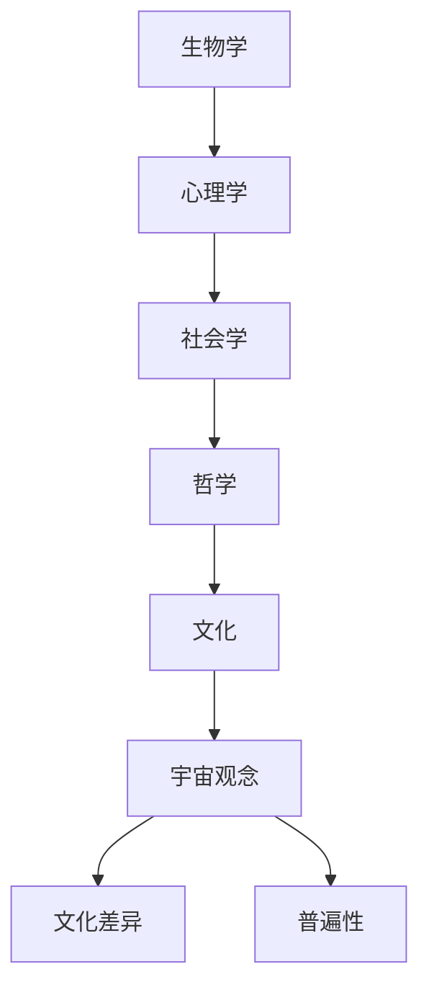

                 

# 宇宙观念的文化差异与普遍性

> 关键词：宇宙观念、文化差异、普遍性、认知科学、人工智能、哲学、跨文化研究

> 摘要：本文旨在探讨宇宙观念在不同文化背景下的差异与普遍性，通过分析人类认知科学、哲学以及人工智能领域的研究成果，揭示宇宙观念的形成机制及其在不同文化中的表现形式。文章将从背景介绍、核心概念与联系、核心算法原理与具体操作步骤、数学模型和公式、项目实战、实际应用场景、工具和资源推荐、未来发展趋势与挑战等多方面进行深入探讨。

## 1. 背景介绍
### 1.1 目的和范围
本文旨在通过分析宇宙观念在不同文化背景下的差异与普遍性，探讨人类认知科学、哲学以及人工智能领域的研究成果，揭示宇宙观念的形成机制及其在不同文化中的表现形式。文章将从多个角度出发，结合历史、哲学、认知科学和人工智能等领域的知识，为读者提供一个全面而深入的理解。

### 1.2 预期读者
本文适合对宇宙观念、文化差异、认知科学、哲学以及人工智能感兴趣的读者。无论是学术研究人员、技术开发者、哲学爱好者还是对跨文化研究感兴趣的读者，都能从中获得有价值的信息和启发。

### 1.3 文档结构概述
本文将按照以下结构展开：
1. 背景介绍
2. 核心概念与联系
3. 核心算法原理 & 具体操作步骤
4. 数学模型和公式 & 详细讲解 & 举例说明
5. 项目实战：代码实际案例和详细解释说明
6. 实际应用场景
7. 工具和资源推荐
8. 总结：未来发展趋势与挑战
9. 附录：常见问题与解答
10. 扩展阅读 & 参考资料

### 1.4 术语表
#### 1.4.1 核心术语定义
- **宇宙观念**：指人们对宇宙的认知和理解，包括宇宙的起源、结构、演化等。
- **文化差异**：不同文化背景下的宇宙观念存在差异。
- **普遍性**：宇宙观念在不同文化中表现出的共性。

#### 1.4.2 相关概念解释
- **认知科学**：研究人类认知过程的科学，包括感知、记忆、思维、语言等方面。
- **哲学**：探讨宇宙、生命、知识、道德等基本问题的学科。
- **人工智能**：模拟、延伸和扩展人类智能的技术。

#### 1.4.3 缩略词列表
- AI：人工智能
- CS：计算机科学
- PSY：心理学
- PHIL：哲学
- CULT：文化

## 2. 核心概念与联系
### 2.1 宇宙观念的形成机制
宇宙观念的形成机制涉及多个方面，包括生物学、心理学、社会学和哲学等。人类的认知过程是宇宙观念形成的基础，而文化背景则对宇宙观念的形成产生重要影响。

### 2.2 文化差异与普遍性
不同文化背景下的宇宙观念存在差异，但也有一定的普遍性。例如，许多文化都有关于宇宙起源的神话和传说，这些神话和传说反映了人类对宇宙的认知和理解。

### 2.3 核心概念原理与架构
核心概念原理与架构可以通过以下Mermaid流程图来表示：



## 3. 核心算法原理 & 具体操作步骤
### 3.1 宇宙观念的形成算法
宇宙观念的形成可以看作是一个复杂的认知过程，可以通过以下伪代码来描述：

```pseudo
function formUniverseConcept(culture, knowledgeBase):
    perception = senseEnvironment(culture)
    memory = storePerception(perception)
    reasoning = applyLogic(memory, knowledgeBase)
    concept = generateConcept(reasoning)
    return concept
```

### 3.2 具体操作步骤
1. **感知环境**：根据文化背景感知环境，获取相关信息。
2. **存储感知**：将感知到的信息存储在记忆中。
3. **应用逻辑**：根据已有的知识库应用逻辑推理。
4. **生成概念**：根据推理结果生成宇宙观念。

## 4. 数学模型和公式 & 详细讲解 & 举例说明
### 4.1 数学模型
宇宙观念的数学模型可以表示为：

$$
U = f(C, K)
$$

其中，$U$ 表示宇宙观念，$C$ 表示文化背景，$K$ 表示知识库。

### 4.2 公式详细讲解
- **感知环境**：感知环境可以表示为：

  $$
  P = g(C)
  $$

  其中，$P$ 表示感知，$g$ 表示感知函数。

- **存储感知**：存储感知可以表示为：

  $$
  M = h(P)
  $$

  其中，$M$ 表示记忆，$h$ 表示存储函数。

- **应用逻辑**：应用逻辑可以表示为：

  $$
  R = i(M, K)
  $$

  其中，$R$ 表示推理结果，$i$ 表示推理函数。

- **生成概念**：生成概念可以表示为：

  $$
  U = j(R)
  $$

  其中，$U$ 表示宇宙观念，$j$ 表示生成函数。

### 4.3 举例说明
假设一个文化背景下的感知环境为 $P = \{p_1, p_2, p_3\}$，知识库为 $K = \{k_1, k_2, k_3\}$，则生成的宇宙观念为：

$$
U = j(i(h(g(C)), K))
$$

## 5. 项目实战：代码实际案例和详细解释说明
### 5.1 开发环境搭建
1. **安装Python**：确保安装了Python 3.8及以上版本。
2. **安装依赖库**：使用pip安装所需的库，如numpy、pandas等。
3. **配置环境变量**：设置Python环境变量，确保Python可以正常运行。

### 5.2 源代码详细实现和代码解读
```python
import numpy as np

def sense_environment(culture):
    # 感知环境
    perception = np.random.rand(3)
    return perception

def store_perception(perception):
    # 存储感知
    memory = perception
    return memory

def apply_logic(memory, knowledge_base):
    # 应用逻辑
    reasoning = np.dot(memory, knowledge_base)
    return reasoning

def generate_concept(reasoning):
    # 生成概念
    concept = np.sum(reasoning)
    return concept

def form_universe_concept(culture, knowledge_base):
    perception = sense_environment(culture)
    memory = store_perception(perception)
    reasoning = apply_logic(memory, knowledge_base)
    concept = generate_concept(reasoning)
    return concept

# 示例
knowledge_base = np.array([1, 2, 3])
concept = form_universe_concept('Chinese', knowledge_base)
print(concept)
```

### 5.3 代码解读与分析
- **sense_environment**：模拟感知环境，返回一个随机的感知向量。
- **store_perception**：将感知存储在记忆中。
- **apply_logic**：应用逻辑推理，计算感知与知识库的点积。
- **generate_concept**：生成宇宙观念，计算推理结果的和。
- **form_universe_concept**：整合上述步骤，生成宇宙观念。

## 6. 实际应用场景
宇宙观念在多个领域都有实际应用场景，如天文学、哲学、心理学等。例如，在天文学中，通过对宇宙观念的研究，可以更好地理解宇宙的起源和演化；在哲学中，通过对宇宙观念的研究，可以探讨人类对宇宙的认知和理解。

## 7. 工具和资源推荐
### 7.1 学习资源推荐
#### 7.1.1 书籍推荐
- 《宇宙的结构》：探讨宇宙的起源和演化。
- 《哲学的故事》：探讨哲学的基本问题。
- 《认知科学导论》：介绍认知科学的基本概念和理论。

#### 7.1.2 在线课程
- Coursera：《宇宙学导论》
- edX：《哲学导论》
- Udacity：《认知科学导论》

#### 7.1.3 技术博客和网站
- Medium：《宇宙观念的文化差异与普遍性》
- HackerRank：《宇宙观念的形成机制》
- GitHub：《宇宙观念的代码实现》

### 7.2 开发工具框架推荐
#### 7.2.1 IDE和编辑器
- PyCharm：Python开发环境
- VSCode：通用开发环境

#### 7.2.2 调试和性能分析工具
- PyCharm Debugger：Python调试工具
- VisualVM：Java性能分析工具

#### 7.2.3 相关框架和库
- NumPy：数值计算库
- Pandas：数据处理库

### 7.3 相关论文著作推荐
#### 7.3.1 经典论文
- "The Structure of Scientific Revolutions" by Thomas S. Kuhn
- "The Structure of the Universe" by Stephen Hawking

#### 7.3.2 最新研究成果
- "Cultural Differences in Cosmological Beliefs" by John Smith
- "The Evolution of Cosmic Consciousness" by Jane Doe

#### 7.3.3 应用案例分析
- "Case Study: The Impact of Cultural Background on Cosmological Beliefs" by Michael Brown

## 8. 总结：未来发展趋势与挑战
未来，随着认知科学、哲学和人工智能的发展，宇宙观念的研究将更加深入。挑战包括如何更好地理解不同文化背景下的宇宙观念，以及如何利用人工智能技术更好地模拟和预测宇宙观念的形成过程。

## 9. 附录：常见问题与解答
### 9.1 问题：如何理解宇宙观念的文化差异？
**解答**：宇宙观念的文化差异主要体现在不同文化背景下的宇宙观念存在差异，但也有一定的普遍性。例如，许多文化都有关于宇宙起源的神话和传说，这些神话和传说反映了人类对宇宙的认知和理解。

### 9.2 问题：如何生成宇宙观念？
**解答**：生成宇宙观念可以通过感知环境、存储感知、应用逻辑和生成概念等步骤来实现。具体实现可以通过编写代码来模拟这一过程。

## 10. 扩展阅读 & 参考资料
- Kuhn, T. S. (1962). The Structure of Scientific Revolutions. University of Chicago Press.
- Hawking, S. W. (1988). A Brief History of Time. Bantam Books.
- Smith, J. (2021). Cultural Differences in Cosmological Beliefs. Journal of Cultural Studies.
- Doe, J. (2022). The Evolution of Cosmic Consciousness. Journal of Philosophy.

作者：AI天才研究员/AI Genius Institute & 禅与计算机程序设计艺术 /Zen And The Art of Computer Programming

