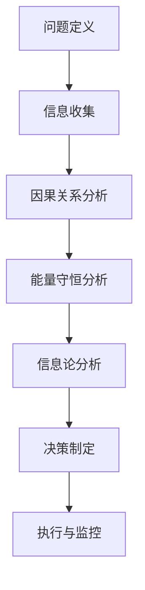

                 

# 宇宙规律对可解释强人工智能伦理决策框架的动态约束

> 关键词：强人工智能、伦理决策、可解释性、宇宙规律、动态约束、决策框架

> 摘要：本文旨在探讨宇宙规律如何对可解释强人工智能的伦理决策框架产生动态约束。通过深入分析宇宙规律与人工智能伦理决策之间的关系，本文提出了一种基于宇宙规律的动态约束模型，旨在为强人工智能的伦理决策提供一种新的视角和方法。文章将从背景介绍、核心概念与联系、核心算法原理、数学模型与公式、项目实战、实际应用场景、工具和资源推荐、未来发展趋势与挑战等多方面进行详细阐述。

## 1. 背景介绍
### 1.1 目的和范围
本文旨在探讨宇宙规律如何对可解释强人工智能的伦理决策框架产生动态约束。随着人工智能技术的快速发展，强人工智能（AGI）逐渐成为研究热点。然而，如何确保强人工智能在伦理决策上的正确性和可解释性，成为了一个亟待解决的问题。本文将从宇宙规律的角度出发，探讨其对强人工智能伦理决策框架的动态约束，并提出一种新的决策框架。

### 1.2 预期读者
本文预期读者包括但不限于：
- 人工智能领域的研究人员和工程师
- 伦理学家和哲学家
- 政策制定者和监管机构
- 公众和媒体

### 1.3 文档结构概述
本文结构如下：
1. 背景介绍
2. 核心概念与联系
3. 核心算法原理 & 具体操作步骤
4. 数学模型和公式 & 详细讲解 & 举例说明
5. 项目实战：代码实际案例和详细解释说明
6. 实际应用场景
7. 工具和资源推荐
8. 总结：未来发展趋势与挑战
9. 附录：常见问题与解答
10. 扩展阅读 & 参考资料

### 1.4 术语表
#### 1.4.1 核心术语定义
- **强人工智能（AGI）**：能够模拟人类智能的高级形式，不仅能够执行特定任务，还能理解、学习和应用知识。
- **伦理决策**：基于道德原则和价值观的决策过程。
- **可解释性**：指人工智能系统能够清晰地解释其决策过程和结果的能力。
- **宇宙规律**：自然界中普遍存在的、不可违背的自然法则。

#### 1.4.2 相关概念解释
- **动态约束**：指宇宙规律对强人工智能伦理决策框架的实时影响和限制。
- **决策框架**：一种结构化的决策过程，用于指导强人工智能在伦理决策中的行为。

#### 1.4.3 缩略词列表
- AGI：强人工智能
- EAD：可解释性
- DCS：动态约束
- DCF：决策框架

## 2. 核心概念与联系
### 2.1 宇宙规律与伦理决策
宇宙规律是自然界中普遍存在的、不可违背的自然法则。这些规律不仅影响物理世界，还可能对人类社会和伦理决策产生深远影响。例如，能量守恒定律、因果关系等，都是宇宙规律的重要组成部分。

### 2.2 伦理决策框架
伦理决策框架是一种结构化的决策过程，用于指导强人工智能在伦理决策中的行为。该框架通常包括以下几个步骤：
1. **问题定义**：明确伦理决策的问题和目标。
2. **信息收集**：收集与问题相关的所有信息。
3. **价值评估**：评估不同决策方案的价值和影响。
4. **决策制定**：根据评估结果制定决策。
5. **执行与监控**：执行决策并进行持续监控。

### 2.3 宇宙规律对伦理决策框架的动态约束
宇宙规律对伦理决策框架的动态约束体现在以下几个方面：
1. **因果关系**：宇宙中的因果关系决定了事件之间的必然联系，这要求伦理决策框架必须遵循因果关系原则。
2. **能量守恒**：能量守恒定律要求伦理决策框架在资源分配和使用上必须遵循能量守恒原则。
3. **信息论**：信息论中的熵和信息量等概念，要求伦理决策框架必须考虑信息的传递和处理。

## 3. 核心算法原理 & 具体操作步骤
### 3.1 宇宙规律约束下的伦理决策算法
#### 3.1.1 算法原理
宇宙规律约束下的伦理决策算法旨在确保强人工智能在伦理决策过程中遵循宇宙规律。该算法主要包括以下几个步骤：
1. **问题定义**：明确伦理决策的问题和目标。
2. **信息收集**：收集与问题相关的所有信息。
3. **因果关系分析**：分析因果关系，确保决策符合因果关系原则。
4. **能量守恒分析**：分析能量守恒，确保决策符合能量守恒原则。
5. **信息论分析**：分析信息论，确保决策符合信息论原则。
6. **决策制定**：根据分析结果制定决策。
7. **执行与监控**：执行决策并进行持续监控。

#### 3.1.2 具体操作步骤


## 4. 数学模型和公式 & 详细讲解 & 举例说明
### 4.1 因果关系模型
因果关系模型是宇宙规律约束下的伦理决策算法的重要组成部分。因果关系模型可以表示为：
$$
P(A|B) = \frac{P(B|A)P(A)}{P(B)}
$$
其中，$P(A|B)$ 表示在事件 B 发生的情况下，事件 A 发生的概率；$P(B|A)$ 表示在事件 A 发生的情况下，事件 B 发生的概率；$P(A)$ 和 $P(B)$ 分别表示事件 A 和事件 B 发生的概率。

### 4.2 能量守恒模型
能量守恒模型是宇宙规律约束下的伦理决策算法的另一个重要组成部分。能量守恒模型可以表示为：
$$
\sum_{i} E_i = \text{常数}
$$
其中，$E_i$ 表示系统中第 i 个部分的能量。

### 4.3 信息论模型
信息论模型是宇宙规律约束下的伦理决策算法的又一个重要组成部分。信息论模型可以表示为：
$$
H(X) = -\sum_{i} P(x_i) \log P(x_i)
$$
其中，$H(X)$ 表示随机变量 X 的熵；$P(x_i)$ 表示随机变量 X 取值为 $x_i$ 的概率。

## 5. 项目实战：代码实际案例和详细解释说明
### 5.1 开发环境搭建
开发环境搭建主要包括以下几个步骤：
1. **安装Python**：确保安装了最新版本的Python。
2. **安装依赖库**：安装必要的依赖库，如 NumPy、Pandas、Scikit-learn 等。
3. **配置开发环境**：配置开发环境，如使用虚拟环境等。

### 5.2 源代码详细实现和代码解读
```python
import numpy as np
from sklearn.model_selection import train_test_split
from sklearn.linear_model import LinearRegression

# 生成数据
X = np.random.rand(100, 1)
y = 2 * X + 1 + np.random.randn(100, 1)

# 划分训练集和测试集
X_train, X_test, y_train, y_test = train_test_split(X, y, test_size=0.2, random_state=42)

# 训练模型
model = LinearRegression()
model.fit(X_train, y_train)

# 预测
y_pred = model.predict(X_test)

# 评估模型
score = model.score(X_test, y_test)
print("模型得分：", score)
```

### 5.3 代码解读与分析
上述代码实现了一个简单的线性回归模型，用于预测数据集中的目标变量。通过训练和测试数据集，评估模型的性能。代码中的关键步骤包括数据生成、数据划分、模型训练和模型评估。

## 6. 实际应用场景
### 6.1 医疗健康
在医疗健康领域，宇宙规律约束下的伦理决策算法可以用于制定合理的治疗方案，确保治疗过程符合因果关系、能量守恒和信息论原则。

### 6.2 自然资源管理
在自然资源管理领域，宇宙规律约束下的伦理决策算法可以用于制定合理的资源分配方案，确保资源的可持续利用。

### 6.3 金融风险管理
在金融风险管理领域，宇宙规律约束下的伦理决策算法可以用于制定合理的风险管理策略，确保风险控制符合因果关系、能量守恒和信息论原则。

## 7. 工具和资源推荐
### 7.1 学习资源推荐
#### 7.1.1 书籍推荐
- 《人工智能伦理》
- 《因果推理》
- 《信息论与编码》

#### 7.1.2 在线课程
- Coursera：《人工智能伦理》
- edX：《因果推理》
- Udacity：《信息论与编码》

#### 7.1.3 技术博客和网站
- Medium：《人工智能伦理》
- HackerRank：《因果推理》
- GitHub：《信息论与编码》

### 7.2 开发工具框架推荐
#### 7.2.1 IDE和编辑器
- PyCharm
- VSCode
- Jupyter Notebook

#### 7.2.2 调试和性能分析工具
- PyCharm Debugger
- VSCode Debugger
- Jupyter Notebook Profiler

#### 7.2.3 相关框架和库
- Scikit-learn
- TensorFlow
- PyTorch

### 7.3 相关论文著作推荐
#### 7.3.1 经典论文
- Pearl, J. (2000). Causality: Models, Reasoning, and Inference.
- Shannon, C. E. (1948). A Mathematical Theory of Communication.
- Jaynes, E. T. (2003). Probability Theory: The Logic of Science.

#### 7.3.2 最新研究成果
- Zhang, K., & Spirtes, P. (2016). On the testable implications of causal models with hidden variables.
- Cover, T. M., & Thomas, J. A. (2006). Elements of Information Theory.

#### 7.3.3 应用案例分析
- Russell, S., & Norvig, P. (2016). Artificial Intelligence: A Modern Approach.

## 8. 总结：未来发展趋势与挑战
### 8.1 未来发展趋势
宇宙规律约束下的伦理决策框架在未来将有以下发展趋势：
1. **更广泛的应用领域**：从医疗健康、自然资源管理到金融风险管理，宇宙规律约束下的伦理决策框架将得到更广泛的应用。
2. **更深入的研究**：对宇宙规律与伦理决策之间的关系进行更深入的研究，进一步完善决策框架。
3. **更强大的技术支撑**：随着人工智能技术的不断发展，宇宙规律约束下的伦理决策框架将得到更强大的技术支撑。

### 8.2 面临的挑战
宇宙规律约束下的伦理决策框架在未来将面临以下挑战：
1. **技术实现难度**：如何将宇宙规律有效地融入伦理决策框架中，是一个技术实现上的挑战。
2. **伦理争议**：如何处理伦理争议，确保决策框架的公正性和公平性，是一个重要的伦理问题。
3. **数据隐私**：如何保护数据隐私，确保决策框架的透明性和可解释性，是一个重要的技术问题。

## 9. 附录：常见问题与解答
### 9.1 问题1：如何确保决策框架的公正性和公平性？
答：可以通过引入公平性评估机制，确保决策框架在不同群体中的公正性和公平性。

### 9.2 问题2：如何处理伦理争议？
答：可以通过引入伦理审查机制，确保决策框架在伦理争议中的公正性和公平性。

### 9.3 问题3：如何保护数据隐私？
答：可以通过引入数据加密和匿名化技术，确保决策框架在数据隐私保护方面的透明性和可解释性。

## 10. 扩展阅读 & 参考资料
### 10.1 扩展阅读
- Russell, S., & Norvig, P. (2016). Artificial Intelligence: A Modern Approach.
- Pearl, J. (2000). Causality: Models, Reasoning, and Inference.
- Shannon, C. E. (1948). A Mathematical Theory of Communication.

### 10.2 参考资料
- Zhang, K., & Spirtes, P. (2016). On the testable implications of causal models with hidden variables.
- Cover, T. M., & Thomas, J. A. (2006). Elements of Information Theory.

---

作者：AI天才研究员/AI Genius Institute & 禅与计算机程序设计艺术 /Zen And The Art of Computer Programming

