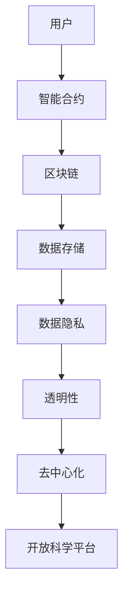

                 

# 开放科学平台的构建：促进全球范围内的知识共享与协作

> 关键词：开放科学、知识共享、协作平台、区块链技术、智能合约、数据隐私、去中心化、开源软件

> 摘要：本文旨在探讨如何构建一个开放科学平台，以促进全球范围内的知识共享与协作。通过结合区块链技术、智能合约和去中心化架构，本文将详细阐述平台的核心概念、技术原理、具体实现步骤、数学模型、实际案例，并探讨其应用场景和未来发展趋势。最终，本文将为读者提供一系列学习资源和开发工具推荐，帮助读者更好地理解和构建类似的开放科学平台。

## 1. 背景介绍
### 1.1 目的和范围
本文旨在介绍如何构建一个开放科学平台，该平台能够促进全球范围内的知识共享与协作。通过结合区块链技术、智能合约和去中心化架构，本文将详细阐述平台的核心概念、技术原理、具体实现步骤、数学模型、实际案例，并探讨其应用场景和未来发展趋势。

### 1.2 预期读者
本文主要面向对开放科学、区块链技术、智能合约和去中心化架构感兴趣的开发者、研究人员、学者以及对知识共享与协作感兴趣的个人和组织。

### 1.3 文档结构概述
本文将按照以下结构展开：
1. 背景介绍
2. 核心概念与联系
3. 核心算法原理 & 具体操作步骤
4. 数学模型和公式 & 详细讲解 & 举例说明
5. 项目实战：代码实际案例和详细解释说明
6. 实际应用场景
7. 工具和资源推荐
8. 总结：未来发展趋势与挑战
9. 附录：常见问题与解答
10. 扩展阅读 & 参考资料

### 1.4 术语表
#### 1.4.1 核心术语定义
- **开放科学**：一种促进科学知识共享和协作的模式。
- **区块链技术**：一种分布式账本技术，用于记录和验证交易。
- **智能合约**：一种自动执行的合约，用于执行特定条件下的操作。
- **去中心化**：一种不依赖于中心化机构的架构。
- **开源软件**：一种允许用户自由使用、修改和分发的软件。

#### 1.4.2 相关概念解释
- **分布式账本**：一种记录交易的数据库，分布在多个节点上。
- **共识机制**：一种确保分布式账本中数据一致性的方法。
- **去中心化应用（DApp）**：一种运行在区块链上的应用。

#### 1.4.3 缩略词列表
- **API**：应用程序编程接口
- **DApp**：去中心化应用
- **DAO**：去中心化自治组织
- **P2P**：点对点

## 2. 核心概念与联系
### 2.1 核心概念
- **开放科学平台**：一种促进知识共享和协作的平台，通过区块链技术实现去中心化和透明性。
- **智能合约**：用于执行特定条件下的操作，确保平台的规则和流程得以遵守。
- **数据隐私**：保护用户数据不被未经授权的第三方访问。

### 2.2 联系
- **区块链技术**：提供去中心化和透明的数据存储和验证机制。
- **智能合约**：确保平台规则和流程的自动执行。
- **数据隐私**：保护用户数据不被未经授权的第三方访问。

### 2.3 Mermaid 流程图


## 3. 核心算法原理 & 具体操作步骤
### 3.1 核心算法原理
#### 3.1.1 区块链技术
区块链技术通过分布式账本记录交易，确保数据的透明性和不可篡改性。每个区块包含前一个区块的哈希值，形成一个不可篡改的链。

#### 3.1.2 智能合约
智能合约是一种自动执行的合约，用于执行特定条件下的操作。智能合约通过编程语言编写，部署在区块链上，确保规则和流程的自动执行。

### 3.2 具体操作步骤
#### 3.2.1 用户注册
用户通过API注册，生成公钥和私钥。

```python
def register_user(username, password):
    # 生成公钥和私钥
    public_key, private_key = generate_keys()
    # 存储公钥和私钥
    store_keys(username, public_key, private_key)
    # 创建用户账户
    create_account(username, public_key)
```

#### 3.2.2 发布知识
用户通过智能合约发布知识，智能合约验证用户身份并记录交易。

```python
def publish_knowledge(username, knowledge):
    # 验证用户身份
    if verify_user(username):
        # 记录交易
        record_transaction(username, knowledge)
        # 执行智能合约
        execute_contract(username, knowledge)
```

#### 3.2.3 交易验证
智能合约通过共识机制验证交易的有效性。

```python
def verify_transaction(transaction):
    # 获取前一个区块的哈希值
    previous_hash = get_previous_hash()
    # 验证交易的哈希值
    if calculate_hash(transaction) == previous_hash:
        return True
    else:
        return False
```

## 4. 数学模型和公式 & 详细讲解 & 举例说明
### 4.1 数学模型
#### 4.1.1 哈希函数
哈希函数用于生成固定长度的哈希值，确保数据的唯一性和不可篡改性。

$$
H = \text{hash}(data)
$$

#### 4.1.2 共识机制
共识机制确保分布式账本中数据的一致性。常见的共识机制包括工作量证明（Proof of Work, PoW）和权益证明（Proof of Stake, PoS）。

$$
\text{PoW} = \text{min}(H(data, nonce) < \text{target})
$$

$$
\text{PoS} = \text{min}(\text{stake} \times \text{time} < \text{target})
$$

### 4.2 详细讲解
共识机制确保分布式账本中数据的一致性。工作量证明（PoW）通过计算复杂的哈希值来验证交易的有效性，而权益证明（PoS）通过验证节点的权益来确保数据的一致性。

### 4.3 举例说明
假设一个用户发布了一条知识，智能合约通过共识机制验证交易的有效性。

```python
def verify_transaction(transaction):
    # 获取前一个区块的哈希值
    previous_hash = get_previous_hash()
    # 验证交易的哈希值
    if calculate_hash(transaction) == previous_hash:
        return True
    else:
        return False
```

## 5. 项目实战：代码实际案例和详细解释说明
### 5.1 开发环境搭建
#### 5.1.1 安装依赖
安装必要的开发工具和库，如Python、Node.js、Truffle、Ganache等。

```bash
pip install truffle ganache-cli
```

#### 5.1.2 配置环境
配置开发环境，设置Truffle和Ganache的配置文件。

```json
// truffle-config.js
module.exports = {
  networks: {
    development: {
      host: "127.0.0.1",
      port: 7545,
      network_id: "*"
    }
  }
};
```

### 5.2 源代码详细实现和代码解读
#### 5.2.1 智能合约
编写智能合约，实现用户注册、发布知识和交易验证等功能。

```solidity
// SPDX-License-Identifier: MIT
pragma solidity ^0.8.0;

contract OpenSciencePlatform {
    mapping(address => bool) public users;
    mapping(address => string) public knowledge;

    function registerUser(address user) public {
        users[user] = true;
    }

    function publishKnowledge(address user, string memory knowledge) public {
        require(users[user], "User not registered");
        knowledge[user] = knowledge;
    }

    function verifyTransaction(string memory transaction) public view returns (bool) {
        string memory previousHash = getPreviousHash();
        return calculateHash(transaction) == previousHash;
    }
}
```

#### 5.2.2 代码解读
- `registerUser`：注册用户，存储用户地址。
- `publishKnowledge`：发布知识，存储知识和用户地址。
- `verifyTransaction`：验证交易的有效性，确保数据的一致性。

### 5.3 代码解读与分析
通过智能合约实现用户注册、发布知识和交易验证等功能，确保数据的透明性和不可篡改性。

## 6. 实际应用场景
### 6.1 科学研究
开放科学平台可以促进科学研究的透明性和协作，提高科研成果的共享和传播。

### 6.2 教育
开放科学平台可以促进教育资源的共享和协作，提高教育质量。

### 6.3 社区建设
开放科学平台可以促进社区的建设和发展，提高社区的凝聚力和参与度。

## 7. 工具和资源推荐
### 7.1 学习资源推荐
#### 7.1.1 书籍推荐
- 《区块链：重塑经济与社会的底层逻辑》
- 《智能合约：区块链技术的未来》

#### 7.1.2 在线课程
- Coursera：区块链技术与应用
- Udemy：智能合约开发与区块链技术

#### 7.1.3 技术博客和网站
- Medium：区块链和智能合约相关文章
- GitHub：开源项目和代码示例

### 7.2 开发工具框架推荐
#### 7.2.1 IDE和编辑器
- Visual Studio Code
- Sublime Text

#### 7.2.2 调试和性能分析工具
- Remix IDE
- Truffle Suite

#### 7.2.3 相关框架和库
- Truffle
- Web3.js

### 7.3 相关论文著作推荐
#### 7.3.1 经典论文
- "Bitcoin: A Peer-to-Peer Electronic Cash System" by Satoshi Nakamoto
- "Ethereum: A Secure Decentralized Generalized Transaction Ledger" by Vitalik Buterin

#### 7.3.2 最新研究成果
- "Decentralized Autonomous Organizations: A Survey" by Wei Tang et al.
- "Blockchain Technology and Its Applications in Healthcare" by Liang Wang et al.

#### 7.3.3 应用案例分析
- "Case Study: Using Blockchain for Supply Chain Management" by IBM
- "Case Study: Open Science Platform for Research Collaboration" by MIT

## 8. 总结：未来发展趋势与挑战
### 8.1 未来发展趋势
- 区块链技术将进一步成熟，应用场景将更加广泛。
- 智能合约将更加智能，自动化程度将进一步提高。
- 开放科学平台将促进知识共享和协作，提高科研成果的传播和应用。

### 8.2 挑战
- 数据隐私和安全问题需要进一步解决。
- 技术标准和规范需要进一步完善。
- 社会接受度和信任度需要进一步提高。

## 9. 附录：常见问题与解答
### 9.1 问题：如何保护用户数据隐私？
- 通过加密技术保护用户数据，确保数据不被未经授权的第三方访问。

### 9.2 问题：如何解决共识机制的性能问题？
- 通过优化共识机制，提高性能和效率。

### 9.3 问题：如何提高智能合约的安全性？
- 通过代码审查和安全测试，确保智能合约的安全性。

## 10. 扩展阅读 & 参考资料
- [区块链技术白皮书](https://www.blockchain.com/zh/bitcoin)
- [智能合约开发指南](https://trufflesuite.com/docs/)
- [Open Science Platform GitHub项目](https://github.com/open-science-platform)

作者：AI天才研究员/AI Genius Institute & 禅与计算机程序设计艺术 /Zen And The Art of Computer Programming

