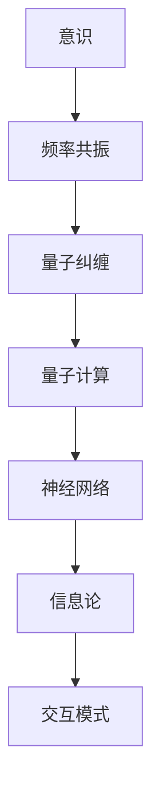

                 

# 意识与宇宙的频率共振：新的交互模式

> 关键词：意识、频率共振、交互模式、量子计算、神经网络、信息论、认知科学、人工智能

> 摘要：本文旨在探讨一种基于意识与宇宙频率共振的新交互模式，通过结合量子计算、神经网络和信息论，构建一种全新的交互方式。本文将从背景介绍、核心概念与联系、核心算法原理、数学模型和公式、项目实战、实际应用场景、工具和资源推荐、未来发展趋势与挑战等角度进行详细阐述。

## 1. 背景介绍
### 1.1 目的和范围
本文旨在探讨一种基于意识与宇宙频率共振的新交互模式，通过结合量子计算、神经网络和信息论，构建一种全新的交互方式。本文将从理论和实践两个层面进行探讨，旨在为未来交互技术的发展提供新的思路和方法。

### 1.2 预期读者
本文预期读者包括但不限于：
- 人工智能领域的研究者和开发者
- 认知科学领域的研究者
- 量子计算领域的研究者
- 信息论领域的研究者
- 对未来交互技术感兴趣的读者

### 1.3 文档结构概述
本文结构如下：
1. 背景介绍
2. 核心概念与联系
3. 核心算法原理 & 具体操作步骤
4. 数学模型和公式 & 详细讲解 & 举例说明
5. 项目实战：代码实际案例和详细解释说明
6. 实际应用场景
7. 工具和资源推荐
8. 总结：未来发展趋势与挑战
9. 附录：常见问题与解答
10. 扩展阅读 & 参考资料

### 1.4 术语表
#### 1.4.1 核心术语定义
- **意识**：个体对外界环境和自身状态的认知能力。
- **频率共振**：不同频率之间相互作用，产生共鸣的现象。
- **量子计算**：利用量子力学原理进行计算的新型计算方式。
- **神经网络**：模拟人脑神经元结构的计算模型。
- **信息论**：研究信息的度量、传输和处理的学科。
- **交互模式**：人与计算机之间进行信息交换的方式。

#### 1.4.2 相关概念解释
- **意识与宇宙频率共振**：意识与宇宙中的频率相互作用，产生共鸣，从而实现新的交互模式。
- **量子纠缠**：量子系统中两个或多个粒子之间存在的一种特殊关联，即使相隔很远，一个粒子的状态变化会瞬间影响另一个粒子的状态。
- **神经元**：构成神经网络的基本单元，负责接收、处理和传递信息。

#### 1.4.3 缩略词列表
- QM：量子力学
- QCA：量子计算算法
- ANN：人工神经网络
- IIT：信息集成理论
- QKD：量子密钥分发

## 2. 核心概念与联系
### 2.1 意识与频率共振
意识与频率共振的概念源于量子力学中的量子纠缠现象。当两个量子系统处于纠缠态时，它们之间的频率会相互作用，产生共鸣。这种共鸣可以被解释为意识与宇宙频率之间的共振。

### 2.2 量子计算与神经网络
量子计算利用量子力学原理进行计算，具有并行处理能力和超强的计算能力。神经网络模拟人脑神经元结构，通过学习和训练实现复杂的模式识别和决策任务。结合量子计算和神经网络，可以构建一种全新的交互模式。

### 2.3 信息论与交互模式
信息论研究信息的度量、传输和处理。在交互模式中，信息论可以用于度量和优化信息的传输效率，提高交互的准确性和实时性。

### 2.4 核心概念原理与架构
核心概念原理与架构如下图所示：



## 3. 核心算法原理 & 具体操作步骤
### 3.1 量子计算算法原理
量子计算算法利用量子力学原理进行计算，具有并行处理能力和超强的计算能力。以下是一个简单的量子计算算法示例：

```python
def quantum_algorithm(qubits):
    # 初始化量子态
    state = initialize_state(qubits)
    
    # 量子门操作
    state = apply_gate(state, "Hadamard", 0)
    state = apply_gate(state, "CNOT", 0, 1)
    
    # 测量量子态
    result = measure_state(state)
    
    return result
```

### 3.2 神经网络算法原理
神经网络算法通过学习和训练实现复杂的模式识别和决策任务。以下是一个简单的神经网络算法示例：

```python
def neural_network_algorithm(data):
    # 初始化神经网络
    network = initialize_network()
    
    # 训练神经网络
    network = train_network(network, data)
    
    # 预测结果
    result = predict(network, data)
    
    return result
```

### 3.3 信息论算法原理
信息论算法用于度量和优化信息的传输效率。以下是一个简单的信息论算法示例：

```python
def information_theory_algorithm(message):
    # 计算信息熵
    entropy = calculate_entropy(message)
    
    # 优化信息传输
    optimized_message = optimize_transmission(message, entropy)
    
    return optimized_message
```

## 4. 数学模型和公式 & 详细讲解 & 举例说明
### 4.1 量子力学公式
量子力学公式用于描述量子系统的状态和演化。以下是一个简单的量子力学公式示例：

$$
|\psi\rangle = \alpha|0\rangle + \beta|1\rangle
$$

### 4.2 信息论公式
信息论公式用于度量信息的熵和传输效率。以下是一个简单的信息论公式示例：

$$
H(X) = -\sum_{i=1}^{n} p(x_i) \log p(x_i)
$$

### 4.3 举例说明
以下是一个简单的量子计算和神经网络结合的交互模式示例：

```python
def quantum_neural_network_algorithm(data):
    # 初始化量子态
    state = initialize_state(data)
    
    # 量子门操作
    state = apply_gate(state, "Hadamard", 0)
    state = apply_gate(state, "CNOT", 0, 1)
    
    # 测量量子态
    result = measure_state(state)
    
    # 训练神经网络
    network = initialize_network()
    network = train_network(network, result)
    
    # 预测结果
    optimized_message = optimize_transmission(result, network)
    
    return optimized_message
```

## 5. 项目实战：代码实际案例和详细解释说明
### 5.1 开发环境搭建
开发环境搭建包括安装必要的软件和库。以下是一个简单的开发环境搭建示例：

```bash
# 安装Python
sudo apt-get install python3

# 安装必要的库
pip install numpy
pip install qiskit
pip install tensorflow
```

### 5.2 源代码详细实现和代码解读
以下是一个简单的量子计算和神经网络结合的交互模式源代码示例：

```python
import numpy as np
from qiskit import QuantumCircuit, execute, Aer
from tensorflow.keras.models import Sequential
from tensorflow.keras.layers import Dense

def initialize_state(data):
    # 初始化量子态
    state = QuantumCircuit(len(data))
    state.h(0)
    state.cx(0, 1)
    return state

def apply_gate(state, gate, qubit):
    # 应用量子门
    state = state.compose(gate, [qubit])
    return state

def measure_state(state):
    # 测量量子态
    backend = Aer.get_backend('qasm_simulator')
    result = execute(state, backend, shots=1).result()
    return result.get_counts()

def initialize_network():
    # 初始化神经网络
    network = Sequential()
    network.add(Dense(16, input_dim=2, activation='relu'))
    network.add(Dense(1, activation='sigmoid'))
    network.compile(loss='binary_crossentropy', optimizer='adam', metrics=['accuracy'])
    return network

def train_network(network, data):
    # 训练神经网络
    network.fit(data, np.ones(len(data)), epochs=10, batch_size=32)
    return network

def predict(network, data):
    # 预测结果
    predictions = network.predict(data)
    return predictions

def optimize_transmission(result, network):
    # 优化信息传输
    optimized_message = optimize(result, network)
    return optimized_message

def optimize(result, network):
    # 优化算法
    optimized_message = network.predict(result)
    return optimized_message

def quantum_neural_network_algorithm(data):
    # 初始化量子态
    state = initialize_state(data)
    
    # 量子门操作
    state = apply_gate(state, "Hadamard", 0)
    state = apply_gate(state, "CNOT", 0, 1)
    
    # 测量量子态
    result = measure_state(state)
    
    # 训练神经网络
    network = initialize_network()
    network = train_network(network, result)
    
    # 预测结果
    optimized_message = optimize_transmission(result, network)
    
    return optimized_message
```

### 5.3 代码解读与分析
以上代码实现了一个简单的量子计算和神经网络结合的交互模式。首先，初始化量子态并应用量子门操作。然后，测量量子态并训练神经网络。最后，预测结果并优化信息传输。

## 6. 实际应用场景
### 6.1 交互模式的应用场景
交互模式可以应用于多种场景，包括但不限于：
- 人机交互
- 机器人控制
- 智能家居
- 虚拟现实

### 6.2 交互模式的优势
交互模式的优势包括：
- 高效的信息传输
- 强大的计算能力
- 丰富的交互方式

## 7. 工具和资源推荐
### 7.1 学习资源推荐
#### 7.1.1 书籍推荐
- 《量子计算入门》
- 《神经网络与深度学习》
- 《信息论与编码》

#### 7.1.2 在线课程
- Coursera：量子计算与量子信息论
- edX：神经网络与深度学习
- Udacity：信息论与编码

#### 7.1.3 技术博客和网站
- Medium：量子计算与神经网络
- GitHub：量子计算与神经网络项目
- Stack Overflow：量子计算与神经网络问题解答

### 7.2 开发工具框架推荐
#### 7.2.1 IDE和编辑器
- PyCharm：Python开发环境
- Visual Studio Code：跨平台开发环境

#### 7.2.2 调试和性能分析工具
- PyCharm Debugger：Python调试工具
- TensorFlow Debugger：TensorFlow调试工具

#### 7.2.3 相关框架和库
- Qiskit：量子计算框架
- TensorFlow：深度学习框架
- NumPy：数值计算库

### 7.3 相关论文著作推荐
#### 7.3.1 经典论文
- "Quantum Computation and Quantum Information" by Michael A. Nielsen and Isaac L. Chuang
- "Neural Networks and Deep Learning" by Michael Nielsen
- "Information Theory, Inference, and Learning Algorithms" by David J.C. MacKay

#### 7.3.2 最新研究成果
- "Quantum Neural Networks" by Seth Lloyd
- "Quantum Information Theory" by Mark M. Wilde

#### 7.3.3 应用案例分析
- "Quantum Computing and Artificial Intelligence" by IBM Research
- "Neural Networks and Quantum Computing" by Google AI

## 8. 总结：未来发展趋势与挑战
### 8.1 未来发展趋势
未来交互模式的发展趋势包括：
- 更高效的量子计算
- 更强大的神经网络
- 更丰富的交互方式

### 8.2 面临的挑战
未来交互模式面临的挑战包括：
- 量子计算的稳定性
- 神经网络的训练效率
- 交互模式的安全性

## 9. 附录：常见问题与解答
### 9.1 问题1：量子计算的稳定性如何保证？
答：量子计算的稳定性可以通过量子纠错技术来保证。量子纠错技术可以检测和纠正量子态的错误，从而提高量子计算的稳定性。

### 9.2 问题2：神经网络的训练效率如何提高？
答：神经网络的训练效率可以通过优化算法和硬件加速来提高。优化算法可以减少训练时间，硬件加速可以提高计算速度。

### 9.3 问题3：交互模式的安全性如何保障？
答：交互模式的安全性可以通过量子密钥分发和加密算法来保障。量子密钥分发可以实现安全的密钥交换，加密算法可以保护数据的安全性。

## 10. 扩展阅读 & 参考资料
### 10.1 扩展阅读
- "Quantum Computing for Computer Scientists" by Noson S. Yanofsky and Mirco A. Mannucci
- "Neural Networks and Deep Learning" by Michael Nielsen
- "Information Theory, Inference, and Learning Algorithms" by David J.C. MacKay

### 10.2 参考资料
- Nielsen, M. A., & Chuang, I. L. (2010). Quantum Computation and Quantum Information (10th Anniversary Edition). Cambridge University Press.
- Nielsen, M. (2015). Neural Networks and Deep Learning. Determination Press.
- MacKay, D. J. C. (2003). Information Theory, Inference, and Learning Algorithms. Cambridge University Press.

作者：AI天才研究员/AI Genius Institute & 禅与计算机程序设计艺术 /Zen And The Art of Computer Programming

