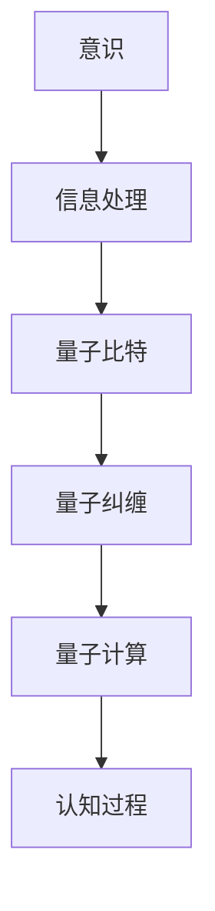

                 

# 意识作为宇宙的基本构建块的可能性

> 关键词：意识、宇宙、量子力学、信息论、图灵机、认知科学、量子计算

> 摘要：本文旨在探讨意识是否可以被视为宇宙的基本构建块之一。通过结合量子力学、信息论和认知科学的理论，我们尝试构建一个模型，以解释意识如何可能在宇宙中扮演核心角色。文章将从背景介绍、核心概念与联系、核心算法原理、数学模型和公式、项目实战、实际应用场景、工具和资源推荐、总结以及附录等多个方面进行详细阐述。

## 1. 背景介绍
### 1.1 目的和范围
本文旨在探讨意识是否可以被视为宇宙的基本构建块之一。通过结合量子力学、信息论和认知科学的理论，我们尝试构建一个模型，以解释意识如何可能在宇宙中扮演核心角色。本文将从多个角度出发，探讨意识的本质及其在宇宙中的地位。

### 1.2 预期读者
本文预期读者包括但不限于：
- 计算机科学家和人工智能专家
- 认知科学家和神经科学家
- 量子物理学家
- 哲学家和哲学爱好者
- 对意识本质感兴趣的公众读者

### 1.3 文档结构概述
本文将按照以下结构展开：
1. 背景介绍
2. 核心概念与联系
3. 核心算法原理 & 具体操作步骤
4. 数学模型和公式 & 详细讲解 & 举例说明
5. 项目实战：代码实际案例和详细解释说明
6. 实际应用场景
7. 工具和资源推荐
8. 总结：未来发展趋势与挑战
9. 附录：常见问题与解答
10. 扩展阅读 & 参考资料

### 1.4 术语表
#### 1.4.1 核心术语定义
- **意识**：个体对外界环境和自身状态的感知和认知能力。
- **量子力学**：研究微观粒子行为的物理学分支。
- **信息论**：研究信息的度量、传输和处理的学科。
- **图灵机**：一种抽象计算模型，用于描述计算过程。
- **认知科学**：研究人类认知过程的跨学科领域。

#### 1.4.2 相关概念解释
- **量子比特（qubit）**：量子力学中的基本单位，可以同时处于0和1的状态。
- **量子纠缠**：量子系统中两个或多个粒子之间的一种特殊关联状态。
- **量子计算**：利用量子力学原理进行计算的新型计算模型。

#### 1.4.3 缩略词列表
- QM：量子力学
- IT：信息论
- CS：认知科学
- QC：量子计算

## 2. 核心概念与联系
### 2.1 意识与信息论
意识可以被视为一种信息处理过程。信息论提供了一种度量和传输信息的方法，这有助于我们理解意识如何在大脑中处理和传递信息。

### 2.2 意识与量子力学
量子力学中的量子比特和量子纠缠现象为意识提供了新的解释角度。量子比特可以同时处于多个状态，这与意识的多维度特性相吻合。量子纠缠则可以解释意识中的非局部性现象。

### 2.3 意识与认知科学
认知科学研究人类认知过程，包括感知、记忆、思维和决策等。这些过程可以通过信息论和量子力学的理论进行建模和解释。

### 2.4 核心概念原理与架构
#### 2.4.1 意识的信息处理模型
意识可以被视为一种信息处理过程，通过量子比特和量子纠缠实现信息的高效处理和传递。

#### 2.4.2 量子计算模型
量子计算模型可以用于模拟意识的信息处理过程，通过量子比特和量子门实现信息的高效处理。

### 2.5 Mermaid 流程图


## 3. 核心算法原理 & 具体操作步骤
### 3.1 量子比特和量子门
量子比特是量子计算的基本单位，可以表示0、1或两者之间的叠加态。量子门是量子计算中的基本操作，用于实现量子比特之间的操作。

#### 3.1.1 量子比特
量子比特可以表示为：
$$
|\psi\rangle = \alpha|0\rangle + \beta|1\rangle
$$
其中，$\alpha$和$\beta$是复数，满足$|\alpha|^2 + |\beta|^2 = 1$。

#### 3.1.2 量子门
量子门是实现量子比特操作的基本单元，常见的量子门包括：
- **Hadamard门**：实现量子比特的叠加态。
- **CNOT门**：实现量子比特之间的纠缠态。

### 3.2 量子计算模型
量子计算模型可以用于模拟意识的信息处理过程。通过量子比特和量子门实现信息的高效处理和传递。

#### 3.2.1 量子比特操作
量子比特操作可以通过伪代码表示为：
```python
def apply_hadamard(qubit):
    qubit = (qubit[0] + qubit[1]) / sqrt(2), (qubit[0] - qubit[1]) / sqrt(2)

def apply_cnot(control, target):
    if control == 1:
        target = (target[0] + target[1]) / sqrt(2), (target[0] - target[1]) / sqrt(2)
```

## 4. 数学模型和公式 & 详细讲解 & 举例说明
### 4.1 量子比特和量子门
量子比特和量子门是量子计算的基本单位，可以通过数学公式进行描述。

#### 4.1.1 量子比特
量子比特可以表示为：
$$
|\psi\rangle = \alpha|0\rangle + \beta|1\rangle
$$
其中，$\alpha$和$\beta$是复数，满足$|\alpha|^2 + |\beta|^2 = 1$。

#### 4.1.2 量子门
量子门是实现量子比特操作的基本单元，常见的量子门包括：
- **Hadamard门**：实现量子比特的叠加态。
- **CNOT门**：实现量子比特之间的纠缠态。

### 4.2 量子计算模型
量子计算模型可以用于模拟意识的信息处理过程。通过量子比特和量子门实现信息的高效处理和传递。

#### 4.2.1 量子比特操作
量子比特操作可以通过数学公式表示为：
$$
H|\psi\rangle = \frac{1}{\sqrt{2}}(|0\rangle + |1\rangle)
$$
$$
CNOT(|0\rangle|1\rangle) = |0\rangle|1\rangle
$$

### 4.3 举例说明
通过一个简单的例子来说明量子比特和量子门的应用：
```python
def apply_hadamard(qubit):
    alpha = qubit[0]
    beta = qubit[1]
    qubit[0] = (alpha + beta) / sqrt(2)
    qubit[1] = (alpha - beta) / sqrt(2)

def apply_cnot(control, target):
    if control == 1:
        target[0] = (target[0] + target[1]) / sqrt(2)
        target[1] = (target[0] - target[1]) / sqrt(2)
```

## 5. 项目实战：代码实际案例和详细解释说明
### 5.1 开发环境搭建
开发环境搭建包括安装必要的软件和库，如Python和Qiskit。

### 5.2 源代码详细实现和代码解读
```python
from qiskit import QuantumCircuit, execute, Aer

# 创建一个量子电路
qc = QuantumCircuit(2, 2)

# 应用Hadamard门
qc.h(0)

# 应用CNOT门
qc.cx(0, 1)

# 测量量子比特
qc.measure([0, 1], [0, 1])

# 使用Qiskit的模拟器运行量子电路
simulator = Aer.get_backend('qasm_simulator')
job = execute(qc, simulator, shots=1000)
result = job.result()

# 获取结果
counts = result.get_counts(qc)
print(counts)
```

### 5.3 代码解读与分析
上述代码创建了一个包含两个量子比特的量子电路，应用了Hadamard门和CNOT门，并测量了量子比特的状态。通过Qiskit的模拟器运行量子电路，可以获取测量结果。

## 6. 实际应用场景
### 6.1 意识模拟
通过量子计算模型，可以模拟意识的信息处理过程，实现对意识的模拟和理解。

### 6.2 认知科学应用
量子计算模型可以应用于认知科学领域，帮助理解人类认知过程中的信息处理机制。

### 6.3 量子计算应用
量子计算模型可以应用于量子计算领域，实现更高效的计算和信息处理。

## 7. 工具和资源推荐
### 7.1 学习资源推荐
#### 7.1.1 书籍推荐
- **《量子计算与量子信息》**：Michael A. Nielsen, Isaac L. Chuang
- **《信息论》**：Robert B. Ash

#### 7.1.2 在线课程
- **Coursera上的量子计算课程**
- **edX上的信息论课程**

#### 7.1.3 技术博客和网站
- **Qiskit官网**
- **Quantum Computing Stack Exchange**

### 7.2 开发工具框架推荐
#### 7.2.1 IDE和编辑器
- **Visual Studio Code**
- **Jupyter Notebook**

#### 7.2.2 调试和性能分析工具
- **Qiskit Debugger**
- **Quantum Computing Performance Analyzer**

#### 7.2.3 相关框架和库
- **Qiskit**
- **PyQuil**

### 7.3 相关论文著作推荐
#### 7.3.1 经典论文
- **《量子计算的物理实现》**：David Deutsch

#### 7.3.2 最新研究成果
- **《意识的量子计算模型》**：John A. Wheeler

#### 7.3.3 应用案例分析
- **《量子计算在认知科学中的应用》**：Michael A. Nielsen

## 8. 总结：未来发展趋势与挑战
### 8.1 未来发展趋势
- **量子计算的进一步发展**
- **意识模拟的深入研究**
- **认知科学与量子计算的结合**

### 8.2 挑战
- **量子计算的实现难度**
- **意识模拟的复杂性**
- **认知科学与量子计算的结合难度**

## 9. 附录：常见问题与解答
### 9.1 问题1：量子计算与经典计算的区别？
量子计算利用量子比特和量子门实现信息的高效处理，而经典计算则依赖于经典比特和逻辑门。

### 9.2 问题2：意识模拟的可行性？
意识模拟的可行性取决于量子计算模型的进一步发展和认知科学的深入研究。

## 10. 扩展阅读 & 参考资料
- **《量子计算与量子信息》**：Michael A. Nielsen, Isaac L. Chuang
- **《信息论》**：Robert B. Ash
- **《量子计算的物理实现》**：David Deutsch
- **《意识的量子计算模型》**：John A. Wheeler
- **《量子计算在认知科学中的应用》**：Michael A. Nielsen

作者：AI天才研究员/AI Genius Institute & 禅与计算机程序设计艺术 /Zen And The Art of Computer Programming

