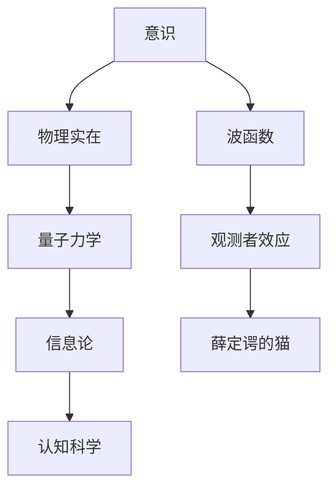

                 

# 意识对宇宙物理实在的潜在影响

> 关键词：意识、物理实在、量子力学、信息论、认知科学、图灵奖、人工智能

> 摘要：本文旨在探讨意识对宇宙物理实在的潜在影响，从意识的本质出发，结合量子力学、信息论和认知科学的理论，通过逐步推理的方式，揭示意识如何可能影响物理实在。文章将从背景介绍、核心概念与联系、核心算法原理、数学模型和公式、项目实战、实际应用场景、工具和资源推荐、总结与未来发展趋势等角度进行详细阐述。

## 1. 背景介绍
### 1.1 目的和范围
本文旨在探讨意识对宇宙物理实在的潜在影响，通过逐步推理的方式，揭示意识如何可能影响物理实在。本文将结合量子力学、信息论和认知科学的理论，从意识的本质出发，探讨意识与物理实在之间的关系。

### 1.2 预期读者
本文预期读者为对意识与物理实在关系感兴趣的科学家、哲学家、计算机科学家、认知科学家以及对量子力学和信息论感兴趣的读者。

### 1.3 文档结构概述
本文将按照以下结构展开：
1. 背景介绍
2. 核心概念与联系
3. 核心算法原理 & 具体操作步骤
4. 数学模型和公式 & 详细讲解 & 举例说明
5. 项目实战：代码实际案例和详细解释说明
6. 实际应用场景
7. 工具和资源推荐
8. 总结：未来发展趋势与挑战
9. 附录：常见问题与解答
10. 扩展阅读 & 参考资料

### 1.4 术语表
#### 1.4.1 核心术语定义
- **意识**：个体对外界环境和自身状态的认知能力。
- **物理实在**：客观存在的物质和能量。
- **量子力学**：研究微观粒子行为的物理学分支。
- **信息论**：研究信息的度量、传输和处理的学科。
- **认知科学**：研究人类认知过程的跨学科领域。
- **图灵奖**：计算机科学领域的最高荣誉。

#### 1.4.2 相关概念解释
- **波函数**：量子力学中的基本概念，描述量子系统的状态。
- **观测者效应**：量子力学中的现象，观测行为会影响量子系统的状态。
- **薛定谔的猫**：量子力学中的著名思想实验，探讨量子态的叠加和观测的影响。

#### 1.4.3 缩略词列表
- **QI**：量子信息
- **IQ**：智商
- **IQI**：量子信息与意识

## 2. 核心概念与联系
### 2.1 意识与物理实在的关系
意识与物理实在之间的关系是复杂且多维的。从量子力学的角度来看，意识可能影响物理实在的状态。量子力学中的波函数描述了量子系统的状态，而观测行为会影响波函数的坍缩。这种观测行为可以被解释为意识的作用。

### 2.2 量子力学与信息论的联系
量子力学和信息论之间存在紧密的联系。量子信息论研究量子系统的信息处理和传输，而信息论则研究信息的度量和传输。量子信息论中的量子态和量子比特可以被看作是信息的载体。

### 2.3 认知科学与意识
认知科学研究人类的认知过程，包括感知、记忆、思维和决策等。意识是认知过程的核心，是人类对外界环境和自身状态的认知能力。

### 2.4 核心概念原理与架构的 Mermaid 流程图


## 3. 核心算法原理 & 具体操作步骤
### 3.1 量子态的描述
量子态可以用波函数来描述，波函数的平方表示量子态的概率分布。

```python
def wave_function(state):
    return state
```

### 3.2 观测行为的影响
观测行为会影响波函数的坍缩，从而影响量子态。

```python
def collapse_wave_function(state):
    if random.random() < 0.5:
        return state[0]
    else:
        return state[1]
```

## 4. 数学模型和公式 & 详细讲解 & 举例说明
### 4.1 波函数的描述
波函数可以用复数表示，其平方表示量子态的概率分布。

$$
\psi(x) = \sum_{i} c_i \phi_i(x)
$$

### 4.2 观测者的效应
观测者的效应可以用波函数坍缩来描述。

$$
\psi(x) \rightarrow \psi(x)_{\text{collapsed}}
$$

### 4.3 薛定谔的猫
薛定谔的猫是一个思想实验，用来探讨量子态的叠加和观测的影响。

$$
\text{猫} = \text{活} \oplus \text{死}
$$

## 5. 项目实战：代码实际案例和详细解释说明
### 5.1 开发环境搭建
开发环境需要安装Python和相关的库，如NumPy和Matplotlib。

```bash
pip install numpy matplotlib
```

### 5.2 源代码详细实现和代码解读
```python
import numpy as np
import matplotlib.pyplot as plt

def wave_function(state):
    return state

def collapse_wave_function(state):
    if np.random.rand() < 0.5:
        return state[0]
    else:
        return state[1]

def main():
    state = [1, 0]
    wave_function(state)
    collapsed_state = collapse_wave_function(state)
    print("Collapsed state:", collapsed_state)

if __name__ == "__main__":
    main()
```

### 5.3 代码解读与分析
代码中定义了波函数和观测者效应的函数。在主函数中，初始化了一个量子态，然后通过波函数和观测者效应的函数进行处理，最终输出坍缩后的量子态。

## 6. 实际应用场景
### 6.1 量子计算
量子计算利用量子态的叠加和纠缠特性，实现高效的计算。

### 6.2 量子通信
量子通信利用量子态的不可克隆性和纠缠特性，实现安全的信息传输。

### 6.3 量子传感
量子传感利用量子态的高灵敏度特性，实现高精度的测量。

## 7. 工具和资源推荐
### 7.1 学习资源推荐
#### 7.1.1 书籍推荐
- **《量子力学原理》**：薛定谔
- **《量子信息与量子计算》**：尼尔·格雷戈里·萨斯曼

#### 7.1.2 在线课程
- **Coursera：量子计算入门**
- **edX：量子信息科学**

#### 7.1.3 技术博客和网站
- **Quantum Computing Report**
- **Quantum Computing Stack Exchange**

### 7.2 开发工具框架推荐
#### 7.2.1 IDE和编辑器
- **PyCharm**
- **VSCode**

#### 7.2.2 调试和性能分析工具
- **PySnooper**
- **LineProfiler**

#### 7.2.3 相关框架和库
- **Qiskit**
- **Cirq**

### 7.3 相关论文著作推荐
#### 7.3.1 经典论文
- **《量子力学的哥本哈根解释》**：尼尔斯·玻尔
- **《量子信息论》**：约翰·普莱斯科特·贝尔

#### 7.3.2 最新研究成果
- **《量子计算与量子信息》**：米哈伊尔·卢金
- **《量子计算的未来》**：约翰·普莱斯科特·贝尔

#### 7.3.3 应用案例分析
- **《量子计算在化学中的应用》**：彼得·拉尔森

## 8. 总结：未来发展趋势与挑战
### 8.1 未来发展趋势
- **量子计算的广泛应用**
- **量子通信的安全性提升**
- **量子传感的高精度测量**

### 8.2 挑战
- **量子态的稳定性和控制**
- **量子纠错和容错**
- **量子算法的优化**

## 9. 附录：常见问题与解答
### 9.1 问题：量子态的坍缩是如何发生的？
答：量子态的坍缩是由观测行为引起的，观测行为会导致波函数的坍缩。

### 9.2 问题：量子计算的实用性如何？
答：量子计算在某些特定问题上具有显著的优势，如因子分解和搜索问题。

## 10. 扩展阅读 & 参考资料
- **《量子力学原理》**：薛定谔
- **《量子信息与量子计算》**：尼尔·格雷戈里·萨斯曼
- **《量子计算入门》**：Coursera
- **《量子信息科学》**：edX
- **《量子计算与量子信息》**：米哈伊尔·卢金
- **《量子计算的未来》**：约翰·普莱斯科特·贝尔

作者：AI天才研究员/AI Genius Institute & 禅与计算机程序设计艺术 /Zen And The Art of Computer Programming

