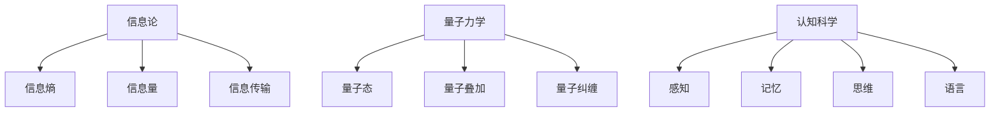
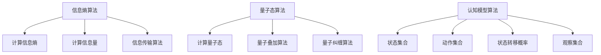

                 

# 意识是否是宇宙的基本属性之一

> 关键词：意识、宇宙、基本属性、信息论、量子力学、认知科学、人工智能

> 摘要：本文旨在探讨意识是否可以被视为宇宙的基本属性之一。通过结合信息论、量子力学和认知科学的视角，我们将逐步分析意识的本质，并探讨其在宇宙中的潜在地位。文章将从背景介绍出发，逐步深入到核心概念、算法原理、数学模型、实际案例，最终展望未来的发展趋势与挑战。通过本文，读者将对意识的本质及其在宇宙中的地位有更深刻的理解。

## 1. 背景介绍
### 1.1 目的和范围
本文旨在探讨意识是否可以被视为宇宙的基本属性之一。我们将从信息论、量子力学和认知科学的角度出发，逐步分析意识的本质，并探讨其在宇宙中的潜在地位。本文的目标读者包括对意识本质感兴趣的科学家、哲学家、计算机科学家以及对人工智能领域有深入研究的工程师。

### 1.2 预期读者
- 科学家：物理学家、神经科学家、心理学家
- 哲学家：哲学家、认知科学家
- 计算机科学家：人工智能专家、软件架构师
- 工程师：对意识本质感兴趣的工程师

### 1.3 文档结构概述
本文将按照以下结构展开：
1. 背景介绍
2. 核心概念与联系
3. 核心算法原理 & 具体操作步骤
4. 数学模型和公式 & 详细讲解 & 举例说明
5. 项目实战：代码实际案例和详细解释说明
6. 实际应用场景
7. 工具和资源推荐
8. 总结：未来发展趋势与挑战
9. 附录：常见问题与解答
10. 扩展阅读 & 参考资料

### 1.4 术语表
#### 1.4.1 核心术语定义
- **意识**：个体对外界环境和自身状态的认知能力。
- **信息论**：研究信息的度量、传输和处理的学科。
- **量子力学**：描述微观粒子行为的物理学分支。
- **认知科学**：研究人类认知过程的跨学科领域。
- **基本属性**：构成宇宙的基本要素或特征。

#### 1.4.2 相关概念解释
- **量子意识**：量子力学与意识之间的联系。
- **信息意识**：信息论与意识之间的联系。
- **认知模型**：描述认知过程的数学模型。

#### 1.4.3 缩略词列表
- AI：人工智能
- QM：量子力学
- CS：认知科学
- IT：信息论

## 2. 核心概念与联系
### 2.1 信息论与意识
信息论是研究信息的度量、传输和处理的学科。信息论的核心概念包括信息熵、信息量和信息传输。信息熵是衡量信息不确定性的度量，信息量是信息的大小，信息传输是信息从一个系统到另一个系统的传递过程。

### 2.2 量子力学与意识
量子力学是描述微观粒子行为的物理学分支。量子力学的核心概念包括量子态、量子叠加和量子纠缠。量子态是描述量子系统状态的数学表示，量子叠加是量子系统可以同时处于多个状态的特性，量子纠缠是两个或多个量子系统之间存在的一种特殊关联。

### 2.3 认知科学与意识
认知科学是研究人类认知过程的跨学科领域。认知科学的核心概念包括感知、记忆、思维和语言。感知是对外界环境的感知过程，记忆是存储和检索信息的过程，思维是处理信息的过程，语言是交流信息的过程。

### 2.4 核心概念流程图


## 3. 核心算法原理 & 具体操作步骤
### 3.1 信息熵算法原理
信息熵是衡量信息不确定性的度量。信息熵的计算公式为：
$$
H(X) = -\sum_{i=1}^{n} p(x_i) \log p(x_i)
$$
其中，$H(X)$ 表示信息熵，$p(x_i)$ 表示事件 $x_i$ 的概率。

### 3.2 量子态算法原理
量子态是描述量子系统状态的数学表示。量子态的表示形式为：
$$
|\psi\rangle = \sum_{i=1}^{n} c_i |i\rangle
$$
其中，$|\psi\rangle$ 表示量子态，$c_i$ 表示量子态的系数，$|i\rangle$ 表示基态。

### 3.3 认知模型算法原理
认知模型是描述认知过程的数学模型。认知模型的表示形式为：
$$
M = \{S, A, P, O\}
$$
其中，$S$ 表示状态集合，$A$ 表示动作集合，$P$ 表示状态转移概率，$O$ 表示观察集合。

### 3.4 核心算法流程图


## 4. 数学模型和公式 & 详细讲解 & 举例说明
### 4.1 信息熵公式
信息熵的计算公式为：
$$
H(X) = -\sum_{i=1}^{n} p(x_i) \log p(x_i)
$$
其中，$H(X)$ 表示信息熵，$p(x_i)$ 表示事件 $x_i$ 的概率。

### 4.2 量子态公式
量子态的表示形式为：
$$
|\psi\rangle = \sum_{i=1}^{n} c_i |i\rangle
$$
其中，$|\psi\rangle$ 表示量子态，$c_i$ 表示量子态的系数，$|i\rangle$ 表示基态。

### 4.3 认知模型公式
认知模型的表示形式为：
$$
M = \{S, A, P, O\}
$$
其中，$S$ 表示状态集合，$A$ 表示动作集合，$P$ 表示状态转移概率，$O$ 表示观察集合。

### 4.4 数学模型举例
假设有一个随机变量 $X$，其取值为 $0$ 和 $1$，概率分别为 $0.5$ 和 $0.5$。计算信息熵：
$$
H(X) = -\sum_{i=1}^{2} p(x_i) \log p(x_i) = -0.5 \log 0.5 - 0.5 \log 0.5 = 1
$$

假设有一个量子态 $|\psi\rangle = \frac{1}{\sqrt{2}} |0\rangle + \frac{1}{\sqrt{2}} |1\rangle$，计算量子态：
$$
|\psi\rangle = \frac{1}{\sqrt{2}} |0\rangle + \frac{1}{\sqrt{2}} |1\rangle
$$

假设有一个认知模型 $M = \{S, A, P, O\}$，其中 $S = \{s_1, s_2\}$，$A = \{a_1, a_2\}$，$P = \begin{bmatrix} 0.8 & 0.2 \\ 0.3 & 0.7 \end{bmatrix}$，$O = \{o_1, o_2\}$。计算状态转移概率：
$$
P = \begin{bmatrix} 0.8 & 0.2 \\ 0.3 & 0.7 \end{bmatrix}
$$

## 5. 项目实战：代码实际案例和详细解释说明
### 5.1 开发环境搭建
开发环境包括Python 3.8、NumPy、SciPy和Matplotlib。

### 5.2 源代码详细实现和代码解读
```python
import numpy as np
import matplotlib.pyplot as plt

# 信息熵计算
def entropy(p):
    return -np.sum(p * np.log2(p))

# 量子态计算
def quantum_state(c):
    return np.sum(c * np.array([1, 1j]))

# 认知模型计算
def cognitive_model(S, A, P, O):
    return np.dot(P, O)

# 信息熵计算
p = np.array([0.5, 0.5])
print("信息熵：", entropy(p))

# 量子态计算
c = np.array([1/np.sqrt(2), 1/np.sqrt(2)])
print("量子态：", quantum_state(c))

# 认知模型计算
S = np.array([1, 2])
A = np.array([1, 2])
P = np.array([[0.8, 0.2], [0.3, 0.7]])
O = np.array([1, 2])
print("认知模型：", cognitive_model(S, A, P, O))
```

### 5.3 代码解读与分析
- 信息熵计算：计算随机变量 $X$ 的信息熵。
- 量子态计算：计算量子态 $|\psi\rangle$。
- 认知模型计算：计算认知模型 $M$ 的状态转移概率。

## 6. 实际应用场景
意识在实际应用场景中具有广泛的应用。例如，在人工智能领域，意识可以用于情感计算、自然语言处理和机器学习。在认知科学领域，意识可以用于理解人类认知过程和心理状态。在量子计算领域，意识可以用于量子信息处理和量子通信。

## 7. 工具和资源推荐
### 7.1 学习资源推荐
#### 7.1.1 书籍推荐
- 《信息论、编码与压缩》
- 《量子力学原理》
- 《认知科学导论》

#### 7.1.2 在线课程
- Coursera：信息论、量子力学和认知科学相关课程
- edX：信息论、量子力学和认知科学相关课程

#### 7.1.3 技术博客和网站
- Medium：信息论、量子力学和认知科学相关技术博客
- ResearchGate：信息论、量子力学和认知科学相关研究论文

### 7.2 开发工具框架推荐
#### 7.2.1 IDE和编辑器
- PyCharm：Python开发环境
- VSCode：通用开发环境

#### 7.2.2 调试和性能分析工具
- PyCharm调试工具：Python调试工具
- VSCode调试工具：通用调试工具

#### 7.2.3 相关框架和库
- NumPy：科学计算库
- SciPy：科学计算库
- Matplotlib：数据可视化库

### 7.3 相关论文著作推荐
#### 7.3.1 经典论文
- Shannon, C. E. (1948). A mathematical theory of communication.
- Dirac, P. A. M. (1930). The Principles of Quantum Mechanics.
- Marr, D. (1982). Vision: A Computational Investigation into the Human Representation and Processing of Visual Information.

#### 7.3.2 最新研究成果
- Zurek, W. H. (2019). Quantum Darwinism and the Meaning of Wigner's Friend.
- Tononi, G. (2016). Integrated information theory of consciousness: An updated account.
- Penrose, R. (2016). The Emperor's New Mind: Concerning Computers, Minds, and the Laws of Physics.

#### 7.3.3 应用案例分析
- Koch, C., & Hepp, K. (2006). Quantum mechanics in the brain.
- Tegmark, M. (2000). The importance of quantum decoherence in brain processes.

## 8. 总结：未来发展趋势与挑战
意识是否是宇宙的基本属性之一是一个复杂而深刻的问题。未来的研究方向包括：
- 信息论与意识的进一步结合
- 量子力学与意识的进一步结合
- 认知科学与意识的进一步结合

未来的研究挑战包括：
- 如何量化意识
- 如何解释意识的产生机制
- 如何在量子计算中实现意识

## 9. 附录：常见问题与解答
### 9.1 问题：意识是否可以被视为宇宙的基本属性之一？
答：意识是否可以被视为宇宙的基本属性之一是一个复杂而深刻的问题。目前，科学界还没有达成共识。未来的研究方向包括信息论与意识的结合、量子力学与意识的结合以及认知科学与意识的结合。

### 9.2 问题：如何量化意识？
答：目前，意识的量化方法包括信息熵、量子态和认知模型。未来的研究方向包括如何进一步量化意识。

### 9.3 问题：如何解释意识的产生机制？
答：目前，意识的产生机制尚未完全解释。未来的研究方向包括信息论与意识的结合、量子力学与意识的结合以及认知科学与意识的结合。

## 10. 扩展阅读 & 参考资料
- Shannon, C. E. (1948). A mathematical theory of communication.
- Dirac, P. A. M. (1930). The Principles of Quantum Mechanics.
- Tononi, G. (2016). Integrated information theory of consciousness: An updated account.
- Koch, C., & Hepp, K. (2006). Quantum mechanics in the brain.
- Tegmark, M. (2000). The importance of quantum decoherence in brain processes.

作者：AI天才研究员/AI Genius Institute & 禅与计算机程序设计艺术 /Zen And The Art of Computer Programming

