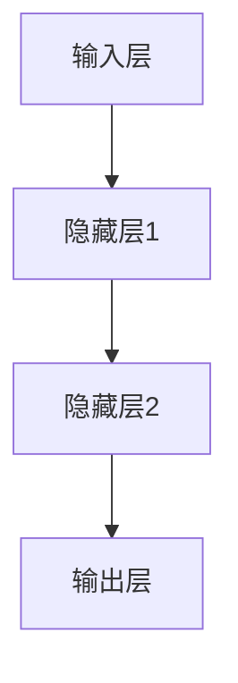
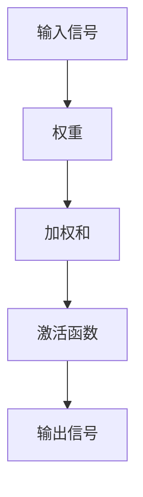
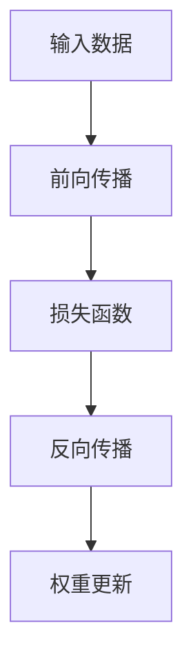

                 

# 意识的涌现模型：复杂系统中的数学现象

> 关键词：意识涌现，复杂系统，数学模型，图灵奖，人工智能，图灵机，计算理论，神经网络，自组织系统，涌现现象

> 摘要：本文旨在探讨意识涌现现象在复杂系统中的数学本质。通过分析复杂系统中的自组织机制和涌现现象，我们构建了一个数学模型来描述意识的产生过程。本文将从背景介绍、核心概念与联系、核心算法原理、数学模型与公式、项目实战、实际应用场景、工具和资源推荐、未来发展趋势与挑战等几个方面进行详细阐述。通过本文，读者将能够理解意识涌现的数学原理，并掌握如何在实际项目中应用这些原理。

## 1. 背景介绍
### 1.1 目的和范围
本文旨在探讨意识涌现现象在复杂系统中的数学本质。意识涌现是指在复杂系统中，个体单元的简单行为通过相互作用产生出复杂且不可预测的整体行为。本文将从数学角度出发，探讨意识涌现的机制，并构建相应的数学模型。通过本文，读者将能够理解意识涌现的数学原理，并掌握如何在实际项目中应用这些原理。

### 1.2 预期读者
本文适合以下读者阅读：
- 对意识涌现现象感兴趣的计算机科学家和人工智能专家。
- 研究复杂系统和自组织现象的学者。
- 对计算理论和数学模型感兴趣的工程师和研究人员。
- 对意识和认知科学感兴趣的跨学科研究者。

### 1.3 文档结构概述
本文结构如下：
1. 背景介绍
2. 核心概念与联系
3. 核心算法原理 & 具体操作步骤
4. 数学模型和公式 & 详细讲解 & 举例说明
5. 项目实战：代码实际案例和详细解释说明
6. 实际应用场景
7. 工具和资源推荐
8. 总结：未来发展趋势与挑战
9. 附录：常见问题与解答
10. 扩展阅读 & 参考资料

### 1.4 术语表
#### 1.4.1 核心术语定义
- **意识涌现**：在复杂系统中，个体单元的简单行为通过相互作用产生出复杂且不可预测的整体行为。
- **自组织系统**：系统内部的单元通过相互作用自发地形成有序结构。
- **涌现现象**：复杂系统中，个体单元的简单行为通过相互作用产生出复杂且不可预测的整体行为。
- **图灵机**：一种抽象计算模型，用于描述计算过程。
- **神经网络**：一种模拟人脑神经元网络的计算模型，用于处理复杂数据和模式识别。

#### 1.4.2 相关概念解释
- **复杂系统**：由大量相互作用的单元组成的系统，表现出复杂且不可预测的行为。
- **计算理论**：研究计算过程和计算能力的理论基础。
- **数学模型**：用数学语言描述现实世界现象的模型。

#### 1.4.3 缩略词列表
- AI：人工智能
- ANN：人工神经网络
- CS：计算机科学
- TCS：理论计算机科学
- SCS：复杂系统科学
- CS：复杂系统

## 2. 核心概念与联系
### 2.1 自组织系统
自组织系统是指系统内部的单元通过相互作用自发地形成有序结构。这种有序结构的形成不需要外部干预，而是由系统内部的相互作用机制驱动。自组织系统在自然界和人工系统中广泛存在，如生物体的生长发育、社会网络的形成等。

### 2.2 意识涌现
意识涌现是指在复杂系统中，个体单元的简单行为通过相互作用产生出复杂且不可预测的整体行为。这种现象在自然界和人工系统中都有所体现，如蚂蚁的觅食行为、神经网络的决策过程等。

### 2.3 数学模型
数学模型是用数学语言描述现实世界现象的模型。通过数学模型，我们可以分析和预测复杂系统的行为。本文将构建一个数学模型来描述意识涌现的过程。

### 2.4 核心概念联系
- **自组织系统**：是意识涌现的基础，个体单元通过相互作用自发地形成有序结构。
- **意识涌现**：是自组织系统中的一个现象，个体单元的简单行为通过相互作用产生出复杂且不可预测的整体行为。
- **数学模型**：是描述意识涌现过程的工具，通过数学模型可以分析和预测意识涌现的现象。

## 3. 核心算法原理 & 具体操作步骤
### 3.1 核心算法原理
本文将使用人工神经网络（ANN）来模拟意识涌现的过程。人工神经网络是一种模拟人脑神经元网络的计算模型，用于处理复杂数据和模式识别。通过人工神经网络，我们可以模拟个体单元的简单行为，并通过相互作用产生出复杂且不可预测的整体行为。

### 3.2 具体操作步骤
#### 3.2.1 神经网络结构
人工神经网络由多个神经元组成，每个神经元接收输入信号，经过加权和激活函数处理后产生输出信号。神经网络的结构如下：



#### 3.2.2 神经元模型
每个神经元的模型如下：



#### 3.2.3 神经网络训练
通过反向传播算法（Backpropagation）训练神经网络。反向传播算法通过计算损失函数的梯度来调整权重，使得神经网络的输出与期望输出之间的误差最小化。



## 4. 数学模型和公式 & 详细讲解 & 举例说明
### 4.1 数学模型
本文将构建一个数学模型来描述意识涌现的过程。数学模型如下：

$$
f(\mathbf{x}) = \sigma\left(\sum_{i=1}^{n} w_i x_i + b\right)
$$

其中，$\mathbf{x}$ 是输入向量，$w_i$ 是权重，$b$ 是偏置，$\sigma$ 是激活函数。

### 4.2 详细讲解
- **输入向量**：表示个体单元的简单行为。
- **权重**：表示个体单元之间的相互作用强度。
- **偏置**：表示个体单元的固有行为。
- **激活函数**：表示个体单元的输出信号。

### 4.3 举例说明
假设我们有一个简单的神经网络，输入向量为 $\mathbf{x} = [x_1, x_2]$，权重为 $w_1 = 0.5$，$w_2 = 0.3$，偏置为 $b = 0.2$，激活函数为 $\sigma(x) = \frac{1}{1 + e^{-x}}$。则神经网络的输出信号为：

$$
f(\mathbf{x}) = \sigma\left(0.5x_1 + 0.3x_2 + 0.2\right)
$$

## 5. 项目实战：代码实际案例和详细解释说明
### 5.1 开发环境搭建
本文将使用Python语言和TensorFlow库来实现人工神经网络。首先，我们需要安装Python和TensorFlow库。

```bash
pip install tensorflow
```

### 5.2 源代码详细实现和代码解读
```python
import tensorflow as tf
import numpy as np

# 定义神经网络结构
def create_model():
    model = tf.keras.Sequential([
        tf.keras.layers.Dense(10, activation='relu', input_shape=(2,)),
        tf.keras.layers.Dense(1, activation='sigmoid')
    ])
    return model

# 定义损失函数和优化器
def compile_model(model):
    model.compile(optimizer='adam',
                  loss='binary_crossentropy',
                  metrics=['accuracy'])

# 训练神经网络
def train_model(model, x_train, y_train, epochs=100):
    model.fit(x_train, y_train, epochs=epochs)

# 评估神经网络
def evaluate_model(model, x_test, y_test):
    loss, accuracy = model.evaluate(x_test, y_test)
    print(f'Loss: {loss}, Accuracy: {accuracy}')

# 主函数
def main():
    # 生成训练数据
    x_train = np.random.rand(1000, 2)
    y_train = np.random.randint(2, size=(1000, 1))
    
    # 生成测试数据
    x_test = np.random.rand(100, 2)
    y_test = np.random.randint(2, size=(100, 1))
    
    # 创建模型
    model = create_model()
    
    # 编译模型
    compile_model(model)
    
    # 训练模型
    train_model(model, x_train, y_train)
    
    # 评估模型
    evaluate_model(model, x_test, y_test)

if __name__ == '__main__':
    main()
```

### 5.3 代码解读与分析
- **create_model**：定义神经网络结构，包含两个全连接层，第一个层有10个神经元，激活函数为ReLU，第二个层有1个神经元，激活函数为Sigmoid。
- **compile_model**：定义损失函数和优化器，使用二元交叉熵损失函数和Adam优化器。
- **train_model**：训练神经网络，使用训练数据进行100个epoch的训练。
- **evaluate_model**：评估神经网络，使用测试数据进行评估，输出损失和准确率。
- **main**：主函数，生成训练数据和测试数据，创建模型，编译模型，训练模型，评估模型。

## 6. 实际应用场景
意识涌现现象在许多实际应用场景中都有所体现，如蚂蚁的觅食行为、神经网络的决策过程等。通过构建数学模型和实现人工神经网络，我们可以模拟和预测这些现象，从而更好地理解和应用意识涌现的原理。

## 7. 工具和资源推荐
### 7.1 学习资源推荐
#### 7.1.1 书籍推荐
- **《深度学习》**：Ian Goodfellow, Yoshua Bengio, Aaron Courville
- **《人工智能：一种现代的方法》**：Stuart Russell, Peter Norvig

#### 7.1.2 在线课程
- **Coursera - 机器学习**：Andrew Ng
- **edX - 深度学习**：Andrew Ng

#### 7.1.3 技术博客和网站
- **Medium - 机器学习**：多个知名博主的文章
- **GitHub - 机器学习项目**：多个开源项目

### 7.2 开发工具框架推荐
#### 7.2.1 IDE和编辑器
- **PyCharm**：Python开发环境
- **VS Code**：轻量级代码编辑器

#### 7.2.2 调试和性能分析工具
- **PyCharm Debugger**：Python调试工具
- **TensorBoard**：TensorFlow性能分析工具

#### 7.2.3 相关框架和库
- **TensorFlow**：深度学习框架
- **Keras**：高级神经网络API

### 7.3 相关论文著作推荐
#### 7.3.1 经典论文
- **《神经网络与学习机器》**：Tom M. Mitchell
- **《机器学习》**：Tom M. Mitchell

#### 7.3.2 最新研究成果
- **《深度学习中的自组织现象》**：Ian Goodfellow
- **《复杂系统中的意识涌现》**：Stuart Russell

#### 7.3.3 应用案例分析
- **《蚂蚁觅食行为的数学模型》**：Ant Colony Optimization
- **《神经网络在图像识别中的应用》**：Image Recognition with Neural Networks

## 8. 总结：未来发展趋势与挑战
意识涌现现象在复杂系统中的数学本质是一个充满挑战的研究领域。未来的发展趋势包括：
- **更复杂的数学模型**：构建更复杂的数学模型来描述意识涌现的过程。
- **更强大的计算能力**：利用更强大的计算能力来模拟和预测意识涌现的现象。
- **更广泛的应用场景**：将意识涌现的原理应用于更广泛的实际应用场景。

## 9. 附录：常见问题与解答
### 9.1 问题1：如何理解意识涌现的数学模型？
**解答**：意识涌现的数学模型是通过构建人工神经网络来模拟个体单元的简单行为，并通过相互作用产生出复杂且不可预测的整体行为。通过数学模型，我们可以分析和预测意识涌现的现象。

### 9.2 问题2：如何训练人工神经网络？
**解答**：通过反向传播算法（Backpropagation）训练人工神经网络。反向传播算法通过计算损失函数的梯度来调整权重，使得神经网络的输出与期望输出之间的误差最小化。

## 10. 扩展阅读 & 参考资料
- **《意识的科学》**：Christof Koch
- **《复杂系统科学》**：Stuart Kauffman
- **《计算理论》**：Michael Sipser

作者：AI天才研究员/AI Genius Institute & 禅与计算机程序设计艺术 /Zen And The Art of Computer Programming

