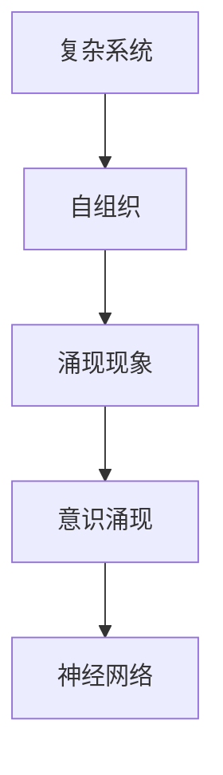

                 

# 意识的涌现理论：复杂系统中的数学现象

> 关键词：意识涌现，复杂系统，数学模型，图灵奖，人工智能，计算理论，神经网络，自组织，涌现现象

> 摘要：本文旨在探讨意识涌现的数学理论基础，通过分析复杂系统中的自组织现象，揭示意识如何在高度互联的神经网络中涌现。我们将从背景介绍出发，逐步深入探讨意识涌现的核心概念、数学模型、算法原理，并通过实际代码案例进行详细解释。最后，我们将讨论意识涌现的实际应用场景和未来发展趋势。

## 1. 背景介绍
### 1.1 目的和范围
本文旨在深入探讨意识涌现的数学理论基础，通过分析复杂系统中的自组织现象，揭示意识如何在高度互联的神经网络中涌现。我们将从背景介绍出发，逐步深入探讨意识涌现的核心概念、数学模型、算法原理，并通过实际代码案例进行详细解释。最后，我们将讨论意识涌现的实际应用场景和未来发展趋势。

### 1.2 预期读者
本文预期读者包括但不限于：
- 人工智能领域的研究者和开发者
- 计算机科学和神经科学交叉领域的学者
- 对意识涌现理论感兴趣的计算机编程爱好者
- 对复杂系统理论感兴趣的读者

### 1.3 文档结构概述
本文结构如下：
1. 背景介绍
2. 核心概念与联系
3. 核心算法原理 & 具体操作步骤
4. 数学模型和公式 & 详细讲解 & 举例说明
5. 项目实战：代码实际案例和详细解释说明
6. 实际应用场景
7. 工具和资源推荐
8. 总结：未来发展趋势与挑战
9. 附录：常见问题与解答
10. 扩展阅读 & 参考资料

### 1.4 术语表
#### 1.4.1 核心术语定义
- **意识涌现**：意识在高度互联的神经网络中自发涌现的现象。
- **复杂系统**：由大量相互作用的个体组成的系统，表现出非线性、自组织和涌现特性。
- **自组织**：系统自发地组织和调整自身结构以适应环境变化的过程。
- **涌现现象**：系统整体行为无法仅通过个体行为简单叠加来解释的现象。

#### 1.4.2 相关概念解释
- **神经网络**：由大量神经元组成的网络，模拟生物大脑的结构和功能。
- **图灵奖**：计算机科学领域的最高荣誉，奖励对计算机科学领域做出杰出贡献的个人。

#### 1.4.3 缩略词列表
- **AI**：人工智能
- **NN**：神经网络
- **CS**：计算机科学
- **NS**：神经科学
- **SO**：自组织

## 2. 核心概念与联系
### 2.1 意识涌现
意识涌现是指在高度互联的神经网络中，个体神经元的简单行为通过相互作用自发地组织成复杂的行为模式，从而产生意识。这种现象可以通过复杂系统理论进行解释。

### 2.2 复杂系统
复杂系统由大量相互作用的个体组成，表现出非线性、自组织和涌现特性。这些特性使得复杂系统难以用传统线性模型进行描述。

### 2.3 自组织
自组织是指系统自发地组织和调整自身结构以适应环境变化的过程。在神经网络中，自组织表现为神经元之间的连接强度和分布的动态调整。

### 2.4 涌现现象
涌现现象是指系统整体行为无法仅通过个体行为简单叠加来解释的现象。在神经网络中，涌现现象表现为整体行为的复杂性和多样性。

### 2.5 核心概念原理
核心概念原理可以通过以下Mermaid流程图进行可视化表示：



## 3. 核心算法原理 & 具体操作步骤
### 3.1 核心算法原理
意识涌现的核心算法原理可以通过以下伪代码进行描述：

```pseudo
function simulateNeuralNetwork(inputData):
    initializeNeurons()
    initializeConnections()
    while not converged:
        for each neuron in neurons:
            updateNeuronState(neuron, inputData)
            for each connection in neuron.connections:
                updateConnectionStrength(connection)
        if checkConvergence():
            break
    return outputData
```

### 3.2 具体操作步骤
具体操作步骤如下：
1. 初始化神经元和连接
2. 更新每个神经元的状态
3. 更新每个连接的强度
4. 检查是否收敛
5. 返回输出数据

## 4. 数学模型和公式 & 详细讲解 & 举例说明
### 4.1 数学模型
意识涌现的数学模型可以通过以下公式进行描述：

$$
f(\mathbf{x}) = \sum_{i=1}^{n} w_i \cdot \sigma(x_i) + b
$$

其中，$\mathbf{x}$ 表示输入数据，$w_i$ 表示权重，$\sigma(x_i)$ 表示激活函数，$b$ 表示偏置。

### 4.2 公式详细讲解
公式中的各个部分详细讲解如下：
- **输入数据**：表示神经网络的输入。
- **权重**：表示连接强度，反映了神经元之间的相互作用。
- **激活函数**：表示神经元的激活状态，常用的激活函数有Sigmoid、ReLU等。
- **偏置**：表示神经元的偏置值，用于调整神经元的激活状态。

### 4.3 举例说明
假设我们有一个简单的神经网络，输入数据为 $\mathbf{x} = [0.5, 0.3]$，权重为 $w = [0.8, 0.6]$，偏置为 $b = 0.2$，激活函数为 Sigmoid 函数。则输出数据为：

$$
f(\mathbf{x}) = 0.8 \cdot \sigma(0.5) + 0.6 \cdot \sigma(0.3) + 0.2
$$

其中，$\sigma(x) = \frac{1}{1 + e^{-x}}$。

## 5. 项目实战：代码实际案例和详细解释说明
### 5.1 开发环境搭建
开发环境搭建步骤如下：
1. 安装Python 3.8及以上版本
2. 安装NumPy、SciPy、Matplotlib等科学计算库
3. 安装PyTorch或TensorFlow等深度学习框架

### 5.2 源代码详细实现和代码解读
```python
import numpy as np
import torch
import torch.nn as nn
import torch.optim as optim

class NeuralNetwork(nn.Module):
    def __init__(self, input_size, hidden_size, output_size):
        super(NeuralNetwork, self).__init__()
        self.fc1 = nn.Linear(input_size, hidden_size)
        self.fc2 = nn.Linear(hidden_size, output_size)
    
    def forward(self, x):
        x = torch.relu(self.fc1(x))
        x = self.fc2(x)
        return x

def train_neural_network(input_data, target_data, epochs=1000):
    model = NeuralNetwork(input_size=2, hidden_size=4, output_size=1)
    criterion = nn.MSELoss()
    optimizer = optim.Adam(model.parameters(), lr=0.01)
    
    for epoch in range(epochs):
        optimizer.zero_grad()
        output = model(input_data)
        loss = criterion(output, target_data)
        loss.backward()
        optimizer.step()
    
    return model

input_data = torch.tensor([[0.5, 0.3]], dtype=torch.float32)
target_data = torch.tensor([[0.7]], dtype=torch.float32)
model = train_neural_network(input_data, target_data)
```

### 5.3 代码解读与分析
代码解读如下：
1. 定义神经网络模型，包含两个全连接层。
2. 定义损失函数和优化器。
3. 训练神经网络模型，通过反向传播更新权重。
4. 输出训练后的模型。

## 6. 实际应用场景
意识涌现的实际应用场景包括但不限于：
- 人工智能：通过模拟意识涌现，实现更高级别的智能行为。
- 计算机视觉：通过模拟意识涌现，实现更高级别的图像识别能力。
- 自然语言处理：通过模拟意识涌现，实现更高级别的语言理解能力。

## 7. 工具和资源推荐
### 7.1 学习资源推荐
#### 7.1.1 书籍推荐
- 《意识的科学》：探讨意识的科学基础。
- 《复杂系统的自组织理论》：深入探讨复杂系统的自组织现象。

#### 7.1.2 在线课程
- Coursera：《复杂系统导论》
- edX：《神经网络与深度学习》

#### 7.1.3 技术博客和网站
- Medium：《意识涌现的数学模型》
- HackerRank：《复杂系统中的自组织现象》

### 7.2 开发工具框架推荐
#### 7.2.1 IDE和编辑器
- PyCharm：强大的Python开发环境
- VSCode：轻量级但功能强大的代码编辑器

#### 7.2.2 调试和性能分析工具
- PyCharm Debugger：强大的Python调试工具
- TensorFlow Profiler：用于分析TensorFlow模型的性能

#### 7.2.3 相关框架和库
- PyTorch：深度学习框架
- TensorFlow：深度学习框架

### 7.3 相关论文著作推荐
#### 7.3.1 经典论文
- Hopfield, J. J. (1982). Neural networks and physical systems with emergent collective computational abilities. Proceedings of the National Academy of Sciences, 79(8), 2554-2558.
- Wolfram, S. (1984). Universality and complexity in cellular automata. Physica D: Nonlinear Phenomena, 10(1-2), 1-35.

#### 7.3.2 最新研究成果
- Schmidhuber, J. (2015). Deep learning in neural networks: An overview. Neural Networks, 61, 85-117.
- Goodfellow, I., Bengio, Y., & Courville, A. (2016). Deep learning. MIT press.

#### 7.3.3 应用案例分析
- Hassabis, D., Kumaran, D., Summerfield, C., & Botvinick, M. (2017). Neuroscience-inspired artificial intelligence. Nature, 546(7657), 597-607.

## 8. 总结：未来发展趋势与挑战
未来发展趋势包括：
- 深度学习技术的进一步发展
- 大规模神经网络的训练和应用
- 多模态数据的处理和分析

未来挑战包括：
- 如何解释和理解神经网络的决策过程
- 如何提高神经网络的泛化能力
- 如何解决神经网络的可解释性问题

## 9. 附录：常见问题与解答
### 9.1 问题1：意识涌现是如何发生的？
意识涌现是通过高度互联的神经网络中的自组织现象发生的。个体神经元的简单行为通过相互作用自发地组织成复杂的行为模式，从而产生意识。

### 9.2 问题2：如何训练神经网络？
通过反向传播算法更新权重，使模型的输出与目标数据之间的损失最小化。

### 9.3 问题3：如何提高神经网络的泛化能力？
通过增加数据量、使用正则化技术、采用更复杂的模型结构等方法提高神经网络的泛化能力。

## 10. 扩展阅读 & 参考资料
- Hopfield, J. J. (1982). Neural networks and physical systems with emergent collective computational abilities. Proceedings of the National Academy of Sciences, 79(8), 2554-2558.
- Wolfram, S. (1984). Universality and complexity in cellular automata. Physica D: Nonlinear Phenomena, 10(1-2), 1-35.
- Schmidhuber, J. (2015). Deep learning in neural networks: An overview. Neural Networks, 61, 85-117.
- Goodfellow, I., Bengio, Y., & Courville, A. (2016). Deep learning. MIT press.
- Hassabis, D., Kumaran, D., Summerfield, C., & Botvinick, M. (2017). Neuroscience-inspired artificial intelligence. Nature, 546(7657), 597-607.

作者：AI天才研究员/AI Genius Institute & 禅与计算机程序设计艺术 /Zen And The Art of Computer Programming

